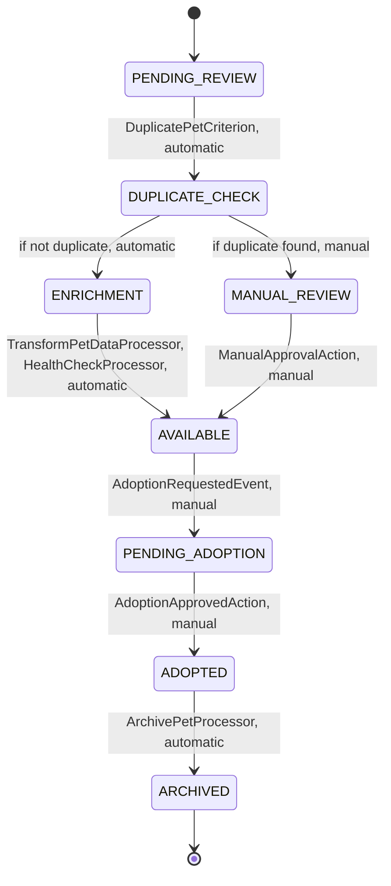
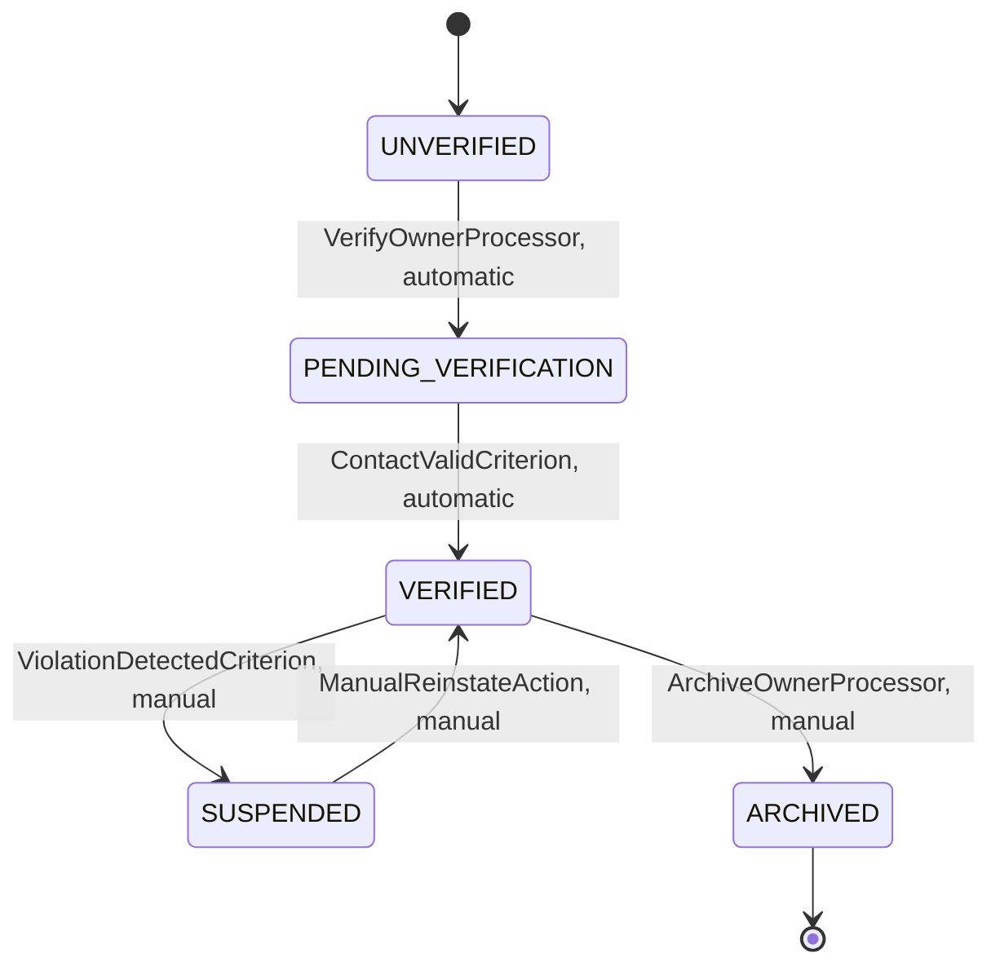
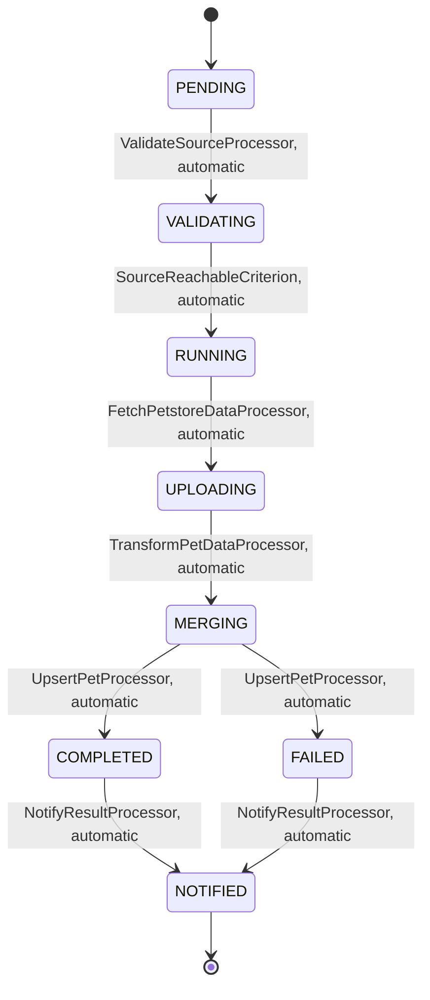

### 1. Entity Definitions
```
Pet:
- id: String (business id from source if any)
- name: String (pet name)
- species: String (cat/dog/etc)
- breed: String (breed description)
- age: Integer (years)
- color: String (visual)
- status: String (available/pending_adoption/adopted/archived)
- healthNotes: String (veterinary notes)
- avatarUrl: String (image link)
- tags: List<String> (fun tags, e.g., playful, shy)
- sourceMetadata: Map<String,Object> (raw Petstore fields for traceability)

Owner:
- id: String (business id)
- name: String (owner full name)
- contactInfo: Map<String,String> (email, phone)
- address: String (postal address)
- adoptedPetIds: List<String> (pet ids adopted)
- favorites: List<String> (pet ids favorited)
- verificationStatus: String (unverified/pending/verified/suspended)
- profileBadges: List<String> (gamification badges)

ImportJob:
- jobId: String (business id)
- sourceUrl: String (Petstore API endpoint or feed)
- mode: String (full/incremental)
- requestedBy: String (actor who created job)
- createdAt: String (timestamp)
- status: String (PENDING/RUNNING/COMPLETED/FAILED)
- processedCount: Integer (pets upserted)
- failedCount: Integer (errors)
- notes: String (diagnostic info)
```

Note: You asked for 3 entities; I used exactly 3 entities as requested.

---

### 2. Entity workflows

Pet workflow:
1. Initial State: Pet record created by ImportJob processor with status PENDING_REVIEW (automatic)
2. Duplicate Check: Run DuplicatePetCriterion automatically
3. Enrichment: Apply TransformPetDataProcessor & HealthCheckProcessor (automatic)
4. Review: If healthNotes missing or quality low -> move to MANUAL_REVIEW (manual)
5. Publish: If passes quality -> status set to AVAILABLE (automatic)
6. Adoption Flow: When adoption event occurs -> status moves to PENDING_ADOPTION then ADOPTED (manual by shelter/admin or automatic by approved request)
7. Archive: After long inactivity or adoption cleanup -> ARCHIVED (automatic or manual)


```mermaid
stateDiagram-v2
    [*] --> PENDING_REVIEW
    PENDING_REVIEW --> DUPLICATE_CHECK : DuplicatePetCriterion, automatic
    DUPLICATE_CHECK --> MANUAL_REVIEW : if duplicate found, manual
    DUPLICATE_CHECK --> ENRICHMENT : if not duplicate, automatic
    ENRICHMENT --> AVAILABLE : TransformPetDataProcessor, HealthCheckProcessor, automatic
    MANUAL_REVIEW --> AVAILABLE : ManualApprovalAction, manual
    AVAILABLE --> PENDING_ADOPTION : AdoptionRequestedEvent, manual
    PENDING_ADOPTION --> ADOPTED : AdoptionApprovedAction, manual
    ADOPTED --> ARCHIVED : ArchivePetProcessor, automatic
    ARCHIVED --> [*]
```

Pet workflow processors and criteria:
- Processors: TransformPetDataProcessor, HealthCheckProcessor, EnrichWithTagsProcessor, ArchivePetProcessor, NotifyNewPetProcessor
- Criteria: DuplicatePetCriterion, DataQualityCriterion

Owner workflow:
1. Initial State: Owner created by system (e.g., registration or import) status UNVERIFIED (automatic)
2. Verification: Verify contact/identity -> if passes set VERIFIED (automatic)
3. Active Use: VERIFIED owners can favorite/adopt (manual)
4. Suspension: If policy violation or failed verification -> SUSPENDED (manual/automatic)
5. Deletion: Owner record can be archived/deleted (manual)


```mermaid
stateDiagram-v2
    [*] --> UNVERIFIED
    UNVERIFIED --> PENDING_VERIFICATION : VerifyOwnerProcessor, automatic
    PENDING_VERIFICATION --> VERIFIED : ContactValidCriterion, automatic
    VERIFIED --> SUSPENDED : ViolationDetectedCriterion, manual
    SUSPENDED --> VERIFIED : ManualReinstateAction, manual
    VERIFIED --> ARCHIVED : ArchiveOwnerProcessor, manual
    ARCHIVED --> [*]
```

Owner processors and criteria:
- Processors: VerifyOwnerProcessor, AssignFavoritesProcessor, NotifyOwnerProcessor, ArchiveOwnerProcessor
- Criteria: ContactValidCriterion, ViolationDetectedCriterion

ImportJob workflow (orchestration entity):
1. Initial State: Job created with PENDING status (POST triggers event)
2. Validation: Validate source reachable and parameters (automatic)
3. Execution: Fetch Petstore data and transform to Pet entities (automatic)
4. Upsert: For each pet run Merge/Upsert into store (automatic)
5. Completion: Set status to COMPLETED or FAILED (automatic)
6. Notification: Send summary notification or retry on failure (automatic/manual)


```mermaid
stateDiagram-v2
    [*] --> PENDING
    PENDING --> VALIDATING : ValidateSourceProcessor, automatic
    VALIDATING --> RUNNING : SourceReachableCriterion, automatic
    RUNNING --> UPLOADING : FetchPetstoreDataProcessor, automatic
    UPLOADING --> MERGING : TransformPetDataProcessor, automatic
    MERGING --> COMPLETED : UpsertPetProcessor, automatic
    MERGING --> FAILED : UpsertPetProcessor, automatic
    COMPLETED --> NOTIFIED : NotifyResultProcessor, automatic
    FAILED --> NOTIFIED : NotifyResultProcessor, automatic
    NOTIFIED --> [*]
```

ImportJob processors and criteria:
- Processors: ValidateSourceProcessor, FetchPetstoreDataProcessor, TransformPetDataProcessor, UpsertPetProcessor, NotifyResultProcessor
- Criteria: SourceReachableCriterion, DataQualityCriterion, RetryCriterion

---

### 3. Pseudo code for processor classes

Note: pseudo code shows business behavior triggered by Cyoda process method. Classes are conceptual and focused on functionality.

TransformPetDataProcessor
```
class TransformPetDataProcessor {
  process(importJob, rawPet) {
    pet = new Pet()
    pet.id = rawPet.id or generateId()
    pet.name = normalizeName(rawPet.name)
    pet.species = mapSpecies(rawPet.category)
    pet.breed = rawPet.breed or "unknown"
    pet.age = estimateAge(rawPet)
    pet.color = rawPet.color
    pet.healthNotes = rawPet.health or ""
    pet.tags = deriveTags(rawPet)
    pet.sourceMetadata = rawPet
    return pet
  }
}
```

DuplicatePetCriterion
```
class DuplicatePetCriterion {
  test(pet) {
    existing = findBySourceIdOrFingerprint(pet.sourceMetadata.id, pet.name, pet.breed)
    return existing != null
  }
}
```

UpsertPetProcessor
```
class UpsertPetProcessor {
  process(pet) {
    if DuplicatePetCriterion.test(pet) {
      existing = loadExistingPet(...)
      merged = mergeFields(existing, pet)
      save(merged)
    } else {
      save(pet)
    }
    incrementJobCounters()
  }
}
```

ValidateSourceProcessor
```
class ValidateSourceProcessor {
  process(importJob) {
    if not ping(importJob.sourceUrl) {
      throw new ValidationError("Source unreachable")
    }
  }
}
```

FetchPetstoreDataProcessor
```
class FetchPetstoreDataProcessor {
  process(importJob) {
    records = fetchAll(importJob.sourceUrl, importJob.mode)
    for raw in records {
      pet = TransformPetDataProcessor.process(importJob, raw)
      queueForUpsert(pet)
    }
  }
}
```

NotifyResultProcessor
```
class NotifyResultProcessor {
  process(importJob) {
    summary = buildSummary(importJob)
    sendNotification(importJob.requestedBy, summary)
  }
}
```

VerifyOwnerProcessor
```
class VerifyOwnerProcessor {
  process(owner) {
    if ContactValidCriterion.test(owner.contactInfo) {
      owner.verificationStatus = VERIFIED
      save(owner)
    } else {
      owner.verificationStatus = PENDING_VERIFICATION
      save(owner)
    }
  }
}
```

---

### 4. API Endpoints Design Rules

Rules applied:
- Only ImportJob is an orchestration POST endpoint (creates an event). Business entities (Pet, Owner) are produced by ImportJob processing.
- POST endpoints return only technicalId.
- GET endpoints provided to retrieve stored results by technicalId. GET by condition not included (not requested).
- GET all endpoints are optional and included for convenience for read-only listing.

Endpoints:

1) Create Import Job (orchestration) — triggers data ingestion event
Request:
```json
{
  "sourceUrl": "https://petstore.example/api/pets",
  "mode": "full",
  "requestedBy": "admin@purrfectpets.local",
  "notes": "Initial import"
}
```
Response (only technicalId):
```json
{
  "technicalId": "job_123456"
}
```

2) Get Import Job by technicalId
Request: GET /import-jobs/{technicalId}
Response:
```json
{
  "technicalId": "job_123456",
  "jobId": "import-2025-08-26-01",
  "sourceUrl": "https://petstore.example/api/pets",
  "mode": "full",
  "requestedBy": "admin@purrfectpets.local",
  "createdAt": "2025-08-26T10:00:00Z",
  "status": "COMPLETED",
  "processedCount": 120,
  "failedCount": 2,
  "notes": "Imported successfully with 2 minor issues"
}
```

3) Get Pet by technicalId
Request: GET /pets/{technicalId}
Response:
```json
{
  "technicalId": "pet_0001",
  "id": "123",
  "name": "Mittens",
  "species": "cat",
  "breed": "Siamese",
  "age": 2,
  "color": "seal point",
  "status": "AVAILABLE",
  "healthNotes": "Vaccinated",
  "avatarUrl": "https://cdn.example/mittens.jpg",
  "tags": ["playful","lap cat"],
  "sourceMetadata": { "petstoreId": "123", "raw": { } }
}
```

4) Get Owner by technicalId
Request: GET /owners/{technicalId}
Response:
```json
{
  "technicalId": "owner_9001",
  "id": "o-45",
  "name": "Alex Doe",
  "contactInfo": { "email": "alex@example.com", "phone": "+123456789" },
  "address": "123 Cat Lane",
  "adoptedPetIds": ["pet_0001"],
  "favorites": ["pet_0002","pet_0003"],
  "verificationStatus": "VERIFIED",
  "profileBadges": ["FirstAdoption"]
}
```

Optional read endpoints (GET /pets, GET /owners) may return lists for UI browsing.

---

If you want, next we can:
- Add more entities (Activity, Badge, VetRecord) — up to 10 total.
- Define failure/retry rules for ImportJob (e.g., exponential backoff RetryCriterion).
- Add explicit manual approval workflows for adoption requests. Which would you like to refine first?