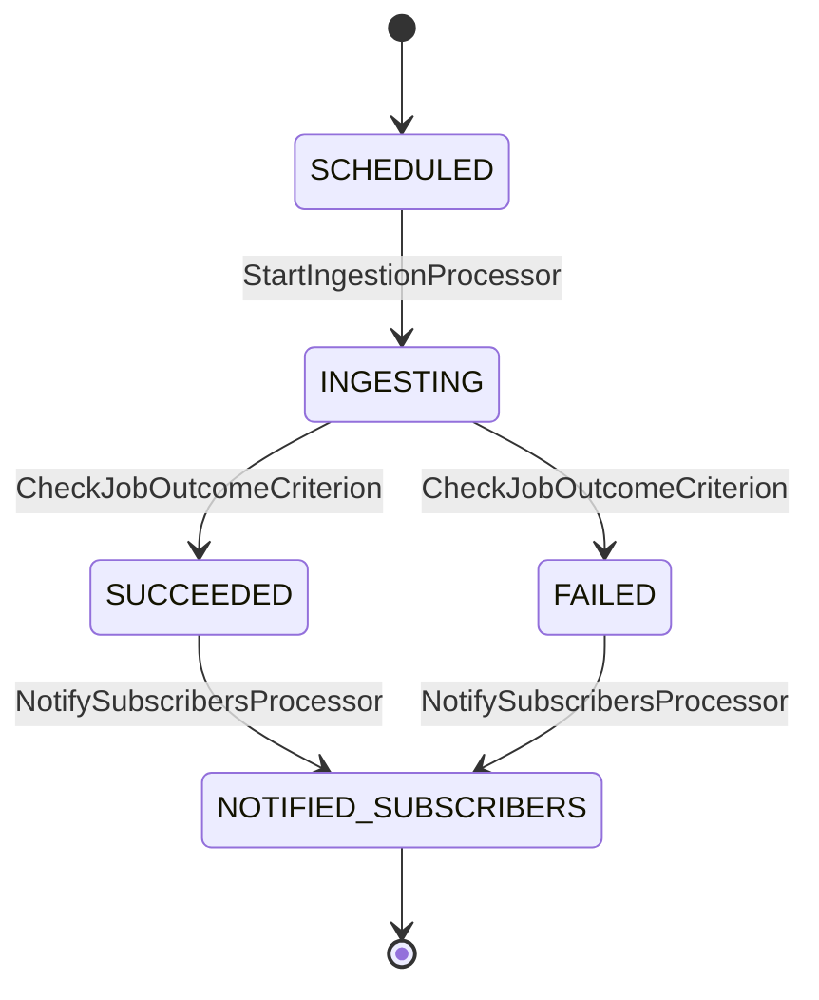
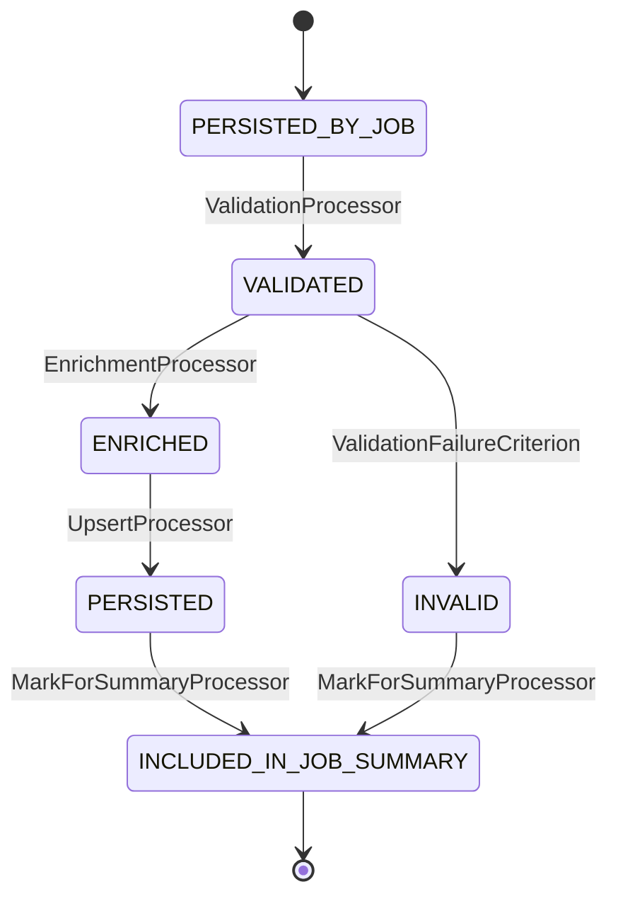
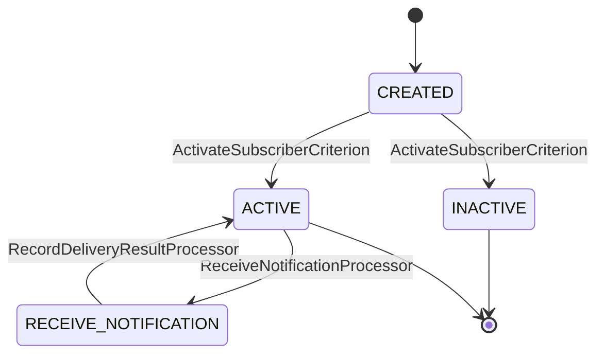

### 1. Entity Definitions
```
Job:
- id: String (business id from client)
- schedule: String (human cadence or manual)
- state: String (SCHEDULED, INGESTING, SUCCEEDED, FAILED, NOTIFIED_SUBSCRIBERS)
- startedAt: String (timestamp)
- finishedAt: String (timestamp)
- recordsFetchedCount: Integer
- recordsProcessedCount: Integer
- recordsFailedCount: Integer
- errorSummary: String
- subscribersNotifiedCount: Integer

Laureate:
- id: Integer (source id from API)
- firstname: String
- surname: String
- gender: String
- born: String (date)
- died: String (date|null)
- borncountry: String
- borncountrycode: String
- borncity: String
- year: String
- category: String
- motivation: String
- affiliation_name: String
- affiliation_city: String
- affiliation_country: String
- ageAtAward: Integer (computed)
- normalizedCountryCode: String (computed)
- validationStatus: String (VALID|INVALID with reasons)
- lastSeenAt: String (timestamp)

Subscriber:
- id: String (business id)
- name: String
- contactType: String (email|webhook|other)
- contactDetails: String (email or webhook URL)
- active: Boolean
- filterPreferences: String (optional JSON: categories, years, countries)
- lastNotifiedAt: String (timestamp)
```

### 2. Entity workflows

Job workflow:
1. Initial State: SCHEDULED (automatic on persist)
2. Start Ingestion: INGESTING (automatic StartIngestionProcessor)
3. Process Records: per-record events create Laureate entities (automatic)
4. Decide Outcome: SUCCEEDED if no fatal error else FAILED (automatic CheckJobOutcomeCriterion)
5. Notify Subscribers: NOTIFIED_SUBSCRIBERS (automatic NotifySubscribersProcessor)
6. Final: terminal


```mermaid
stateDiagram-v2
    [*] --> SCHEDULED
    SCHEDULED --> INGESTING : StartIngestionProcessor
    INGESTING --> SUCCEEDED : CheckJobOutcomeCriterion
    INGESTING --> FAILED : CheckJobOutcomeCriterion
    SUCCEEDED --> NOTIFIED_SUBSCRIBERS : NotifySubscribersProcessor
    FAILED --> NOTIFIED_SUBSCRIBERS : NotifySubscribersProcessor
    NOTIFIED_SUBSCRIBERS --> [*]
```

Laureate workflow:
1. Initial: PERSISTED_BY_JOB (automatic when Job creates event)
2. Validation: VALIDATED if ok else INVALID (ValidationProcessor)
3. Enrichment: ENRICHED (EnrichmentProcessor)
4. Deduplicate/Upsert: PERSISTED (UpsertProcessor) and mark isNewOrUpdated
5. Terminal: INCLUDED_IN_JOB_SUMMARY


```mermaid
stateDiagram-v2
    [*] --> PERSISTED_BY_JOB
    PERSISTED_BY_JOB --> VALIDATED : ValidationProcessor
    VALIDATED --> INVALID : ValidationFailureCriterion
    VALIDATED --> ENRICHED : EnrichmentProcessor
    ENRICHED --> PERSISTED : UpsertProcessor
    PERSISTED --> INCLUDED_IN_JOB_SUMMARY : MarkForSummaryProcessor
    INVALID --> INCLUDED_IN_JOB_SUMMARY : MarkForSummaryProcessor
    INCLUDED_IN_JOB_SUMMARY --> [*]
```

Subscriber workflow:
1. Created: CREATED (manual POST)
2. Activation check: ACTIVE if active true else INACTIVE (automatic ActivateSubscriberCriterion)
3. Notifications: RECEIVE_NOTIFICATION (automatic when Job notifies; delivery attempts recorded)
4. Final: NO workflow orchestration beyond notifications


```mermaid
stateDiagram-v2
    [*] --> CREATED
    CREATED --> ACTIVE : ActivateSubscriberCriterion
    CREATED --> INACTIVE : ActivateSubscriberCriterion
    ACTIVE --> RECEIVE_NOTIFICATION : ReceiveNotificationProcessor
    RECEIVE_NOTIFICATION --> ACTIVE : RecordDeliveryResultProcessor
    INACTIVE --> [*]
    ACTIVE --> [*]
```

Processors and Criteria (per entity)
- Job:
  - Processors: StartIngestionProcessor, AggregateJobMetricsProcessor, NotifySubscribersProcessor
  - Criteria: CheckJobOutcomeCriterion
- Laureate:
  - Processors: ValidationProcessor, EnrichmentProcessor, UpsertProcessor, MarkForSummaryProcessor
  - Criteria: ValidationFailureCriterion, DuplicateDetectionCriterion
- Subscriber:
  - Processors: ReceiveNotificationProcessor, RecordDeliveryResultProcessor
  - Criteria: ActivateSubscriberCriterion

### 3. Pseudo code for processor classes
```java
// ValidationProcessor
void process(Laureate l) {
  List<String> errors = []
  if (l.id==null) errors.add("missing id")
  if (l.firstname==null && l.surname==null) errors.add("missing name")
  l.validationStatus = errors.isEmpty() ? "VALID" : "INVALID:"+join(errors)
}

// EnrichmentProcessor
void process(Laureate l) {
  l.ageAtAward = computeAge(l.born, l.year)
  l.normalizedCountryCode = normalizeCountry(l.borncountry, l.borncountrycode)
  l.lastSeenAt = now()
}

// UpsertProcessor
void process(Laureate l) {
  existing = findBySourceId(l.id)
  if (existing==null) saveNew(l); else saveUpdated(existing,l)
  emit MarkForSummary(l, existing==null ? "NEW" : "UPDATED")
}

// NotifySubscribersProcessor
void process(Job j) {
  subs = findActiveSubscribers(j.filter)
  payload = buildJobSummary(j)
  for s in subs sendAsync(s.contactDetails, payload)
  recordDeliveryResults(job)
}
```

### 4. API Endpoints Design Rules

- POST /jobs
  - Creates Job entity (persists -> Cyoda starts Job workflow)
  - Response returns only technicalId

```json
POST /jobs
{
  "id":"job-2025-08-01",
  "schedule":"manual"
}
Response:
{
  "technicalId":"TID_JOB_12345"
}
```

- GET /jobs/{technicalId}
```json
GET /jobs/TID_JOB_12345
Response:
{
  "id":"job-2025-08-01",
  "state":"NOTIFIED_SUBSCRIBERS",
  "startedAt":"2025-08-01T10:00:00Z",
  "finishedAt":"2025-08-01T10:00:10Z",
  "recordsFetchedCount":200,
  "recordsProcessedCount":198,
  "recordsFailedCount":2,
  "errorSummary":"2 invalid records",
  "subscribersNotifiedCount":5
}
```

- POST /subscribers
  - Creates Subscriber (returns technicalId)
```json
POST /subscribers
{
  "id":"sub-1",
  "name":"Nobel Alerts",
  "contactType":"webhook",
  "contactDetails":"https://example.com/hook",
  "active":true,
  "filterPreferences":"{\"category\":[\"Chemistry\"],\"years\":[\">=2000\"]}"
}
Response:
{
  "technicalId":"TID_SUB_987"
}
```

- GET /subscribers/{technicalId}
```json
GET /subscribers/TID_SUB_987
Response:
{
  "id":"sub-1",
  "name":"Nobel Alerts",
  "active":true,
  "lastNotifiedAt":"2025-08-01T10:00:15Z"
}
```

- GET /laureates/{id}
```json
GET /laureates/853
Response:
{
  "id":853,
  "firstname":"Akira",
  "surname":"Suzuki",
  "year":"2010",
  "category":"Chemistry",
  "validationStatus":"VALID",
  "ageAtAward":80
}
```

Notes:
- Persisting Job or Subscriber triggers Cyoda workflows as specified.
- Laureate entities are created by Job processing (no POST for Laureate).
- POST endpoints return only technicalId per rules.