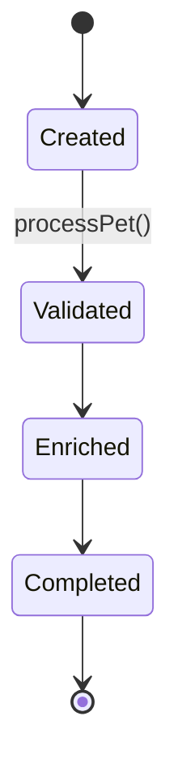
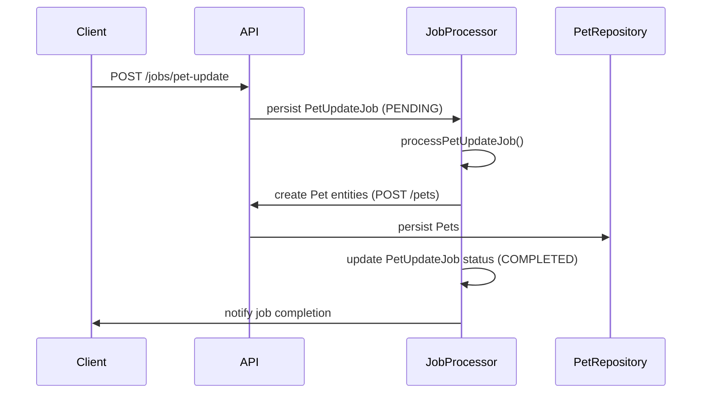

### 1. Entity Definitions

``` 
PetUpdateJob:  // Orchestration entity managing pet data ingestion and processing
- jobId: String (unique identifier for the job)
- source: String (data source, e.g., "Petstore API")
- requestedAt: DateTime (timestamp when job was created)
- status: JobStatusEnum (PENDING, PROCESSING, COMPLETED, FAILED)

Pet:  // Business domain entity representing a pet record
- petId: String (unique pet identifier)
- name: String (pet's name)
- category: String (e.g., "Cat", "Dog")
- status: PetStatusEnum (AVAILABLE, PENDING, SOLD)
- tags: List<String> (descriptive tags)
- photoUrls: List<String> (links to pet images)
```

---

### 2. Process Method Flows

```
processPetUpdateJob() Flow:
1. Initial State: PetUpdateJob created with PENDING status
2. Fetch Data: Retrieve pet data from the configured Petstore API source
3. Data Validation: Validate incoming pet entries for completeness and correctness
4. Persistence: Create or update Pet entities by creating new immutable versions (no direct updates)
5. Status Update: Mark PetUpdateJob as COMPLETED if successful, or FAILED if errors occur
6. Notification: (Optional) Trigger downstream events or notifications about job completion

processPet() Flow:
1. Initial State: Pet entity created with a status (e.g., AVAILABLE)
2. Business Rules: Validate pet data integrity and enforce status transitions if applicable
3. Enrichment: Add derived or calculated fields if needed (e.g., tag normalization)
4. Completion: Confirm Pet entity persisted and ready for retrieval via GET endpoints
```

---

### 3. API Endpoints Design

| Method | Endpoint               | Description                                             | Request Body (JSON)                     | Response Body (JSON)                           |
|--------|------------------------|---------------------------------------------------------|----------------------------------------|-----------------------------------------------|
| POST   | /jobs/pet-update       | Create a PetUpdateJob to trigger pet data ingestion     | `{ "source": "Petstore API" }`         | `{ "jobId": "123", "status": "PENDING" }`    |
| GET    | /jobs/{jobId}          | Get the status and details of a PetUpdateJob            | -                                      | `{ "jobId": "123", "status": "COMPLETED", "requestedAt": "...", "source": "Petstore API" }`  |
| GET    | /pets                  | Retrieve list of pets with optional filters             | -                                      | `[ { "petId": "...", "name": "...", ... }, ... ]` |
| POST   | /pets                  | Create a new Pet entity (immutable creation)             | `{ "name": "...", "category": "...", "status": "...", "tags": [...], "photoUrls": [...] }` | `{ "petId": "abc123", "status": "AVAILABLE" }` |

---

### 4. Request/Response Formats

**Create PetUpdateJob Request**

```json
{
  "source": "Petstore API"
}
```

**Create PetUpdateJob Response**

```json
{
  "jobId": "job-001",
  "status": "PENDING"
}
```

**Get PetUpdateJob Response**

```json
{
  "jobId": "job-001",
  "source": "Petstore API",
  "status": "COMPLETED",
  "requestedAt": "2024-06-01T12:00:00Z"
}
```

**Create Pet Request**

```json
{
  "name": "Fluffy",
  "category": "Cat",
  "status": "AVAILABLE",
  "tags": ["cute", "small"],
  "photoUrls": ["http://example.com/fluffy.jpg"]
}
```

**Create Pet Response**

```json
{
  "petId": "pet-123",
  "status": "AVAILABLE"
}
```

**Get Pets Response**

```json
[
  {
    "petId": "pet-123",
    "name": "Fluffy",
    "category": "Cat",
    "status": "AVAILABLE",
    "tags": ["cute", "small"],
    "photoUrls": ["http://example.com/fluffy.jpg"]
  },
  {
    "petId": "pet-124",
    "name": "Buddy",
    "category": "Dog",
    "status": "SOLD",
    "tags": ["friendly"],
    "photoUrls": []
  }
]
```

---

### Mermaid Diagrams

**PetUpdateJob Lifecycle**


```mermaid
stateDiagram-v2
    [*] --> Pending
    Pending --> Processing : processPetUpdateJob()
    Processing --> Completed : success
    Processing --> Failed : error
    Completed --> [*]
    Failed --> [*]
```

**Pet Entity Lifecycle**


```mermaid
stateDiagram-v2
    [*] --> Created
    Created --> Validated : processPet()
    Validated --> Enriched
    Enriched --> Completed
    Completed --> [*]
```

**Event-Driven Processing Chain**


```mermaid
sequenceDiagram
    participant Client
    participant API
    participant JobProcessor
    participant PetRepository

    Client->>API: POST /jobs/pet-update
    API->>JobProcessor: persist PetUpdateJob (PENDING)
    JobProcessor->>JobProcessor: processPetUpdateJob()
    JobProcessor->>API: create Pet entities (POST /pets)
    API->>PetRepository: persist Pets
    JobProcessor->>JobProcessor: update PetUpdateJob status (COMPLETED)
    JobProcessor->>Client: notify job completion
```

---

If you need further adjustments or additional entities/features later, feel free to ask!