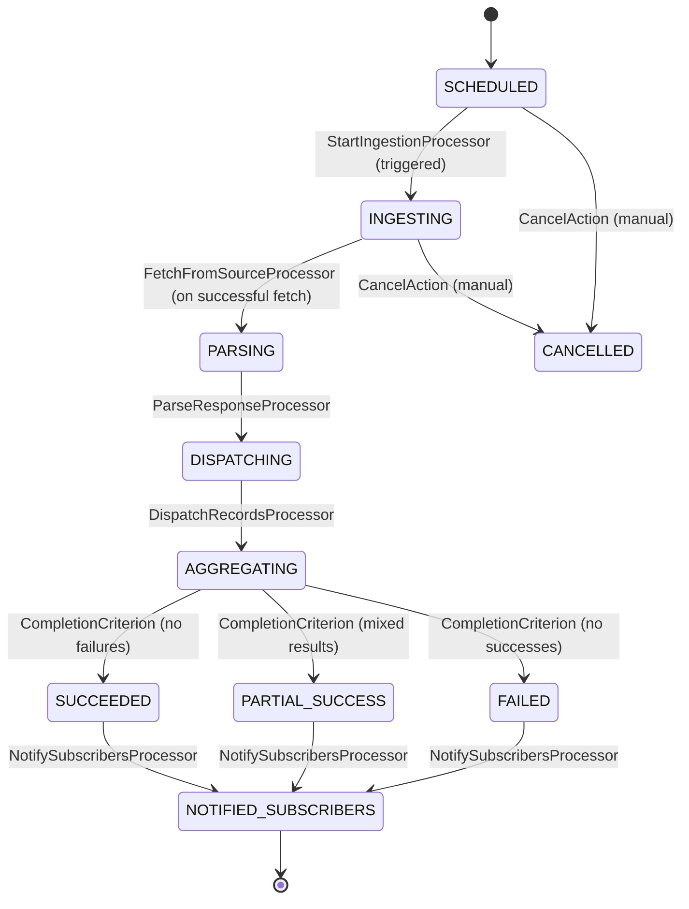
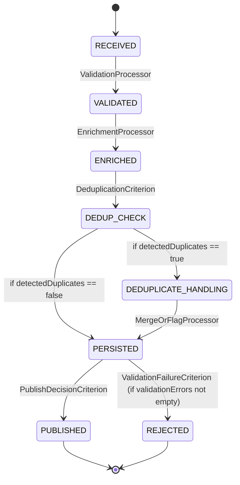
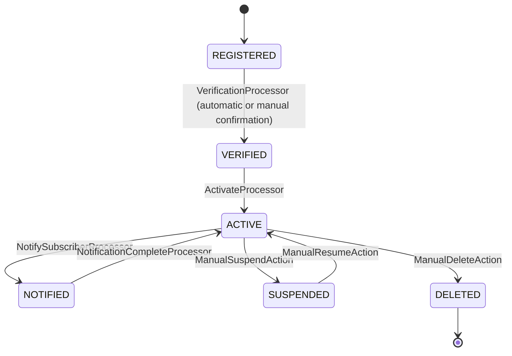

# Functional Requirements

This document defines the entities, their workflows (state machines), processors/criteria, and HTTP API contract for the Nobel Laureates ingestion prototype. It updates and clarifies earlier requirements to reflect consistent, current logic.

Key updates in this revision:
- Every persisted entity includes a `technicalId` (datastore-assigned unique id). This is returned by POST endpoints.
- Clarified status/state names and transitions, added required/optional fields, and specified verification/verified flags for Subscribers.
- Made explicit rules for idempotency, pagination, rate limits, retries, error handling and partial successes.
- Clarified deduplication/merge semantics and `published` semantics for Laureates.
- Made notification behavior configurable (summary vs. details), and emphasized async processing and non-blocking behavior.

---

## Entity Definitions

Note: every persisted entity contains a datastore-assigned `technicalId: String` (returned by POST endpoints). Timestamps are ISO-8601 strings in UTC unless otherwise noted.

Job
```
- technicalId: String (datastore-assigned unique id; returned by POST)
- name: String (human-friendly name for the job)
- sourceUrl: String (API endpoint to ingest data from; default: https://public.opendatasoft.com/api/explore/v2.1/catalog/datasets/nobel-prize-laureates/records)
- schedule: String (cron expression or interval descriptor used by scheduler; optional for manual/webhook triggers)
- triggerType: String (scheduled | manual | webhook)
- maxRecords: Integer (max records to fetch per run; optional, null means fetch all per pagination limits)
- status: String (current workflow status - see Job.Status enum below)
- scheduledAt: String (ISO-8601 timestamp when job was scheduled to run)
- startedAt: String (ISO-8601 timestamp when ingestion started)
- finishedAt: String (ISO-8601 timestamp when ingestion finished)
- processedCount: Integer (number of laureate records processed in this run)
- successCount: Integer (number of successfully processed laureates)
- failureCount: Integer (number of failed laureate records)
- resultSummary: String (short human summary of results)
- errorDetails: String (detailed error information when FAILED; may be truncated)
- rawResponse: Object (raw JSON payload returned from the source for debugging/replay; trimmed/obfuscated if large)
- subscriberIds: List<String> (list of Subscriber.technicalId to notify; empty or null = notify all active subscribers)
- notificationMode: String (summary | details — controls whether notifications include full errorDetails/raw payload; default: summary)
- idempotencyKey: String (optional: client-supplied key to make Job POST idempotent)
- createdAt: String (ISO-8601)
- updatedAt: String (ISO-8601)
```

Job.Status (enumerated values)
```
- SCHEDULED: job recorded and awaiting trigger (manual, scheduled or webhook)
- INGESTING: ingestion task started
- PARSING: parsing raw response into records
- DISPATCHING: dispatching parsed records into Laureate persistence
- AGGREGATING: aggregating per-record results
- SUCCEEDED: ingestion completed with zero failures
- PARTIAL_SUCCESS: ingestion completed with at least one success and at least one failure
- FAILED: ingestion failed and no records were successfully processed
- NOTIFIED_SUBSCRIBERS: subscribers have been notified (terminal)
- CANCELLED: job was cancelled by user
```

Laureate
```
- technicalId: String (datastore-assigned unique id)
- externalId: Integer (id from OpenDataSoft dataset; may be null if dataset lacks numeric id)
- firstname: String
- surname: String
- born: String (date ISO-8601 if parsable otherwise original string)
- died: String (date ISO-8601 or null)
- borncountry: String
- borncountrycode: String (as provided in source)
- borncity: String
- gender: String
- year: String (award year as string)
- category: String
- motivation: String
- affiliation_name: String
- affiliation_city: String
- affiliation_country: String
- calculatedAgeAtAward: Integer (derived/enriched field, null if not computable)
- normalizedCountryCode: String (enriched/standardized country code if resolvable)
- detectedDuplicates: Boolean (true if deduplication found a match)
- dedupMatchTechnicalId: String (if detectedDuplicates true, reference to matched laureate technicalId)
- validationErrors: List<String> (validation failures if any)
- sourceJobTechnicalId: String (Job.technicalId that created this laureate)
- rawPayload: Object (original JSON record)
- persistedAt: String (ISO-8601 when last persisted)
- published: Boolean (true when ready for consumers; false if rejected or pending)
- createdAt: String (ISO-8601)
- updatedAt: String (ISO-8601)
```

Publish semantics: `published == true` means the record passed validation/publish criteria and is available to read-only GET endpoints and downstream consumers. Records with `published == false` are stored for debugging/audit and may be reprocessed.

Subscriber
```
- technicalId: String (datastore-assigned unique id)
- name: String (display name)
- contactType: String (email | webhook | slack | other)
- contactAddress: String (email address, webhook URL, or channel id)
- active: Boolean (true if notifications should be sent)
- verified: Boolean (true after verification handshake where required)
- filters: Object (optional filtering rules, e.g., { categories: ["Chemistry"], years: ["2010","2011"], countries: ["JP"] })
- retryPolicy: Object (optional; e.g., { maxRetries: 3, backoffMs: 2000, maxBackoffMs: 60000 })
- lastNotifiedAt: String (ISO-8601)
- createdAt: String (ISO-8601)
- updatedAt: String (ISO-8601)
```

Notes:
- `filters` are simple inclusion lists by default (match if any of the provided values is present). Advanced boolean logic (AND/OR/Nested) is possible in a later iteration but is out of scope for v1 unless requested.
- `verified` is required for `active == true` for types that require verification (email/webhook handshake).

---

## Event-Driven Workflows

Important: Persistence of an entity (POST/save) emits an event that starts or advances that entity's workflow. Processing steps should be asynchronous and idempotent where possible.

### Job workflow (updated)

Overview: Jobs progress from SCHEDULED to terminal state NOTIFIED_SUBSCRIBERS (or CANCELLED). The workflow tracks partial successes and failures explicitly.

1. Initial State: Job is created with status SCHEDULED.
2. Trigger: On schedule, manual trigger or webhook, the job moves to INGESTING and StartIngestionProcessor is executed.
3. Fetch: FetchFromSourceProcessor performs HTTP GET(s) with pagination and rate-limit handling; stores rawResponse or incremental chunks.
4. Parse: ParseResponseProcessor parses JSON into record payloads.
5. Dispatch: DispatchRecordsProcessor maps each record to a Laureate object and persists it. Each persistence triggers the Laureate workflow.
6. Aggregate: AggregateResultsProcessor waits for (or collects) the per-record results (success/failure/published/dedup) and compiles counts and resultSummary.
7. Completion: CompletionCriterion sets status to SUCCEEDED, PARTIAL_SUCCESS or FAILED based on counts:
   - SUCCEEDED: processedCount > 0 and failureCount == 0
   - PARTIAL_SUCCESS: processedCount > 0 and failureCount > 0 and successCount > 0
   - FAILED: processedCount == 0 and failureCount > 0 OR fatal fetch/parse error prevented processing
8. Notify: NotifySubscribersProcessor is invoked regardless of SUCCEEDED/PARTIAL_SUCCESS/FAILED to inform subscribers; then set NOTIFIED_SUBSCRIBERS. Notification content depends on `notificationMode`.
9. Terminal: NOTIFIED_SUBSCRIBERS -> end

Mermaid state diagram for Job:


```mermaid
stateDiagram-v2
    [*] --> SCHEDULED
    SCHEDULED --> INGESTING : StartIngestionProcessor (triggered)
    INGESTING --> PARSING : FetchFromSourceProcessor (on successful fetch)
    PARSING --> DISPATCHING : ParseResponseProcessor
    DISPATCHING --> AGGREGATING : DispatchRecordsProcessor
    AGGREGATING --> SUCCEEDED : CompletionCriterion (no failures)
    AGGREGATING --> PARTIAL_SUCCESS : CompletionCriterion (mixed results)
    AGGREGATING --> FAILED : CompletionCriterion (no successes)
    SUCCEEDED --> NOTIFIED_SUBSCRIBERS : NotifySubscribersProcessor
    PARTIAL_SUCCESS --> NOTIFIED_SUBSCRIBERS : NotifySubscribersProcessor
    FAILED --> NOTIFIED_SUBSCRIBERS : NotifySubscribersProcessor
    NOTIFIED_SUBSCRIBERS --> [*]
    SCHEDULED --> CANCELLED : CancelAction (manual)
    INGESTING --> CANCELLED : CancelAction (manual)
```

Job processors and criteria (updated details)
- StartIngestionProcessor
  - Validate schedule/sourceUrl/trigger
  - set startedAt, status=INGESTING
  - create ingestion execution context (idempotency, concurrency guards)
  - enqueue FetchFromSourceProcessor asynchronously
- FetchFromSourceProcessor
  - Use robust HTTP client with timeouts and retry/backoff configured
  - Support pagination and `maxRecords` (stop when limit reached)
  - Respect rate limits and honor Retry-After headers
  - On fatal HTTP error: record errorDetails, set failureCount appropriately, set status=FAILED and enqueue NotifySubscribersProcessor
  - On partial success (some pages fetched, others failed): store rawResponse fragments and continue to parse processed fragments
- ParseResponseProcessor
  - Parse JSON into a list of records using Jackson/Gson
  - Sanitize/mask sensitive fields when storing rawResponse
  - Enqueue DispatchRecordsProcessor
- DispatchRecordsProcessor
  - Map each parsed payload to Laureate domain object along with sourceJobTechnicalId
  - Persist laureate via repository in a manner that triggers Laureate workflow
  - Track processedCount; ensure persistence is idempotent when reprocessing same payload (use dedup keys or source record id)
  - Dispatch processing should be concurrent but bounded to avoid resource exhaustion; use backpressure when necessary
- AggregateResultsProcessor
  - Collect per-record results (success/failure/published/dedup) — either via event counters or a short-lived aggregation datastore entry
  - set finishedAt, processedCount, successCount, failureCount and concise resultSummary
- CompletionCriterion
  - Route to SUCCEEDED / PARTIAL_SUCCESS / FAILED based on aggregated counts and error conditions
- NotifySubscribersProcessor
  - Resolve subscriber list: explicit `subscriberIds` if provided else all subscribers where active == true and verified == true
  - Evaluate subscriber.filters against job summary and/or individual laureates (filtering performed server-side)
  - For each eligible subscriber, send notification asynchronously using contactType
  - Honor subscriber.retryPolicy on send failures
  - Notification content controlled by `notificationMode` (summary vs details)
  - Update lastNotifiedAt and log notification results
  - Set status = NOTIFIED_SUBSCRIBERS and updatedAt

Notes on idempotency and re-runs:
- Jobs should be re-runnable with idempotency protection: if a Job is executed twice for the same dataset slice, processing should avoid creating duplicate laureates by relying on deduplication keys (externalId or composite key) and idempotencyKey when provided.
- Job-level retries (e.g., if Fetch fails transiently) should be bounded; persistent failures should result in FAILED with errorDetails.

---

### Laureate workflow (updated)

Overview: Each persisted Laureate goes through validation, enrichment, deduplication/merge and persistence. Valid records become `published == true` when safe for consumers.

1. Initial State: Persisting a Laureate record starts the workflow in RECEIVED.
2. Validation: ValidationProcessor checks required fields and formats.
3. Enrichment: EnrichmentProcessor computes age at award, normalizes country codes, trims/normalizes names.
4. Deduplication: DeduplicationCriterion attempts to find existing matches via externalId or composite key.
   - If duplicate found: mark detectedDuplicates true and set dedupMatchTechnicalId; route to DEDUPLICATE_HANDLING
   - If not duplicate: route to PERSISTED
5. Merge/Flag: MergeOrFlagProcessor will either merge fields into an existing record (preferred when they appear complementary) or flag as duplicate for manual review, based on business rules and conflict resolution policy.
6. Persistence: PersistLaureateProcessor saves/merges the record. Set persistedAt.
7. Publish Decision: PublishDecisionCriterion sets published=true if validationErrors is empty and record is persisted successfully and dedup/match rules allow publishing.
8. Terminal: PUBLISHED or REJECTED

Mermaid state diagram for Laureate:


```mermaid
stateDiagram-v2
    [*] --> RECEIVED
    RECEIVED --> VALIDATED : ValidationProcessor
    VALIDATED --> ENRICHED : EnrichmentProcessor
    ENRICHED --> DEDUP_CHECK : DeduplicationCriterion
    DEDUP_CHECK --> DEDUPLICATE_HANDLING : if detectedDuplicates == true
    DEDUP_CHECK --> PERSISTED : if detectedDuplicates == false
    DEDUPLICATE_HANDLING --> PERSISTED : MergeOrFlagProcessor
    PERSISTED --> PUBLISHED : PublishDecisionCriterion
    PERSISTED --> REJECTED : ValidationFailureCriterion (if validationErrors not empty)
    PUBLISHED --> [*]
    REJECTED --> [*]
```

Laureate processors and criteria (updated details)
- ValidationProcessor
  - Required fields (strict v1 defaults): at least one of firstname or surname AND year AND category
  - Preferably externalId when available (helps idempotency) but not strictly required
  - Basic checks: year is parseable/int-like, dates in born/died parseable if present
  - Append to validationErrors; determine severity (fatal vs non-fatal). Fatal errors lead to REJECTED.
- EnrichmentProcessor
  - Calculate calculatedAgeAtAward if born date and award year available
  - Normalize country codes using a lookup table (ISO-3166 mapping) and populate normalizedCountryCode when resolvable
  - Trim whitespace and normalize name capitalization
  - Add provenance metadata where helpful
- DeduplicationCriterion
  - Matching priority: externalId exact match -> composite key (firstname + surname + year + category) -> fuzzy name/year match with thresholds
  - If match found set detectedDuplicates=true and populate dedupMatchTechnicalId
- MergeOrFlagProcessor
  - If duplicate, follow configured policy:
    - mergeNonEmptyFields: merge non-empty fields from incoming record into existing record and update source references
    - or mark duplicate: create a relation that ties both records for manual review
  - Record merge decisions (audit trail)
- PersistLaureateProcessor
  - Persist or update existing record depending on dedup policy
  - Set persistedAt and createdAt/updatedAt accordingly
- PublishDecisionCriterion
  - published = true if no fatal validationErrors and persistence succeeded
  - If record was merged into an existing published record, the existing record remains published

Notes:
- Each persisted laureate that becomes published can trigger downstream events (analytics, search index, notifications). These downstream events should be separate consumers of the LAUREATE_PUBLISHED event.
- rawPayload must be kept to allow reprocessing but should be size-limited and optionally archived.

---

### Subscriber workflow (updated)

1. Initial State: Subscriber created via POST -> REGISTERED (technicalId returned).
2. Verification: If contactType requires it (email/webhook), run VerificationProcessor to confirm address/handshake.
3. Activation: On successful verification set verified=true and active=true -> ACTIVE.
4. Notification Lifecycle: When a Job reaches NOTIFIED_SUBSCRIBERS, NotifySubscribersProcessor sends notifications to matching ACTIVE & VERIFIED subscribers.
5. Suspension/Deletion: Manual transitions to SUSPENDED or DELETED by user.

Mermaid state diagram for Subscriber:


```mermaid
stateDiagram-v2
    [*] --> REGISTERED
    REGISTERED --> VERIFIED : VerificationProcessor (automatic or manual confirmation)
    VERIFIED --> ACTIVE : ActivateProcessor
    ACTIVE --> NOTIFIED : NotifySubscriberProcessor
    NOTIFIED --> ACTIVE : NotificationCompleteProcessor
    ACTIVE --> SUSPENDED : ManualSuspendAction
    SUSPENDED --> ACTIVE : ManualResumeAction
    ACTIVE --> DELETED : ManualDeleteAction
    DELETED --> [*]
```

Subscriber processors and criteria (updated details)
- VerificationProcessor
  - Email: send verification link or code; wait for user confirmation
  - Webhook: perform handshake (HTTP POST) and expect a 2xx within configured timeout
  - Slack/other: follow provider-specific verification flows
  - Set verified=true only after successful verification
- ActivateProcessor
  - Set active=true if verified == true (or for contact types that don't require verification set verified=true by default)
  - Record createdAt/updatedAt
- NotifySubscriberProcessor
  - Evaluate subscriber.filters against job payload or laureate list
  - If match, send notification using contactType
  - Honor retryPolicy (maxRetries with exponential backoff capped at maxBackoffMs)
  - Update lastNotifiedAt and log per-subscriber outcome
- Manual actions
  - Allow user to suspend/resume/delete subscribers; ensure suspended subscribers are not notified

---

## APIs Design Rules & Endpoints (unchanged principles with clarifications)

Design rules:
- POST endpoints return only `technicalId` to follow event-driven persistence pattern.
- POST triggers the entity persistence event and any workflows attached.
- GET endpoints are read-only and return stored entity representation.
- Idempotency: clients may provide `idempotencyKey` in POST /api/jobs to avoid duplicate job creation.

Endpoints (examples):

1) Create Job
- POST /api/jobs
- Request JSON (example):
{
  "name": "Daily Nobel Laureates Ingestion",
  "sourceUrl": "https://public.opendatasoft.com/api/explore/v2.1/catalog/datasets/nobel-prize-laureates/records",
  "schedule": "0 0 * * *",
  "triggerType": "scheduled",
  "maxRecords": 1000,
  "subscriberIds": [],
  "notificationMode": "summary",
  "idempotencyKey": "optional-client-key-123"
}
- Response JSON (must return only technicalId):
{
  "technicalId": "job_123e4567"
}

Notes:
- Job POST returns quickly after persistence; ingestion is asynchronous.
- If client provides idempotencyKey, duplicate POSTs with same key should return the same technicalId.

2) Get Job by technicalId
- GET /api/jobs/{technicalId}
- Response JSON (full stored job entity and current status)
(Structure includes `technicalId` and all Job fields shown above.)

3) Register Subscriber
- POST /api/subscribers
- Request JSON (example):
{
  "name": "Nobel Alerts",
  "contactType": "webhook",
  "contactAddress": "https://example.com/webhook",
  "filters": { "categories": ["Chemistry"], "years": ["2010"] },
  "retryPolicy": { "maxRetries": 3, "backoffMs": 2000 }
}
- Response JSON:
{
  "technicalId": "sub_89ab12cd"
}

4) Get Subscriber by technicalId
- GET /api/subscribers/{technicalId}
- Response JSON: full subscriber object (includes verified, active, lastNotifiedAt etc.)

5) Get Laureate by technicalId
- GET /api/laureates/{technicalId}
- Response JSON: full laureate object (published records are available via GET; unpublished REJECTED records may be accessible to admins only)

Notes on endpoints and security:
- POST endpoints return only technicalId to avoid leaking internal state before processing completes.
- Authentication/authorization must be applied: only authorized actors can POST Jobs or read sensitive records.
- Provide admin endpoints for reprocessing laureate/rawPayload when necessary.

---

## Required Processors and Criteria Summary (cross-entity)

- Job:
  - StartIngestionProcessor
  - FetchFromSourceProcessor (HTTP client, pagination, rate-limit, retries)
  - ParseResponseProcessor (Jackson/Gson, resilient to schema drift)
  - DispatchRecordsProcessor (persist Laureate records; idempotency keys)
  - AggregateResultsProcessor (collect per-record outcomes)
  - CompletionCriterion (SUCCEEDED / PARTIAL_SUCCESS / FAILED)
  - NotifySubscribersProcessor (async notifications; honor retryPolicy; notificationMode)

- Laureate:
  - ValidationProcessor (strict baseline + configurable rules)
  - EnrichmentProcessor (calculate age, normalize country codes)
  - DeduplicationCriterion (externalId/composite/fuzzy matching)
  - MergeOrFlagProcessor (merge when safe else flag for manual review)
  - PersistLaureateProcessor (persist or update)
  - PublishDecisionCriterion (set published)

- Subscriber:
  - VerificationProcessor (email/webhook handshake)
  - ActivateProcessor
  - NotifySubscriberProcessor
  - ManualSuspendAction / ManualResumeAction / ManualDeleteAction

---

## Examples & Pseudo-code (updated)

StartIngestionProcessor
```
void process(Job job) {
  job.startedAt = now();
  job.status = "INGESTING";
  job.updatedAt = now();
  enqueueAsync(() -> new FetchFromSourceProcessor().process(job.technicalId));
}
```

FetchFromSourceProcessor
```
void process(String jobId) {
  // load job, build request with pagination and maxRecords
  // perform HTTP GET(s) with retries/backoff
  // on fatal error -> set job.errorDetails, job.status = FAILED and enqueue NotifySubscribersProcessor
  // on success store raw response fragment(s) and enqueue ParseResponseProcessor
}
```

ParseResponseProcessor / DispatchRecordsProcessor
```
void process(Job job) {
  List<JsonNode> records = extractRecords(job.rawResponse);
  for (JsonNode rec : records) {
    Laureate l = mapToLaureate(rec);
    // persist should be idempotent (use externalId/composite key)
    laureateRepository.persist(l, job.technicalId);
    // persistence triggers Laureate workflow asynchronously
  }
  enqueue(() -> new AggregateResultsProcessor().process(job.technicalId));
}
```

NotifySubscribersProcessor
```
void process(Job job) {
  List<Subscriber> subs = (job.subscriberIds != null && !job.subscriberIds.isEmpty()) ? subscriberRepo.findByIds(job.subscriberIds) : subscriberRepo.findAllActiveVerified();
  for (Subscriber s : subs) {
    if (matchesFilters(s.filters, job, jobProcessResults)) {
      sendNotificationAsync(s, job, job.notificationMode);
    }
  }
  job.status = "NOTIFIED_SUBSCRIBERS";
  job.updatedAt = now();
}
```

---

## Operational Considerations

- Processing must be asynchronous and non-blocking. Use message queues or scheduled task executors for scaling.
- Use bounded concurrency for dispatching laureate persist operations.
- Implement observability: metrics (processedCount, successCount, failures), structured logs, tracing for job runs.
- Implement retention and truncation policies for rawResponse and rawPayloads.
- Ensure sensitive data is redacted when stored or included in notifications.

---

## Questions for stakeholders (unchanged / clarified)
1. For Laureate validation, confirm which fields must be strictly required in v1. Recommended defaults: require at least one of firstname or surname AND year AND category. Is externalId required for your workflow (recommended but optional)?
2. For Subscriber filters, do you want support for complex boolean logic (AND/OR) or only simple inclusion list matching? Recommended: simple list matching v1; advanced boolean logic in later iterations.
3. For Job notifications, should failed jobs include full errorDetails/rawResponse in subscriber notifications or only a short summary? Recommended default: short summary only; full details available to admins via GET job endpoint or secure admin channels.

---

If you want any of the defaults changed (required fields, dedup/merge policy, notification detail level, or filter expressiveness), reply with specifics and this document will be updated.
