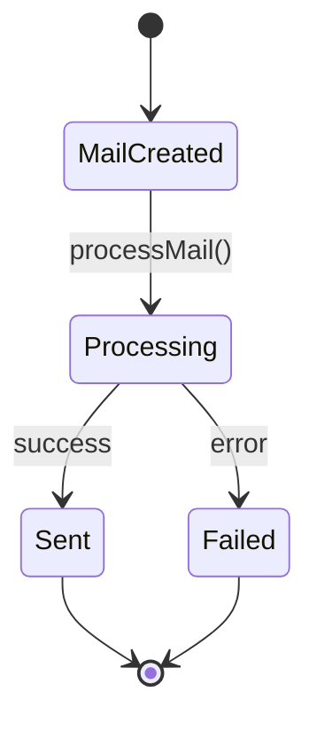
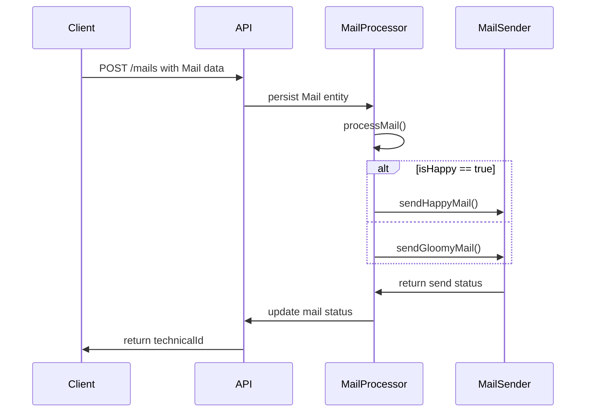
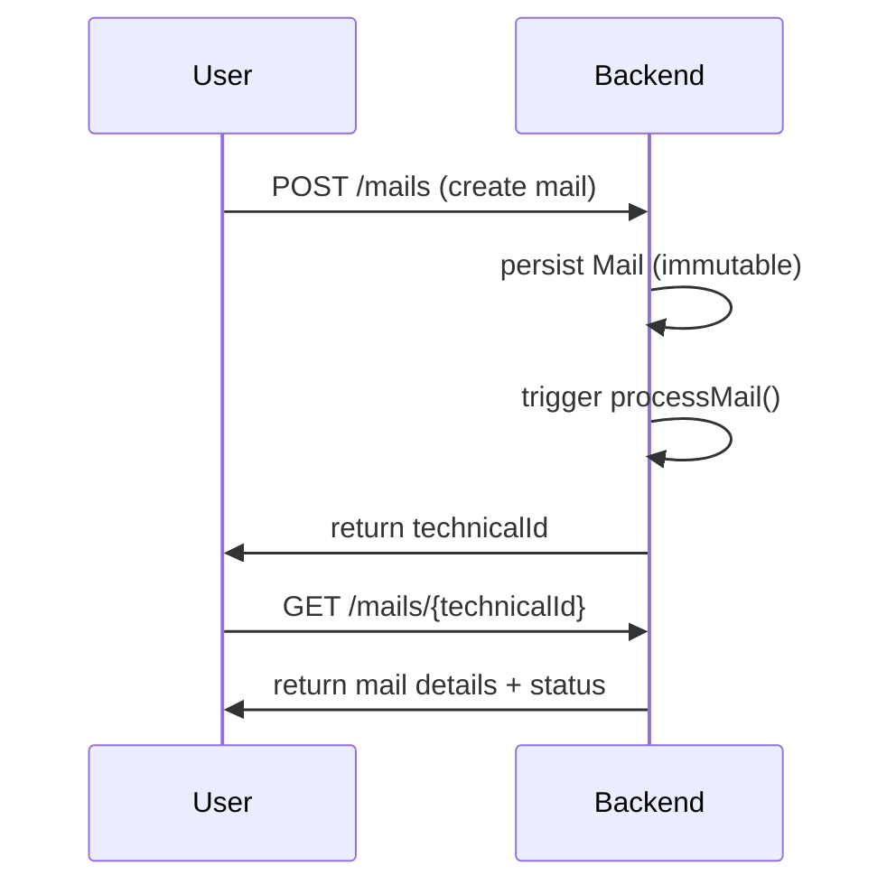

### 1. Entity Definitions

``` 
Mail:  
- isHappy: boolean (indicates if the mail is happy or gloomy)  
- mailList: List<String> (list of recipient email addresses)  
- content: String (mail content to be sent)  
```

### 2. Process Method Flows

```
processMail() Flow:
1. Initial State: Mail entity is created (immutable) with fields isHappy, mailList, and content
2. Validation: Optionally validate mailList for correct email format and non-empty content
3. Processing:  
   - If isHappy == true → invoke sendHappyMail processor logic  
   - Else → invoke sendGloomyMail processor logic  
4. Sending: Iterate over mailList and send mail content based on the mood type  
5. Completion: Persist sending status as part of event history (if needed)  
```

### 3. API Endpoints Design

- **POST /mails**  
  - Creates a new Mail entity (immutable creation)  
  - Triggers `processMail()` event automatically  
  - Response: `{ "technicalId": "<generated_id>" }`  

- **GET /mails/{technicalId}**  
  - Retrieves the stored Mail event data by technicalId  

- No update or delete endpoints, following immutable event-driven principle.

- No GET by condition or GET all endpoints unless explicitly requested later.

### 4. Request/Response Formats

**POST /mails**

Request:
```json
{
  "isHappy": true,
  "mailList": ["user1@example.com", "user2@example.com"],
  "content": "Hello! Wishing you a great day!"
}
```

Response:
```json
{
  "technicalId": "123e4567-e89b-12d3-a456-426614174000"
}
```

**GET /mails/{technicalId}**

Response:
```json
{
  "technicalId": "123e4567-e89b-12d3-a456-426614174000",
  "isHappy": true,
  "mailList": ["user1@example.com", "user2@example.com"],
  "content": "Hello! Wishing you a great day!",
  "status": "SENT"
}
```

---

### Visual Representations

**Entity lifecycle state diagram**


```mermaid
stateDiagram-v2
    [*] --> MailCreated
    MailCreated --> Processing : processMail()
    Processing --> Sent : success
    Processing --> Failed : error
    Sent --> [*]
    Failed --> [*]
```

**Event-driven processing chain**


```mermaid
sequenceDiagram
    participant Client
    participant API
    participant MailProcessor
    participant MailSender

    Client->>API: POST /mails with Mail data
    API->>MailProcessor: persist Mail entity
    MailProcessor->>MailProcessor: processMail()
    alt isHappy == true
        MailProcessor->>MailSender: sendHappyMail()
    else
        MailProcessor->>MailSender: sendGloomyMail()
    end
    MailSender->>MailProcessor: return send status
    MailProcessor->>API: update mail status
    API->>Client: return technicalId
```

**User interaction sequence flow**


```mermaid
sequenceDiagram
    participant User
    participant Backend

    User->>Backend: POST /mails (create mail)
    Backend->>Backend: persist Mail (immutable)
    Backend->>Backend: trigger processMail()
    Backend->>User: return technicalId
    User->>Backend: GET /mails/{technicalId}
    Backend->>User: return mail details + status
```

---

This completes the finalized functional requirements for your happy mail sender application using Event-Driven Architecture.