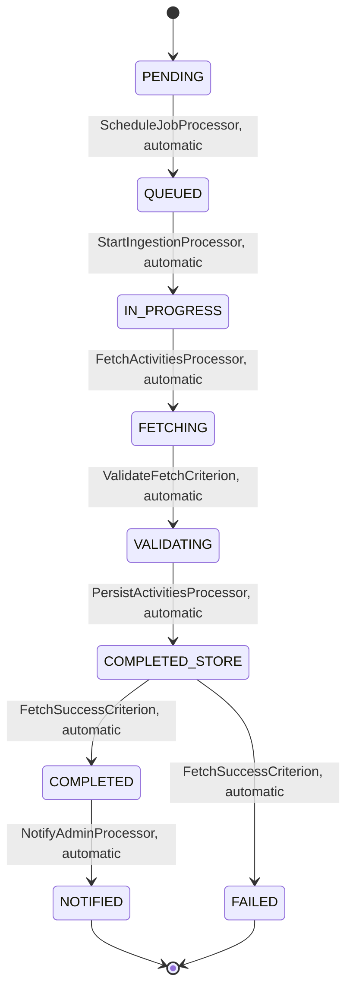

### 1. Entity Definitions

```
IngestionJob:
- jobName: string (friendly name for the ingestion run)
- scheduleDate: string (ISO datetime when job was scheduled to run)
- windowStart: string (ISO datetime start of ingestion window)
- windowEnd: string (ISO datetime end of ingestion window)
- status: string (current state: PENDING/IN_PROGRESS/COMPLETED/FAILED)
- createdAt: string (ISO datetime)
- startedAt: string (ISO datetime)
- finishedAt: string (ISO datetime)
- summary: object (counts, errors, metrics)

Activity:
- activityId: string (external API id)
- userId: string (id of user from external system)
- timestamp: string (ISO datetime of activity)
- activityType: string (type/category of activity)
- rawPayload: object (raw JSON from external API)
- validated: boolean (validation result)
- enriched: object (derived metadata e.g., duration, tags)
- classificationScore: number (confidence of classification)
- ingestionJobTechnicalId: string (references IngestionJob technicalId)
- persistedAt: string (ISO datetime when stored)

DailyReport:
- reportDate: string (ISO date for the report)
- generatedAt: string (ISO datetime)
- jobTechnicalId: string (IngestionJob technicalId used to build report)
- summaryMetrics: object (totalActivities, perTypeCounts, perUserCounts, hourlyDistribution)
- anomalies: array (list of detected anomalies with context)
- recipients: array (admin emails)
- status: string (CREATED/AGGREGATING/READY/PUBLISHED/FAILED)
- publishedAt: string (ISO datetime)
```

Note: Defaulting to 3 entities as requested. Up to 10 allowed — let me know if you want more.

---

### 2. Entity workflows

In this EDA model each entity persistence is an EVENT; Cyoda will start the entity workflow automatically.

IngestionJob workflow:
1. Initial State: Job created (PENDING) via POST (manual create or scheduled create)
2. Scheduling: If scheduled date <= now -> transition to QUEUED
3. Start: QUEUED -> IN_PROGRESS (automatic StartIngestionProcessor)
4. Fetching: IN_PROGRESS -> FETCHING (automatic FetchActivitiesProcessor)
5. Post-Fetch Validation: FETCHING -> VALIDATING (automatic ValidateFetchCriterion)
6. Store Activities: VALIDATING -> COMPLETED_STORE (automatic PersistActivitiesProcessor)
7. Completion: COMPLETED_STORE -> COMPLETED or FAILED (based on FetchSuccessCriterion)
8. Notification: COMPLETED -> NOTIFIED (automatic NotifyAdminProcessor)
9. Final: NOTIFIED -> [*]


```mermaid
stateDiagram-v2
    [*] --> PENDING
    PENDING --> QUEUED : ScheduleJobProcessor, automatic
    QUEUED --> IN_PROGRESS : StartIngestionProcessor, automatic
    IN_PROGRESS --> FETCHING : FetchActivitiesProcessor, automatic
    FETCHING --> VALIDATING : ValidateFetchCriterion, automatic
    VALIDATING --> COMPLETED_STORE : PersistActivitiesProcessor, automatic
    COMPLETED_STORE --> COMPLETED : FetchSuccessCriterion, automatic
    COMPLETED_STORE --> FAILED : FetchSuccessCriterion, automatic
    COMPLETED --> NOTIFIED : NotifyAdminProcessor, automatic
    NOTIFIED --> [*]
    FAILED --> [*]
```

Processors and criteria needed:
- Processors: ScheduleJobProcessor, StartIngestionProcessor, FetchActivitiesProcessor, PersistActivitiesProcessor, NotifyAdminProcessor
- Criteria: ValidateFetchCriterion, FetchSuccessCriterion

Activity workflow:
1. Initial State: Activity created (INGESTED) when persisted by FetchActivitiesProcessor
2. Validation: INGESTED -> VALIDATED (automatic ActivityValidationProcessor) or -> INVALID (if validation fails)
3. Enrichment: VALIDATED -> ENRICHED (automatic EnrichActivityProcessor)
4. Classification/Analysis: ENRICHED -> ANALYZED (automatic ClassifyActivityProcessor)
5. Persist/Complete: ANALYZED -> COMPLETED (automatic PersistActivityProcessor)
6. Manual Correction: INVALID -> VALIDATED (manual correction by user/admin)


```mermaid
stateDiagram-v2
    [*] --> INGESTED
    INGESTED --> VALIDATED : ActivityValidationProcessor, automatic
    INGESTED --> INVALID : ActivityValidationProcessor, automatic
    VALIDATED --> ENRICHED : EnrichActivityProcessor, automatic
    ENRICHED --> ANALYZED : ClassifyActivityProcessor, automatic
    ANALYZED --> COMPLETED : PersistActivityProcessor, automatic
    INVALID --> VALIDATED : ManualCorrectionAction, manual
    COMPLETED --> [*]
```

Processors and criteria needed:
- Processors: ActivityValidationProcessor, EnrichActivityProcessor, ClassifyActivityProcessor, PersistActivityProcessor
- Criteria: ActivityValidityCriterion (e.g., timestamp within window, required fields present)

DailyReport workflow:
1. Initial State: Report created (CREATED) when aggregation process starts (triggered by job completion or schedule)
2. Aggregation: CREATED -> AGGREGATING (automatic AggregateProcessor)
3. Anomaly Detection: AGGREGATING -> ANALYZED (automatic DetectAnomaliesProcessor)
4. Ready: ANALYZED -> READY (if AggregationCompleteCriterion)
5. Publishing: READY -> PUBLISHING (automatic PublishReportProcessor)
6. Completed: PUBLISHING -> PUBLISHED or FAILED
7. Archive: PUBLISHED -> ARCHIVED (automatic after retention period)


```mermaid
stateDiagram-v2
    [*] --> CREATED
    CREATED --> AGGREGATING : AggregateProcessor, automatic
    AGGREGATING --> ANALYZED : DetectAnomaliesProcessor, automatic
    ANALYZED --> READY : AggregationCompleteCriterion, automatic
    READY --> PUBLISHING : PublishReportProcessor, automatic
    PUBLISHING --> PUBLISHED : PublishSuccessCriterion, automatic
    PUBLISHING --> FAILED : PublishSuccessCriterion, automatic
    PUBLISHED --> ARCHIVED : RetentionProcessor, automatic
    FAILED --> [*]
    ARCHIVED --> [*]
```

Processors and criteria needed:
- Processors: AggregateProcessor, DetectAnomaliesProcessor, PublishReportProcessor, RetentionProcessor
- Criteria: AggregationCompleteCriterion, PublishSuccessCriterion, AnomalyDetectionCriterion

---

### 3. Pseudo code for processor classes

Note: Pseudo code focuses on business processing logic (no implementation/technology details). Cyoda will invoke these processors when entity is persisted.

FetchActivitiesProcessor
```
class FetchActivitiesProcessor {
  process(IngestionJob job) {
    // Determine windowStart/windowEnd from job
    // Call external Fakerest API to list activities for window
    // For each activity payload:
    //   create Activity entity with ingested rawPayload and activityId and ingestionJobTechnicalId
    //   persist Activity (this triggers Activity workflow)
    // job.summary.count = number of activities fetched
    // job.status = IN_PROGRESS
  }
}
```

ActivityValidationProcessor
```
class ActivityValidationProcessor {
  process(Activity activity) {
    // Ensure required fields exist (activityId, userId, timestamp)
    // Check timestamp within job window
    // If ok set activity.validated = true
    // Else set activity.validated = false and record reason
    // Persist activity state
  }
}
```

EnrichActivityProcessor
```
class EnrichActivityProcessor {
  process(Activity activity) {
    // Derive additional fields e.g., duration, sourceTag, normalizedType
    // Add to activity.enriched
    // Persist activity
  }
}
```

ClassifyActivityProcessor
```
class ClassifyActivityProcessor {
  process(Activity activity) {
    // Use simple business rules to compute classificationScore and activityType
    // e.g., map rawPayload fields to activityType
    // Persist activity
  }
}
```

PersistActivitiesProcessor (part of job)
```
class PersistActivitiesProcessor {
  process(IngestionJob job, activities) {
    // Ensure all activities linked to job persisted
    // Update job.summary, job.finishedAt
    // Set job.status = COMPLETED
    // Emit event to trigger DailyReport creation
  }
}
```

AggregateProcessor
```
class AggregateProcessor {
  process(DailyReport report) {
    // Query Activities by reportDate/window (use ingestion job link)
    // Compute total activities, perTypeCounts, perUserCounts, hourlyDistribution
    // Update report.summaryMetrics
    // Persist report
  }
}
```

DetectAnomaliesProcessor
```
class DetectAnomaliesProcessor {
  process(DailyReport report) {
    // Compare current metrics to historical baseline (7-day average)
    // If deviation > threshold add anomaly entries to report.anomalies
    // Persist report
  }
}
```

PublishReportProcessor
```
class PublishReportProcessor {
  process(DailyReport report) {
    // Render summary to email body
    // Send to report.recipients (admin)
    // Update status to PUBLISHED or FAILED
    // Persist report
  }
}
```

NotifyAdminProcessor
```
class NotifyAdminProcessor {
  process(IngestionJob job) {
    // Summarize job.summary and errors
    // Send notification to admin (email list configured)
    // Persist job with notification timestamp
  }
}
```

Criteria examples:
- ValidateFetchCriterion: succeed if API returned 200 and items >= 0
- FetchSuccessCriterion: succeed if no unrecoverable errors and activities persisted
- AggregationCompleteCriterion: succeed if aggregate counts computed and persisted

---

### 4. API Endpoints Design Rules

Rules applied:
- Only orchestration entity has POST endpoint (creating a Job triggers event/workflow).
- POST returns only technicalId.
- GET endpoints provided to retrieve stored results by technicalId for Job, Activity, DailyReport.
- No GET by condition included (not explicitly requested).
- GET all for Activities and Reports provided as optional read endpoints.

1) Create Ingestion Job (POST triggers EDA event)
POST /jobs/ingest
Request:
```json
{
  "jobName": "daily-user-activities",
  "scheduleDate": "2025-08-21T02:00:00Z",
  "windowStart": "2025-08-20T00:00:00Z",
  "windowEnd": "2025-08-20T23:59:59Z",
  "recipients": ["admin@example.com"]
}
```
Response (must return only technicalId):
```json
{
  "technicalId": "job_abc123"
}
```

2) Get Ingestion Job by technicalId
GET /jobs/ingest/{technicalId}
Response:
```json
{
  "technicalId": "job_abc123",
  "jobName": "daily-user-activities",
  "scheduleDate": "2025-08-21T02:00:00Z",
  "windowStart": "2025-08-20T00:00:00Z",
  "windowEnd": "2025-08-20T23:59:59Z",
  "status": "COMPLETED",
  "createdAt": "2025-08-21T02:00:00Z",
  "startedAt": "2025-08-21T02:00:05Z",
  "finishedAt": "2025-08-21T02:03:10Z",
  "summary": {
    "fetched": 120,
    "persisted": 118,
    "errors": 2
  }
}
```

3) Get Activity by technicalId
GET /activities/{technicalId}
Response:
```json
{
  "technicalId": "activity_def456",
  "activityId": "42",
  "userId": "7",
  "timestamp": "2025-08-20T10:12:00Z",
  "activityType": "login",
  "validated": true,
  "enriched": { "duration": 0, "tags": ["auth"] },
  "classificationScore": 0.98,
  "ingestionJobTechnicalId": "job_abc123",
  "persistedAt": "2025-08-21T02:00:10Z",
  "rawPayload": { "id": 42, "userId": 7, "action": "login" }
}
```

4) Get DailyReport by technicalId
GET /reports/daily/{technicalId}
Response:
```json
{
  "technicalId": "report_ghi789",
  "reportDate": "2025-08-20",
  "generatedAt": "2025-08-21T03:00:00Z",
  "jobTechnicalId": "job_abc123",
  "summaryMetrics": {
    "totalActivities": 118,
    "perTypeCounts": { "login": 60, "purchase": 10, "view": 48 },
    "perUserCounts": { "7": 12, "8": 9 },
    "hourlyDistribution": { "00": 2, "01": 1, "10": 25 }
  },
  "anomalies": [
    { "type": "spike", "metric": "login", "details": "200% above 7-day avg" }
  ],
  "recipients": ["admin@example.com"],
  "status": "PUBLISHED",
  "publishedAt": "2025-08-21T03:05:00Z"
}
```

Optional: GET all activities /reports endpoints for browsing (not required).

---

If you want, next we can:
- Expand to include a User entity for richer per-user reporting (this would be a 4th entity).
- Define retention rules and archival workflow details.
- Add GET-by-condition endpoints (e.g., activities by userId or by date) — tell me which queries are needed and I will add them.