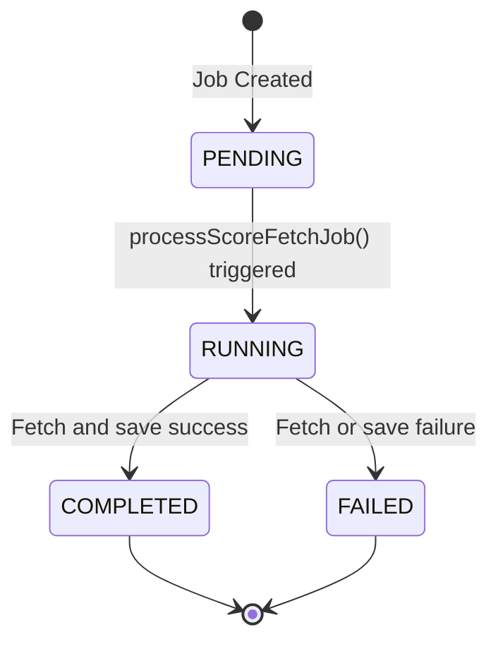
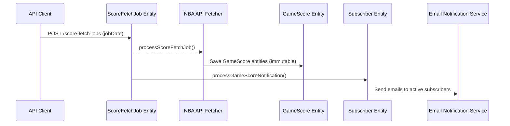
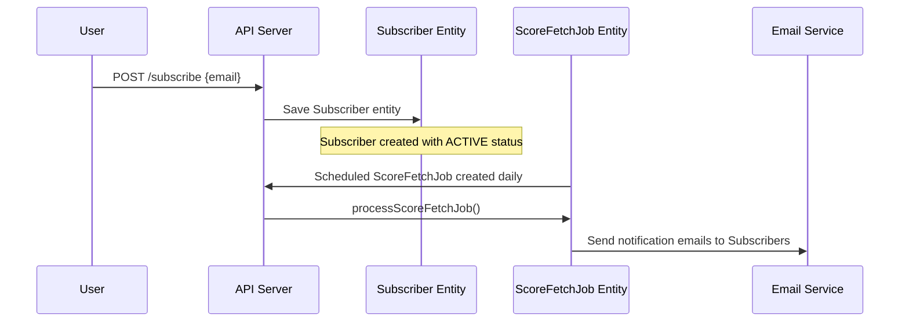

### 1. Entity Definitions

``` 
ScoreFetchJob:
- jobDate: LocalDate (date for which NBA scores are fetched)
- status: StatusEnum (PENDING, RUNNING, COMPLETED, FAILED)
- triggeredAt: Instant (timestamp when job started)
- completedAt: Instant (timestamp when job finished)
  
Subscriber:
- email: String (subscriber's email address)
- subscribedAt: Instant (timestamp when subscription was created)
- status: StatusEnum (ACTIVE, UNSUBSCRIBED)

GameScore:
- gameDate: LocalDate (date of the NBA game)
- homeTeam: String (name of the home team)
- awayTeam: String (name of the away team)
- homeScore: Integer (home team final score)
- awayScore: Integer (away team final score)
- status: StatusEnum (RECEIVED, PROCESSED)
```

---

### 2. Process Method Flows

```
processScoreFetchJob() Flow:
1. Initial State: ScoreFetchJob created with PENDING status for a specific jobDate
2. Update status to RUNNING and triggeredAt timestamp set
3. Fetch NBA scores asynchronously from external API for jobDate
4. Save each game as immutable GameScore entities with status RECEIVED
5. Update ScoreFetchJob status to COMPLETED or FAILED accordingly and set completedAt
6. Trigger processGameScoreNotification() to send emails to active Subscribers

processSubscriber() Flow:
1. Subscriber created with ACTIVE status and subscribedAt timestamp
2. Validate email format (optional check)
3. Add subscriber to notification list

processGameScoreNotification() Flow:
1. Retrieve all GameScore entities for jobDate with status RECEIVED
2. Generate daily summary email content
3. Send emails asynchronously to all ACTIVE Subscribers
4. Update GameScore entities status to PROCESSED to indicate notification sent
```

---

### 3. API Endpoints & Request/Response Formats

- **POST /score-fetch-jobs**

  Request:
  ```json
  {
    "jobDate": "2025-03-25"
  }
  ```

  Response:
  ```json
  {
    "technicalId": "string"
  }
  ```

- **POST /subscribe**

  Request:
  ```json
  {
    "email": "user@example.com"
  }
  ```

  Response:
  ```json
  {
    "technicalId": "string"
  }
  ```

- **GET /subscribers**

  Response:
  ```json
  [
    {
      "email": "user@example.com",
      "subscribedAt": "2025-03-20T15:30:00Z",
      "status": "ACTIVE"
    }
  ]
  ```

- **GET /games/all?limit=20&page=1** (optional pagination)

  Response:
  ```json
  [
    {
      "gameDate": "2025-03-25",
      "homeTeam": "Team A",
      "awayTeam": "Team B",
      "homeScore": 100,
      "awayScore": 98,
      "status": "PROCESSED"
    }
  ]
  ```

- **GET /games/{date}**

  Response:
  ```json
  [
    {
      "gameDate": "2025-03-25",
      "homeTeam": "Team A",
      "awayTeam": "Team B",
      "homeScore": 100,
      "awayScore": 98,
      "status": "PROCESSED"
    }
  ]
  ```

- **GET by technicalId** endpoints for ScoreFetchJob and Subscriber return the saved entity data.

---

### 4. Mermaid Diagrams

#### Entity Lifecycle State Diagram (ScoreFetchJob)


```mermaid
stateDiagram-v2
    [*] --> PENDING : Job Created
    PENDING --> RUNNING : processScoreFetchJob() triggered
    RUNNING --> COMPLETED : Fetch and save success
    RUNNING --> FAILED : Fetch or save failure
    COMPLETED --> [*]
    FAILED --> [*]
```

#### Event-Driven Processing Chain


```mermaid
sequenceDiagram
    participant API as API Client
    participant Job as ScoreFetchJob Entity
    participant Fetcher as NBA API Fetcher
    participant Game as GameScore Entity
    participant Subscriber as Subscriber Entity
    participant Notifier as Email Notification Service

    API->>Job: POST /score-fetch-jobs (jobDate)
    Job-->>Fetcher: processScoreFetchJob()
    Fetcher->>Game: Save GameScore entities (immutable)
    Job->>Subscriber: processGameScoreNotification()
    Subscriber->>Notifier: Send emails to active subscribers
```

#### User Interaction Sequence Flow (Subscription + Notification)


```mermaid
sequenceDiagram
    participant User as User
    participant API as API Server
    participant Subscriber as Subscriber Entity
    participant Job as ScoreFetchJob Entity
    participant Notifier as Email Service

    User->>API: POST /subscribe {email}
    API->>Subscriber: Save Subscriber entity
    Note over Subscriber: Subscriber created with ACTIVE status

    Job->>API: Scheduled ScoreFetchJob created daily
    API->>Job: processScoreFetchJob()
    Job->>Notifier: Send notification emails to Subscribers
```

---

If you need any further refinement or additional endpoints, please let me know!