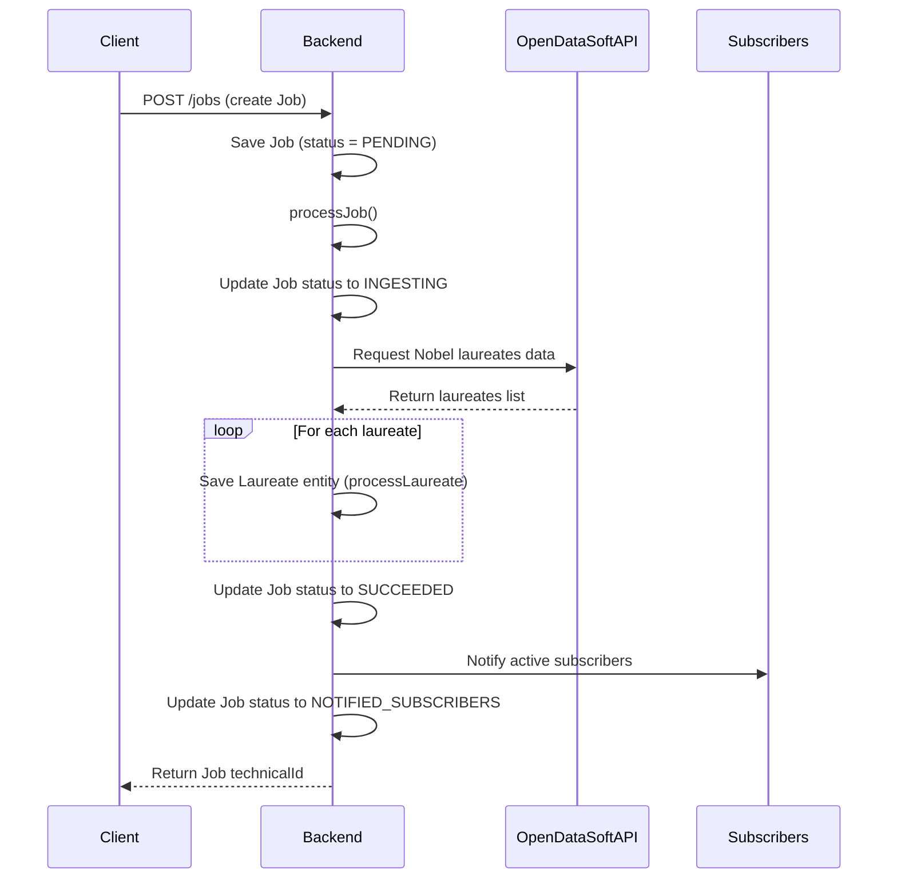
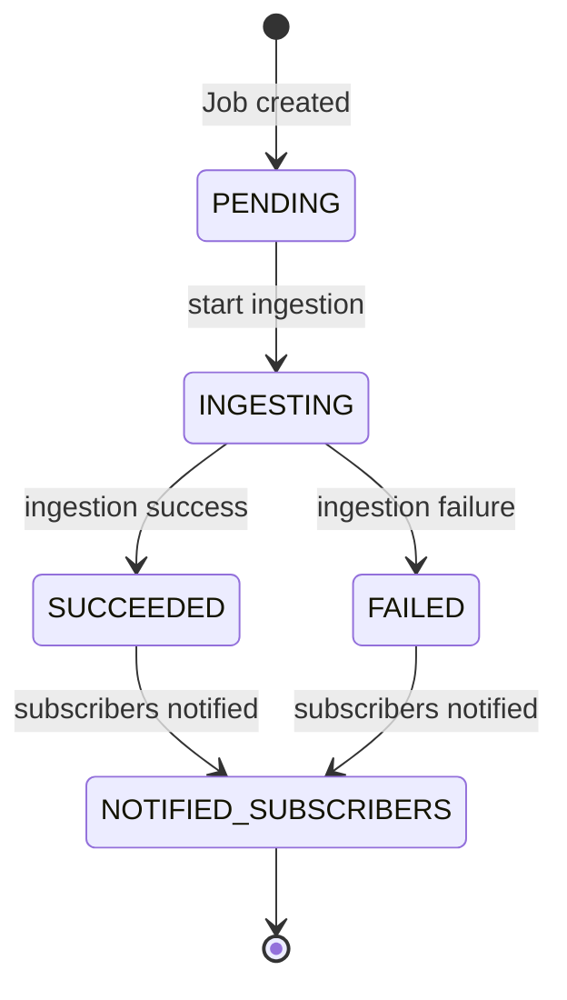

### 1. Entity Definitions

```
Job:
- jobName: String (Name of the ingestion job)
- jobStatus: String (Current status of the job, e.g., PENDING, INGESTING, SUCCEEDED, FAILED, NOTIFIED_SUBSCRIBERS)
- scheduledTime: String (ISO 8601 timestamp for when the job is scheduled)
- startedTime: String (ISO 8601 timestamp when ingestion started)
- finishedTime: String (ISO 8601 timestamp when ingestion finished)
- resultSummary: String (Summary or description of ingestion results)

Laureate:
- laureateId: Integer (Unique ID of the laureate)
- firstname: String (First name of the laureate)
- surname: String (Surname of the laureate)
- gender: String (Gender of the laureate)
- born: String (Date of birth, ISO 8601 format)
- died: String (Date of death, ISO 8601 format or null)
- borncountry: String (Country where laureate was born)
- borncountrycode: String (Country code of birthplace)
- borncity: String (City where laureate was born)
- year: String (Year laureate won the prize)
- category: String (Category of the Nobel Prize)
- motivation: String (Motivation for the prize)
- affiliationName: String (Name of affiliated institution)
- affiliationCity: String (City of affiliation)
- affiliationCountry: String (Country of affiliation)

Subscriber:
- contactType: String (Type of contact, e.g., "email", "webhook")
- contactDetails: String (Email address or webhook URL)
- active: Boolean (Indicates if subscriber is active)
- preferredCategories: String (Comma-separated list of categories they want notifications for; optional)
```

---

### 2. Process Method Flows

```
processJob() Flow:
1. Initial State: Job entity is created with jobStatus = "PENDING".
2. Validation: Validate job parameters (e.g., scheduledTime must be valid ISO timestamp).
3. Processing: 
   - Transition jobStatus to "INGESTING".
   - Fetch Nobel laureates data from OpenDataSoft API.
   - For each retrieved laureate, save a new Laureate entity (triggering processLaureate()).
4. Completion:
   - If data ingestion succeeds, set jobStatus to "SUCCEEDED".
   - If ingestion fails, set jobStatus to "FAILED".
5. Notification:
   - Trigger notifications to all active Subscribers (filter by preferredCategories if set).
   - Update jobStatus to "NOTIFIED_SUBSCRIBERS".
   - Save a summary in resultSummary.
```

```
processLaureate() Flow:
1. Validation:
   - Check mandatory fields: laureateId, firstname, surname, year, category.
   - Validate date formats for born and died.
2. Enrichment:
   - Normalize borncountrycode if necessary.
   - Calculate derived attributes if needed (optional).
3. Persistence:
   - Save the laureate data as immutable entity.
4. Event:
   - Optionally trigger further downstream events or processing if required.
```

```
processSubscriber() Flow:
1. Validation:
   - Validate contactType and contactDetails format.
2. Persistence:
   - Save subscriber as immutable entity.
3. No further processing unless explicitly triggered.
```

---

### 3. API Endpoints Design

#### Job Entity:
- **POST /jobs**  
  Request Body:
  ```json
  {
    "jobName": "Nobel Laureates Ingestion",
    "scheduledTime": "2024-07-01T00:00:00Z"
  }
  ```
  Response Body:
  ```json
  {
    "technicalId": "string"
  }
  ```

- **GET /jobs/{technicalId}**  
  Response Body:
  ```json
  {
    "jobName": "Nobel Laureates Ingestion",
    "jobStatus": "NOTIFIED_SUBSCRIBERS",
    "scheduledTime": "2024-07-01T00:00:00Z",
    "startedTime": "2024-07-01T00:01:00Z",
    "finishedTime": "2024-07-01T00:05:00Z",
    "resultSummary": "150 laureates ingested, notifications sent"
  }
  ```

#### Laureate Entity:
- **No POST endpoint** (Created immutably by processJob -> processLaureate)
- **GET /laureates/{technicalId}**  
  Response Body:
  ```json
  {
    "laureateId": 853,
    "firstname": "Akira",
    "surname": "Suzuki",
    "gender": "male",
    "born": "1930-09-12",
    "died": null,
    "borncountry": "Japan",
    "borncountrycode": "JP",
    "borncity": "Mukawa",
    "year": "2010",
    "category": "Chemistry",
    "motivation": "\"for palladium-catalyzed cross couplings in organic synthesis\"",
    "affiliationName": "Hokkaido University",
    "affiliationCity": "Sapporo",
    "affiliationCountry": "Japan"
  }
  ```

#### Subscriber Entity:
- **POST /subscribers**  
  Request Body:
  ```json
  {
    "contactType": "email",
    "contactDetails": "user@example.com",
    "active": true,
    "preferredCategories": "Physics,Chemistry"
  }
  ```
  Response Body:
  ```json
  {
    "technicalId": "string"
  }
  ```

- **GET /subscribers/{technicalId}**  
  Response Body:
  ```json
  {
    "contactType": "email",
    "contactDetails": "user@example.com",
    "active": true,
    "preferredCategories": "Physics,Chemistry"
  }
  ```

---

### 4. Mermaid Diagrams


```mermaid
sequenceDiagram
    participant Client
    participant Backend
    participant OpenDataSoftAPI
    participant Subscribers

    Client->>Backend: POST /jobs (create Job)
    Backend->>Backend: Save Job (status = PENDING)
    Backend->>Backend: processJob()
    Backend->>Backend: Update Job status to INGESTING
    Backend->>OpenDataSoftAPI: Request Nobel laureates data
    OpenDataSoftAPI-->>Backend: Return laureates list
    loop For each laureate
        Backend->>Backend: Save Laureate entity (processLaureate)
    end
    Backend->>Backend: Update Job status to SUCCEEDED
    Backend->>Subscribers: Notify active subscribers
    Backend->>Backend: Update Job status to NOTIFIED_SUBSCRIBERS
    Backend-->>Client: Return Job technicalId
```


```mermaid
stateDiagram-v2
    [*] --> PENDING : Job created
    PENDING --> INGESTING : start ingestion
    INGESTING --> SUCCEEDED : ingestion success
    INGESTING --> FAILED : ingestion failure
    SUCCEEDED --> NOTIFIED_SUBSCRIBERS : subscribers notified
    FAILED --> NOTIFIED_SUBSCRIBERS : subscribers notified
    NOTIFIED_SUBSCRIBERS --> [*]
```