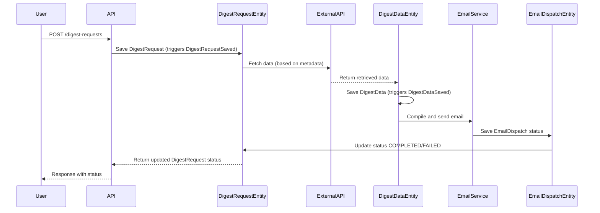
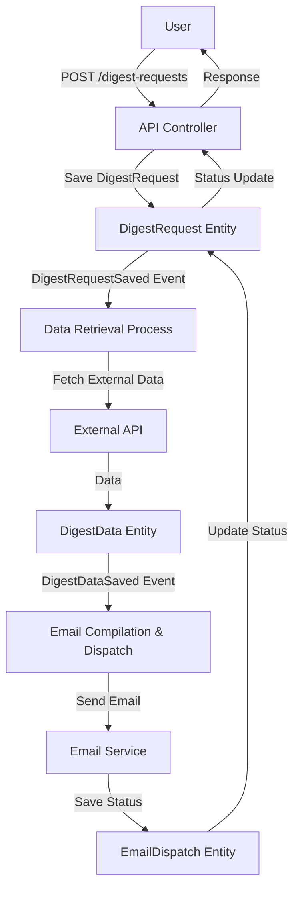

# Functional Requirements using Event-Driven Architecture (EDA)

## 1. Business Entities

- **DigestRequest**
  - Fields: `id`, `userEmail`, `metadata`, `status`, `createdAt`, `updatedAt`
  - Description: Represents a user's request for a digest email.
- **DigestData**
  - Fields: `id`, `digestRequestId`, `retrievedData`, `format`, `createdAt`
  - Description: Stores data retrieved from external API to be included in the digest.
- **EmailDispatch**
  - Fields: `id`, `digestRequestId`, `emailStatus`, `sentAt`
  - Description: Tracks the status of digest email dispatch.

## 2. API Endpoints

### POST Endpoints (Add/Update Entities & Trigger Events)

- **POST /digest-requests**
  - Description: Create or update a DigestRequest entity. Triggers event for data retrieval and email dispatch.
  - Request:
    ```json
    {
      "userEmail": "string",
      "metadata": { "key": "value" }
    }
    ```
  - Response:
    ```json
    {
      "id": "string",
      "status": "PENDING"
    }
    ```

- **POST /digest-data**
  - Description: (Internal use) Save retrieved data for a DigestRequest.
  - Request:
    ```json
    {
      "digestRequestId": "string",
      "retrievedData": "object",
      "format": "PLAIN_TEXT | HTML | ATTACHMENT"
    }
    ```
  - Response:
    ```json
    {
      "id": "string"
    }
    ```

- **POST /email-dispatch**
  - Description: (Internal use) Save email dispatch status.
  - Request:
    ```json
    {
      "digestRequestId": "string",
      "emailStatus": "SENT | FAILED"
    }
    ```
  - Response:
    ```json
    {
      "id": "string"
    }
    ```

### GET Endpoints (Retrieve Application Results)

- **GET /digest-requests/{id}**
  - Description: Retrieve the status and details of a DigestRequest.
  - Response:
    ```json
    {
      "id": "string",
      "userEmail": "string",
      "metadata": { "key": "value" },
      "status": "PENDING | COMPLETED | FAILED",
      "createdAt": "timestamp",
      "updatedAt": "timestamp"
    }
    ```

- **GET /email-dispatch/{digestRequestId}**
  - Description: Retrieve the email dispatch status for a DigestRequest.
  - Response:
    ```json
    {
      "digestRequestId": "string",
      "emailStatus": "SENT | FAILED",
      "sentAt": "timestamp"
    }
    ```

## 3. Event Processing Workflows

- **Workflow 1: On DigestRequest Creation/Update**
  - Event: `DigestRequestSaved`
  - Actions:
    1. Fetch data from external API based on `metadata` or defaults.
    2. Save retrieved data as `DigestData`.
    3. Trigger next event: `DigestDataSaved`.

- **Workflow 2: On DigestDataSaved**
  - Event: `DigestDataSaved`
  - Actions:
    1. Compile digest in specified format.
    2. Send email to `userEmail`.
    3. Save email dispatch status as `EmailDispatch`.
    4. Update `DigestRequest` status to COMPLETED or FAILED.

## 4. User Request/Response Flow Example

### POST /digest-requests (User sends new digest request)
Request:
```json
{
  "userEmail": "user@example.com",
  "metadata": {
    "category": "pets",
    "frequency": "daily"
  }
}
```
Response:
```json
{
  "id": "12345",
  "status": "PENDING"
}
```

---

## Mermaid Diagrams

### Entity Creation and Event-Driven Processing Flow


```mermaid
sequenceDiagram
    participant User
    participant API
    participant DigestRequestEntity
    participant ExternalAPI
    participant DigestDataEntity
    participant EmailService
    participant EmailDispatchEntity

    User->>API: POST /digest-requests
    API->>DigestRequestEntity: Save DigestRequest (triggers DigestRequestSaved)
    DigestRequestEntity->>ExternalAPI: Fetch data (based on metadata)
    ExternalAPI-->>DigestDataEntity: Return retrieved data
    DigestDataEntity->>DigestDataEntity: Save DigestData (triggers DigestDataSaved)
    DigestDataEntity->>EmailService: Compile and send email
    EmailService->>EmailDispatchEntity: Save EmailDispatch status
    EmailDispatchEntity->>DigestRequestEntity: Update status COMPLETED/FAILED
    DigestRequestEntity-->>API: Return updated DigestRequest status
    API-->>User: Response with status
```

### User Interaction Pattern


```mermaid
flowchart TD
    A[User] -->|POST /digest-requests| B[API Controller]
    B -->|Save DigestRequest| C[DigestRequest Entity]
    C -->|DigestRequestSaved Event| D[Data Retrieval Process]
    D -->|Fetch External Data| E[External API]
    E -->|Data| F[DigestData Entity]
    F -->|DigestDataSaved Event| G[Email Compilation & Dispatch]
    G -->|Send Email| H[Email Service]
    H -->|Save Status| I[EmailDispatch Entity]
    I -->|Update Status| C
    C -->|Status Update| B
    B -->|Response| A
```

---

Please let me know if you need any further adjustments!