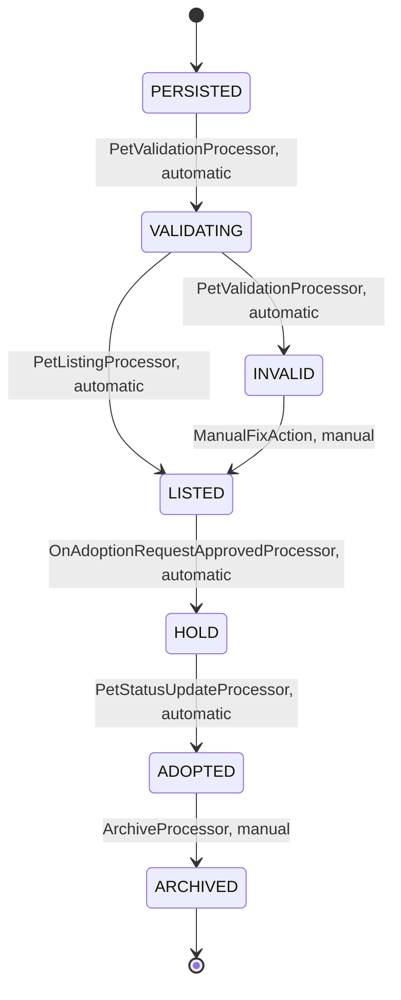
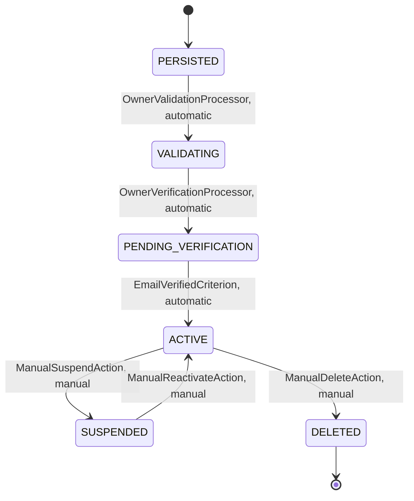
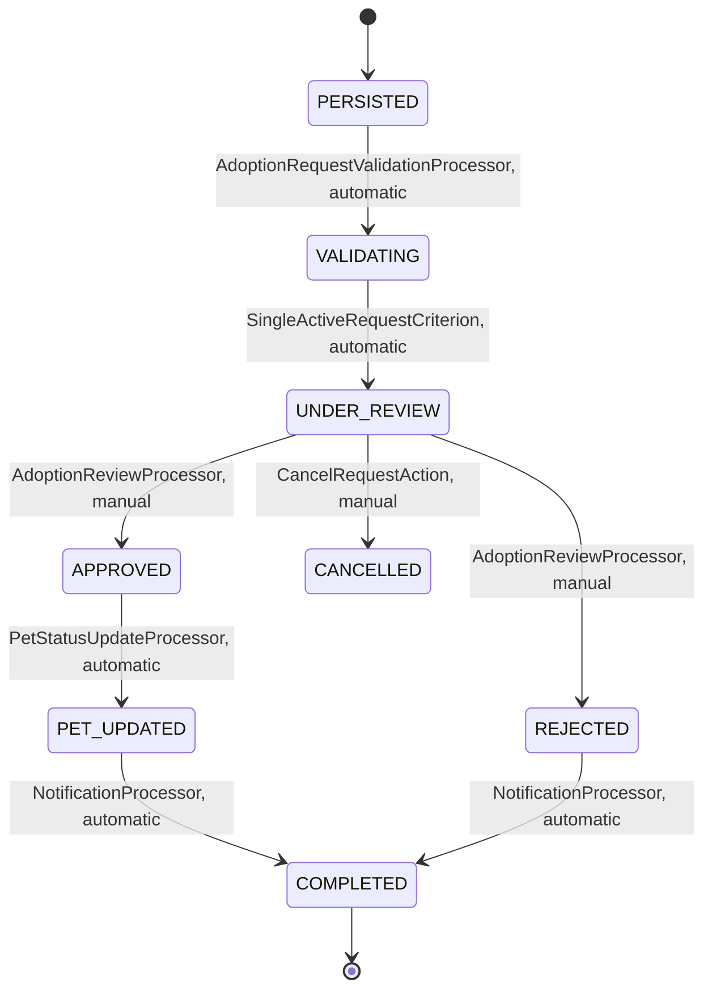

### 1. Entity Definitions

```
Pet:
- id: String (business id assigned by shelter)
- name: String (pet name)
- species: String (e.g., cat, dog)
- breed: String (breed description)
- age: Integer (age in years)
- sex: String (M/F/Unknown)
- status: String (available/pending/adopted)
- description: String (short bio)
- photos: Array[String] (URLs)
- healthNotes: Array[String] (vaccinations, conditions)
- createdAt: String (ISO timestamp)
- updatedAt: String (ISO timestamp)

Owner:
- id: String (business id)
- fullName: String
- email: String
- phone: String
- address: String
- bio: String
- favoritePetIds: Array[String]
- role: String (visitor/owner/staff)
- createdAt: String (ISO timestamp)
- updatedAt: String (ISO timestamp)

AdoptionRequest:
- id: String (business id)
- petId: String (references Pet.id)
- requesterId: String (references Owner.id)
- message: String (owner message)
- status: String (submitted/approved/rejected/cancelled)
- submittedAt: String (ISO timestamp)
- processedAt: String (ISO timestamp)
- processedBy: String (staff id who processed)
```

Note: You asked for 3 entities; I used exactly those 3.

---

### 2. Entity workflows

Pet workflow:
1. Initial State: PERSISTED (entity created via POST => event)
2. Automatic Validation: VALIDATION_PROCESSOR verifies required fields
3. Auto-Photo Check: PHOTO_PROCESSOR ensures at least one photo
4. If valid -> LISTED (available for browsing)
5. If data missing -> INVALID (manual correction by staff)
6. On adoption approval -> ADOPTED (via AdoptionRequest workflow)
7. Final: ARCHIVED (optional when record retired)

Mermaid state diagram for Pet:

```mermaid
stateDiagram-v2
    [*] --> PERSISTED
    PERSISTED --> VALIDATING : PetValidationProcessor, automatic
    VALIDATING --> LISTED : PetListingProcessor, automatic
    VALIDATING --> INVALID : PetValidationProcessor, automatic
    LISTED --> HOLD : OnAdoptionRequestApprovedProcessor, automatic
    HOLD --> ADOPTED : PetStatusUpdateProcessor, automatic
    ADOPTED --> ARCHIVED : ArchiveProcessor, manual
    INVALID --> LISTED : ManualFixAction, manual
    ARCHIVED --> [*]
```

Pet workflow processors & criteria:
- Criteria: PetDataCompleteCriterion (checks required fields); PetPhotoCriterion (>=1 photo).
- Processors: PetValidationProcessor (validate fields), PetListingProcessor (index/list pet), PetStatusUpdateProcessor (change status on adoption).
- Pseudo:
  - PetValidationProcessor.process(entity):
    - if PetDataCompleteCriterion.fail then set state INVALID and emit notification
    - else set state LISTED

Owner workflow:
1. Initial State: PERSISTED
2. Automatic Validation: OWNER_VALIDATION_PROCESSOR checks contact format
3. Automatic Verification: EMAIL_VERIFICATION_PROCESSOR sends verification (status remains ACTIVE after verification)
4. Manual role changes: staff can change role to staff
5. Final: SUSPENDED/DELETED (manual)

Mermaid state diagram for Owner:

```mermaid
stateDiagram-v2
    [*] --> PERSISTED
    PERSISTED --> VALIDATING : OwnerValidationProcessor, automatic
    VALIDATING --> PENDING_VERIFICATION : OwnerVerificationProcessor, automatic
    PENDING_VERIFICATION --> ACTIVE : EmailVerifiedCriterion, automatic
    ACTIVE --> SUSPENDED : ManualSuspendAction, manual
    SUSPENDED --> ACTIVE : ManualReactivateAction, manual
    ACTIVE --> DELETED : ManualDeleteAction, manual
    DELETED --> [*]
```

Owner processors & criteria:
- Criteria: OwnerContactValidCriterion (email/phone format); EmailVerifiedCriterion.
- Processors: OwnerValidationProcessor, OwnerVerificationProcessor, OwnerRoleUpdateProcessor.
- Pseudo:
  - OwnerVerificationProcessor.process(entity):
    - send verification email via Cyoda action
    - set state PENDING_VERIFICATION

AdoptionRequest workflow:
1. Initial State: PERSISTED (submitted)
2. Automatic Validation: REQUEST_VALIDATION_PROCESSOR checks fields and PetAvailabilityCriterion
3. If valid -> UNDER_REVIEW (manual review by staff)
4. Manual Decision: staff sets APPROVED or REJECTED
5. On APPROVED -> PET_UPDATED (PetStatusUpdateProcessor sets Pet.status -> adopted/pending)
6. Request moves to COMPLETED; notifications sent
7. Owner can cancel while UNDER_REVIEW -> CANCELLED

Mermaid state diagram for AdoptionRequest:

```mermaid
stateDiagram-v2
    [*] --> PERSISTED
    PERSISTED --> VALIDATING : AdoptionRequestValidationProcessor, automatic
    VALIDATING --> UNDER_REVIEW : SingleActiveRequestCriterion, automatic
    UNDER_REVIEW --> APPROVED : AdoptionReviewProcessor, manual
    UNDER_REVIEW --> REJECTED : AdoptionReviewProcessor, manual
    APPROVED --> PET_UPDATED : PetStatusUpdateProcessor, automatic
    PET_UPDATED --> COMPLETED : NotificationProcessor, automatic
    REJECTED --> COMPLETED : NotificationProcessor, automatic
    UNDER_REVIEW --> CANCELLED : CancelRequestAction, manual
    COMPLETED --> [*]
```

AdoptionRequest processors & criteria:
- Criteria: SingleActiveRequestCriterion (one active request per pet per requester); PetAvailabilityCriterion (pet.status==available).
- Processors: AdoptionRequestValidationProcessor, AdoptionReviewProcessor, PetStatusUpdateProcessor, NotificationProcessor.
- Pseudo:
  - AdoptionRequestValidationProcessor.process(entity):
    - if not PetAvailabilityCriterion.pass then set state VALIDATING -> UNDER_REVIEW (with note) or REJECTED
    - else allow move to UNDER_REVIEW

---

### 3. Pseudo code for processor classes

PetValidationProcessor
```
class PetValidationProcessor {
  process(pet) {
    if (!PetDataCompleteCriterion(pet)) {
      pet.state = INVALID
      emit Event(PetInvalid, pet.id)
      return
    }
    if (!PetPhotoCriterion(pet)) {
      pet.state = INVALID
      emit Event(PetInvalid, pet.id)
      return
    }
    pet.state = LISTED
    emit Event(PetListed, pet.id)
  }
}
```

AdoptionRequestValidationProcessor
```
class AdoptionRequestValidationProcessor {
  process(request) {
    if (!SingleActiveRequestCriterion(request)) {
      request.state = REJECTED
      emit Event(AdoptionRequestRejected, request.id)
      return
    }
    if (!PetAvailabilityCriterion(request.petId)) {
      request.state = REJECTED
      emit Event(AdoptionRequestRejected, request.id)
      return
    }
    request.state = UNDER_REVIEW
    emit Event(AdoptionRequestUnderReview, request.id)
  }
}
```

PetStatusUpdateProcessor
```
class PetStatusUpdateProcessor {
  process(request) {
    set Pet.status = pending
    if (request.decision == APPROVED) {
      set Pet.status = adopted
      emit Event(PetAdopted, request.petId)
    }
    persist Pet
  }
}
```

NotificationProcessor (generic)
```
class NotificationProcessor {
  process(entity, reason) {
    build notification
    send to interested parties via Cyoda notification action
  }
}
```

---

### 4. API Endpoints Design Rules

Rules applied:
- Every POST returns only {"technicalId":"..."}.
- Every entity created via POST has GET by technicalId to retrieve persisted result.
- No GET by condition unless requested.

Endpoints and JSON shapes:

1) Create Pet
POST /pets
Request:
```json
{
  "id":"PET-123",
  "name":"Whiskers",
  "species":"cat",
  "breed":"Tabby",
  "age":2,
  "sex":"F",
  "description":"Playful kitten",
  "photos":["https://.../1.jpg"],
  "healthNotes":["vaccinated"]
}
```
Response:
```json
{ "technicalId":"tech-pet-0001" }
```

GET /pets/{technicalId}
Response:
```json
{
  "technicalId":"tech-pet-0001",
  "id":"PET-123",
  "name":"Whiskers",
  "species":"cat",
  "breed":"Tabby",
  "age":2,
  "sex":"F",
  "status":"available",
  "description":"Playful kitten",
  "photos":["https://.../1.jpg"],
  "healthNotes":["vaccinated"],
  "createdAt":"2025-08-28T12:00:00Z",
  "updatedAt":"2025-08-28T12:00:00Z"
}
```

2) Create Owner
POST /owners
Request:
```json
{
  "id":"OWN-10",
  "fullName":"Alex Doe",
  "email":"alex@example.com",
  "phone":"+123456789",
  "address":"123 Cat St",
  "bio":"Loves cats"
}
```
Response:
```json
{ "technicalId":"tech-owner-0001" }
```

GET /owners/{technicalId}
Response:
```json
{
  "technicalId":"tech-owner-0001",
  "id":"OWN-10",
  "fullName":"Alex Doe",
  "email":"alex@example.com",
  "phone":"+123456789",
  "address":"123 Cat St",
  "bio":"Loves cats",
  "favoritePetIds":[],
  "role":"owner",
  "createdAt":"2025-08-28T12:00:00Z"
}
```

3) Create AdoptionRequest
POST /adoption-requests
Request:
```json
{
  "id":"REQ-55",
  "petId":"PET-123",
  "requesterId":"OWN-10",
  "message":"I have a loving home"
}
```
Response:
```json
{ "technicalId":"tech-req-0001" }
```

GET /adoption-requests/{technicalId}
Response:
```json
{
  "technicalId":"tech-req-0001",
  "id":"REQ-55",
  "petId":"PET-123",
  "requesterId":"OWN-10",
  "message":"I have a loving home",
  "status":"under_review",
  "submittedAt":"2025-08-28T12:05:00Z"
}
```

---

If you want, I can:
- Add more entities (up to 10) like Staff, NotificationJob, PhotoIngestJob (orchestration jobs) — note: you asked for 3 so I used exactly 3.
- Add GET by condition endpoints (search/filter) or an orchestration Job entity to batch-import Petstore data via Cyoda.
Which would you prefer next?