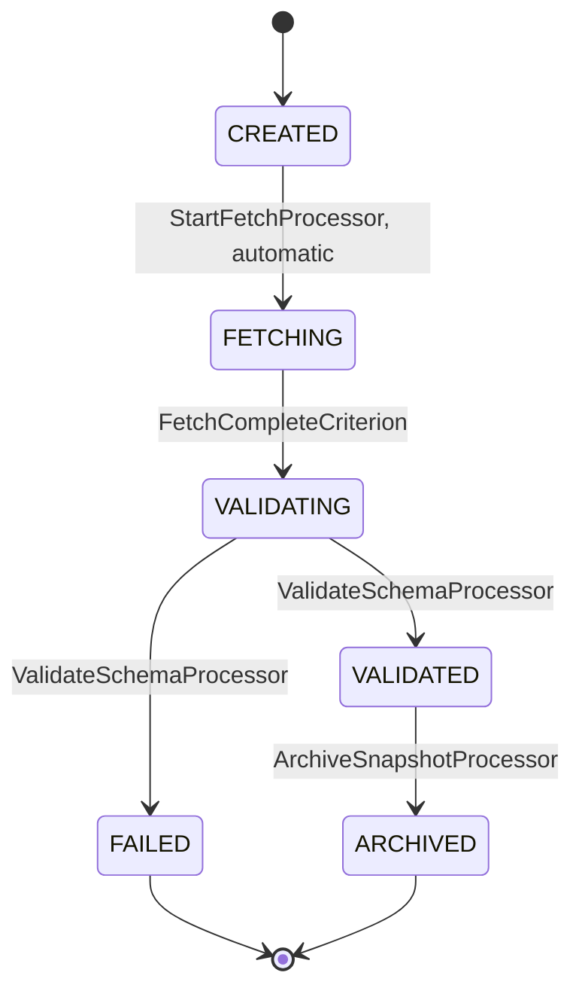
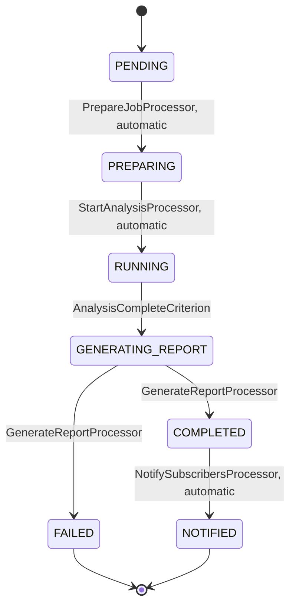
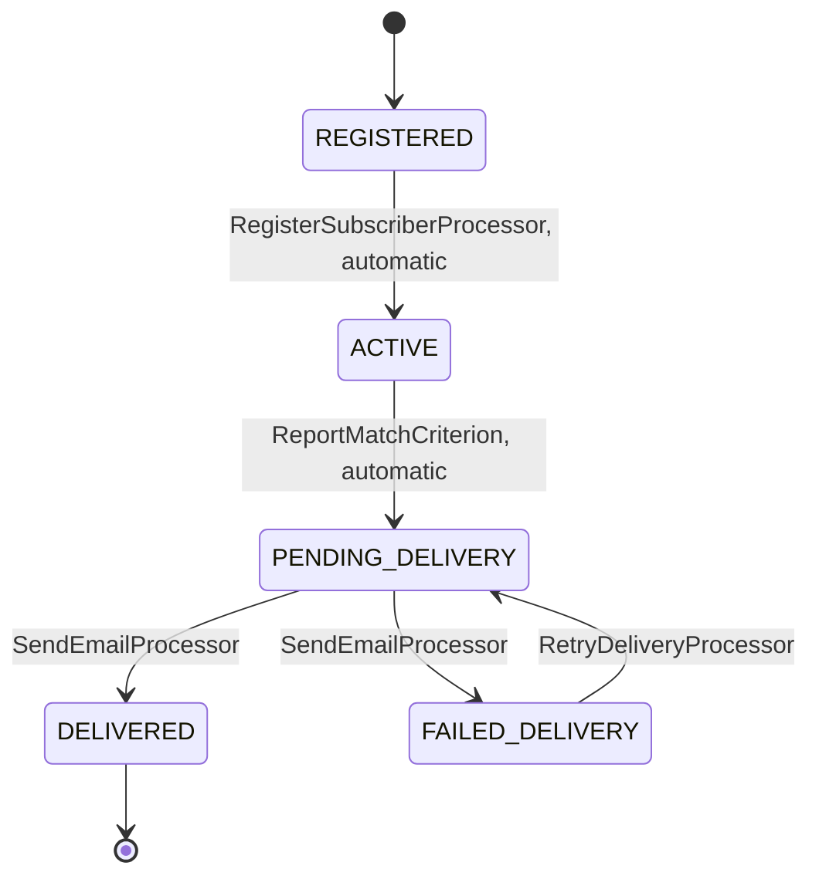

### 1. Entity Definitions
```
DataFeed:
- id: String (reference id to DataFeed entity)
- url: String (source CSV URL)
- name: String (friendly name)
- lastFetchedAt: DateTime (when CSV last fetched)
- lastChecksum: String (checksum of last snapshot)
- recordCount: Integer (rows in last snapshot)
- schemaPreview: Map<String,String> (column -> detected type)
- status: String (e.g., CREATED, FETCHED, VALIDATED, FAILED)
- createdAt: DateTime
- updatedAt: DateTime

AnalysisJob:
- id: String (reference id to AnalysisJob entity)
- dataFeedId: String (DataFeed referenced)
- requestedBy: String (user or system)
- runMode: String (AD_HOC or SCHEDULED)
- scheduleSpec: String (cron or frequency string, optional)
- startedAt: DateTime
- completedAt: DateTime
- status: String (PENDING, RUNNING, COMPLETED, FAILED)
- reportRef: String (AnalysisReport id or storage ref)
- createdAt: DateTime

Subscriber:
- id: String (reference id to Subscriber)
- name: String
- email: String
- preferences: Map<String,String> (reportType -> frequency etc.)
- active: Boolean
- lastDeliveryStatus: String (SUCCESS, FAILED, PENDING)
- optOutAt: DateTime (optional)
- createdAt: DateTime
```

### 2. Entity workflows

DataFeed workflow:
1. Initial State: DataFeed created (CREATED) when registered via POST
2. Fetching: system automatically starts fetch on register or schedule -> attempt to download CSV
3. Validation: validate presence, checksum, minimal schema -> update schemaPreview and recordCount
4. Snapshot: if valid, archive snapshot and set status FETCHED/VALIDATED
5. Failure: on fetch/validation failure set status FAILED and record error

Mermaid state diagram for DataFeed:

```mermaid
stateDiagram-v2
    [*] --> CREATED
    CREATED --> FETCHING : StartFetchProcessor, automatic
    FETCHING --> VALIDATING : FetchCompleteCriterion
    VALIDATING --> VALIDATED : ValidateSchemaProcessor
    VALIDATING --> FAILED : ValidateSchemaProcessor
    FAILED --> [*]
    VALIDATED --> ARCHIVED : ArchiveSnapshotProcessor
    ARCHIVED --> [*]
```

DataFeed processors and criteria:
- Processors: StartFetchProcessor, ValidateSchemaProcessor, ArchiveSnapshotProcessor, MarkFailureProcessor
- Criteria: FetchCompleteCriterion, IsSchemaValidCriterion

Example pseudo code (processor):
```
class StartFetchProcessor {
  process(dataFeed) {
    content = fetchUrl(dataFeed.url)
    if content missing -> throw FetchError
    checksum = computeChecksum(content)
    persistSnapshot(dataFeed.id, content, checksum)
    mark dataFeed.lastFetchedAt and lastChecksum
  }
}
```

AnalysisJob workflow:
1. Initial State: Job created via POST -> status PENDING
2. Preparation: choose latest DataFeed snapshot; validate prerequisites
3. Processing: run analyses (summary stats, missing values, distributions, outliers, diff vs previous)
4. Report generation: compile report artifact and attach reportRef
5. Completion: mark COMPLETED or FAILED and emit event to NotifySubscribers

Mermaid state diagram for AnalysisJob:

```mermaid
stateDiagram-v2
    [*] --> PENDING
    PENDING --> PREPARING : PrepareJobProcessor, automatic
    PREPARING --> RUNNING : StartAnalysisProcessor, automatic
    RUNNING --> GENERATING_REPORT : AnalysisCompleteCriterion
    GENERATING_REPORT --> COMPLETED : GenerateReportProcessor
    GENERATING_REPORT --> FAILED : GenerateReportProcessor
    COMPLETED --> NOTIFIED : NotifySubscribersProcessor, automatic
    FAILED --> [*]
    NOTIFIED --> [*]
```

AnalysisJob processors and criteria:
- Processors: PrepareJobProcessor, StartAnalysisProcessor, GenerateReportProcessor, NotifySubscribersProcessor, MarkJobCompletedProcessor
- Criteria: IsSnapshotAvailableCriterion, AnalysisCompleteCriterion

Example pseudo code (processor):
```
class StartAnalysisProcessor {
  process(job) {
    snapshot = selectSnapshot(job.dataFeedId)
    analysisResults = runAnalyses(snapshot)
    storeAnalysisResults(job.id, analysisResults)
  }
}
```

Subscriber workflow:
1. Initial State: Subscriber created via POST -> REGISTERED
2. Activation: system marks ACTIVE when validated (email format, opt-in)
3. Queue Delivery: when a report is ready and matches preferences, create delivery task
4. Deliver: SendEmailProcessor attempts delivery, update lastDeliveryStatus
5. Retry/Disable: on repeated failures mark FAILED and optionally mark inactive/manual retry

Mermaid state diagram for Subscriber:

```mermaid
stateDiagram-v2
    [*] --> REGISTERED
    REGISTERED --> ACTIVE : RegisterSubscriberProcessor, automatic
    ACTIVE --> PENDING_DELIVERY : ReportMatchCriterion, automatic
    PENDING_DELIVERY --> DELIVERED : SendEmailProcessor
    PENDING_DELIVERY --> FAILED_DELIVERY : SendEmailProcessor
    FAILED_DELIVERY --> PENDING_DELIVERY : RetryDeliveryProcessor
    DELIVERED --> [*]
```

Subscriber processors and criteria:
- Processors: RegisterSubscriberProcessor, PrepareDeliveryProcessor, SendEmailProcessor, RetryDeliveryProcessor
- Criteria: IsSubscriberActiveCriterion, ShouldReceiveReportCriterion

Example pseudo code (processor):
```
class SendEmailProcessor {
  process(deliveryTask) {
    payload = buildEmailPayload(deliveryTask.reportRef, deliveryTask.summary)
    result = sendEmail(deliveryTask.subscriber.email, payload)
    logDelivery(deliveryTask.id, result)
  }
}
```

### 3. Pseudo code for processor classes (concise set)
```
class ValidateSchemaProcessor {
  process(snapshot) {
    schema = inferSchema(snapshot.content)
    if requiredColumnsMissing(schema) -> throw ValidationError
    updateDataFeed(schema, snapshot.rowCount)
  }
}

class GenerateReportProcessor {
  process(job) {
    results = loadAnalysisResults(job.id)
    report = compileReport(results) // summary + attachments
    reportRef = storeReport(job.id, report)
    job.reportRef = reportRef
    job.status = COMPLETED
  }
}

class NotifySubscribersProcessor {
  process(job) {
    subscribers = findSubscribersMatching(job)
    for s in subscribers:
      createDeliveryTask(job.reportRef, s.id)
  }
}
```

### 4. API Endpoints Design Rules

General rules applied:
- POST endpoints create entities and return only technicalId
- GET by technicalId for all entities created via POST
- GET all are optional; included below as optional endpoints

Endpoints:

1) Register DataFeed (POST)
- URL: POST /data-feeds
- Request:
```json
{
  "url": "https://raw.githubusercontent.com/.../london_houses.csv",
  "name": "London Houses CSV",
  "scheduleSpec": "daily" 
}
```
- Response:
```json
{
  "technicalId": "df_12345"
}
```
- GET by technicalId:
URL: GET /data-feeds/{technicalId}
Response:
```json
{
  "id": "df_12345",
  "url": "...",
  "name": "London Houses CSV",
  "lastFetchedAt": "2025-08-01T12:00:00Z",
  "recordCount": 1000,
  "schemaPreview": {"price":"numeric","bedrooms":"integer"},
  "status": "VALIDATED",
  "createdAt": "2025-08-01T11:50:00Z"
}
```

2) Create Analysis Job (POST) — orchestration entity
- URL: POST /jobs
- Request:
```json
{
  "dataFeedId": "df_12345",
  "requestedBy": "analyst@example.com",
  "runMode": "AD_HOC"
}
```
- Response:
```json
{
  "technicalId": "job_67890"
}
```
- GET by technicalId:
URL: GET /jobs/{technicalId}
Response:
```json
{
  "id": "job_67890",
  "dataFeedId": "df_12345",
  "status": "COMPLETED",
  "startedAt": "2025-08-01T12:01:00Z",
  "completedAt": "2025-08-01T12:03:30Z",
  "reportRef": "report_001"
}
```

3) Register Subscriber (POST)
- URL: POST /subscribers
- Request:
```json
{
  "name": "Alice",
  "email": "alice@example.com",
  "preferences": {"reportType":"summary","frequency":"daily"}
}
```
- Response:
```json
{
  "technicalId": "sub_222"
}
```
- GET by technicalId:
URL: GET /subscribers/{technicalId}
Response:
```json
{
  "id": "sub_222",
  "name": "Alice",
  "email": "alice@example.com",
  "preferences": {"reportType":"summary","frequency":"daily"},
  "active": true,
  "lastDeliveryStatus": "SUCCESS"
}
```

Notes and next steps
- These entities follow Cyoda EDA patterns: persistence of DataFeed/AnalysisJob/Subscriber triggers the corresponding workflow processors and criteria.
- If you want more entities (e.g., AnalysisReport, DeliveryTask, Snapshot) I can expand up to 10 entities. Which additional entities or report contents (summary metrics, charts, comparisons) do you want included next?