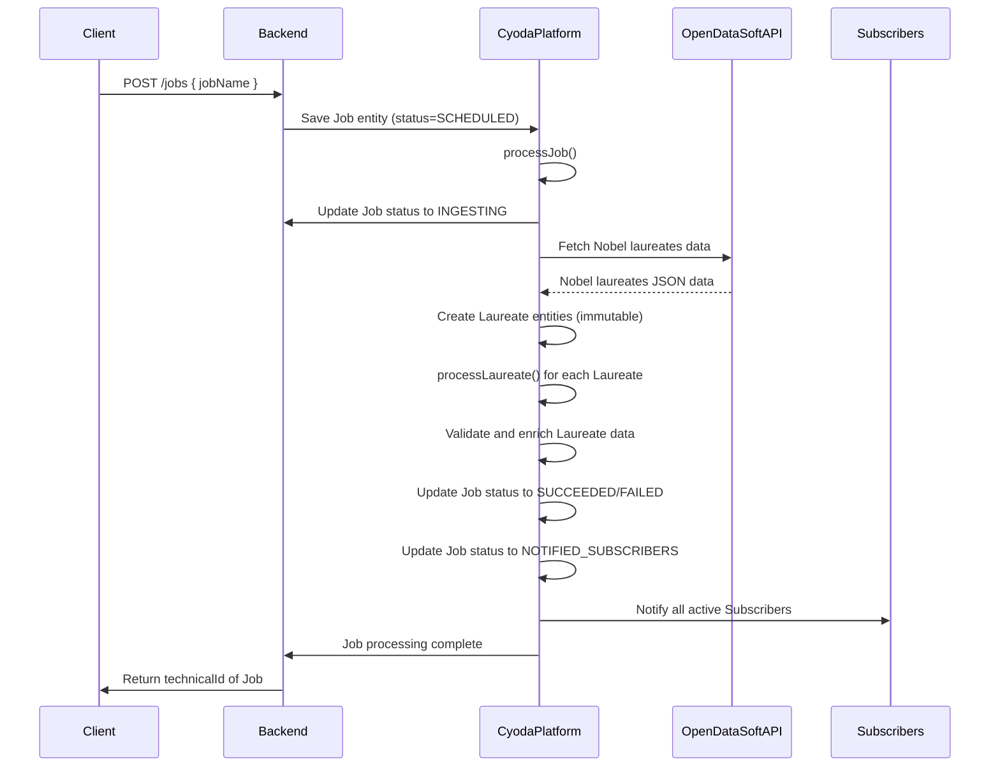
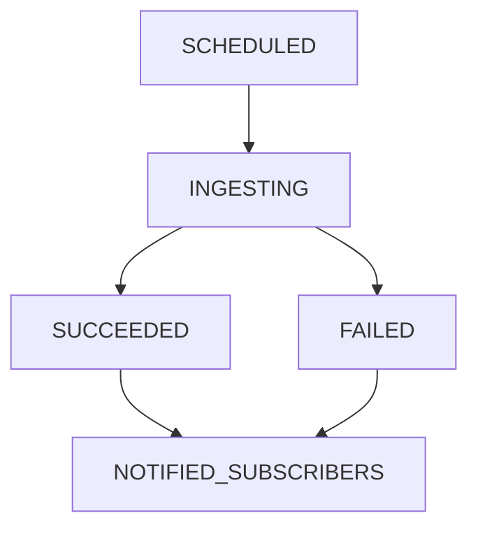

# Functional Requirements

---

## 1. Entity Definitions

### Job
- `jobName`: String - Name or identifier of the ingestion job.
- `status`: String - State of the job. Possible values:
  - `SCHEDULED`
  - `INGESTING`
  - `SUCCEEDED`
  - `FAILED`
  - `NOTIFIED_SUBSCRIBERS`
- `createdAt`: DateTime - Timestamp when the job was created.
- `completedAt`: DateTime - Timestamp when the job finished processing.
- `resultSummary`: String - Summary of ingestion results or failure reason.

### Laureate
- `laureateId`: Integer - Unique identifier from the Nobel laureates dataset.
- `firstname`: String - First name of the laureate.
- `surname`: String - Last name of the laureate.
- `gender`: String - Gender of the laureate.
- `born`: Date - Date of birth.
- `died`: Date (nullable) - Date of death, can be null if living.
- `borncountry`: String - Country where laureate was born.
- `borncountrycode`: String - ISO country code of birth country.
- `borncity`: String - City where laureate was born.
- `year`: String - Year laureate received the Nobel Prize.
- `category`: String - Nobel Prize category.
- `motivation`: String - Motivation for the award.
- `affiliationName`: String - Name of affiliated institution.
- `affiliationCity`: String - City of affiliated institution.
- `affiliationCountry`: String - Country of affiliated institution.

### Subscriber
- `contactType`: String - Type of contact, e.g., "email", "webhook".
- `contactDetails`: String - Email address or webhook URL.
- `active`: Boolean - Subscriber active status.
- `subscribedAt`: DateTime - Timestamp when subscription was created.

---

## 2. Process Method Flows

### processJob() Flow
1. Job entity is created with status set to `SCHEDULED`.
2. Job status is updated to `INGESTING`.
3. Fetch Nobel laureates data from the OpenDataSoft API.
4. For each laureate record received:
   - Create a new immutable Laureate entity.
   - Invoke `processLaureate()` for validation and enrichment.
5. If all laureates are processed successfully:
   - Update Job status to `SUCCEEDED`.
   - Record `completedAt` timestamp.
   - Summarize results in `resultSummary` (e.g., number of laureates ingested).
6. If any failure occurs during ingestion or processing:
   - Update Job status to `FAILED`.
   - Record `completedAt` timestamp.
   - Capture failure reason in `resultSummary`.
7. Transition Job status to `NOTIFIED_SUBSCRIBERS`.
8. Notify all active Subscribers with relevant job and laureate information.
9. End of process.

### processLaureate() Flow
1. Triggered automatically when a Laureate entity is saved (assuming single processor).
2. Validate Laureate fields for non-null and correct formats.
3. Enrich Laureate data, e.g., normalize country codes, calculate derived attributes.
4. Persist enriched Laureate as a new immutable entity.
5. End of flow.

### processSubscriber() Flow
1. Triggered when a new Subscriber entity is created.
2. Validate contact details for correct email or webhook URL format.
3. Persist Subscriber entity with `active` set to true.
4. End of flow.

---

## 3. API Endpoints Design

| Entity    | HTTP Method | Endpoint                   | Request Body                                          | Response                         |
|-----------|-------------|----------------------------|-------------------------------------------------------|--------------------------------|
| Job       | POST        | `/jobs`                    | `{ "jobName": "string" }`                          | `{ "technicalId": "string" }`|
| Job       | GET         | `/jobs/{technicalId}`      | N/A                                                   | Full Job entity with all fields |
| Laureate  | GET         | `/laureates/{technicalId}` | N/A                                                   | Full Laureate entity             |
| Subscriber| POST        | `/subscribers`             | `{ "contactType": "string", "contactDetails": "string" }` | `{ "technicalId": "string" }`|
| Subscriber| GET         | `/subscribers/{technicalId}`| N/A                                                  | Full Subscriber entity          |

- No update or delete endpoints for any entities (immutable creation only).
- Laureates are created only internally by `processJob`, no POST endpoint exposed.
- Subscribers can register via POST `/subscribers`.
- GET endpoints support retrieval by `technicalId`.

---

## 4. Request/Response Formats

### POST /jobs Request
```json
{
  "jobName": "NobelLaureatesIngestion_2024_06"
}
```

### POST /jobs Response
```json
{
  "technicalId": "job-1234567890"
}
```

### GET /jobs/{technicalId} Response
```json
{
  "jobName": "NobelLaureatesIngestion_2024_06",
  "status": "NOTIFIED_SUBSCRIBERS",
  "createdAt": "2024-06-01T10:00:00Z",
  "completedAt": "2024-06-01T10:05:00Z",
  "resultSummary": "Ingested 100 laureates successfully."
}
```

### POST /subscribers Request
```json
{
  "contactType": "email",
  "contactDetails": "subscriber@example.com"
}
```

### POST /subscribers Response
```json
{
  "technicalId": "subscriber-987654321"
}
```

### GET /subscribers/{technicalId} Response
```json
{
  "contactType": "email",
  "contactDetails": "subscriber@example.com",
  "active": true,
  "subscribedAt": "2024-06-01T09:00:00Z"
}
```

### GET /laureates/{technicalId} Response
```json
{
  "laureateId": 853,
  "firstname": "Akira",
  "surname": "Suzuki",
  "gender": "male",
  "born": "1930-09-12",
  "died": null,
  "borncountry": "Japan",
  "borncountrycode": "JP",
  "borncity": "Mukawa",
  "year": "2010",
  "category": "Chemistry",
  "motivation": "for palladium-catalyzed cross couplings in organic synthesis",
  "affiliationName": "Hokkaido University",
  "affiliationCity": "Sapporo",
  "affiliationCountry": "Japan"
}
```

---

## 5. Visual Representation

### Sequence Diagram

```mermaid
sequenceDiagram
  participant Client
  participant Backend
  participant CyodaPlatform
  participant OpenDataSoftAPI
  participant Subscribers

  Client->>Backend: POST /jobs { jobName }
  Backend->>CyodaPlatform: Save Job entity (status=SCHEDULED)
  CyodaPlatform->>CyodaPlatform: processJob()
  CyodaPlatform->>Backend: Update Job status to INGESTING
  CyodaPlatform->>OpenDataSoftAPI: Fetch Nobel laureates data
  OpenDataSoftAPI-->>CyodaPlatform: Nobel laureates JSON data
  CyodaPlatform->>CyodaPlatform: Create Laureate entities (immutable)
  CyodaPlatform->>CyodaPlatform: processLaureate() for each Laureate
  CyodaPlatform->>CyodaPlatform: Validate and enrich Laureate data
  CyodaPlatform->>CyodaPlatform: Update Job status to SUCCEEDED/FAILED
  CyodaPlatform->>CyodaPlatform: Update Job status to NOTIFIED_SUBSCRIBERS
  CyodaPlatform->>Subscribers: Notify all active Subscribers
  CyodaPlatform->>Backend: Job processing complete
  Backend->>Client: Return technicalId of Job
```

### State Transition Diagram

```mermaid
graph TD
  SCHEDULED --> INGESTING
  INGESTING --> SUCCEEDED
  INGESTING --> FAILED
  SUCCEEDED --> NOTIFIED_SUBSCRIBERS
  FAILED --> NOTIFIED_SUBSCRIBERS
```
