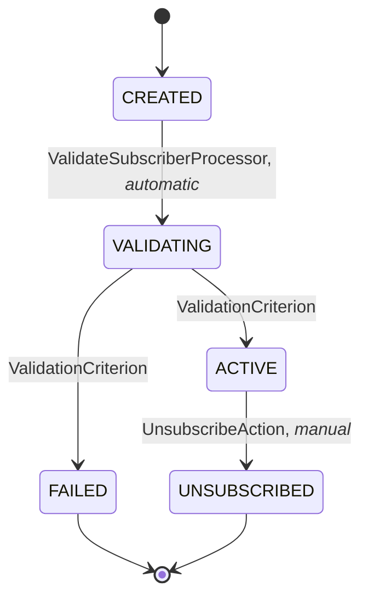
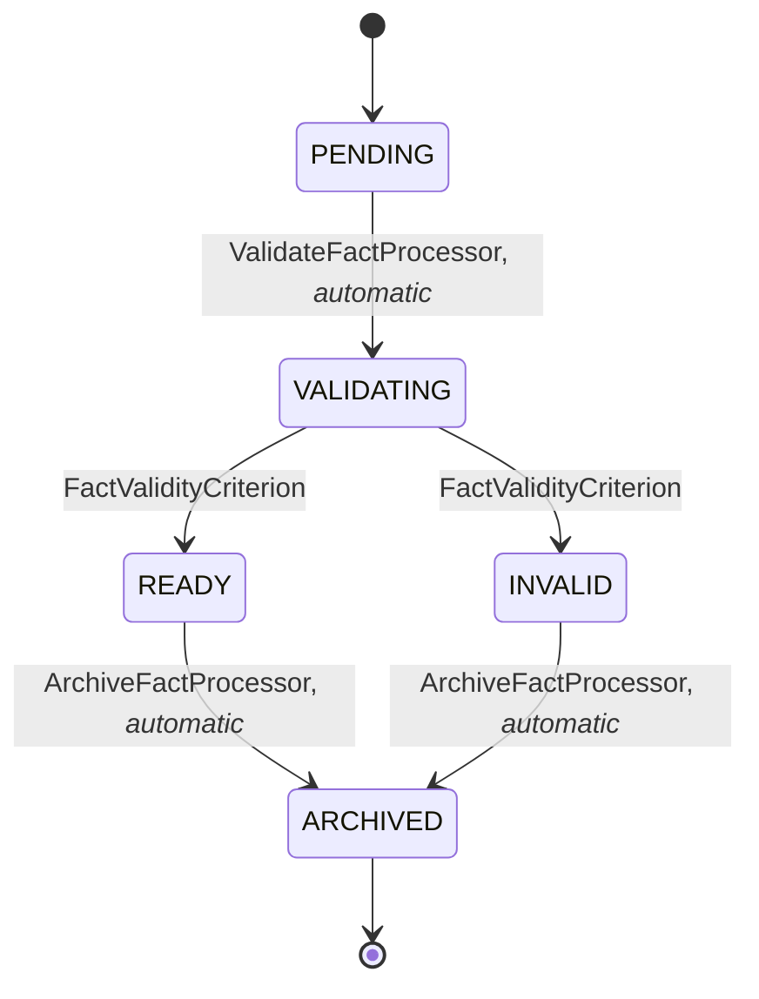
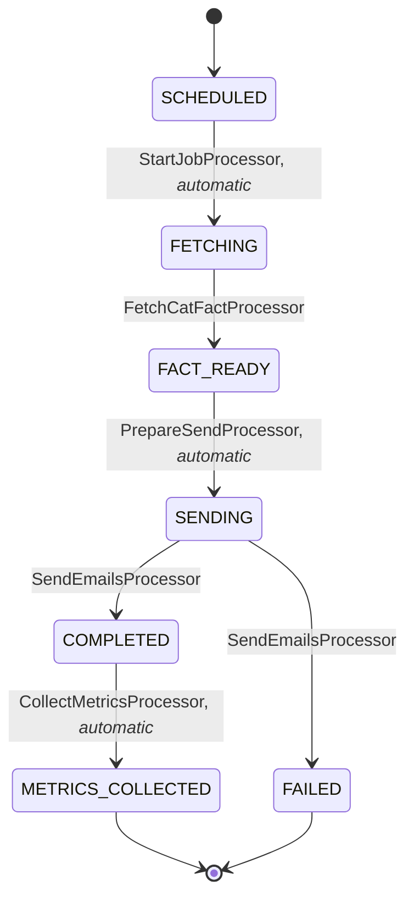

### 1. Entity Definitions
```
Subscriber:
- email: String (subscriber email address)
- name: String (optional display name)
- signup_date: String (ISO timestamp)
- status: String (CREATED/ACTIVE/UNSUBSCRIBED/FAILED)
- timezone: String (optional)

CatFact:
- fact_id: String (provider id or generated id)
- text: String (fact content)
- fetched_date: String (ISO timestamp)
- validation_status: String (PENDING/VALID/INVALID)
- archived_date: String (optional)

WeeklySendJob:
- job_name: String (e.g. weekly-send-YYYY-MM-DD)
- scheduled_date: String (ISO date/time for send)
- catfact_ref: String (link to CatFact.fact_id once fetched)
- target_count: Integer (number of subscribers at scheduling time)
- status: String (SCHEDULED/FETCHING/READY/SENDING/COMPLETED/FAILED)
```

### 2. Entity workflows

Subscriber workflow:
1. Initial State: CREATED when POSTed
2. Validation: Validate email format and duplicates (automatic)
3. Activation: Move to ACTIVE if valid (automatic) or FAILED if invalid
4. Unsubscribe: Manual transition to UNSUBSCRIBED


```mermaid
stateDiagram-v2
    [*] --> CREATED
    CREATED --> VALIDATING : ValidateSubscriberProcessor, *automatic*
    VALIDATING --> ACTIVE : ValidationCriterion
    VALIDATING --> FAILED : ValidationCriterion
    ACTIVE --> UNSUBSCRIBED : UnsubscribeAction, *manual*
    FAILED --> [*]
    UNSUBSCRIBED --> [*]
```

Processors/Criteria: ValidateSubscriberProcessor, ValidationCriterion, UnsubscribeAction

CatFact workflow:
1. Initial State: PENDING when created by a fetch
2. Validation: Check length/content (automatic)
3. Ready: VALID facts marked READY
4. Archive: After retention period move to ARCHIVED (automatic)


```mermaid
stateDiagram-v2
    [*] --> PENDING
    PENDING --> VALIDATING : ValidateFactProcessor, *automatic*
    VALIDATING --> READY : FactValidityCriterion
    VALIDATING --> INVALID : FactValidityCriterion
    READY --> ARCHIVED : ArchiveFactProcessor, *automatic*
    INVALID --> ARCHIVED : ArchiveFactProcessor, *automatic*
    ARCHIVED --> [*]
```

Processors/Criteria: ValidateFactProcessor, FactValidityCriterion, ArchiveFactProcessor

WeeklySendJob workflow:
1. Initial State: SCHEDULED (POST or scheduler creates)
2. Fetching: Trigger fetch of CatFact (automatic)
3. Fact Ready: CatFact created & validated
4. Sending: Send emails to ACTIVE subscribers
5. Completion: COMPLETED or FAILED; then trigger metrics collection


```mermaid
stateDiagram-v2
    [*] --> SCHEDULED
    SCHEDULED --> FETCHING : StartJobProcessor, *automatic*
    FETCHING --> FACT_READY : FetchCatFactProcessor
    FACT_READY --> SENDING : PrepareSendProcessor, *automatic*
    SENDING --> COMPLETED : SendEmailsProcessor
    SENDING --> FAILED : SendEmailsProcessor
    COMPLETED --> METRICS_COLLECTED : CollectMetricsProcessor, *automatic*
    METRICS_COLLECTED --> [*]
    FAILED --> [*]
```

Processors/Criteria: StartJobProcessor, FetchCatFactProcessor, PrepareSendProcessor, SendEmailsProcessor, CollectMetricsProcessor, DeliverySuccessCriterion

### 3. Pseudo code for processor classes
- FetchCatFactProcessor
```java
class FetchCatFactProcessor {
  void process(WeeklySendJob job) {
    // call CatFact API, create CatFact entity (persist triggers its workflow)
    CatFact fact = CatFact.fromApi();
    persist(fact);
    job.catfact_ref = fact.fact_id;
    job.status = FACT_READY;
    persist(job);
  }
}
```
- ValidateFactProcessor
```java
class ValidateFactProcessor {
  void process(CatFact fact) {
    if (fact.text != null && fact.text.length() > 10) {
      fact.validation_status = VALID;
    } else {
      fact.validation_status = INVALID;
    }
    persist(fact);
  }
}
```
- SendEmailsProcessor
```java
class SendEmailsProcessor {
  void process(WeeklySendJob job) {
    List<Subscriber> subs = queryActiveSubscribers();
    job.target_count = subs.size();
    for (Subscriber s : subs) {
      sendEmail(s.email, job.catfact_ref);
    }
    job.status = COMPLETED;
    persist(job);
  }
}
```

### 4. API Endpoints Design Rules

POST /subscribers
- Creates Subscriber (triggers Subscriber workflow)
Request:
```json
{
  "email":"user@example.com",
  "name":"Optional Name",
  "timezone":"UTC"
}
```
Response (only technicalId):
```json
{
  "technicalId":"<generated-id>"
}
```

GET /subscribers/{technicalId}
Response:
```json
{
  "technicalId":"<id>",
  "email":"user@example.com",
  "name":"Optional Name",
  "signup_date":"2025-08-26T12:00:00Z",
  "status":"ACTIVE",
  "timezone":"UTC"
}
```

POST /weekly-send-jobs
- Create or schedule a job manually (also scheduler can create jobs); triggers WeeklySendJob workflow
Request:
```json
{
  "job_name":"weekly-send-2025-09-01",
  "scheduled_date":"2025-09-01T09:00:00Z"
}
```
Response:
```json
{
  "technicalId":"<generated-job-id>"
}
```

GET /weekly-send-jobs/{technicalId}
Response:
```json
{
  "technicalId":"<id>",
  "job_name":"weekly-send-2025-09-01",
  "scheduled_date":"2025-09-01T09:00:00Z",
  "catfact_ref":"<fact_id>",
  "target_count":123,
  "status":"COMPLETED"
}
```

Notes:
- Max entities used: 3 (default). If you want more entities (e.g., per-recipient SendRecord, Report) ask and I will add up to 10.
- All entity creation events (POST or system-persist) trigger Cyoda workflows as defined above.