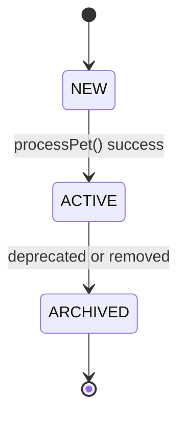
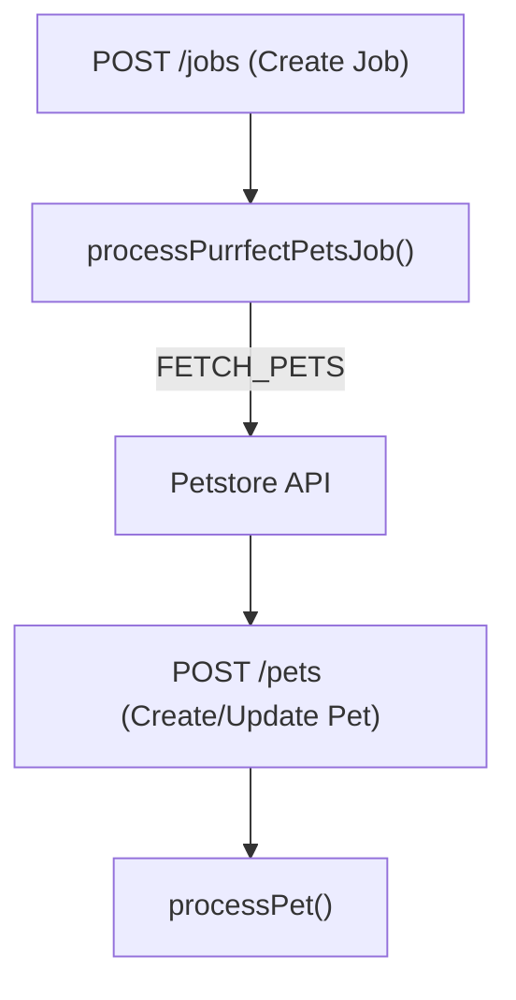
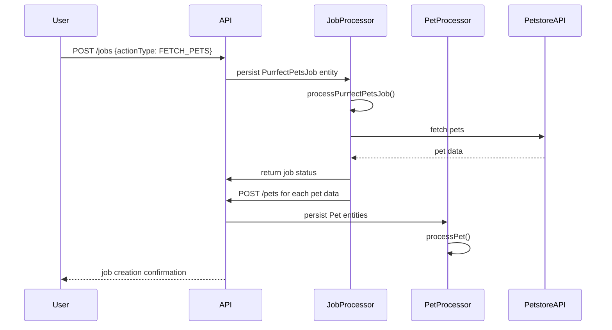

### 1. Entity Definitions

``` 
PurrfectPetsJob:  
- jobId: String (unique identifier for the orchestration job)  
- actionType: String (type of action e.g., FETCH_PETS, UPDATE_PET_STATUS)  
- createdAt: DateTime (timestamp of job creation)  
- status: StatusEnum (PENDING, PROCESSING, COMPLETED, FAILED)  
  
Pet:  
- petId: String (unique identifier for the pet)  
- name: String (pet's name)  
- type: String (species, e.g., cat, dog)  
- breed: String (breed of the pet)  
- age: Integer (age in years)  
- availabilityStatus: String (AVAILABLE, ADOPTED, PENDING)  
- status: StatusEnum (NEW, ACTIVE, ARCHIVED)  
```

### 2. Process Method Flows

``` 
processPurrfectPetsJob() Flow:  
1. Initial State: PurrfectPetsJob created with PENDING status  
2. Validation: Verify actionType and parameters (e.g., fetch pets or update status)  
3. Execution:  
   - If FETCH_PETS: call Petstore API to fetch pet data and create Pet entities  
   - If UPDATE_PET_STATUS: update availabilityStatus of specified Pet entities by creating new states  
4. Update Job Status: Set PurrfectPetsJob status to COMPLETED or FAILED based on execution result  
5. Notification: Optionally notify consumers or log outcome  
```

``` 
processPet() Flow:  
1. Initial State: Pet entity persisted with NEW or ACTIVE status  
2. Validation: Check required fields and business rules (e.g., valid breed/type)  
3. Processing: Save pet info, trigger any dependent processes if needed (e.g., availability changes)  
4. Update Pet status if applicable (e.g., ACTIVE after validation)  
5. Notification: Log or notify about pet creation/update  
```

### 3. API Endpoints Design

| Method | Path             | Description                           | Request Body                         | Response Body                        |
|--------|------------------|-------------------------------------|------------------------------------|------------------------------------|
| POST   | /jobs            | Create a new orchestration job (triggers `processPurrfectPetsJob()`) | `{ "actionType": "FETCH_PETS" }`   | `{ "jobId": "...", "status": "PENDING" }`  |
| POST   | /pets            | Add or update pet info (creates new Pet entity triggering `processPet()`) | `{ "name": "...", "type": "...", "breed": "...", "age": 3, "availabilityStatus": "AVAILABLE" }` | `{ "petId": "...", "status": "NEW" }` |
| GET    | /pets            | Retrieve all pets or filter by type/status | Query params e.g., `?type=cat&availabilityStatus=AVAILABLE` | `[ { pet objects... } ]`            |
| GET    | /jobs/{jobId}    | Retrieve job status and results      | N/A                                | `{ "jobId": "...", "status": "...", "details": "..." }` |

### 4. Request/Response Formats

**Create Job (POST /jobs) Request:**

```json
{
  "actionType": "FETCH_PETS"
}
```

**Create Job Response:**

```json
{
  "jobId": "job-1234",
  "status": "PENDING"
}
```

**Create/Update Pet (POST /pets) Request:**

```json
{
  "name": "Whiskers",
  "type": "cat",
  "breed": "Siamese",
  "age": 2,
  "availabilityStatus": "AVAILABLE"
}
```

**Create/Update Pet Response:**

```json
{
  "petId": "pet-5678",
  "status": "NEW"
}
```

**Get Pets (GET /pets) Response:**

```json
[
  {
    "petId": "pet-5678",
    "name": "Whiskers",
    "type": "cat",
    "breed": "Siamese",
    "age": 2,
    "availabilityStatus": "AVAILABLE",
    "status": "ACTIVE"
  }
]
```

---

### Mermaid Diagrams

**Entity Lifecycle State Diagram for PurrfectPetsJob**


```mermaid
stateDiagram-v2
    [*] --> PENDING
    PENDING --> PROCESSING : processPurrfectPetsJob()
    PROCESSING --> COMPLETED : success
    PROCESSING --> FAILED : failure
    COMPLETED --> [*]
    FAILED --> [*]
```

**Entity Lifecycle State Diagram for Pet**


```mermaid
stateDiagram-v2
    [*] --> NEW
    NEW --> ACTIVE : processPet() success
    ACTIVE --> ARCHIVED : deprecated or removed
    ARCHIVED --> [*]
```

**Event-Driven Processing Chain**


```mermaid
graph TD
    POST_jobs["POST /jobs (Create Job)"]
    POST_pets["POST /pets (Create/Update Pet)"]
    processJob["processPurrfectPetsJob()"]
    processPet["processPet()"]
    PetstoreAPI["Petstore API"]

    POST_jobs --> processJob
    POST_pets --> processPet

    processJob -- FETCH_PETS --> PetstoreAPI
    PetstoreAPI --> POST_pets
```

**User Interaction Sequence Flow**


```mermaid
sequenceDiagram
    participant User
    participant API
    participant JobProcessor
    participant PetProcessor
    participant PetstoreAPI

    User->>API: POST /jobs {actionType: FETCH_PETS}
    API->>JobProcessor: persist PurrfectPetsJob entity
    JobProcessor->>JobProcessor: processPurrfectPetsJob()
    JobProcessor->>PetstoreAPI: fetch pets
    PetstoreAPI-->>JobProcessor: pet data
    JobProcessor->>API: return job status
    JobProcessor->>API: POST /pets for each pet data
    API->>PetProcessor: persist Pet entities
    PetProcessor->>PetProcessor: processPet()
    API-->>User: job creation confirmation
```

---

If you need any adjustments or additional entities and flows, feel free to ask!