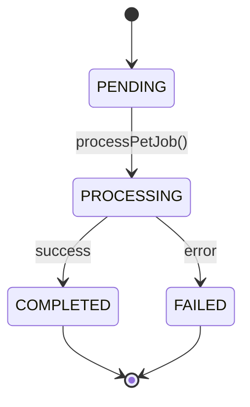
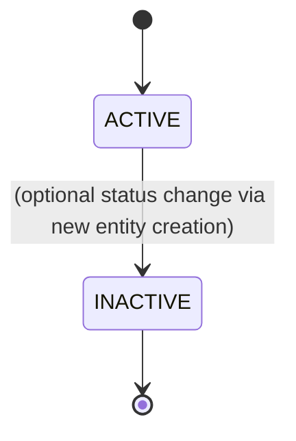
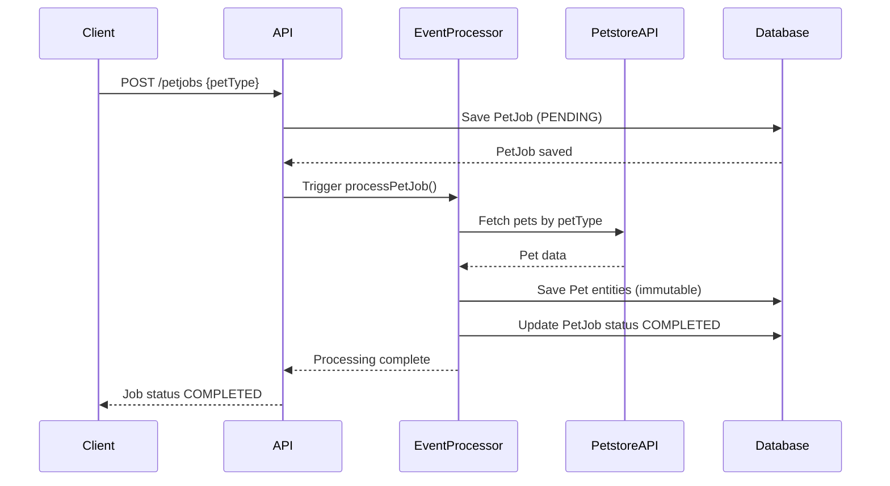

Certainly! Here is the well-formatted final version of your functional requirements for the 'Purrfect Pets' API app using Event-Driven Architecture:

### 1. Entity Definitions

```
PetJob:                      # Orchestration entity triggering processing of pet data
- jobId: String (unique ID for the job)
- petType: String (type of pet to process, e.g., "cat", "dog", or "all")
- requestedAt: DateTime (when the job was created)
- status: StatusEnum (PENDING, PROCESSING, COMPLETED, FAILED)

Pet:                         # Business domain entity representing a pet
- petId: String (unique pet identifier)
- name: String (pet's name)
- type: String (species/type of pet)
- status: StatusEnum (ACTIVE, INACTIVE)

AdoptionRequest:             # Business entity for pet adoption requests
- requestId: String (unique ID)
- petId: String (the pet requested for adoption)
- requesterName: String (name of the person requesting)
- requestedAt: DateTime (timestamp of request)
- status: StatusEnum (PENDING, APPROVED, REJECTED)
```

---

### 2. Process Method Flows

```
processPetJob() Flow:
1. Initial State: PetJob created with PENDING status
2. Validation: Validate petType and job parameters
3. Processing: Fetch pets from Petstore API filtered by petType
4. Data Persistence: Save new Pet entities for each fetched pet (immutable creation)
5. Completion: Update PetJob status to COMPLETED or FAILED
6. Notification: (Optional) Notify downstream systems or logs

processPet() Flow:
1. Initial State: Pet entity created with ACTIVE status
2. Validation: Check pet data completeness
3. Enrichment: Add any additional data or tagging (e.g., fun facts)
4. Completion: Confirm pet record is stored and ready for retrieval

processAdoptionRequest() Flow:
1. Initial State: AdoptionRequest created with PENDING status
2. Validation: Verify pet availability and requester info
3. Decision: Approve or reject request based on business rules
4. Update: Create a new AdoptionRequest entity with updated status (immutable)
5. Notification: Inform requester of approval/rejection
```

---

### 3. API Endpoints (POST + GET)

| Method | Path                   | Purpose                                      | Request JSON Sample                                   | Response JSON Sample                                |
|--------|------------------------|----------------------------------------------|------------------------------------------------------|----------------------------------------------------|
| POST   | /petjobs               | Create a PetJob to trigger pet data processing | `{ "petType": "cat" }`                               | `{ "jobId": "job-123", "status": "PENDING" }`      |
| GET    | /petjobs/{jobId}       | Get PetJob status and metadata                | N/A                                                  | `{ "jobId": "job-123", "status": "COMPLETED" }`    |
| POST   | /adoptionrequests      | Create a new adoption request                  | `{ "petId": "pet-456", "requesterName": "Alice" }` | `{ "requestId": "req-789", "status": "PENDING" }`  |
| GET    | /pets/{petId}          | Retrieve pet details                           | N/A                                                  | `{ "petId": "pet-456", "name": "Whiskers", "type": "cat", "status": "ACTIVE" }` |

---

### 4. Request/Response JSON Formats

**Create PetJob (POST /petjobs)**
```json
{
  "petType": "cat"
}
```

**PetJob Response**
```json
{
  "jobId": "job-123",
  "status": "PENDING"
}
```

**Create AdoptionRequest (POST /adoptionrequests)**
```json
{
  "petId": "pet-456",
  "requesterName": "Alice"
}
```

**AdoptionRequest Response**
```json
{
  "requestId": "req-789",
  "status": "PENDING"
}
```

---

### Mermaid Diagrams

**PetJob Lifecycle State Diagram**


```mermaid
stateDiagram-v2
    [*] --> PENDING
    PENDING --> PROCESSING : processPetJob()
    PROCESSING --> COMPLETED : success
    PROCESSING --> FAILED : error
    COMPLETED --> [*]
    FAILED --> [*]
```

**Pet Entity Lifecycle State Diagram**


```mermaid
stateDiagram-v2
    [*] --> ACTIVE
    ACTIVE --> INACTIVE : (optional status change via new entity creation)
    INACTIVE --> [*]
```

**Event-Driven Processing Chain**


```mermaid
sequenceDiagram
    participant Client
    participant API
    participant EventProcessor
    participant PetstoreAPI
    participant Database

    Client->>API: POST /petjobs {petType}
    API->>Database: Save PetJob (PENDING)
    Database-->>API: PetJob saved
    API->>EventProcessor: Trigger processPetJob()
    EventProcessor->>PetstoreAPI: Fetch pets by petType
    PetstoreAPI-->>EventProcessor: Pet data
    EventProcessor->>Database: Save Pet entities (immutable)
    EventProcessor->>Database: Update PetJob status COMPLETED
    EventProcessor-->>API: Processing complete
    API-->>Client: Job status COMPLETED
```

---

If you need further assistance or adjustments, feel free to ask!