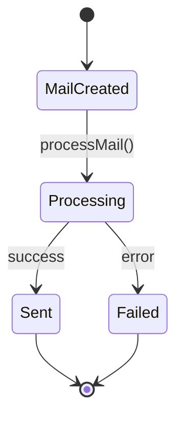
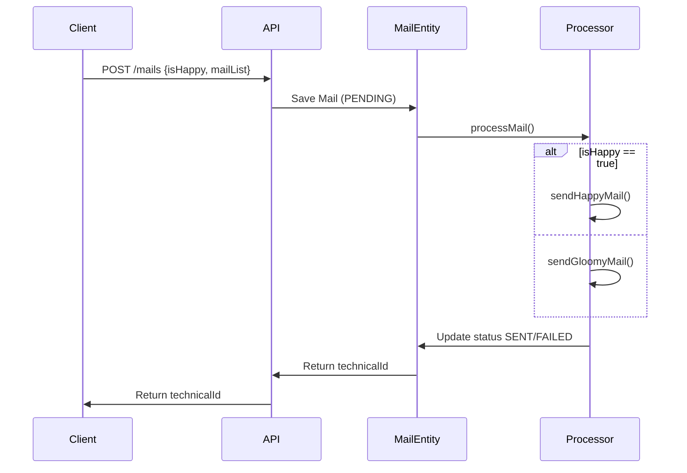

### 1. Entity Definitions

``` 
Mail:
- isHappy: Boolean (flag indicating if the mail is happy or gloomy)
- mailList: List<String> (list of recipient email addresses)
- status: MailStatusEnum (entity lifecycle state: PENDING, SENT, FAILED)
```

### 2. Process Method Flows

``` 
processMail() Flow:
1. Initial State: Mail entity created with status = PENDING
2. Validation: Check mailList is not empty and isHappy is set
3. Processing:
   - If isHappy == true, invoke sendHappyMail processor
   - Else invoke sendGloomyMail processor
4. Sending: Dispatch emails according to the processor logic
5. Completion: Update status to SENT on success or FAILED on error
6. Notification: (Optional) Log or notify about the sending result
```

### 3. API Endpoints Design

- **POST /mails**  
  - Creates a new Mail entity (triggers event processing)  
  - Request:  
    ```json
    {
      "isHappy": true,
      "mailList": ["email1@example.com", "email2@example.com"]
    }
    ```  
  - Response:  
    ```json
    {
      "technicalId": "uuid-generated-id"
    }
    ```  

- **GET /mails/{technicalId}**  
  - Retrieves stored Mail entity results by technicalId  
  - Response example:  
    ```json
    {
      "isHappy": true,
      "mailList": ["email1@example.com", "email2@example.com"],
      "status": "SENT"
    }
    ```

- **(Optional) GET /mails?isHappy=true**  
  - Retrieves stored mails filtered by `isHappy` if explicitly requested  

### 4. Request/Response Formats

- POST /mails Request:

```json
{
  "isHappy": true,
  "mailList": ["user1@example.com", "user2@example.com"]
}
```

- POST /mails Response:

```json
{
  "technicalId": "uuid-generated-id"
}
```

- GET /mails/{technicalId} Response:

```json
{
  "isHappy": true,
  "mailList": ["user1@example.com", "user2@example.com"],
  "status": "SENT"
}
```

---

### Visual Representations

**Mail Entity Lifecycle State Diagram**


```mermaid
stateDiagram-v2
    [*] --> MailCreated
    MailCreated --> Processing : processMail()
    Processing --> Sent : success
    Processing --> Failed : error
    Sent --> [*]
    Failed --> [*]
```

**Event-Driven Processing Chain**


```mermaid
sequenceDiagram
    participant Client
    participant API
    participant MailEntity
    participant Processor

    Client->>API: POST /mails {isHappy, mailList}
    API->>MailEntity: Save Mail (PENDING)
    MailEntity->>Processor: processMail()
    alt isHappy == true
        Processor->>Processor: sendHappyMail()
    else
        Processor->>Processor: sendGloomyMail()
    end
    Processor->>MailEntity: Update status SENT/FAILED
    MailEntity->>API: Return technicalId
    API->>Client: Return technicalId
```

---

If you would like me to expand on any part or add more entities or endpoints later, just let me know!