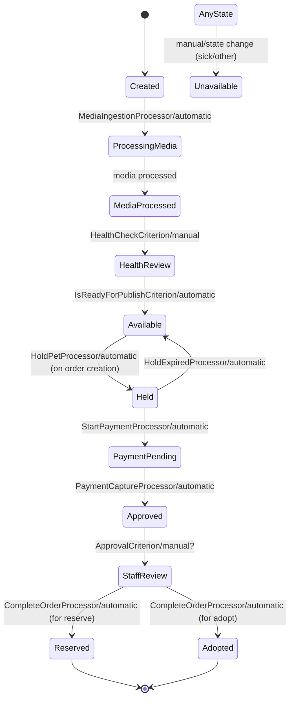
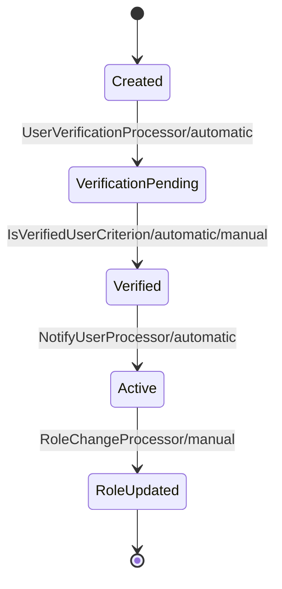
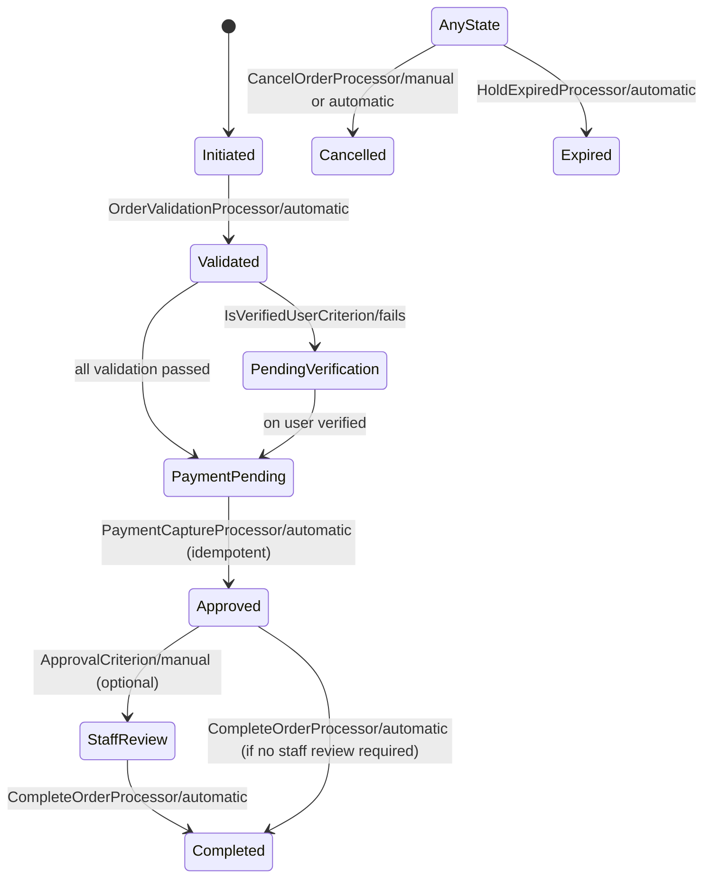

# Functional Requirements

## Overview
This document defines the canonical functional requirements, entity models, workflows, processors and API design rules for the Pet adoption/purchase prototype. The content below contains updated and corrected logic for entity fields, state transitions, processing rules (including concurrency and reservation handling), and API expectations.

---

## 1. Entity Definitions
All timestamps use ISO 8601 strings (UTC). Where enumerations are listed, implementations should validate and enforce allowable values.

### Pet
- id: String (business id visible in UI, e.g. `PET-123`) — unique business identifier
- technicalId: String (datastore id, returned on POST)
- name: String
- species: String (cat/dog/etc)
- breed: String
- age: Integer (years or months; include unit in UI if necessary)
- gender: String (M/F/other)
- status: String (enum) — allowed values: `created`, `available`, `held`, `reserved`, `adopted`, `sick`, `unavailable`
  - Notes: `held` indicates a temporary hold due to a pending Order (reservation); `reserved` indicates a confirmed reservation (payment captured but not completed adoption); `adopted` is final.
- mediaStatus: String (enum) — allowed values: `none`, `processing`, `processed`, `failed`
- photos: List<String> (URLs or media ids)
- description: String
- tags: List<String>
- healthNotes: String
- createdAt: String (ISO timestamp)
- updatedAt: String (ISO timestamp)
- metadata: Map<String,String> (optional additional persisted data)

Notes:
- `status` and `mediaStatus` are used by processors and criteria to determine publishability and availability.
- A pet cannot be `available` unless `mediaStatus == processed` and health checks pass.

### User
- id: String (business id, e.g. `USR-99`)
- technicalId: String (datastore id)
- name: String
- email: String
- role: String (enum) — allowed values: `customer`, `staff`, `admin`
- contact: String (phone)
- verified: Boolean (identity/eligibility verified)
- verificationStatus: String (enum) — allowed values: `unverified`, `pending`, `verified`, `rejected`
- savedPets: List<String> (pet business ids)
- notes: String (internal notes)
- createdAt: String
- updatedAt: String

Notes:
- `verified` is a derived boolean based on verificationStatus.
- Role changes must be performed by staff/admin and audited.

### Order
- id: String (business id, e.g. `ORD-777`)
- technicalId: String (datastore id)
- petId: String (business pet id)
- petTechnicalId: String (optional) — datastore id for the pet (for internal/atomic operations)
- userId: String (business user id)
- userTechnicalId: String (optional)
- type: String (enum) — allowed values: `adopt`, `purchase`, `reserve`
- status: String (enum) — allowed values:
  - `initiated` (created)
  - `validation_failed` (rejected during validation)
  - `pending_verification` (user must complete verification before payment)
  - `payment_pending` (validation passed; awaiting payment capture)
  - `payment_failed`
  - `approved` (payment captured; may still require staff review)
  - `staff_review` (requires manual staff approval)
  - `completed` (order and pet finalised)
  - `cancelled`
  - `expired` (reservation expired)
- total: Number
- createdAt: String
- expiresAt: String (reservation expiry; optional)
- notes: String
- holdId: String (optional) — reference to a hold/reservation record if a pet is temporarily held

Notes:
- Orders must be validated atomically with pet availability to prevent race conditions (see concurrency rules below).

---

## 2. Workflows and State Machines
The following sections describe canonical workflows and rules for transitions. Processors listed are the logical components responsible for transitions. Criteria are reusable evaluations.

### Pet workflow (updated)
States: `created` -> `processing_media` -> `media_processed` -> `health_review` -> `available` -> `held` -> `reserved` -> `adopted` -> terminal

Rules & notes:
- Newly created pets start in `created`.
- Media ingestion moves `created` -> `processing_media` -> `media_processed` (mediaStatus updated accordingly).
- Health review may set a pet to `sick` or allow publishing.
- Publish action (automatic or manual depending on policy) sets pet to `available` only when criteria are satisfied (media processed & health OK).
- When an Order that passes initial validation is created, the system attempts to place an atomic hold on the pet (transition `available` -> `held`). The hold lasts until `expiresAt` or until payment completes/cancels.
- If payment completes and staff approval (if required) is granted, `held` -> `reserved` or `adopted` depending on `type` and finalization.
- If an order is cancelled or hold expires, pet returns to `available` (or `unavailable`/`sick` as appropriate).

Mermaid diagram:

```mermaid
stateDiagram-v2
    [*] --> Created
    Created --> ProcessingMedia : MediaIngestionProcessor/automatic
    ProcessingMedia --> MediaProcessed : media processed
    MediaProcessed --> HealthReview : HealthCheckCriterion/manual
    HealthReview --> Available : IsReadyForPublishCriterion/automatic
    Available --> Held : HoldPetProcessor/automatic (on order creation)
    Held --> PaymentPending : StartPaymentProcessor/automatic
    PaymentPending --> Approved : PaymentCaptureProcessor/automatic
    Approved --> StaffReview : ApprovalCriterion/manual? 
    StaffReview --> Reserved : CompleteOrderProcessor/automatic (for reserve)
    StaffReview --> Adopted : CompleteOrderProcessor/automatic (for adopt)
    Reserved --> [*]
    Adopted --> [*]
    Held --> Available : HoldExpiredProcessor/automatic
    AnyState --> Unavailable : manual/state change (sick/other)
```

Pet processors/criteria:
- Processors: MediaIngestionProcessor, HoldPetProcessor, PublishPetProcessor, HoldExpiredProcessor, UpdateAvailabilityProcessor, NotifySubscribersProcessor
- Criteria: HealthCheckCriterion, IsReadyForPublishCriterion, IsPetAvailableCriterion (see section 3)

### User workflow (updated)
States: `created` -> `verification_pending` -> `verified` -> `active`

Rules & notes:
- Users start as `created` with `verificationStatus = unverified`.
- Verification may include automatic checks (email verification, phone OTP) and manual staff review for identity/eligibility.
- If verification required for order types (e.g., adoption), an order for an unverified user will transition to `pending_verification` until verification completes.
- Role changes are manual and should be audited.

Mermaid diagram:

```mermaid
stateDiagram-v2
    [*] --> Created
    Created --> VerificationPending : UserVerificationProcessor/automatic
    VerificationPending --> Verified : IsVerifiedUserCriterion/automatic/manual
    Verified --> Active : NotifyUserProcessor/automatic
    Active --> RoleUpdated : RoleChangeProcessor/manual
    RoleUpdated --> [*]
```

User processors/criteria:
- Processors: UserVerificationProcessor, NotifyUserProcessor, RoleChangeProcessor
- Criteria: IsVerifiedUserCriterion

### Order workflow (updated and corrected for atomic reservation and verification)
States: `initiated` -> `validated` -> `pending_verification` (optional) -> `payment_pending` -> `payment_failed`|`approved` -> `staff_review` (optional) -> `completed` | `cancelled` | `expired`

Key rules:
- Order creation must validate the pet's availability and the user's verification status _atomically_. The system should attempt to create a short-lived hold (using a database transaction or an atomic compare-and-set) on the pet when an order is initiated. If the hold cannot be obtained, the order is set to `validation_failed` or `cancelled`.
- If the user is not verified and the business policy requires verification for the order type, the order transitions to `pending_verification` and no payment is accepted until verification completes.
- Payment capture should be idempotent and may be automatic or manual depending on payment gateway and policy. On successful capture, the order goes to `approved` (or directly to `staff_review` if manual staff approval is required).
- Staff approval is only required if the order matches approval criteria (e.g., certain adoption types or edge-cases). If required, order moves to `staff_review` and awaits manual action.
- On completion, the order becomes `completed` and pet becomes `adopted` (for `adopt`) or `reserved` (for `reserve` / `purchase` as defined by policy). Holds are cleared and notifications are sent.
- If a hold expires before payment completes, the order is set to `expired` and pet status reverts.

Mermaid diagram:

```mermaid
stateDiagram-v2
    [*] --> Initiated
    Initiated --> Validated : OrderValidationProcessor/automatic
    Validated --> PendingVerification : IsVerifiedUserCriterion/fails
    Validated --> PaymentPending : all validation passed
    PendingVerification --> PaymentPending : on user verified
    PaymentPending --> Approved : PaymentCaptureProcessor/automatic (idempotent)
    Approved --> StaffReview : ApprovalCriterion/manual (optional)
    StaffReview --> Completed : CompleteOrderProcessor/automatic
    Approved --> Completed : CompleteOrderProcessor/automatic (if no staff review required)
    AnyState --> Cancelled : CancelOrderProcessor/manual or automatic
    AnyState --> Expired : HoldExpiredProcessor/automatic
``` 

Order processors/criteria:
- Processors: OrderValidationProcessor, HoldPetProcessor (atomic hold on pet), StartPaymentProcessor, PaymentCaptureProcessor (idempotent), CompleteOrderProcessor, CancelOrderProcessor, HoldExpiredProcessor
- Criteria: IsPetAvailableCriterion (considers `available` only), IsVerifiedUserCriterion, IsPaymentValidCriterion, ApprovalCriterion

Concurrency and reservation rules (important):
- When an order is created, the system must attempt to obtain an atomic hold on the pet. Implementation options:
  - Database transaction with a row-level lock or a compare-and-set on pet.status (preferred where supported).
  - A separate `Hold` entity keyed by petTechnicalId with an owner (orderTechnicalId) and expiry; creation should fail if an active hold exists.
- Holds should have a short TTL (e.g., 10–30 minutes configurable) and be extended only while payment is in progress if allowed by policy.
- All processors reading/modifying pet.status for reservation must use the same locking/compare-and-set strategy to avoid races.

---

## 3. Processor Pseudocode (corrected)
The pseudocode below is canonical and should be adjusted for language-specific conventions and error handling. All persist operations should be transactional where required.

MediaIngestionProcessor
```
class MediaIngestionProcessor:
  process(pet):
    if not pet.photos or pet.photos.isEmpty():
      pet.mediaStatus = 'none'
      persist(pet)
      return

    pet.mediaStatus = 'processing'
    persist(pet)

    for url in pet.photos:
      try:
        validateImage(url)
        generateThumbnail(url)
      except Exception e:
        log.error("media processing failed for {}", url)
        pet.mediaStatus = 'failed'
        persist(pet)
        return

    pet.mediaStatus = 'processed'
    persist(pet)
```

PublishPetProcessor
```
class PublishPetProcessor:
  process(pet):
    # Ensure pet has media processed and health check passed
    if IsReadyForPublishCriterion.evaluate(pet):
      pet.status = 'available'
      pet.updatedAt = now()
      persist(pet)
      NotifySubscribersProcessor.process(pet)
    else:
      # keep pet in appropriate state (health_review/sick/unavailable)
      persist(pet)
```

UserVerificationProcessor
```
class UserVerificationProcessor:
  process(user):
    # run automatic checks (email/phone formatting, domain checks, 3rd-party identity)
    if basicChecks(user.email, user.contact) and optionalIdentityChecks(user):
      user.verificationStatus = 'verified'
      user.verified = true
    else:
      # either pending manual review or rejected depending on checks
      user.verificationStatus = 'pending' or 'rejected' # as appropriate
      user.verified = (user.verificationStatus == 'verified')
    persist(user)
    if user.verified:
      NotifyUserProcessor.process(user)
```

OrderValidationProcessor (key corrections)
```
class OrderValidationProcessor:
  process(order):
    pet = fetchPetByTechnicalId(order.petTechnicalId or mapBusinessIdToTechnical(order.petId))
    user = fetchUserByTechnicalId(order.userTechnicalId or mapBusinessIdToTechnical(order.userId))

    # 1) Check pet exists and is available for a hold
    if not IsPetAvailableCriterion.evaluate(pet):
      order.status = 'validation_failed'
      order.notes += ' pet not available '
      persist(order)
      return

    # 2) Check user verification if required by policy
    if policyRequiresVerification(order.type) and not IsVerifiedUserCriterion.evaluate(user):
      order.status = 'pending_verification'
      persist(order)
      return

    # 3) Attempt to create an atomic hold on the pet
    hold = HoldPetProcessor.createHold(pet, order)
    if not hold.created:
      order.status = 'validation_failed'
      order.notes += ' failed to obtain hold '
      persist(order)
      return

    order.holdId = hold.id
    order.status = 'payment_pending'
    persist(order)
```

HoldPetProcessor (atomic hold)
```
class HoldPetProcessor:
  createHold(pet, order):
    # Implementation must be atomic
    # Option A: DB transaction: if pet.status == 'available' then set pet.status='held' and create hold record
    # Option B: Try insert into Hold table with unique petTechnicalId; fail if exists

    begin transaction
      reloadedPet = lock(pet) # row-level lock
      if reloadedPet.status != 'available':
        rollback
        return { created: false }

      reloadedPet.status = 'held'
      reloadedPet.updatedAt = now()
      persist(reloadedPet)

      hold = new Hold(petTechnicalId=pet.technicalId, ownerOrder=order.technicalId, expiresAt=computeExpiry())
      persist(hold)

    commit
    return { created: true, id: hold.id }
```

PaymentCaptureProcessor (idempotent)
```
class PaymentCaptureProcessor:
  process(order):
    if order.status not in ['payment_pending', 'pending_verification']:
      return

    # Call payment gateway (idempotent) - wrap network calls with retry
    try:
      if capturePayment(order):
        order.status = 'approved'
        persist(order)
      else:
        order.status = 'payment_failed'
        persist(order)
    except Exception e:
      order.status = 'payment_failed'
      persist(order)
```

CompleteOrderProcessor
```
class CompleteOrderProcessor:
  process(order):
    # Only proceed for approved orders (and optionally staff_review completed)
    pet = fetchPetByTechnicalId(order.petTechnicalId)

    if order.type == 'adopt':
      pet.status = 'adopted'
    else:
      # reserve or purchase maps to reserved depending on business rule
      pet.status = 'reserved'

    # clear hold if present
    if order.holdId:
      HoldPetProcessor.clearHold(order.holdId)

    persist(pet)

    order.status = 'completed'
    persist(order)

    NotifyUserProcessor.process(order)
```

HoldExpiredProcessor (background)
```
class HoldExpiredProcessor:
  run():
    expiredHolds = findHoldsWhere(expiresAt < now())
    for hold in expiredHolds:
      begin transaction
        pet = fetchPetByTechnicalId(hold.petTechnicalId)
        if pet.status == 'held':
          pet.status = 'available'
          persist(pet)
        mark hold as expired
      commit

      # update any associated order(s)
      order = fetchOrderByTechnicalId(hold.ownerOrder)
      if order and order.status in ['payment_pending', 'pending_verification']:
        order.status = 'expired'
        persist(order)
```

Criteria examples
- IsPetAvailableCriterion.evaluate(pet): return pet.status == 'available' and pet.mediaStatus == 'processed'
- IsVerifiedUserCriterion.evaluate(user): return user.verificationStatus == 'verified' or user.verified == true
- IsPaymentValidCriterion.evaluate(order): return payment gateway confirms capture / authorization

---

## 4. API Endpoints Design Rules (updated)
General rules:
- POST creation endpoints return only `technicalId` in the successful response. This is a datastore/internal id used for subsequent GET by technicalId.
- All created entities must be retrievable by GET /{resource}/{technicalId}.
- POST payloads accept business ids (id) and optional technicalId fields (technicalId ignored if provided). The server will map business ids to internal technical ids.
- Endpoints that mutate state (e.g., order creation which triggers hold) must be implemented atomically on the server to enforce consistency.
- All endpoints must return proper HTTP status codes and meaningful error bodies (validation errors, concurrency errors, payment failures).
- Payment endpoints must be idempotent (provide an idempotency key header to the payment endpoint to avoid double-capture).

Examples (unchanged endpoints with clarified behaviors):

1) Create Pet
POST /pets
- Request: business fields (see Pet entity). `status` may be provided but server will normalize (e.g., new pets typically start in `created`).
- Response:
{
  "technicalId": "tx-abc-001"
}
- After creation, processors (MediaIngestionProcessor, user/staff actions) will move the pet through media processing and publishing.

GET Pet by technicalId
GET /pets/{technicalId}
- Response includes `technicalId`, `entity` (full persisted pet record including createdAt/updatedAt/mediaStatus/status/metadata).

2) Create User
POST /users
- Request: business fields
- Response: `{ "technicalId": "tx-user-002" }`
- User verification may start automatically (UserVerificationProcessor).

GET User by technicalId
GET /users/{technicalId}
- Response: persisted user including verificationStatus and createdAt/updatedAt.

3) Create Order (atomic hold)
POST /orders
- Request: order business fields. Server will:
  1) validate payload
  2) map business ids to technical ids
  3) run OrderValidationProcessor which will attempt to create an atomic hold on the pet
  4) if validation succeeds and hold created, respond with `technicalId` and the order will be in `payment_pending` (unless verification is required)

- Response: `{ "technicalId": "tx-order-010" }`
- If the hold cannot be obtained, the request should return 409 Conflict or 400 with a clear reason and the order not created (or created with `validation_failed` status and 201 depending on API policy). Prefer returning a clear client-visible error in most UX flows.

GET Order by technicalId
GET /orders/{technicalId}
- Response: `{ "technicalId":"tx-order-010", "entity": { /* Order fields */ } }`

Optional list endpoints (recommended additions):
- GET /pets?status=available&species=cat — list available pets by species
- GET /pets?tag=playful — list pets by tag
- GET /orders?userId=USR-99 — list orders for a user

These endpoints should support pagination, filtering and sorting. They are not required by the core create/get-by-technicalId rule but are typically necessary for UIs.

---

## 5. Error-handling, Observability and Extensibility
- All processors should emit structured logs and metrics for success, failure, and latency.
- Payment and external network calls must have retry policies and exponential backoff. Failures must be surfaced to the order flow with appropriate statuses and notifications.
- System should support manual overrides by staff (e.g., force-approve an order, change pet status) with audit trail.
- Add feature toggles for automatic vs manual publish/approval flows.
- For scalability, Hold creation can be implemented using a separate core store (Redis with TTL + watch/compare) or within the primary DB using row locks.

---

If you want, I can now:
- Add the Hold entity definition and API to manage holds explicitly.
- Add example HTTP error responses and suggested status codes for each endpoint.
- Expand the optional list endpoints into full API specs (request/response examples).

Which of these would you like next?