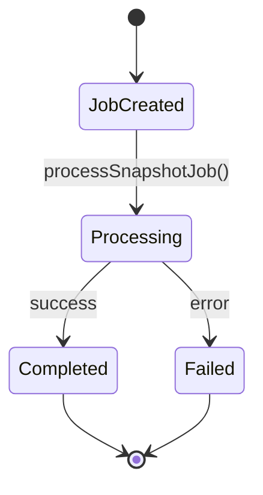
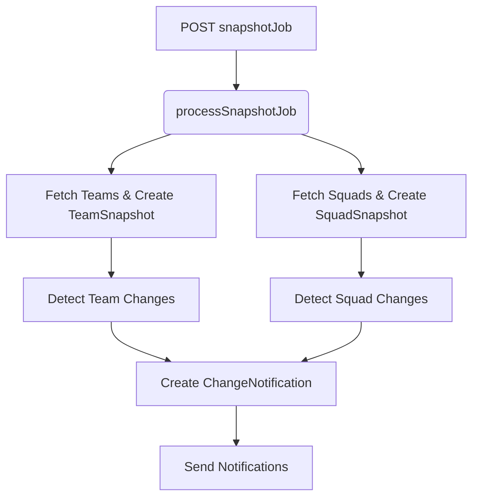
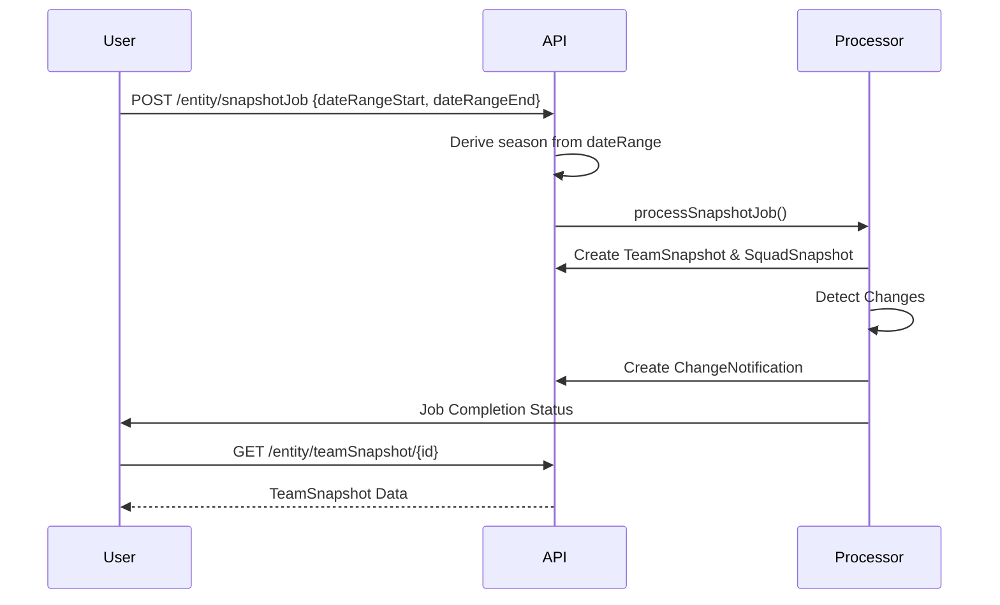

### 1. Entity Definitions

```
SnapshotJob:
- season: String (The Bundesliga season year, e.g., "2023")
- dateRangeStart: String (ISO date, start of snapshot capture period)
- dateRangeEnd: String (ISO date, end of snapshot capture period)
- status: String (Job status: PENDING, COMPLETED, FAILED)
- createdAt: String (Timestamp when job was created)
- failReason: String (Reason for failure when status is FAILED, optional)

TeamSnapshot:
- season: String (The Bundesliga season year this snapshot belongs to)
- effectiveDate: String (ISO date, the date this snapshot reflects)
- teamId: Integer (External football-data.org team ID)
- teamName: String
- venue: String (Team venue)
- crestUrl: String (URL to team crest image)
- createdAt: String (Timestamp when snapshot was created)

SquadSnapshot:
- teamSnapshotId: String (Reference to TeamSnapshot entity)
- playerId: Integer (External football-data.org player ID)
- playerName: String
- position: String
- dateOfBirth: String (ISO date)
- nationality: String
- squadNumber: Integer (If available)
- contractStartDate: String (ISO date, if available)
- contractEndDate: String (ISO date, if available)
- createdAt: String (Timestamp when snapshot was created)

ChangeNotification:
- entityType: String (e.g., "TeamSnapshot" or "SquadSnapshot")
- entityId: String (ID of the changed snapshot entity)
- changeType: String (e.g., "ADDED", "REMOVED", "MODIFIED")
- detectedAt: String (Timestamp of detection)
- details: String (Description or diff summary)
```

---

### 2. Process Method Flows

```
processSnapshotJob() Flow:
1. Initial State: SnapshotJob created with status = PENDING
2. Validation: Check dateRangeStart < dateRangeEnd and season format
3. Processing:
   - Fetch teams for the season from football-data.org
   - For each team, create immutable TeamSnapshot for the effectiveDate(s)
   - For each team, fetch squad data and create SquadSnapshot entities
4. Change Detection:
   - Compare new snapshots with most recent previous snapshots by effectiveDate
   - If changes detected, create ChangeNotification entities
5. Completion:
   - Update SnapshotJob status to COMPLETED or FAILED
6. Notification:
   - Trigger notifications based on ChangeNotification entities (optional external integration)
```

```
processTeamSnapshot() Flow:
- Triggered internally by processSnapshotJob
- Store immutable team snapshot
- No update/delete operations allowed

processSquadSnapshot() Flow:
- Triggered internally by processSnapshotJob
- Store immutable squad snapshot linked to TeamSnapshot
- No update/delete operations allowed

processChangeNotification() Flow:
- Triggered by change detection logic
- Create notification record
- Optionally trigger external notification event (email, webhook, etc.)
```

---

### 3. API Endpoints Design

| Method | Path                  | Description                          | Request Body                      | Response Body                |
|--------|-----------------------|----------------------------------|---------------------------------|-----------------------------|
| POST   | /entity/snapshotJob   | Create a SnapshotJob to ingest data | `{ "dateRangeStart": "...", "dateRangeEnd": "..." }` | `{ "technicalId": "job-uuid" }` |
| GET    | /entity/snapshotJob/{id} | Retrieve SnapshotJob status/details | N/A                             | SnapshotJob entity data      |
| GET    | /entity/teamSnapshot/{id} | Retrieve TeamSnapshot by technicalId | N/A                             | TeamSnapshot entity data     |
| GET    | /entity/squadSnapshot/{id} | Retrieve SquadSnapshot by technicalId | N/A                             | SquadSnapshot entity data    |
| GET    | /entity/changeNotification/{id} | Retrieve ChangeNotification by technicalId | N/A                         | ChangeNotification entity data |

---

### 4. Request/Response Formats

**POST /entity/snapshotJob Request Example**

```json
{
  "dateRangeStart": "2023-08-01",
  "dateRangeEnd": "2024-05-31"
}
```

**POST /entity/snapshotJob Response Example**

```json
{
  "technicalId": "snapshotJob-uuid-1234"
}
```

**GET /entity/snapshotJob/{id} Response Example (Success)**

```json
{
  "season": "2023",
  "dateRangeStart": "2023-08-01",
  "dateRangeEnd": "2024-05-31",
  "status": "COMPLETED",
  "createdAt": "2023-09-01T12:00:00Z",
  "failReason": null
}
```

**GET /entity/snapshotJob/{id} Response Example (Failure)**

```json
{
  "season": "2023",
  "dateRangeStart": "2024-05-31",
  "dateRangeEnd": "2023-08-01",
  "status": "FAILED",
  "createdAt": "2023-09-01T12:00:00Z",
  "failReason": "SnapshotJob date validation failed: dateRangeStart (2024-05-31) must be before dateRangeEnd (2023-08-01)"
}
```

**GET /entity/teamSnapshot/{id} Response Example**

```json
{
  "season": "2023",
  "effectiveDate": "2023-09-01",
  "teamId": 5,
  "teamName": "FC Bayern München",
  "venue": "Allianz Arena",
  "crestUrl": "https://...",
  "createdAt": "2023-09-01T12:00:00Z"
}
```

---

### 5. Mermaid Diagrams

**SnapshotJob Entity Lifecycle**


```mermaid
stateDiagram-v2
    [*] --> JobCreated
    JobCreated --> Processing : processSnapshotJob()
    Processing --> Completed : success
    Processing --> Failed : error
    Completed --> [*]
    Failed --> [*]
```

**Event-Driven Processing Chain**


```mermaid
graph TD
    A[POST snapshotJob] --> B(processSnapshotJob)
    B --> C[Fetch Teams & Create TeamSnapshot]
    B --> D[Fetch Squads & Create SquadSnapshot]
    C --> E[Detect Team Changes]
    D --> F[Detect Squad Changes]
    E --> G[Create ChangeNotification]
    F --> G
    G --> H[Send Notifications]
```

**User Interaction Sequence Flow**


```mermaid
sequenceDiagram
    participant User
    participant API
    participant Processor

    User->>API: POST /entity/snapshotJob {dateRangeStart, dateRangeEnd}
    API->>API: Derive season from dateRange
    API->>Processor: processSnapshotJob()
    Processor->>API: Create TeamSnapshot & SquadSnapshot
    Processor->>Processor: Detect Changes
    Processor->>API: Create ChangeNotification
    Processor->>User: Job Completion Status
    User->>API: GET /entity/teamSnapshot/{id}
    API-->>User: TeamSnapshot Data
```

---

If you need further clarifications or refinements, please let me know!