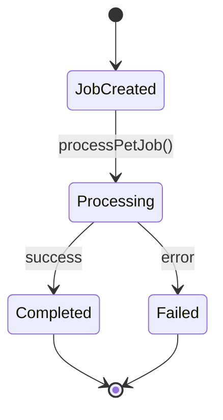
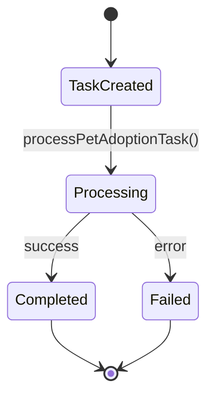
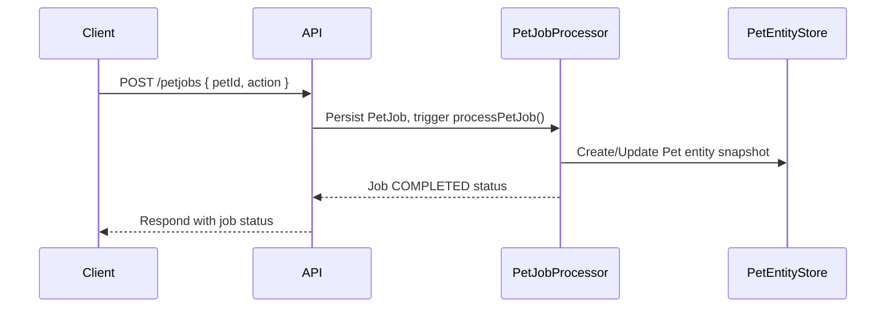

Certainly! Here is the well-formatted final version of the functional requirements for the "Purrfect Pets" API app using Event-Driven Architecture:

### 1. Entity Definitions

``` 
PetJob:  # Orchestration entity - controls pet data processing
  - id: String (unique job identifier)
  - petId: String (reference to Pet entity)
  - action: ActionEnum (CREATE, UPDATE, STATUS_CHANGE)
  - status: StatusEnum (PENDING, PROCESSING, COMPLETED, FAILED)
  - createdAt: DateTime (job creation timestamp)

Pet:  # Business domain entity - pet details
  - id: String (unique pet identifier)
  - name: String (pet name)
  - species: String (cat, dog, etc.)
  - breed: String (breed details)
  - age: Integer (pet age in years)
  - adoptionStatus: AdoptionStatusEnum (AVAILABLE, PENDING, ADOPTED)
  - status: StatusEnum (ACTIVE, INACTIVE)

PetAdoptionTask:  # Optional secondary entity to track adoption workflow steps
  - id: String (task id)
  - petId: String (reference to Pet)
  - taskType: TaskTypeEnum (APPLICATION_RECEIVED, INTERVIEW_SCHEDULED, APPROVAL)
  - status: StatusEnum (PENDING, COMPLETED)
  - createdAt: DateTime
```

### 2. Process Method Flows

```
processPetJob() Flow:
1. Initial State: PetJob created with PENDING status
2. Validation: Verify petId exists and action is valid
3. Processing: Depending on action:
   - CREATE: Create new Pet entity with ACTIVE status
   - UPDATE: Create new immutable Pet entity snapshot with updated data
   - STATUS_CHANGE: Create new Pet entity state with new adoptionStatus
4. Completion: Update PetJob status to COMPLETED or FAILED
5. Notification: Log results or send event downstream if needed

processPetAdoptionTask() Flow:
1. Initial State: Task created with PENDING status
2. Validation: Confirm pet exists and taskType is valid
3. Processing: Execute task-specific logic (e.g., notify adoption team)
4. Completion: Update task status to COMPLETED or FAILED
5. Notification: Log or trigger next workflow step
```

### 3. API Endpoints (JSON request/response samples)

- **POST /petjobs**  
Request:  
```json
{
  "petId": "123",
  "action": "CREATE"
}
```
Response:  
```json
{
  "jobId": "job-456",
  "status": "PENDING"
}
```

- **POST /petadoptiontasks**  
Request:  
```json
{
  "petId": "123",
  "taskType": "APPLICATION_RECEIVED"
}
```
Response:  
```json
{
  "taskId": "task-789",
  "status": "PENDING"
}
```

- **GET /pets/{id}**  
Response:  
```json
{
  "id": "123",
  "name": "Whiskers",
  "species": "Cat",
  "breed": "Siamese",
  "age": 3,
  "adoptionStatus": "AVAILABLE",
  "status": "ACTIVE"
}
```

### 4. Visual Representations

**PetJob Lifecycle State Diagram**


```mermaid
stateDiagram-v2
    [*] --> JobCreated
    JobCreated --> Processing : processPetJob()
    Processing --> Completed : success
    Processing --> Failed : error
    Completed --> [*]
    Failed --> [*]
```

**Pet Adoption Task Lifecycle State Diagram**


```mermaid
stateDiagram-v2
    [*] --> TaskCreated
    TaskCreated --> Processing : processPetAdoptionTask()
    Processing --> Completed : success
    Processing --> Failed : error
    Completed --> [*]
    Failed --> [*]
```

**Event-Driven Processing Chain**


```mermaid
sequenceDiagram
    participant Client
    participant API
    participant PetJobProcessor
    participant PetEntityStore

    Client->>API: POST /petjobs { petId, action }
    API->>PetJobProcessor: Persist PetJob, trigger processPetJob()
    PetJobProcessor->>PetEntityStore: Create/Update Pet entity snapshot
    PetJobProcessor-->>API: Job COMPLETED status
    API-->>Client: Respond with job status
```

---

If you'd like me to proceed with implementation or add any further details, just let me know!