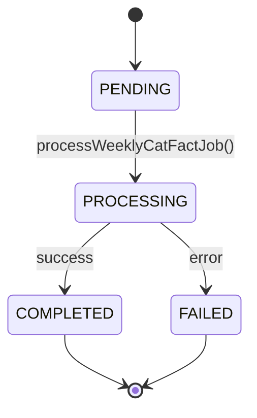
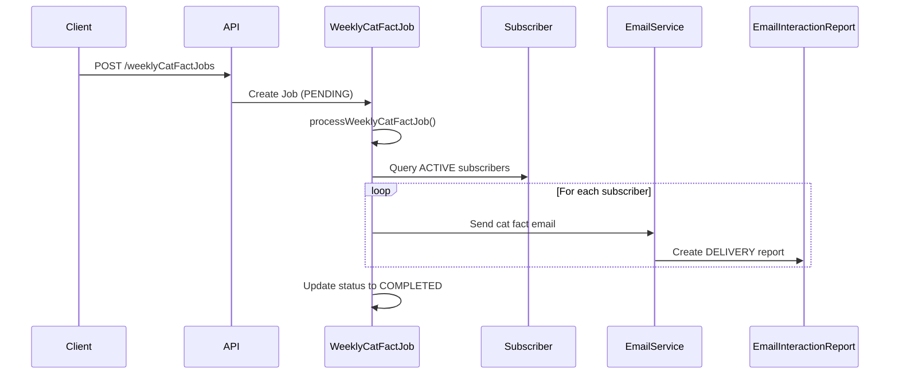
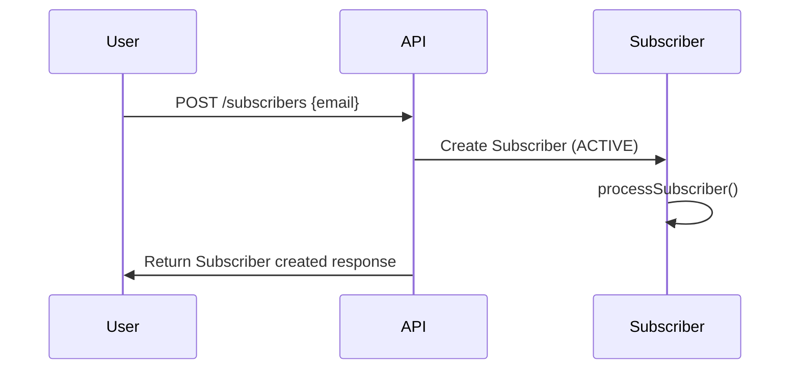

### 1. Entity Definitions

``` 
WeeklyCatFactJob:
- id: UUID (unique identifier for the job)
- scheduledAt: DateTime (when the job is scheduled to run)
- status: JobStatusEnum {PENDING, PROCESSING, COMPLETED, FAILED} (job lifecycle state)

Subscriber:
- id: UUID (unique identifier for subscriber)
- email: String (subscriber's email address)
- status: SubscriberStatusEnum {ACTIVE} (subscriber lifecycle state, immutable—no unsubscribe tracking)

EmailInteractionReport:
- id: UUID (unique identifier for report event)
- subscriberId: UUID (reference to subscriber)
- eventType: InteractionTypeEnum {DELIVERY, OPEN} (type of email interaction)
- eventTimestamp: DateTime (when the interaction occurred)
- status: ReportStatusEnum {RECORDED} (report event state)
```

---

### 2. Process Method Flows

``` 
processWeeklyCatFactJob() Flow:
1. Initial State: WeeklyCatFactJob created with PENDING status
2. Transition to PROCESSING status
3. Fetch new cat fact from Cat Fact API
4. Retrieve all ACTIVE Subscribers
5. Send cat fact email to each subscriber
6. For each email sent, create EmailInteractionReport with DELIVERY event
7. Update WeeklyCatFactJob status to COMPLETED or FAILED based on outcomes
```

``` 
processSubscriber() Flow:
1. SubscriberCreated event triggered on subscriber creation
2. Validate email format and uniqueness
3. Mark subscriber status as ACTIVE immediately (no verification)
4. No unsubscribe or deletion processing to preserve event history
```

``` 
processEmailInteractionReport() Flow:
1. Created when a delivery or open event occurs
2. Persist interaction immutably for reporting
3. No further processing needed, just storage
```

---

### 3. API Endpoints & Request/Response Formats

**POST /subscribers**  
_Request:_  
```json
{
  "email": "user@example.com"
}
```  
_Response:_  
```json
{
  "id": "uuid",
  "email": "user@example.com",
  "status": "ACTIVE"
}
```

**POST /weeklyCatFactJobs** (trigger weekly fact sending)  
_Request:_  
```json
{
  "scheduledAt": "2024-07-01T10:00:00Z"
}
```  
_Response:_  
```json
{
  "id": "uuid",
  "scheduledAt": "2024-07-01T10:00:00Z",
  "status": "PENDING"
}
```

**GET /emailInteractionReports** (retrieve reports)  
_Response:_  
```json
[
  {
    "id": "uuid",
    "subscriberId": "uuid",
    "eventType": "DELIVERY",
    "eventTimestamp": "2024-06-28T12:00:00Z",
    "status": "RECORDED"
  },
  {
    "id": "uuid",
    "subscriberId": "uuid",
    "eventType": "OPEN",
    "eventTimestamp": "2024-06-28T13:00:00Z",
    "status": "RECORDED"
  }
]
```

---

### 4. Visual Representations

**Entity Lifecycle State Diagram (WeeklyCatFactJob)**


```mermaid
stateDiagram-v2
    [*] --> PENDING
    PENDING --> PROCESSING : processWeeklyCatFactJob()
    PROCESSING --> COMPLETED : success
    PROCESSING --> FAILED : error
    COMPLETED --> [*]
    FAILED --> [*]
```

**Event-Driven Processing Chain**


```mermaid
sequenceDiagram
    participant Client
    participant API
    participant WeeklyCatFactJob
    participant Subscriber
    participant EmailService
    participant EmailInteractionReport

    Client->>API: POST /weeklyCatFactJobs
    API->>WeeklyCatFactJob: Create Job (PENDING)
    WeeklyCatFactJob->>WeeklyCatFactJob: processWeeklyCatFactJob()
    WeeklyCatFactJob->>Subscriber: Query ACTIVE subscribers
    loop For each subscriber
        WeeklyCatFactJob->>EmailService: Send cat fact email
        EmailService->>EmailInteractionReport: Create DELIVERY report
    end
    WeeklyCatFactJob->>WeeklyCatFactJob: Update status to COMPLETED
```

**User Subscription Sequence Flow**


```mermaid
sequenceDiagram
    participant User
    participant API
    participant Subscriber

    User->>API: POST /subscribers {email}
    API->>Subscriber: Create Subscriber (ACTIVE)
    Subscriber->>Subscriber: processSubscriber()
    API->>User: Return Subscriber created response
```

---

You can use this as the final functional specification for your Weekly Cat Fact Subscription application using Event-Driven Architecture on Cyoda.  
Please let me know if you need any further assistance!