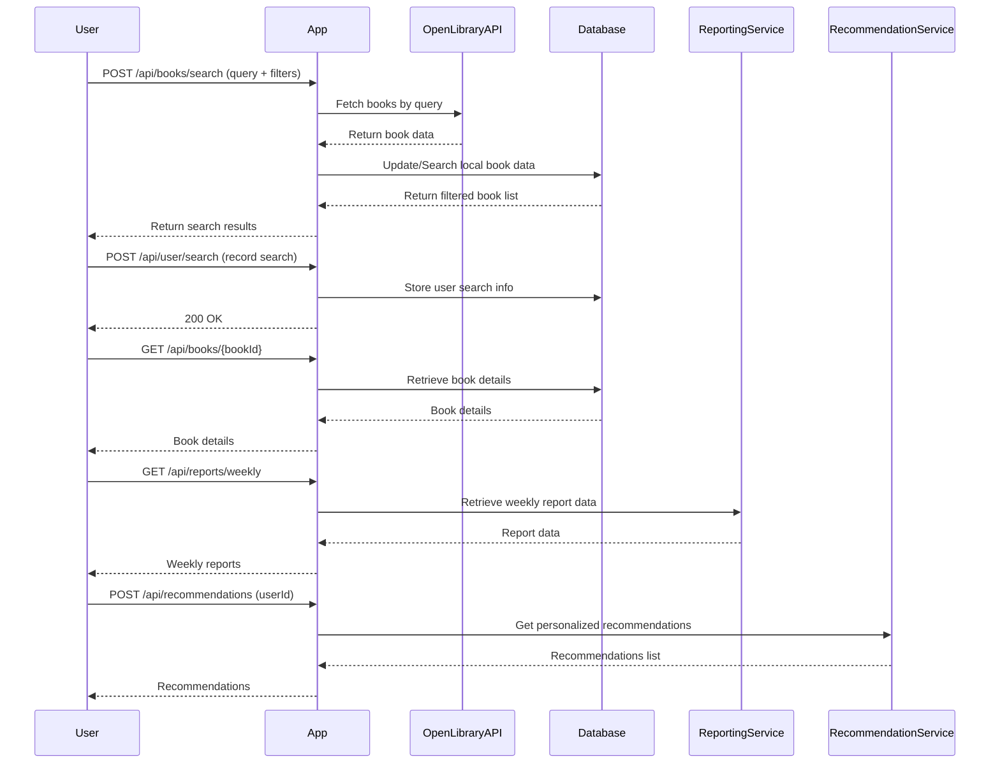

# Functional Requirements and API Design for Book Search and Recommendation Application

## API Endpoints

### 1. Search Books (POST /api/books/search)

- **Purpose:** Search for books based on user query and filters by invoking Open Library API and/or querying local database.
- **Request:**
  ```json
  {
    "query": "string",
    "filters": {
      "genre": "string",          // optional
      "publicationYear": "number", // optional
      "author": "string"          // optional
    },
    "page": "number",              // optional, for pagination
    "pageSize": "number"           // optional, for pagination
  }
  ```
- **Response:**
  ```json
  {
    "results": [
      {
        "bookId": "string",
        "title": "string",
        "authors": ["string"],
        "coverImageUrl": "string",
        "publicationYear": "number",
        "genres": ["string"]
      }
    ],
    "totalResults": "number",
    "page": "number",
    "pageSize": "number"
  }
  ```

### 2. Get Book Details (GET /api/books/{bookId})

- **Purpose:** Retrieve detailed book information from local database by book ID.
- **Response:**
  ```json
  {
    "bookId": "string",
    "title": "string",
    "authors": ["string"],
    "coverImageUrl": "string",
    "publicationYear": "number",
    "genres": ["string"],
    "description": "string",
    "publisher": "string",
    "isbn": "string"
  }
  ```

### 3. Record User Search (POST /api/user/search)

- **Purpose:** Record user search activity for reporting and recommendation purposes.
- **Request:**
  ```json
  {
    "userId": "string",
    "query": "string",
    "filters": {
      "genre": "string",            // optional
      "publicationYear": "number",  // optional
      "author": "string"            // optional
    },
    "timestamp": "ISO8601 string"
  }
  ```
- **Response:** `200 OK`

### 4. Get Weekly Reports (GET /api/reports/weekly)

- **Purpose:** Retrieve weekly reports on most searched books and user preferences.
- **Response:**
  ```json
  {
    "mostSearchedBooks": [
      {
        "bookId": "string",
        "title": "string",
        "searchCount": "number"
      }
    ],
    "userPreferences": {
      "topGenres": ["string"],
      "topAuthors": ["string"]
    },
    "weekStartDate": "ISO8601 string",
    "weekEndDate": "ISO8601 string"
  }
  ```

### 5. Get Recommendations (POST /api/recommendations)

- **Purpose:** Provide personalized book recommendations based on user’s previous searches.
- **Request:**
  ```json
  {
    "userId": "string",
    "limit": "number"  // optional, default to 10
  }
  ```
- **Response:**
  ```json
  {
    "recommendations": [
      {
        "bookId": "string",
        "title": "string",
        "authors": ["string"],
        "coverImageUrl": "string"
      }
    ]
  }
  ```

---

## Mermaid Diagram: User Interaction Sequence


```mermaid
sequenceDiagram
    participant User
    participant App
    participant OpenLibraryAPI
    participant Database
    participant ReportingService
    participant RecommendationService

    User->>App: POST /api/books/search (query + filters)
    App->>OpenLibraryAPI: Fetch books by query
    OpenLibraryAPI-->>App: Return book data
    App->>Database: Update/Search local book data
    Database-->>App: Return filtered book list
    App-->>User: Return search results

    User->>App: POST /api/user/search (record search)
    App->>Database: Store user search info
    App-->>User: 200 OK

    User->>App: GET /api/books/{bookId}
    App->>Database: Retrieve book details
    Database-->>App: Book details
    App-->>User: Book details

    User->>App: GET /api/reports/weekly
    App->>ReportingService: Retrieve weekly report data
    ReportingService-->>App: Report data
    App-->>User: Weekly reports

    User->>App: POST /api/recommendations (userId)
    App->>RecommendationService: Get personalized recommendations
    RecommendationService-->>App: Recommendations list
    App-->>User: Recommendations
```