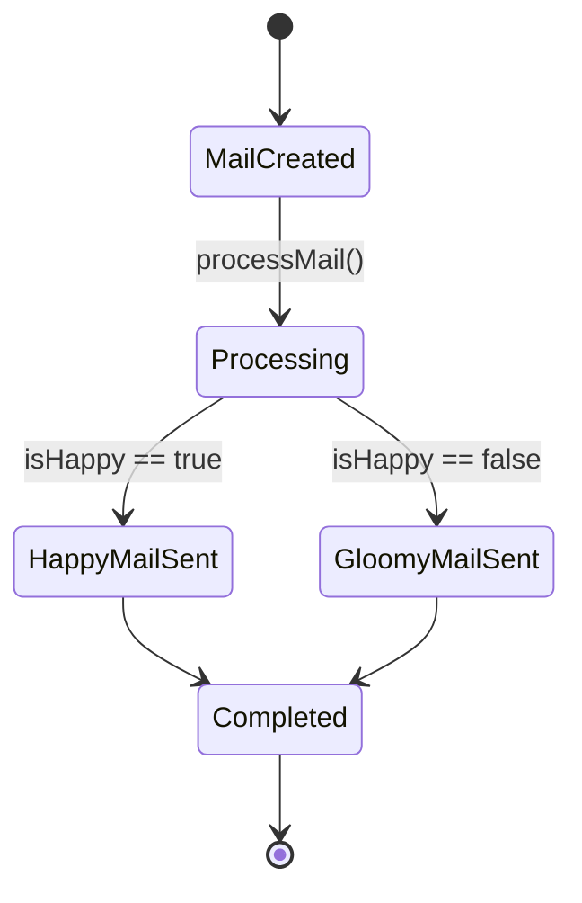
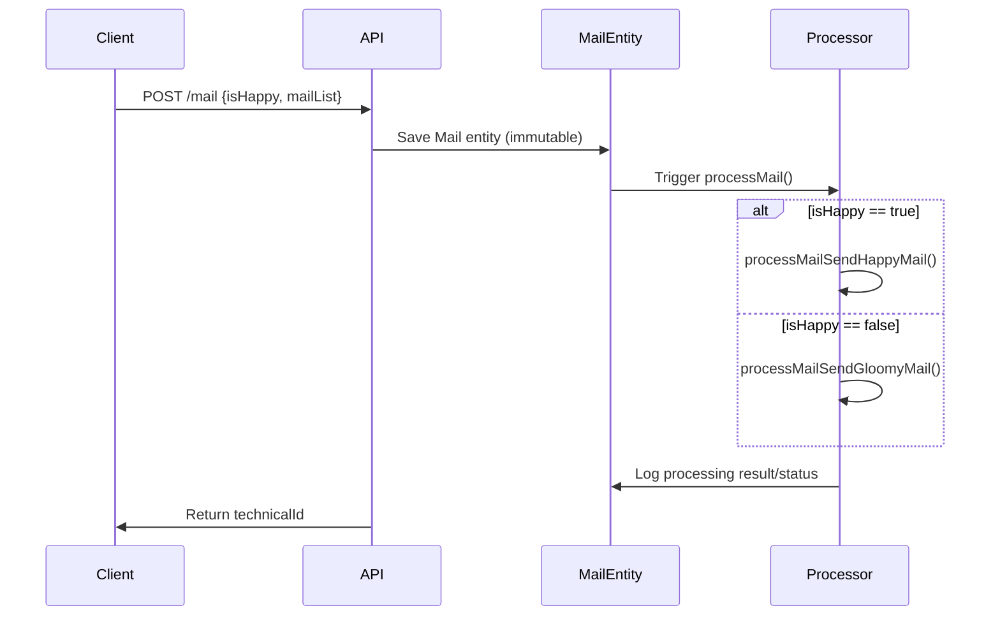

### 1. Entity Definitions

``` 
Mail:  
- isHappy: Boolean (Indicates if the mail is happy or gloomy)  
- mailList: List<String> (List of recipient email addresses)  
```  

### 2. Process Method Flows

``` 
processMail() Flow:  
1. Initial State: Mail entity is created and persisted (immutable creation).  
2. Criteria Check:  
   - checkMailHappy() is invoked if user specifies `isHappy == true` criteria.  
   - checkMailGloomy() is invoked if user specifies `isHappy == false` criteria.  
3. Processing:  
   - If `isHappy == true`, processMailSendHappyMail() is triggered, sending happy mail content to all addresses in `mailList`.  
   - If `isHappy == false`, processMailSendGloomyMail() is triggered, sending gloomy mail content to all addresses in `mailList`.  
4. Completion: Mark mail as processed or log the event (immutable, no update to entity).  
5. Notification/Logging: Log sending status; no direct user notification specified.  
```  

### 3. API Endpoints Design

| Method | Endpoint                 | Description                                | Request Body                   | Response Body        |
|--------|--------------------------|--------------------------------------------|-------------------------------|----------------------|
| POST   | /mail                    | Create a new Mail entity (triggers processing) | `{ "isHappy": true/false, "mailList": ["email1", "email2"] }` | `{ "technicalId": "uuid" }` |
| GET    | /mail/{technicalId}       | Retrieve stored Mail processing result or status | N/A                           | `{ "technicalId": "uuid", "isHappy": true/false, "mailList": [...], "status": "processed" }` |

- No update or delete endpoints (immutable design).
- No GET by condition unless explicitly requested later.

### 4. Request/Response Formats

**POST /mail**

Request:

```json
{
  "isHappy": true,
  "mailList": [
    "recipient1@example.com",
    "recipient2@example.com"
  ]
}
```

Response:

```json
{
  "technicalId": "123e4567-e89b-12d3-a456-426614174000"
}
```

**GET /mail/{technicalId}**

Response:

```json
{
  "technicalId": "123e4567-e89b-12d3-a456-426614174000",
  "isHappy": true,
  "mailList": [
    "recipient1@example.com",
    "recipient2@example.com"
  ],
  "status": "processed"
}
```

---

### Mermaid Diagrams

**Entity Lifecycle State Diagram**


```mermaid
stateDiagram-v2
    [*] --> MailCreated
    MailCreated --> Processing : processMail()
    Processing --> HappyMailSent : isHappy == true
    Processing --> GloomyMailSent : isHappy == false
    HappyMailSent --> Completed
    GloomyMailSent --> Completed
    Completed --> [*]
```

**Event-Driven Processing Chain**


```mermaid
sequenceDiagram
    participant Client
    participant API
    participant MailEntity
    participant Processor

    Client->>API: POST /mail {isHappy, mailList}
    API->>MailEntity: Save Mail entity (immutable)
    MailEntity->>Processor: Trigger processMail()
    alt isHappy == true
        Processor->>Processor: processMailSendHappyMail()
    else isHappy == false
        Processor->>Processor: processMailSendGloomyMail()
    end
    Processor->>MailEntity: Log processing result/status
    API->>Client: Return technicalId
```

---

If you need any adjustments or additional entities, please let me know!