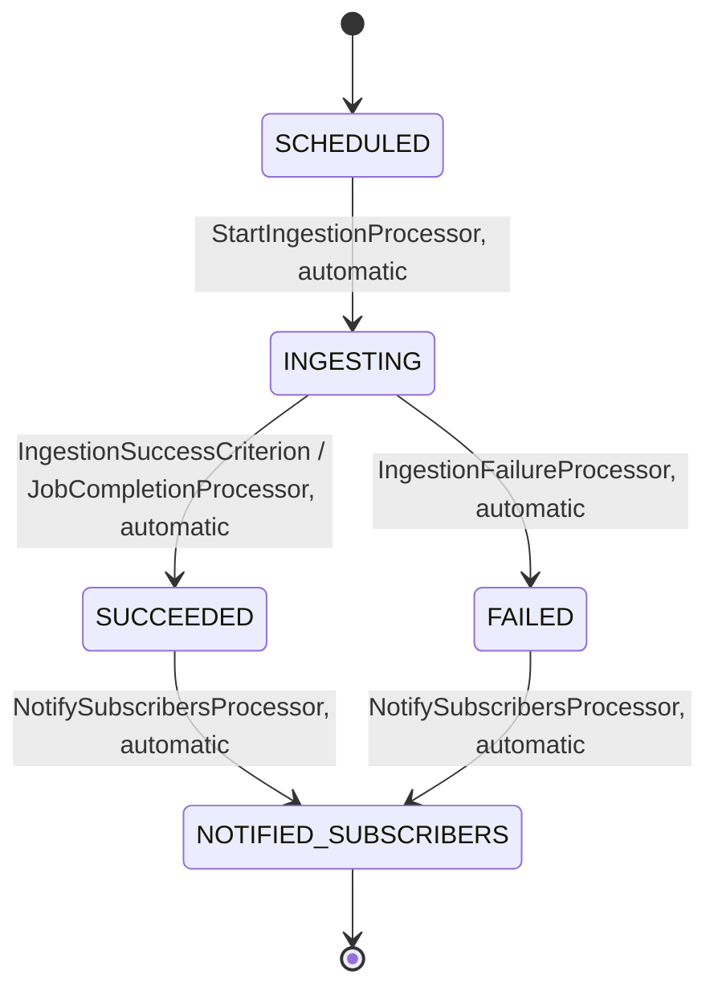
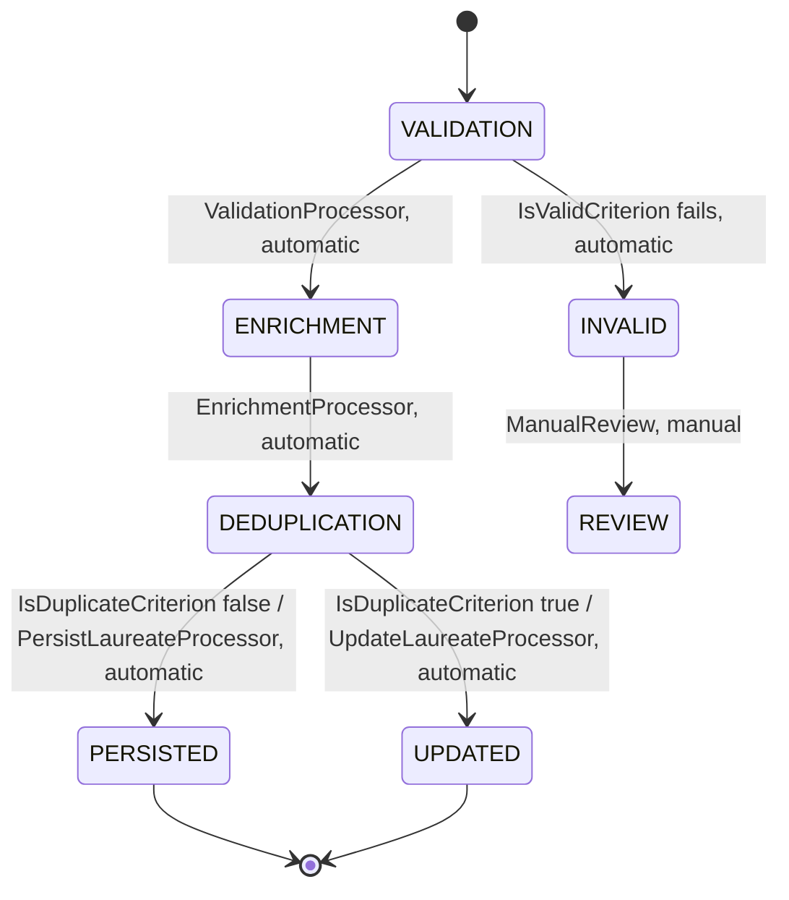
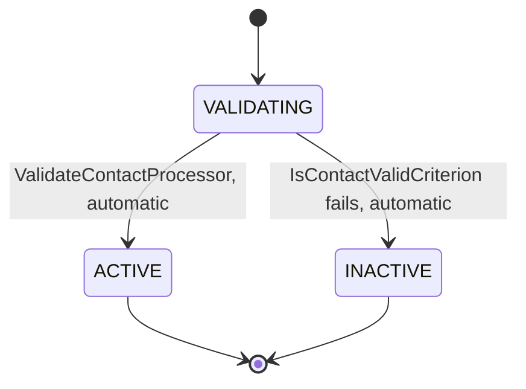

### 1. Entity Definitions
```
Job:
- id: String (logical id provided by caller)
- schedule: String (cron expression or manual)
- sourceUrl: String (API endpoint to ingest)
- state: String (SCHEDULED, INGESTING, SUCCEEDED, FAILED, NOTIFIED_SUBSCRIBERS)
- startedAt: String (timestamp)
- finishedAt: String (timestamp)
- processedCount: Integer (number of laureates processed)
- failedCount: Integer (errors during ingestion)
- errorSummary: String (short error message)

Laureate:
- id: Integer (source id)
- firstname: String
- surname: String
- gender: String
- born: String (date)
- died: String (date|null)
- borncountry: String
- borncountrycode: String
- borncity: String
- year: String (award year)
- category: String
- motivation: String
- affiliationName: String
- affiliationCity: String
- affiliationCountry: String
- ageAtAward: Integer (enriched)
- normalizedCountryCode: String (enriched)
- sourceSnapshot: String (raw JSON)
- lastUpdatedAt: String (timestamp)

Subscriber:
- id: String (business id)
- name: String
- email: String|null
- webhookUrl: String|null
- filters: String (simple expression e.g. category=Chemistry; optional)
- active: Boolean
- createdAt: String
```

### 2. Entity workflows

Job workflow (automatic transitions mostly)
1. Initial State: Job persisted -> SCHEDULED (automatic)
2. Start Ingestion: SCHEDULED -> INGESTING (automatic by ScheduleProcessor or manual trigger)
3. Ingest Data: INGESTING -> SUCCEEDED if ingestion completes, else FAILED (automatic; uses IngestionProcessor)
4. Notify: SUCCEEDED/FAILED -> NOTIFIED_SUBSCRIBERS (automatic; NotifySubscribersProcessor)
5. Final: NOTIFIED_SUBSCRIBERS -> (end)


```mermaid
stateDiagram-v2
    [*] --> SCHEDULED
    SCHEDULED --> INGESTING : StartIngestionProcessor, automatic
    INGESTING --> SUCCEEDED : IngestionSuccessCriterion / JobCompletionProcessor, automatic
    INGESTING --> FAILED : IngestionFailureProcessor, automatic
    SUCCEEDED --> NOTIFIED_SUBSCRIBERS : NotifySubscribersProcessor, automatic
    FAILED --> NOTIFIED_SUBSCRIBERS : NotifySubscribersProcessor, automatic
    NOTIFIED_SUBSCRIBERS --> [*]
```

Job processors & criteria:
- Processors: ScheduleProcessor, IngestionProcessor, JobCompletionProcessor, NotifySubscribersProcessor, JobRetryProcessor
- Criteria: IngestionSuccessCriterion, RetryExceededCriterion

Laureate workflow (triggered when Laureate entity is persisted by ingestion)
1. Persisted -> VALIDATION (automatic)
2. VALIDATION -> ENRICHMENT if valid, else INVALID (automatic)
3. ENRICHMENT -> DEDUPLICATION -> PERSISTED (automatic)
4. INVALID -> REVIEW (manual) or DROP (automatic)


```mermaid
stateDiagram-v2
    [*] --> VALIDATION
    VALIDATION --> ENRICHMENT : ValidationProcessor, automatic
    VALIDATION --> INVALID : IsValidCriterion fails, automatic
    ENRICHMENT --> DEDUPLICATION : EnrichmentProcessor, automatic
    DEDUPLICATION --> PERSISTED : IsDuplicateCriterion false / PersistLaureateProcessor, automatic
    DEDUPLICATION --> UPDATED : IsDuplicateCriterion true / UpdateLaureateProcessor, automatic
    INVALID --> REVIEW : ManualReview, manual
    PERSISTED --> [*]
    UPDATED --> [*]
```

Laureate processors & criteria:
- Processors: ValidationProcessor, EnrichmentProcessor, DuplicateDetectorProcessor, PersistLaureateProcessor, UpdateLaureateProcessor
- Criteria: IsValidCriterion, IsDuplicateCriterion

Subscriber workflow (simple validation/activation)
1. Persisted -> VALIDATING (automatic)
2. VALIDATING -> ACTIVE if contact valid else INACTIVE (automatic)
3. ACTIVE -> (no orchestration role) receives notifications


```mermaid
stateDiagram-v2
    [*] --> VALIDATING
    VALIDATING --> ACTIVE : ValidateContactProcessor, automatic
    VALIDATING --> INACTIVE : IsContactValidCriterion fails, automatic
    ACTIVE --> [*]
    INACTIVE --> [*]
```

Subscriber processors & criteria:
- Processors: ValidateContactProcessor, ActivateSubscriberProcessor
- Criteria: IsContactValidCriterion

### 3. Pseudo code for processor classes (concise)

IngestionProcessor
```
class IngestionProcessor {
  process(Job job):
    fetch JSON from job.sourceUrl
    for record in response:
      laureate = mapToLaureate(record)
      publishEvent("LaureateCreated", laureate) // persistence handled by Cyoda process
    mark job.processedCount, job.finishedAt
```

ValidationProcessor (Laureate)
```
class ValidationProcessor {
  process(Laureate l):
    if missing required fields return mark INVALID
    if date formats invalid return INVALID
    else pass to next
```

EnrichmentProcessor (Laureate)
```
class EnrichmentProcessor {
  process(Laureate l):
    l.ageAtAward = computeAge(l.born, l.year)
    l.normalizedCountryCode = normalizeCountry(l.borncountrycode)
```

NotifySubscribersProcessor (Job)
```
class NotifySubscribersProcessor {
  process(Job job):
    subscribers = query active subscribers
    for s in subscribers:
      if s.filters match job results:
         send notification (email or webhook) asynchronously
         record delivery status
```

DuplicateDetectorProcessor
```
class DuplicateDetectorProcessor {
  process(Laureate l):
    existing = find by id
    if existing null -> continue persist
    else compare and update -> publish update event
```

### 4. API Endpoints Design Rules

- POST endpoints create orchestration or admin entities and MUST return only technicalId.
- GET endpoints retrieve stored results. GET by technicalId present for Job and Subscriber. Laureate created by ingestion but GET by technicalId allowed.

POST /jobs
Request:
```json
{
  "id":"job-001",
  "schedule":"0 0 * * *",
  "sourceUrl":"https://public.opendatasoft.com/api/explore/v2.1/catalog/datasets/nobel-prize-laureates/records"
}
```
Response:
```json
{ "technicalId":"T_JOB_0001" }
```

GET /jobs/{technicalId}
Response:
```json
{
  "id":"job-001",
  "schedule":"0 0 * * *",
  "sourceUrl":"https://.../records",
  "state":"SCHEDULED",
  "processedCount":0
}
```

POST /subscribers
Request:
```json
{
  "id":"sub-01",
  "name":"Chemistry Feed",
  "email":"alerts@example.com",
  "webhookUrl":null,
  "filters":"category=Chemistry",
  "active":true
}
```
Response:
```json
{ "technicalId":"T_SUB_0001" }
```

GET /subscribers/{technicalId}
Response:
```json
{
  "id":"sub-01",
  "name":"Chemistry Feed",
  "email":"alerts@example.com",
  "filters":"category=Chemistry",
  "active":true
}
```

GET /laureates/{technicalId}
Response:
```json
{
  "id":853,
  "firstname":"Akira",
  "surname":"Suzuki",
  "year":"2010",
  "category":"Chemistry",
  "ageAtAward":80,
  "normalizedCountryCode":"JP",
  "lastUpdatedAt":"2025-08-01T12:00:00Z"
}
```

Notes:
- Laureate creation is triggered by IngestionProcessor publishing LaureateCreated events; no POST for Laureate.
- All processing is event-driven: persisting an entity triggers its Cyoda workflow (process method), which runs the processors/criteria above.
- Retries, backoff, and audit logging are implemented via JobRetryProcessor and errorSummary fields (behavior to be finalized).