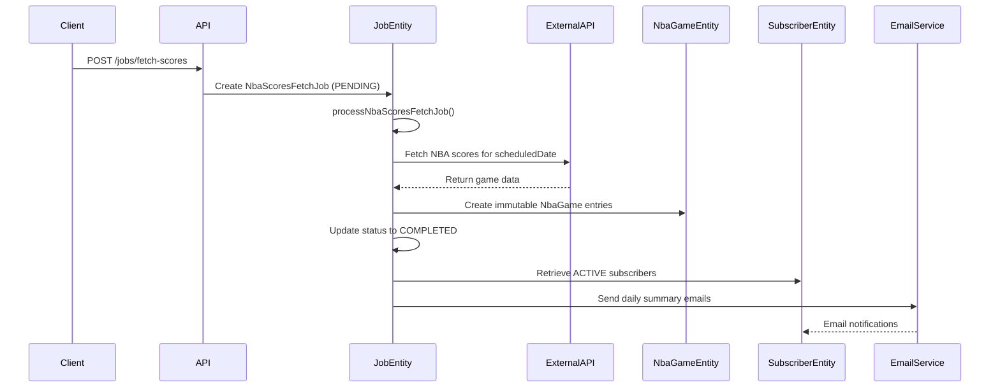
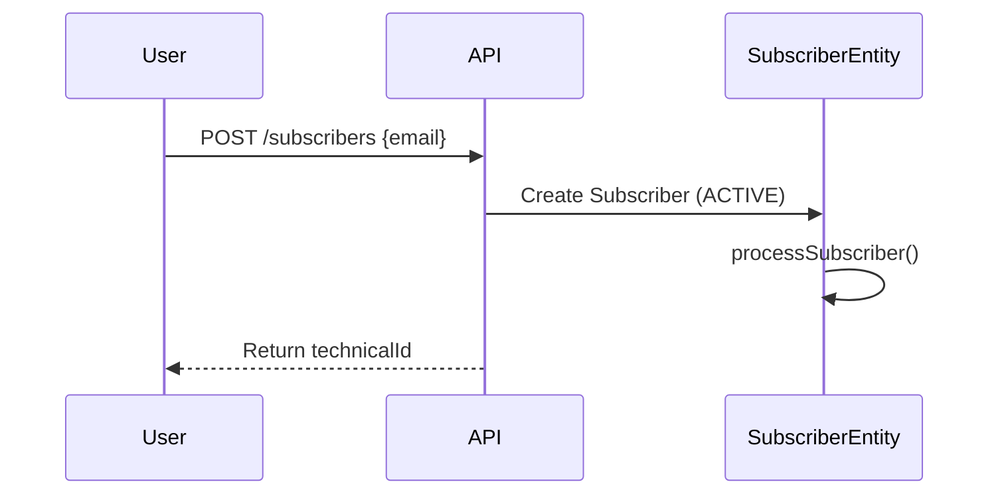

### 1. Entity Definitions

``` 
NbaScoresFetchJob:
- scheduledDate: LocalDate (the date for which NBA scores are fetched)
- fetchTimeUTC: LocalTime (time when fetching is scheduled, e.g., 18:00 UTC)
- status: JobStatusEnum (PENDING, IN_PROGRESS, COMPLETED, FAILED)
- summary: String (brief summary or error message after processing)

NbaGame:
- gameDate: LocalDate (date of the NBA game)
- homeTeam: String (home team name)
- awayTeam: String (away team name)
- homeScore: Integer (final score of home team)
- awayScore: Integer (final score of away team)
- status: GameStatusEnum (REPORTED, VERIFIED)

Subscriber:
- email: String (subscriber email address)
- subscriptionDate: LocalDateTime (timestamp when subscription was created)
- status: SubscriberStatusEnum (ACTIVE, INACTIVE)
```

---

### 2. Process Method Flows

```
processNbaScoresFetchJob() Flow:
1. Initial State: NbaScoresFetchJob created with PENDING status and scheduledDate set.
2. Validation: Confirm scheduledDate is valid and not in the future.
3. Processing:
   - Call external NBA API asynchronously using scheduledDate.
   - Parse and save results as immutable NbaGame entities with status REPORTED.
4. Completion:
   - Update NbaScoresFetchJob status to COMPLETED if successful, or FAILED with error info.
   - Generate daily summary text for email notifications.
5. Notification:
   - Trigger sending emails to all ACTIVE Subscribers with the daily summary.
```

```
processSubscriber() Flow:
1. Initial State: Subscriber entity created with ACTIVE status.
2. Validation: Check email format and enforce uniqueness.
3. Completion: Confirm subscription is active; no further processing required.
```

---

### 3. API Endpoints Design & Request/Response Formats

| Endpoint                     | Method | Request Body                          | Response                      | Description                         |
|-----------------------------|--------|-------------------------------------|-------------------------------|-----------------------------------|
| `/jobs/fetch-scores`         | POST   | `{ "scheduledDate": "YYYY-MM-DD" }`| `{ "technicalId": "string" }` | Create a new NBA scores fetch job |
| `/jobs/fetch-scores/{id}`    | GET    | -                                   | Full NbaScoresFetchJob details | Retrieve job by technicalId       |
| `/subscribers`               | POST   | `{ "email": "user@example.com" }`  | `{ "technicalId": "string" }` | Add new subscriber                 |
| `/subscribers/{id}`          | GET    | -                                   | Subscriber details             | Retrieve subscriber by technicalId|
| `/games/{date}`              | GET    | -                                   | List of NbaGame for given date | Retrieve games by date            |
| `/games/all` (optional)      | GET    | -                                   | Paginated list of all NbaGame  | Retrieve all stored game data     |

**Example Request/Response:**

- POST `/jobs/fetch-scores`

Request:
```json
{
  "scheduledDate": "2025-03-25"
}
```

Response:
```json
{
  "technicalId": "job-123456"
}
```

---

### 4. Mermaid Diagrams

#### Entity Lifecycle State Diagram for NbaScoresFetchJob


```mermaid
stateDiagram-v2
    [*] --> Pending
    Pending --> InProgress : processNbaScoresFetchJob()
    InProgress --> Completed : success
    InProgress --> Failed : error
    Completed --> [*]
    Failed --> [*]
```

#### Event-Driven Processing Chain


```mermaid
sequenceDiagram
    participant Client
    participant API
    participant JobEntity
    participant ExternalAPI
    participant NbaGameEntity
    participant SubscriberEntity
    participant EmailService

    Client->>API: POST /jobs/fetch-scores
    API->>JobEntity: Create NbaScoresFetchJob (PENDING)
    JobEntity->>JobEntity: processNbaScoresFetchJob()
    JobEntity->>ExternalAPI: Fetch NBA scores for scheduledDate
    ExternalAPI-->>JobEntity: Return game data
    JobEntity->>NbaGameEntity: Create immutable NbaGame entries
    JobEntity->>JobEntity: Update status to COMPLETED
    JobEntity->>SubscriberEntity: Retrieve ACTIVE subscribers
    JobEntity->>EmailService: Send daily summary emails
    EmailService-->>SubscriberEntity: Email notifications
```

#### User Interaction Sequence Flow for Subscription


```mermaid
sequenceDiagram
    participant User
    participant API
    participant SubscriberEntity

    User->>API: POST /subscribers {email}
    API->>SubscriberEntity: Create Subscriber (ACTIVE)
    SubscriberEntity->>SubscriberEntity: processSubscriber()
    API-->>User: Return technicalId
```

---

If you need further clarifications or additions, please let me know!