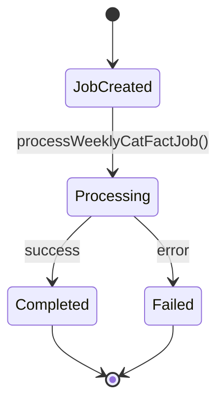
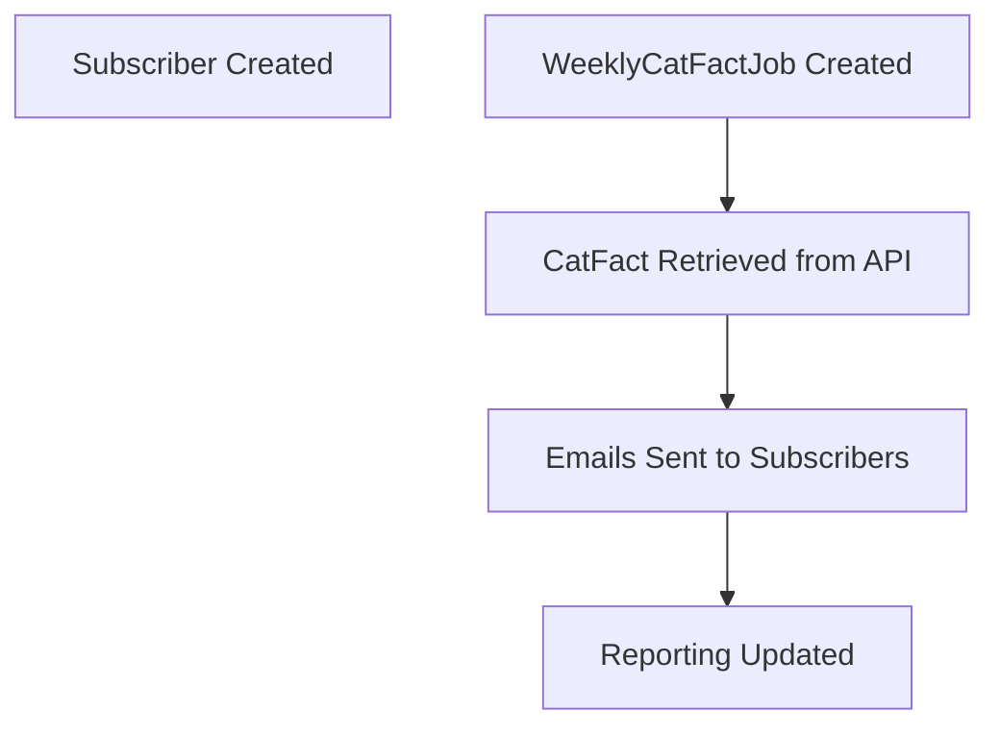
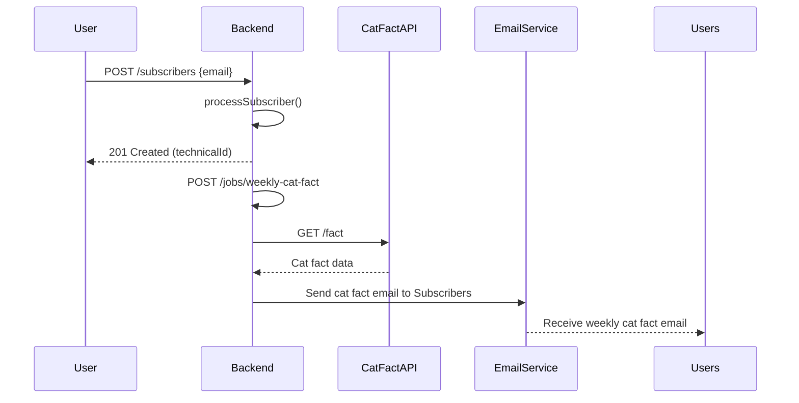

### 1. Entity Definitions

``` 
WeeklyCatFactJob:
- emailSentDate: LocalDateTime (timestamp when the weekly cat fact email was sent)
- catFact: String (the cat fact content sent in the email)
- status: String (job state: PENDING, COMPLETED, FAILED)
- subscriberCount: Integer (number of subscribers at time of sending)

Subscriber:
- email: String (subscriber's email address)
- subscribedDate: LocalDateTime (timestamp when user subscribed)
- status: String (subscription status: ACTIVE, UNSUBSCRIBED)
- interactionCount: Integer (number of times user opened/clicked cat fact emails)

CatFact:
- fact: String (the cat fact text retrieved from API)
- retrievedDate: LocalDateTime (timestamp when fact was fetched)
```

---

### 2. Process Method Flows

``` 
processWeeklyCatFactJob() Flow:
1. Initial State: WeeklyCatFactJob created with status = PENDING and emailSentDate = null
2. Data Ingestion: Call Cat Fact API to retrieve a new cat fact; save as CatFact entity
3. Email Preparation: Count active Subscribers, compose email content including the CatFact
4. Publishing: Send email to all active Subscribers
5. Update Job: Set emailSentDate, subscriberCount, and status to COMPLETED or FAILED accordingly
6. Reporting: Increment interaction metrics asynchronously when users interact with emails (tracked outside this flow)

processSubscriber() Flow:
1. Initial State: New Subscriber created with status = ACTIVE
2. Validation: Check if email is unique and valid (via checkSubscriberEmailValid())
3. Persistence: Save Subscriber entity
4. (Optional) Interaction: Track user interactions (opens/clicks) via separate events not detailed here

processCatFact() Flow:
1. Initial State: CatFact entity created upon retrieval from external API
2. Persistence: Save CatFact entity as immutable record to maintain history
3. No further processing (read-only for reporting and email content)
```

---

### 3. API Endpoints Design

| Endpoint                       | Method | Description                                | Request Body                      | Response Body              |
|-------------------------------|--------|--------------------------------------------|---------------------------------|----------------------------|
| `/jobs/weekly-cat-fact`        | POST   | Create a WeeklyCatFactJob to trigger weekly email send | `{}` (empty or optional scheduling date) | `{ "technicalId": "uuid" }`   |
| `/jobs/weekly-cat-fact/{id}`   | GET    | Get WeeklyCatFactJob status and details     | N/A                             | Full WeeklyCatFactJob entity data |
| `/subscribers`                 | POST   | Add new Subscriber (email sign-up)          | `{ "email": "user@example.com" }` | `{ "technicalId": "uuid" }`  |
| `/subscribers/{id}`            | GET    | Get Subscriber details by technicalId       | N/A                             | Full Subscriber entity data |
| `/cat-facts/{id}`              | GET    | Retrieve previously fetched CatFact          | N/A                             | Full CatFact entity data    |

- No PUT/PATCH/DELETE endpoints to maintain immutability.

---

### 4. Request/Response Formats

**POST /subscribers**  
Request:
```json
{
  "email": "user@example.com"
}
```
Response:
```json
{
  "technicalId": "uuid-subscriber-1234"
}
```

**POST /jobs/weekly-cat-fact**  
Request:
```json
{}
```
Response:
```json
{
  "technicalId": "uuid-job-5678"
}
```

**GET /jobs/weekly-cat-fact/{id}**  
Response:
```json
{
  "emailSentDate": "2024-06-01T10:00:00",
  "catFact": "Cats sleep 70% of their lives.",
  "status": "COMPLETED",
  "subscriberCount": 1500
}
```

---

### 5. Mermaid Diagrams

#### Entity Lifecycle State Diagram (WeeklyCatFactJob)


```mermaid
stateDiagram-v2
    [*] --> JobCreated
    JobCreated --> Processing : processWeeklyCatFactJob()
    Processing --> Completed : success
    Processing --> Failed : error
    Completed --> [*]
    Failed --> [*]
```

#### Event-Driven Processing Chain


```mermaid
graph TD
    SubscriberCreated[Subscriber Created]
    WeeklyCatFactJobCreated[WeeklyCatFactJob Created]
    CatFactRetrieved[CatFact Retrieved from API]
    EmailsSent[Emails Sent to Subscribers]
    ReportingUpdated[Reporting Updated]

    WeeklyCatFactJobCreated --> CatFactRetrieved
    CatFactRetrieved --> EmailsSent
    EmailsSent --> ReportingUpdated
```

#### User Interaction Sequence Flow


```mermaid
sequenceDiagram
    participant User
    participant Backend
    participant CatFactAPI
    participant EmailService

    User->>Backend: POST /subscribers {email}
    Backend->>Backend: processSubscriber()
    Backend-->>User: 201 Created (technicalId)

    Backend->>Backend: POST /jobs/weekly-cat-fact
    Backend->>CatFactAPI: GET /fact
    CatFactAPI-->>Backend: Cat fact data
    Backend->>EmailService: Send cat fact email to Subscribers
    EmailService-->>Users: Receive weekly cat fact email
```

---

This completes the functional requirements for your weekly cat fact email service using Event-Driven Architecture on the Cyoda platform.