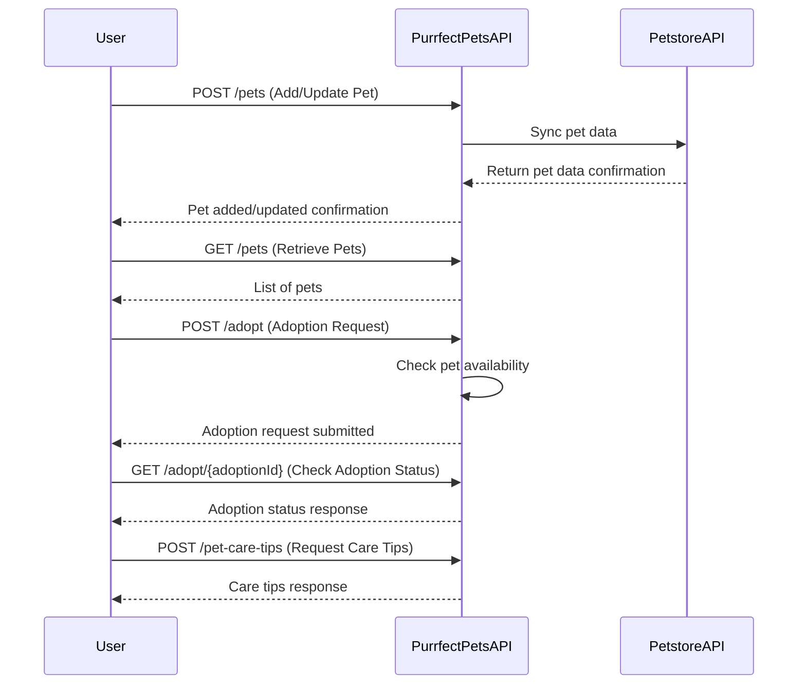
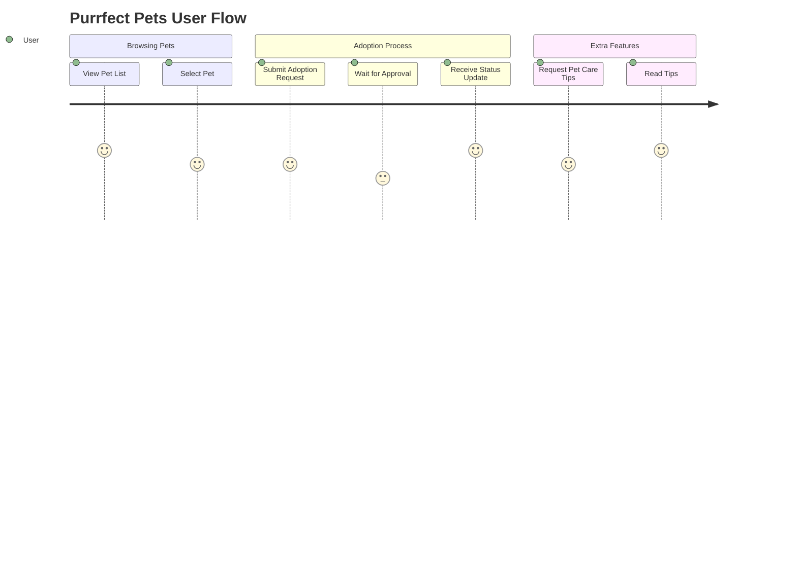

# Purrfect Pets API Functional Requirements

## API Endpoints

### 1. Add or Update Pet Data (POST)
- **URL:** `/pets`
- **Description:** Create a new pet entry or update an existing pet by invoking the Petstore external API to sync data.
- **Request:**
  ```json
  {
    "petId": "string (optional for update)",
    "name": "string",
    "category": "string",
    "status": "string (available, pending, sold)"
  }
  ```
- **Response:**
  ```json
  {
    "petId": "string",
    "message": "Pet added/updated successfully"
  }
  ```

---

### 2. Retrieve Pets (GET)
- **URL:** `/pets`
- **Description:** Retrieve a list of pets stored in the application.
- **Request:** None
- **Response:**
  ```json
  [
    {
      "petId": "string",
      "name": "string",
      "category": "string",
      "status": "string"
    }
  ]
  ```

---

### 3. Pet Adoption Request (POST)
- **URL:** `/adopt`
- **Description:** Submit an adoption request for a pet, which processes business logic such as availability checking.
- **Request:**
  ```json
  {
    "petId": "string",
    "userId": "string"
  }
  ```
- **Response:**
  ```json
  {
    "adoptionId": "string",
    "status": "pending/approved/denied",
    "message": "Adoption request submitted"
  }
  ```

---

### 4. Retrieve Adoption Status (GET)
- **URL:** `/adopt/{adoptionId}`
- **Description:** Retrieve the status of a submitted adoption request.
- **Request:** None
- **Response:**
  ```json
  {
    "adoptionId": "string",
    "petId": "string",
    "userId": "string",
    "status": "pending/approved/denied"
  }
  ```

---

### 5. Pet Care Tips Request (POST)
- **URL:** `/pet-care-tips`
- **Description:** Request pet care tips based on pet category.
- **Request:**
  ```json
  {
    "category": "string"
  }
  ```
- **Response:**
  ```json
  {
    "category": "string",
    "tips": [
      "string"
    ]
  }
  ```

---

# Mermaid Sequence Diagram: User Interaction with Purrfect Pets API


```mermaid
sequenceDiagram
    participant User
    participant PurrfectPetsAPI
    participant PetstoreAPI

    User->>PurrfectPetsAPI: POST /pets (Add/Update Pet)
    PurrfectPetsAPI->>PetstoreAPI: Sync pet data
    PetstoreAPI-->>PurrfectPetsAPI: Return pet data confirmation
    PurrfectPetsAPI-->>User: Pet added/updated confirmation

    User->>PurrfectPetsAPI: GET /pets (Retrieve Pets)
    PurrfectPetsAPI-->>User: List of pets

    User->>PurrfectPetsAPI: POST /adopt (Adoption Request)
    PurrfectPetsAPI->>PurrfectPetsAPI: Check pet availability
    PurrfectPetsAPI-->>User: Adoption request submitted

    User->>PurrfectPetsAPI: GET /adopt/{adoptionId} (Check Adoption Status)
    PurrfectPetsAPI-->>User: Adoption status response

    User->>PurrfectPetsAPI: POST /pet-care-tips (Request Care Tips)
    PurrfectPetsAPI-->>User: Care tips response
```

---

# Mermaid Journey Diagram: Typical User Flow


```mermaid
journey
    title Purrfect Pets User Flow
    section Browsing Pets
      View Pet List: 5: User
      Select Pet: 4: User
    section Adoption Process
      Submit Adoption Request: 4: User
      Wait for Approval: 3: User
      Receive Status Update: 5: User
    section Extra Features
      Request Pet Care Tips: 4: User
      Read Tips: 5: User
```