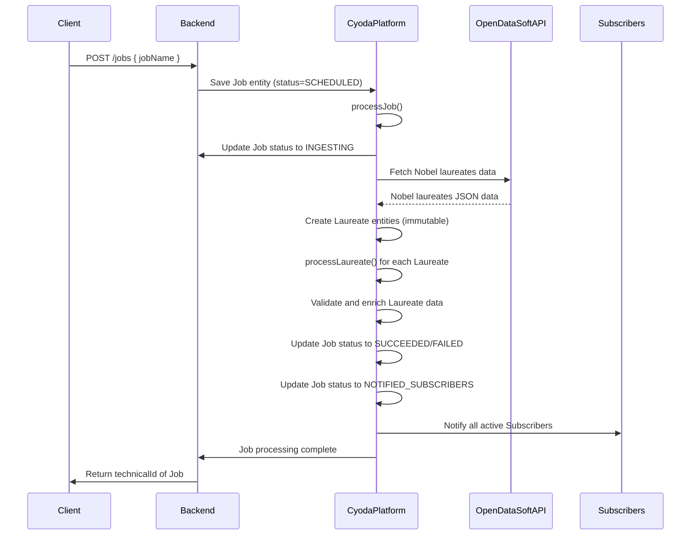
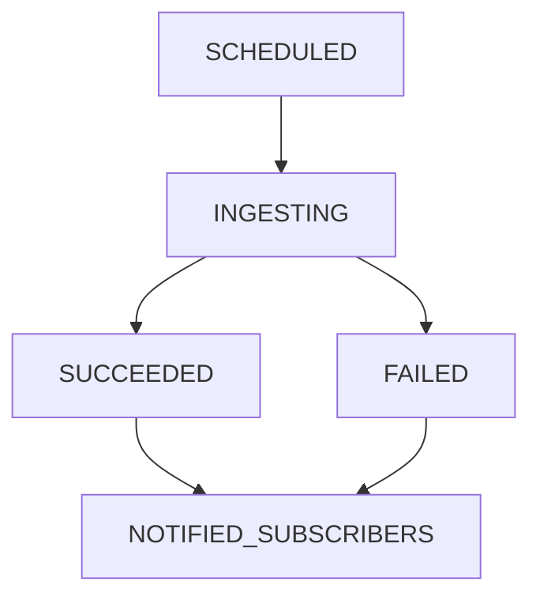

### 1. Entity Definitions

```
Job:
- jobName: String (name/identifier of the ingestion job)
- status: String (state of the job, e.g., SCHEDULED, INGESTING, SUCCEEDED, FAILED, NOTIFIED_SUBSCRIBERS)
- createdAt: DateTime (timestamp when the job was created)
- completedAt: DateTime (timestamp when the job finished processing)
- resultSummary: String (summary of ingestion results or failure reason)

Laureate:
- laureateId: Integer (unique identifier from the Nobel laureates dataset)
- firstname: String (first name of the laureate)
- surname: String (last name of the laureate)
- gender: String (gender of the laureate)
- born: Date (date of birth)
- died: Date (date of death, can be null)
- borncountry: String (country where laureate was born)
- borncountrycode: String (ISO country code of birth country)
- borncity: String (city where laureate was born)
- year: String (year laureate received the Nobel Prize)
- category: String (Nobel Prize category)
- motivation: String (motivation for the award)
- affiliationName: String (name of affiliated institution)
- affiliationCity: String (city of affiliated institution)
- affiliationCountry: String (country of affiliated institution)

Subscriber:
- contactType: String (type of contact, e.g., "email", "webhook")
- contactDetails: String (email address or webhook URL)
- active: Boolean (subscriber active status)
- subscribedAt: DateTime (timestamp when subscription was created)
```

---

### 2. Process Method Flows

```
processJob() Flow:
1. Initial State: Job created with status = SCHEDULED
2. Transition: Update job status to INGESTING
3. Ingestion: Fetch Nobel laureates data from OpenDataSoft API
4. Laureate Creation: For each laureate record, create a Laureate entity (immutable creation)
5. Validation: Optionally validate Laureate entities using checkLaureateCriteria events
6. Enrichment: Optionally enrich Laureate entities using processLaureateEnrichment event
7. Completion:
   - If ingestion and processing succeed, set Job status to SUCCEEDED, record completedAt and resultSummary
   - If failure occurs, set Job status to FAILED, record completedAt and failure reason in resultSummary
8. Notification: Transition job status to NOTIFIED_SUBSCRIBERS
   - Notify all active Subscribers with relevant job and laureate information
9. End of flow
```

```
processLaureate() Flow:
1. Triggered automatically when a Laureate entity is saved (if only one processor exists)
2. Validate Laureate fields (non-null, correct formats)
3. Enrich data (e.g., normalize country codes, calculate age if needed)
4. Persist enriched Laureate entity (immutable creation)
5. End of flow
```

```
processSubscriber() Flow:
1. Triggered when a new Subscriber entity is created
2. Validate contact details (email format, webhook URL format)
3. Persist subscriber as active
4. End of flow
```

---

### 3. API Endpoints Design

| Entity    | HTTP Method | Endpoint                      | Request Body                         | Response                     |
|-----------|-------------|-------------------------------|------------------------------------|------------------------------|
| Job       | POST        | `/jobs`                       | `{ "jobName": "string" }`          | `{ "technicalId": "string" }`|
| Job       | GET         | `/jobs/{technicalId}`         | N/A                                | Full Job entity with fields  |
| Laureate  | GET         | `/laureates/{technicalId}`    | N/A                                | Full Laureate entity          |
| Subscriber| POST        | `/subscribers`                | `{ "contactType": "string", "contactDetails": "string" }` | `{ "technicalId": "string" }`|
| Subscriber| GET         | `/subscribers/{technicalId}`  | N/A                                | Full Subscriber entity        |

- No update/delete endpoints for any entity (immutable creation only).
- Laureate entities are created internally by the processJob workflow, no POST endpoint exposed.
- Subscribers can be created via POST to register for notifications.
- GET endpoints only for retrieving stored entities by `technicalId`.

---

### 4. Request/Response Formats

**POST /jobs Request:**

```json
{
  "jobName": "NobelLaureatesIngestion_2024_06"
}
```

**POST /jobs Response:**

```json
{
  "technicalId": "job-1234567890"
}
```

**GET /jobs/{technicalId} Response:**

```json
{
  "jobName": "NobelLaureatesIngestion_2024_06",
  "status": "NOTIFIED_SUBSCRIBERS",
  "createdAt": "2024-06-01T10:00:00Z",
  "completedAt": "2024-06-01T10:05:00Z",
  "resultSummary": "Ingested 100 laureates successfully."
}
```

**POST /subscribers Request:**

```json
{
  "contactType": "email",
  "contactDetails": "subscriber@example.com"
}
```

**POST /subscribers Response:**

```json
{
  "technicalId": "subscriber-987654321"
}
```

**GET /subscribers/{technicalId} Response:**

```json
{
  "contactType": "email",
  "contactDetails": "subscriber@example.com",
  "active": true,
  "subscribedAt": "2024-06-01T09:00:00Z"
}
```

**GET /laureates/{technicalId} Response:**

```json
{
  "laureateId": 853,
  "firstname": "Akira",
  "surname": "Suzuki",
  "gender": "male",
  "born": "1930-09-12",
  "died": null,
  "borncountry": "Japan",
  "borncountrycode": "JP",
  "borncity": "Mukawa",
  "year": "2010",
  "category": "Chemistry",
  "motivation": "for palladium-catalyzed cross couplings in organic synthesis",
  "affiliationName": "Hokkaido University",
  "affiliationCity": "Sapporo",
  "affiliationCountry": "Japan"
}
```

---

### 5. Visual Representation


```mermaid
sequenceDiagram
  participant Client
  participant Backend
  participant CyodaPlatform
  participant OpenDataSoftAPI
  participant Subscribers

  Client->>Backend: POST /jobs { jobName }
  Backend->>CyodaPlatform: Save Job entity (status=SCHEDULED)
  CyodaPlatform->>CyodaPlatform: processJob()
  CyodaPlatform->>Backend: Update Job status to INGESTING
  CyodaPlatform->>OpenDataSoftAPI: Fetch Nobel laureates data
  OpenDataSoftAPI-->>CyodaPlatform: Nobel laureates JSON data
  CyodaPlatform->>CyodaPlatform: Create Laureate entities (immutable)
  CyodaPlatform->>CyodaPlatform: processLaureate() for each Laureate
  CyodaPlatform->>CyodaPlatform: Validate and enrich Laureate data
  CyodaPlatform->>CyodaPlatform: Update Job status to SUCCEEDED/FAILED
  CyodaPlatform->>CyodaPlatform: Update Job status to NOTIFIED_SUBSCRIBERS
  CyodaPlatform->>Subscribers: Notify all active Subscribers
  CyodaPlatform->>Backend: Job processing complete
  Backend->>Client: Return technicalId of Job
```


```mermaid
graph TD
  SCHEDULED --> INGESTING
  INGESTING --> SUCCEEDED
  INGESTING --> FAILED
  SUCCEEDED --> NOTIFIED_SUBSCRIBERS
  FAILED --> NOTIFIED_SUBSCRIBERS
```