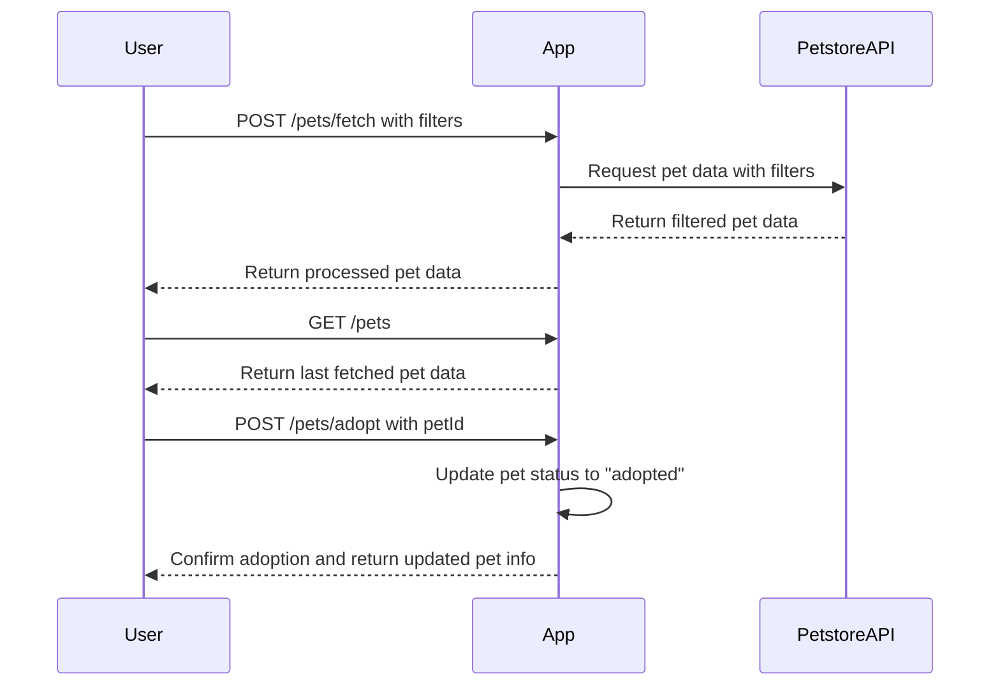
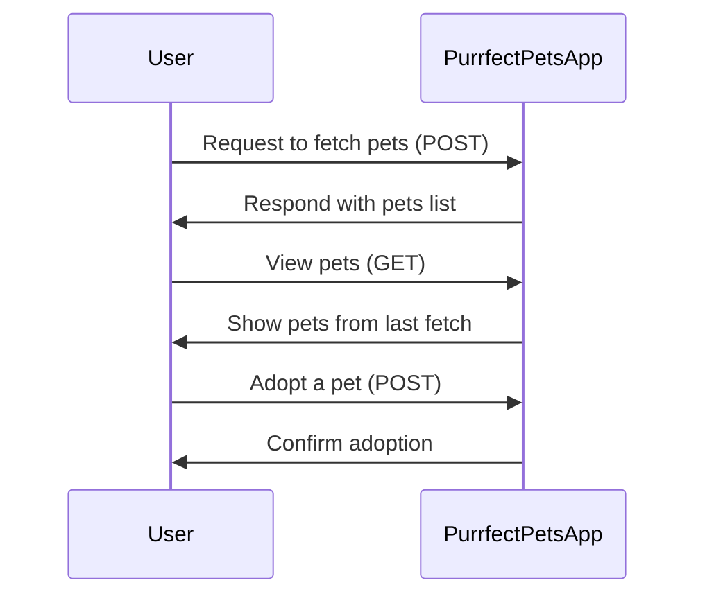

# Purrfect Pets API Functional Requirements

## API Endpoints

### 1. POST /pets/fetch  
**Description:** Fetch and process pet data from the external Petstore API.  
**Request:**  
```json
{
  "filter": {
    "type": "string",         // optional, e.g. "dog", "cat"
    "status": "string"        // optional, e.g. "available", "sold"
  }
}
```  
**Response:**  
```json
{
  "pets": [
    {
      "id": "integer",
      "name": "string",
      "type": "string",
      "status": "string",
      "description": "string"
    }
  ]
}
```

### 2. GET /pets  
**Description:** Retrieve the last fetched and processed pet data stored in the application.  
**Response:**  
```json
{
  "pets": [
    {
      "id": "integer",
      "name": "string",
      "type": "string",
      "status": "string",
      "description": "string"
    }
  ]
}
```

### 3. POST /pets/adopt  
**Description:** Adopt a pet by updating its status. Business logic updates the status to "adopted".  
**Request:**  
```json
{
  "petId": "integer"
}
```  
**Response:**  
```json
{
  "message": "Pet adopted successfully",
  "pet": {
    "id": "integer",
    "name": "string",
    "type": "string",
    "status": "string"
  }
}
```

---

## User-App Interaction Sequence Diagram


```mermaid
sequenceDiagram
    participant User
    participant App
    participant PetstoreAPI

    User->>App: POST /pets/fetch with filters
    App->>PetstoreAPI: Request pet data with filters
    PetstoreAPI-->>App: Return filtered pet data
    App-->>User: Return processed pet data

    User->>App: GET /pets
    App-->>User: Return last fetched pet data

    User->>App: POST /pets/adopt with petId
    App->>App: Update pet status to "adopted"
    App-->>User: Confirm adoption and return updated pet info
```

---

## Alternative User Journey Diagram


```mermaid
sequenceDiagram
    participant User
    participant PurrfectPetsApp

    User->>PurrfectPetsApp: Request to fetch pets (POST)
    PurrfectPetsApp->>User: Respond with pets list

    User->>PurrfectPetsApp: View pets (GET)
    PurrfectPetsApp->>User: Show pets from last fetch

    User->>PurrfectPetsApp: Adopt a pet (POST)
    PurrfectPetsApp->>User: Confirm adoption
```