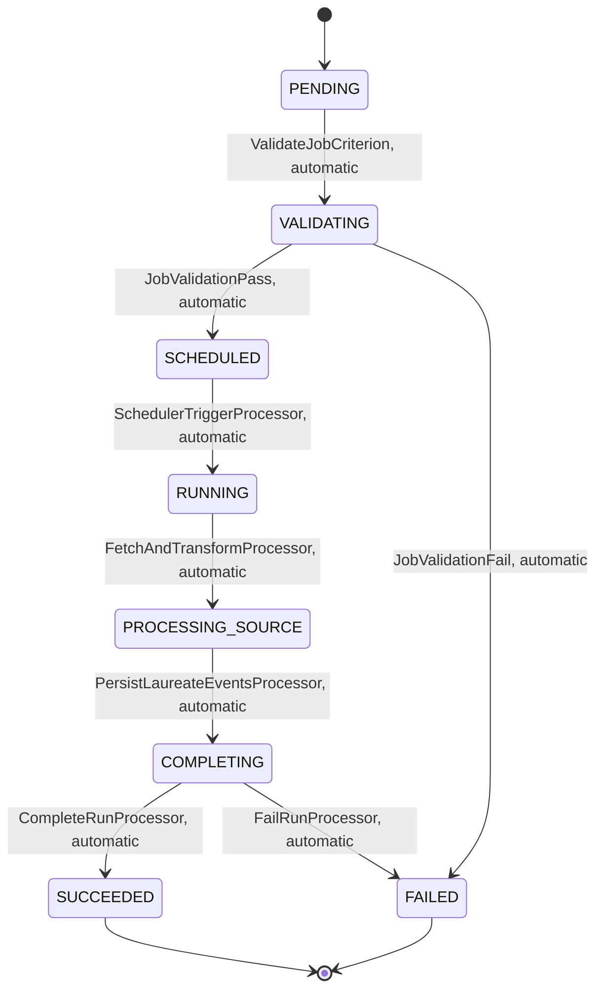
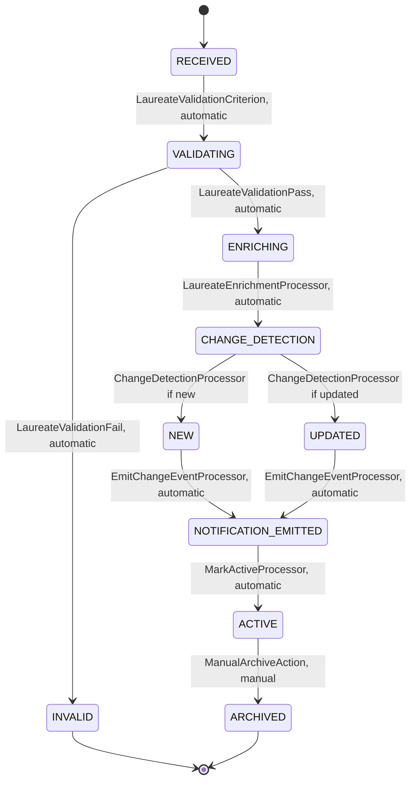
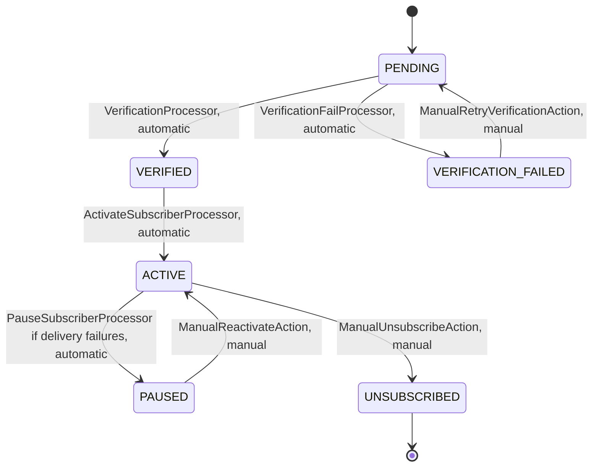
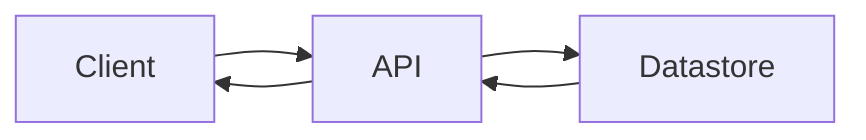

### 1. Entity Definitions
```
Job:
- id: String (business id)
- name: String (human friendly job name)
- sourceUrl: String (OpenDataSoft dataset endpoint)
- schedule: String (cron or human schedule description)
- lastRunAt: String (timestamp of last run)
- status: String (current job status)
- runHistory: Array (records of past runs with results)
- config: Object (ingestion/transform rules, rate limits)

Laureate:
- id: String (business id from source or generated)
- fullName: String (person name)
- year: String (award year)
- category: String (award category)
- country: String (affiliation country)
- affiliation: String (institution)
- citation: String (award citation)
- sourceUrl: String (original record url)
- currentVersion: Number (incremental version)
- lastUpdated: String (timestamp)
- changeType: String (new or updated)
- archived: Boolean (soft delete/archive marker)

Subscriber:
- id: String (business id)
- contact: String (email or webhook url or in-app id)
- filters: Object (year, category, country, newOnly, updatedOnly)
- channels: Array (email, webhook, in-app)
- status: String (pending, verified, active, paused, unsubscribed)
- retryPolicy: Object (attempts, interval)
- createdAt: String (timestamp)
- lastNotifiedAt: String (timestamp)
```

### 2. Entity workflows

Job workflow:
1. Initial State: Job created with PENDING status (manual POST)
2. Validation: Validate schedule and sourceUrl (automatic)
3. Scheduled: Job scheduled and waiting for trigger (automatic)
4. Execution: Job triggered -> fetch source -> normalize -> emit Laureate persist events (automatic)
5. Postprocessing: Update runHistory and status to SUCCEEDED or FAILED (automatic)
6. Notification: If failures or important metrics, emit admin notification (automatic)

Entity state diagram


```mermaid
stateDiagram-v2
    [*] --> PENDING
    PENDING --> VALIDATING : ValidateJobCriterion, automatic
    VALIDATING --> SCHEDULED : JobValidationPass, automatic
    VALIDATING --> FAILED : JobValidationFail, automatic
    SCHEDULED --> RUNNING : SchedulerTriggerProcessor, automatic
    RUNNING --> PROCESSING_SOURCE : FetchAndTransformProcessor, automatic
    PROCESSING_SOURCE --> COMPLETING : PersistLaureateEventsProcessor, automatic
    COMPLETING --> SUCCEEDED : CompleteRunProcessor, automatic
    COMPLETING --> FAILED : FailRunProcessor, automatic
    SUCCEEDED --> [*]
    FAILED --> [*]
```

Job required criteria and processors
- JobValidationCriterion (checks schedule, sourceUrl presence)
- SchedulerTriggerProcessor (schedules/starts run)
- FetchAndTransformProcessor (fetches OpenDataSoft, normalizes records)
- PersistLaureateEventsProcessor (persists Laureate entities — each persist triggers Laureate workflow)
- CompleteRunProcessor / FailRunProcessor (finalize run and update runHistory)

Laureate workflow:
1. Initial State: Laureate persisted by Job process with state RECEIVED (automatic event)
2. Validation: Validate required fields (automatic)
3. Enrichment: Add missing affiliation/country if resolvable (automatic)
4. Change Detection: Compare with existing record -> mark NEW or UPDATED (automatic)
5. Notification Event: Emit ChangeEvent for notifications (automatic)
6. Post State: ACTIVE or ARCHIVED (manual archive possible)

Entity state diagram


```mermaid
stateDiagram-v2
    [*] --> RECEIVED
    RECEIVED --> VALIDATING : LaureateValidationCriterion, automatic
    VALIDATING --> ENRICHING : LaureateValidationPass, automatic
    VALIDATING --> INVALID : LaureateValidationFail, automatic
    ENRICHING --> CHANGE_DETECTION : LaureateEnrichmentProcessor, automatic
    CHANGE_DETECTION --> NEW : ChangeDetectionProcessor if new
    CHANGE_DETECTION --> UPDATED : ChangeDetectionProcessor if updated
    NEW --> NOTIFICATION_EMITTED : EmitChangeEventProcessor, automatic
    UPDATED --> NOTIFICATION_EMITTED : EmitChangeEventProcessor, automatic
    NOTIFICATION_EMITTED --> ACTIVE : MarkActiveProcessor, automatic
    ACTIVE --> ARCHIVED : ManualArchiveAction, manual
    INVALID --> [*]
    ARCHIVED --> [*]
```

Laureate required criteria and processors
- LaureateValidationCriterion (required fields present)
- LaureateEnrichmentProcessor (normalize names, resolve affiliation)
- ChangeDetectionProcessor (compare to stored record, set changeType)
- EmitChangeEventProcessor (create a ChangeEvent that triggers Subscriber notifications)
- MarkActiveProcessor (update version and lastUpdated)

Subscriber workflow:
1. Initial State: Subscriber created via POST with status PENDING (manual)
2. Verification: Verify contact (email webhook handshake) (automatic or manual)
3. Active: Subscriber receives notifications (automatic)
4. Failure handling: If delivery fails repeatedly, move to PAUSED (automatic)
5. Unsubscribe: Manual unsubscribe (manual)
6. Reactivate: Manual re-verify/reactivate (manual)

Entity state diagram


```mermaid
stateDiagram-v2
    [*] --> PENDING
    PENDING --> VERIFIED : VerificationProcessor, automatic
    PENDING --> VERIFICATION_FAILED : VerificationFailProcessor, automatic
    VERIFIED --> ACTIVE : ActivateSubscriberProcessor, automatic
    ACTIVE --> PAUSED : PauseSubscriberProcessor if delivery failures, automatic
    ACTIVE --> UNSUBSCRIBED : ManualUnsubscribeAction, manual
    PAUSED --> ACTIVE : ManualReactivateAction, manual
    UNSUBSCRIBED --> [*]
    VERIFICATION_FAILED --> PENDING : ManualRetryVerificationAction, manual
```

Subscriber required criteria and processors
- VerificationProcessor (send handshake and mark verified)
- ActivateSubscriberProcessor (move to active)
- NotificationMatcherCriterion (matches ChangeEvent to subscriber filters)
- NotificationDeliverProcessor (deliver payload via channels)
- DeliveryRetryProcessor (apply retryPolicy; pause on repeated failures)

### 3. Pseudo code for processor classes

Example: FetchAndTransformProcessor
```
class FetchAndTransformProcessor {
  process(Job job) {
    records = fetch(job.sourceUrl)
    for each record in records {
      laureate = normalize(record)
      persistLaureate(laureate) // persistence triggers Laureate workflow event
    }
  }
}
```

Example: ChangeDetectionProcessor
```
class ChangeDetectionProcessor {
  process(Laureate incoming) {
    existing = findByBusinessId(incoming.id)
    if existing == null {
      incoming.changeType = new
      incoming.currentVersion = 1
      save(incoming)
    } else {
      if hasDifferences(existing, incoming) {
        incoming.changeType = updated
        incoming.currentVersion = existing.currentVersion + 1
        save(incoming)
      } else {
        // no-op update timestamp if needed
        updateTimestamp(existing)
      }
    }
  }
}
```

Example: NotificationDeliverProcessor
```
class NotificationDeliverProcessor {
  process(ChangeEvent event) {
    subscribers = findSubscribersMatching(event.payload)
    for each sub in subscribers {
      payload = buildPayload(event, sub.channels)
      result = deliver(payload, sub.contact, sub.channels)
      recordDelivery(sub, event, result)
      if result.failed and shouldRetry(sub) then scheduleRetry(sub, event)
    }
  }
}
```

### 4. API Endpoints Design Rules

Rules summary
- POST endpoints trigger events; POST returns only technicalId (opaque id).
- GET endpoints read stored results.
- POST exists for orchestration entity Job and for Subscriber (to allow users to subscribe).
- Laureates are created by Job process; they are readable via GET by technicalId.

Endpoints and JSON

1) Create Job (POST)
- URL: POST /jobs
- Request body:
{
  "name": "Nobel Ingest Daily",
  "sourceUrl": "https://public.opendatasoft.com/.../laureates",
  "schedule": "0 0 * * *",
  "config": { "maxRecords": 1000 }
}
- Response body:
{
  "technicalId": "job_abc123"
}

Mermaid request/response

```mermaid
flowchart LR
    Client --> API
    API --> Datastore
    Datastore --> API
    API --> Client
```

2) Get Job by technicalId (GET)
- URL: GET /jobs/{technicalId}
- Response body:
{
  "id": "job-1",
  "name": "Nobel Ingest Daily",
  "schedule": "0 0 * * *",
  "lastRunAt": "2025-08-18T10:00:00Z",
  "status": "SUCCEEDED",
  "runHistory": [ { "runAt":"...", "result":"..." } ]
}

Mermaid request/response

```mermaid
flowchart LR
    Client --> API
    API --> Datastore
    Datastore --> API
    API --> Client
```

3) Create Subscriber (POST)
- URL: POST /subscribers
- Request body:
{
  "contact": "https://webhook.example.com/notify",
  "filters": { "category":"physics", "year":"2024", "newOnly": true },
  "channels": ["webhook"],
  "retryPolicy": { "attempts":3, "intervalSeconds":60 }
}
- Response body:
{
  "technicalId": "sub_xyz789"
}

Mermaid request/response

```mermaid
flowchart LR
    Client --> API
    API --> Datastore
    Datastore --> API
    API --> Client
```

4) Get Subscriber by technicalId (GET)
- URL: GET /subscribers/{technicalId}
- Response body:
{
  "id":"sub-1",
  "contact":"https://webhook.example.com/notify",
  "filters": { "category":"physics" },
  "status":"active",
  "lastNotifiedAt":"2025-08-18T10:05:00Z"
}

5) Get Laureate by technicalId (GET)
- URL: GET /laureates/{technicalId}
- Response body:
{
  "id":"laureate-2024-1",
  "fullName":"Jane Doe",
  "year":"2024",
  "category":"physics",
  "affiliation":"University X",
  "currentVersion":2,
  "lastUpdated":"2025-08-18T10:00:00Z"
}

Notes and constraints
- POST endpoints return only technicalId and trigger Cyoda to start the process method for that entity.
- Laureate entities are created/updated by Job process (no public POST).
- All GET endpoints return stored results and may be paginated if requested later.
- Failure handling: delivery retries use Subscriber.retryPolicy; on repeated failures subscriber transitions to PAUSED automatically.

If you want, I can now:
- add more entities (up to 10),
- expand criteria and processor pseudo code into more detailed steps,
- or produce sample ChangeEvent entity and its workflow for orchestration of notifications. Which would you prefer?