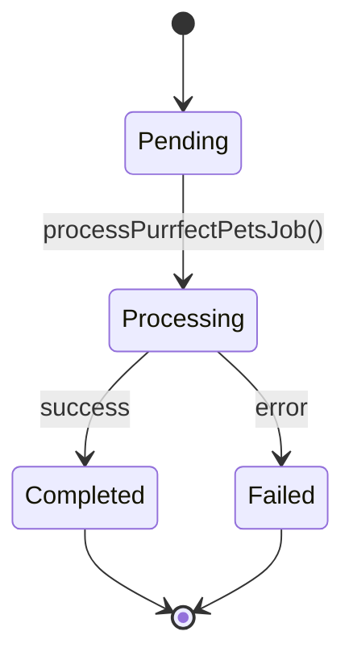
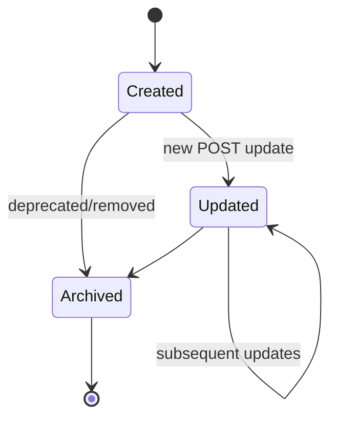
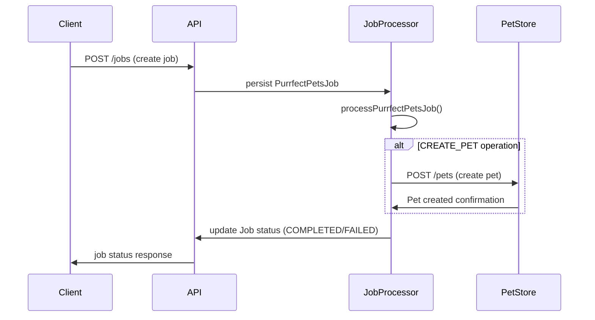

### 1. Entity Definitions

``` 
PurrfectPetsJob:  
- jobId: String (unique identifier for the orchestration job)  
- operationType: String (type of operation: CREATE_PET, UPDATE_PET_STATE, etc.)  
- petId: String (reference to the Pet entity involved)  
- requestedAt: DateTime (timestamp of job creation)  
- status: StatusEnum (PENDING, PROCESSING, COMPLETED, FAILED)  

Pet:  
- petId: String (unique identifier for the pet)  
- name: String (pet's name)  
- type: String (pet species, e.g., Cat, Dog, Bird)  
- age: Integer (pet's age in years)  
- adoptionStatus: String (AVAILABLE, ADOPTED, PENDING)  
- status: StatusEnum (CREATED, UPDATED, ARCHIVED)  
```

### 2. Process Method Flows

``` 
processPurrfectPetsJob() Flow:  
1. Initial State: Job created with PENDING status  
2. Validation: Verify operationType and petId correctness  
3. Dispatch: Route job to appropriate business logic (e.g., create pet or update pet status)  
4. Execution: Perform requested operation on Pet entity  
5. Completion: Update job status to COMPLETED or FAILED based on outcome  
6. Notification: Log job result and optionally notify external systems  

processPet() Flow:  
1. Initial State: Pet entity saved with CREATED or UPDATED status  
2. Validation: Check mandatory fields (name, type, adoptionStatus)  
3. Business Rules: Validate adoptionStatus transitions (e.g., AVAILABLE → ADOPTED only)  
4. Persistence: Confirm pet data consistency and save state  
5. Completion: Update status to reflect current lifecycle state  
```

### 3. API Endpoints Design

| Method | Endpoint            | Description                                      | Request Body                       | Response Body                 |
|--------|---------------------|------------------------------------------------|----------------------------------|------------------------------|
| POST   | /jobs               | Create a new orchestration job                  | `{ jobId, operationType, petId }`| `{ jobId, status, requestedAt }` |
| POST   | /pets               | Create or update a pet (immutable state creation) | `{ petId, name, type, age, adoptionStatus }` | `{ petId, status }`             |
| GET    | /pets/{petId}       | Retrieve pet information                         | N/A                              | `{ petId, name, type, age, adoptionStatus, status }` |
| GET    | /jobs/{jobId}       | Retrieve job status and details                  | N/A                              | `{ jobId, operationType, petId, status, requestedAt }` |

### 4. Request/Response Formats (JSON)

**POST /jobs**  
Request:  
```json
{
  "jobId": "job-12345",
  "operationType": "CREATE_PET",
  "petId": "pet-67890"
}
```
Response:  
```json
{
  "jobId": "job-12345",
  "status": "PENDING",
  "requestedAt": "2024-06-01T12:00:00Z"
}
```

**POST /pets**  
Request:  
```json
{
  "petId": "pet-67890",
  "name": "Whiskers",
  "type": "Cat",
  "age": 3,
  "adoptionStatus": "AVAILABLE"
}
```
Response:  
```json
{
  "petId": "pet-67890",
  "status": "CREATED"
}
```

**GET /pets/{petId}**  
Response:  
```json
{
  "petId": "pet-67890",
  "name": "Whiskers",
  "type": "Cat",
  "age": 3,
  "adoptionStatus": "AVAILABLE",
  "status": "CREATED"
}
```

**GET /jobs/{jobId}**  
Response:  
```json
{
  "jobId": "job-12345",
  "operationType": "CREATE_PET",
  "petId": "pet-67890",
  "status": "COMPLETED",
  "requestedAt": "2024-06-01T12:00:00Z"
}
```

### 5. Mermaid Diagrams

**Entity Lifecycle State Diagram (for Job):**


```mermaid
stateDiagram-v2
    [*] --> Pending
    Pending --> Processing : processPurrfectPetsJob()
    Processing --> Completed : success
    Processing --> Failed : error
    Completed --> [*]
    Failed --> [*]
```

**Entity Lifecycle State Diagram (for Pet):**


```mermaid
stateDiagram-v2
    [*] --> Created
    Created --> Updated : new POST update
    Created --> Archived : deprecated/removed
    Updated --> Archived
    Updated --> Updated : subsequent updates
    Archived --> [*]
```

**Event-Driven Processing Chain:**


```mermaid
sequenceDiagram
    participant Client
    participant API
    participant JobProcessor
    participant PetStore

    Client->>API: POST /jobs (create job)
    API->>JobProcessor: persist PurrfectPetsJob
    JobProcessor->>JobProcessor: processPurrfectPetsJob()
    alt CREATE_PET operation
        JobProcessor->>PetStore: POST /pets (create pet)
        PetStore->>JobProcessor: Pet created confirmation
    end
    JobProcessor->>API: update Job status (COMPLETED/FAILED)
    API->>Client: job status response
```

---

If you need any further refinements or additions, please feel free to ask!