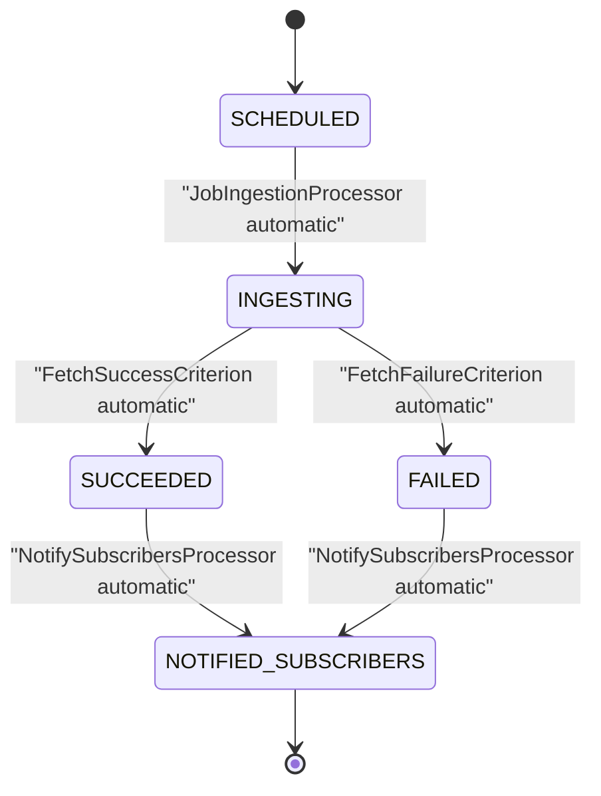
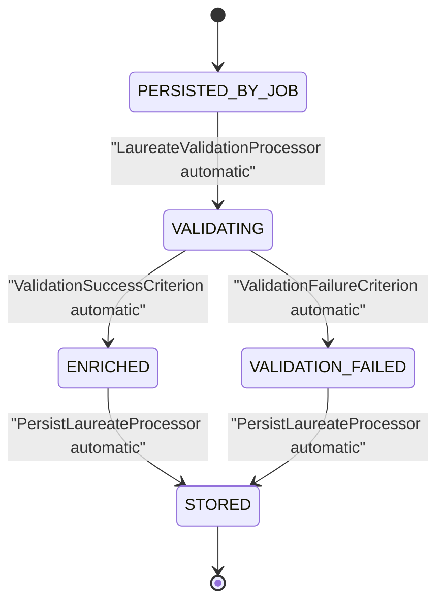
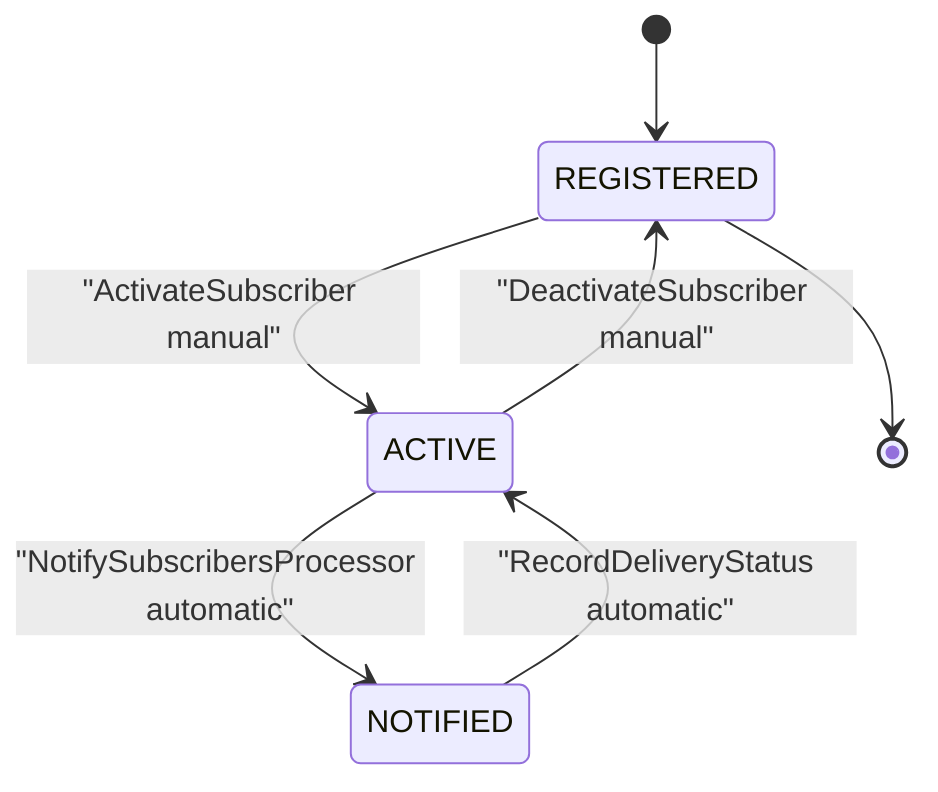

### 1. Entity Definitions
```
Job:
- jobId: String (business id / external identifier)
- scheduledAt: String (ISO datetime, when ingestion is scheduled)
- startedAt: String (ISO datetime, when ingestion started)
- finishedAt: String (ISO datetime, when ingestion finished)
- state: String (current lifecycle state)
- sourceEndpoint: String (API endpoint URL)
- recordsFetchedCount: Integer (number of laureate records processed)
- errorDetails: String (error message or stack trace if any)
- metadata: Object (optional extra info)

Laureate:
- id: Integer (laureate business id from source)
- firstname: String (given name)
- surname: String (family name)
- gender: String (gender)
- born: String (ISO date)
- died: String (ISO date or null)
- borncountry: String (country name)
- borncountrycode: String (country code)
- borncity: String (city)
- year: String (award year)
- category: String (award category)
- motivation: String (award motivation)
- affiliationName: String (affiliation name)
- affiliationCity: String (affiliation city)
- affiliationCountry: String (affiliation country)
- derived_age_at_award: Integer (derived)
- normalized_country_code: String (derived)
- ingestJobId: String (jobId that created/updated this record)

Subscriber:
- subscriberId: String (business id)
- contactType: String (email|webhook|other)
- contactDetails: Object (email address or webhook URL)
- active: Boolean (whether to receive notifications)
- filters: Object (optional: categories, years)
- preferredPayload: String (full|summary)
- lastNotifiedAt: String (ISO datetime)
```

Notes: you specified 3 entities; I used only those and added no extras.

### 2. Entity workflows

Job workflow:
1. Initial State: SCHEDULED (created via POST)
2. Automatic: INGESTING (persistence triggers JobIngestionProcessor)
3. Automatic: SUCCEEDED or FAILED (based on FetchSuccessCriterion)
4. Automatic: NOTIFIED_SUBSCRIBERS (NotifySubscribersProcessor)
5. Terminal: completed (audit stored)

Mermaid Job state diagram

```mermaid
stateDiagram-v2
    [*] --> SCHEDULED
    SCHEDULED --> INGESTING : "JobIngestionProcessor automatic"
    INGESTING --> SUCCEEDED : "FetchSuccessCriterion automatic"
    INGESTING --> FAILED : "FetchFailureCriterion automatic"
    SUCCEEDED --> NOTIFIED_SUBSCRIBERS : "NotifySubscribersProcessor automatic"
    FAILED --> NOTIFIED_SUBSCRIBERS : "NotifySubscribersProcessor automatic"
    NOTIFIED_SUBSCRIBERS --> [*]
```

Job processors & criteria
- Processors: JobIngestionProcessor, LaureateValidationProcessor, LaureateEnrichmentProcessor, PersistLaureateProcessor, NotifySubscribersProcessor
- Criteria: FetchSuccessCriterion, FetchFailureCriterion
- Notes: persistence of Job triggers JobIngestionProcessor in Cyoda; processors call subsequent processors automatically when criteria satisfied.

Laureate workflow:
1. Initial State: PERSISTED_BY_JOB (created by PersistLaureateProcessor)
2. Automatic: VALIDATING (LaureateValidationProcessor)
3. Automatic: ENRICHED (LaureateEnrichmentProcessor) or VALIDATION_FAILED
4. Automatic: STORED (final persisted state) or INVALID (flagged)
5. Terminal: STORED

Mermaid Laureate state diagram

```mermaid
stateDiagram-v2
    [*] --> PERSISTED_BY_JOB
    PERSISTED_BY_JOB --> VALIDATING : "LaureateValidationProcessor automatic"
    VALIDATING --> ENRICHED : "ValidationSuccessCriterion automatic"
    VALIDATING --> VALIDATION_FAILED : "ValidationFailureCriterion automatic"
    ENRICHED --> STORED : "PersistLaureateProcessor automatic"
    VALIDATION_FAILED --> STORED : "PersistLaureateProcessor automatic"
    STORED --> [*]
```

Laureate processors & criteria
- Processors: LaureateValidationProcessor, LaureateEnrichmentProcessor, PersistLaureateProcessor
- Criteria: ValidationSuccessCriterion, ValidationFailureCriterion
- Typical logic: validate required fields → enrich (derive age, normalize codes) → persist/merge.

Subscriber workflow:
1. Initial State: REGISTERED (created via POST)
2. Manual: ACTIVATION / DEACTIVATION (admin toggles active)
3. Automatic: NOTIFIED (when Job notifies subscribers)
4. Terminal: REGISTERED (continues to exist)

Mermaid Subscriber state diagram

```mermaid
stateDiagram-v2
    [*] --> REGISTERED
    REGISTERED --> ACTIVE : "ActivateSubscriber manual"
    ACTIVE --> REGISTERED : "DeactivateSubscriber manual"
    ACTIVE --> NOTIFIED : "NotifySubscribersProcessor automatic"
    NOTIFIED --> ACTIVE : "RecordDeliveryStatus automatic"
    REGISTERED --> [*]
```

Subscriber processors & criteria
- Processors: DeliveryBuilderProcessor, DeliverToSubscriberProcessor, RecordDeliveryStatusProcessor
- Criteria: SubscriberActiveCriterion

Important Cyoda behavior: when Subscriber persists or is changed, Cyoda may start subscriber-specific workflows (e.g., activation). Subscriber does not orchestrate ingestion flows.

### 3. Pseudo code for processor classes (concise)

JobIngestionProcessor
```
process(job):
  job.startedAt = now
  emit log "start"
  response = fetch(job.sourceEndpoint)
  if response.success:
    job.recordsFetchedCount = response.items.size
    for record in response.items:
      laureate = mapRecordToLaureate(record, job.jobId)
      persist(laureate)  // triggers Laureate workflow in Cyoda
    set job.state = SUCCEEDED
  else:
    job.errorDetails = response.error
    set job.state = FAILED
  job.finishedAt = now
  persist(job)
```

LaureateValidationProcessor
```
process(laureate):
  required = [id, firstname, surname, year, category]
  if any missing or malformed:
    laureate.validation = FAILED
  else:
    laureate.validation = PASSED
  persist(laureate)
```

LaureateEnrichmentProcessor
```
process(laureate):
  if born and year:
    laureate.derived_age_at_award = computeAge(laureate.born, laureate.year)
  laureate.normalized_country_code = normalizeCountry(laureate.borncountrycode)
  persist(laureate)
```

NotifySubscribersProcessor
```
process(job):
  payload = buildPayload(job, includeLaureates=true)
  subscribers = queryActiveSubscribers(job.filters)
  for sub in subscribers:
    delivery = deliver(sub, payload)
    recordDeliveryStatus(job.jobId, sub.subscriberId, delivery)
  job.state = NOTIFIED_SUBSCRIBERS
  persist(job)
```

DeliverToSubscriberProcessor (abstract)
```
deliver(subscriber, payload):
  if subscriber.contactType == webhook:
    result = post(subscriber.contactDetails.url, payload)
  else if email:
    result = sendEmail(subscriber.contactDetails.email, payload)
  return result
```

Notes: processors are triggered automatically by Cyoda when entity persisted; small criteria functions determine transitions.

### 4. API Endpoints Design Rules

General rules applied:
- POST endpoints that create orchestration or registration entities return only technicalId in response.
- GET endpoints retrieve stored results.
- Job and Subscriber have POST + GET by technicalId.
- Laureate is created by Job processing; GET endpoints for retrieving laureates are provided (read-only).

Endpoints (concise):

1) Create Job
- POST /jobs
Request:
```json
{
  "jobId": "job-20250827-001",
  "scheduledAt": "2025-08-27T09:00:00Z",
  "sourceEndpoint": "https://public.opendatasoft.com/api/explore/v2.1/catalog/datasets/nobel-prize-laureates/records?limit=100"
}
```
Response:
```json
{
  "technicalId": "tch-0001"
}
```

2) Get Job by technicalId
- GET /jobs/{technicalId}
Response:
```json
{
  "technicalId": "tch-0001",
  "jobId": "job-20250827-001",
  "scheduledAt": "...",
  "startedAt": "...",
  "finishedAt": "...",
  "state": "NOTIFIED_SUBSCRIBERS",
  "recordsFetchedCount": 12,
  "errorDetails": null
}
```

3) Register Subscriber
- POST /subscribers
Request:
```json
{
  "subscriberId": "sub-abc",
  "contactType": "webhook",
  "contactDetails": {"url":"https://example.com/webhook"},
  "active": true,
  "filters": {"categories":["Chemistry"]}
}
```
Response:
```json
{
  "technicalId": "tch-0002"
}
```

4) Get Subscriber by technicalId
- GET /subscribers/{technicalId}
Response:
```json
{
  "technicalId":"tch-0002",
  "subscriberId":"sub-abc",
  "contactType":"webhook",
  "contactDetails":{"url":"https://example.com/webhook"},
  "active":true
}
```

5) Get Laureate by id (read-only)
- GET /laureates/{id}
Response:
```json
{
  "id":853,
  "firstname":"Akira",
  "surname":"Suzuki",
  "year":"2010",
  "category":"Chemistry",
  "derived_age_at_award":80,
  "normalized_country_code":"JP",
  "ingestJobId":"job-20250827-001"
}
```

6) Optional: GET /laureates (all) — optional for bulk read.

Behavioral notes
- Creating Job (POST /jobs) triggers an event in Cyoda; Cyoda runs the Job workflow automatically.
- Creating Subscriber (POST /subscribers) registers recipient; changes trigger subscriber workflow for activation.
- Laureates are persisted by the system (no POST) and their persistence triggers Laureate workflows in Cyoda.
- Notifications are attempted asynchronously; per-subscriber delivery status recorded on job.

Acceptance criteria (brief)
- POSTing a Job returns technicalId and triggers Cyoda workflow.
- Job moves through states: SCHEDULED → INGESTING → SUCCEEDED/FAILED → NOTIFIED_SUBSCRIBERS.
- Laureates produced are validated, enriched, persisted and retrievable via GET.
- Active subscribers receive job notifications and delivery records are stored.
- Errors per transition are logged in job.errorDetails.

If you want I can now:
- tighten validation rules (which fields mandatory/format),
- define notification payload shape,
- or produce a sample event sequence (Job creation -> sample events).