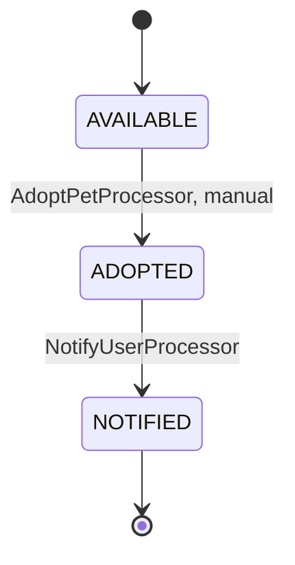
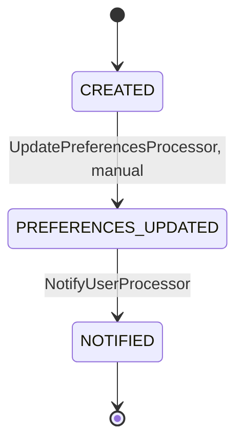
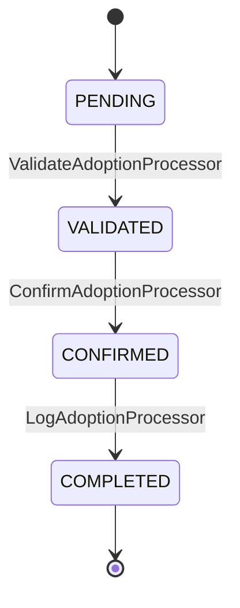

# Functional Requirements for 'Purrfect Pets' API App

Based on the requirement to build a 'Purrfect Pets' API app using the Petstore API data, here are the finalized functional requirements utilizing an Event-Driven Architecture (EDA) approach.

### 1. Entity Definitions
```
Pet:
- id: String (unique identifier for the pet)
- name: String (name of the pet)
- species: String (type of pet, e.g., cat, dog)
- age: Integer (age of the pet)
- status: String (adoption status: available, adopted)

User:
- id: String (unique identifier for the user)
- username: String (name of the user)
- email: String (email address of the user)
- preferences: String (user preferences for pet adoption)

Adoption:
- id: String (unique identifier for the adoption event)
- petId: String (ID of the pet being adopted)
- userId: String (ID of the user adopting the pet)
- adoptionDate: Date (date when the pet was adopted)
```

### 2. Entity Workflows

**Pet workflow:**
1. Initial State: Pet created with AVAILABLE status.
2. Validation: Check pet details and availability.
3. Adoption Process: Change status to ADOPTED when a user adopts a pet.
4. Notification: Notify the user about the successful adoption.
5. Completion: Update pet status and log the adoption.


```mermaid
stateDiagram-v2
    [*] --> AVAILABLE
    AVAILABLE --> ADOPTED : AdoptPetProcessor, manual
    ADOPTED --> NOTIFIED : NotifyUserProcessor
    NOTIFIED --> [*]
```

**User workflow:**
1. Initial State: User created.
2. Preferences Update: User updates preferences for pet adoption.
3. Notification: Notify user about available pets matching preferences.


```mermaid
stateDiagram-v2
    [*] --> CREATED
    CREATED --> PREFERENCES_UPDATED : UpdatePreferencesProcessor, manual
    PREFERENCES_UPDATED --> NOTIFIED : NotifyUserProcessor
    NOTIFIED --> [*]
```

**Adoption workflow:**
1. Initial State: Adoption event created.
2. Validation: Check pet and user details for the adoption.
3. Confirmation: Confirm the adoption and update pet status.
4. Completion: Log the adoption details.


```mermaid
stateDiagram-v2
    [*] --> PENDING
    PENDING --> VALIDATED : ValidateAdoptionProcessor
    VALIDATED --> CONFIRMED : ConfirmAdoptionProcessor
    CONFIRMED --> COMPLETED : LogAdoptionProcessor
    COMPLETED --> [*]
```

### 3. Pseudo Code for Each Processor Class

1. **AdoptPetProcessor**
   ```java
   public class AdoptPetProcessor {
       public void process(Pet pet, User user) {
           // Check pet availability
           if (pet.getStatus().equals("AVAILABLE")) {
               pet.setStatus("ADOPTED");
               // Notify user
           }
       }
   }
   ```

2. **NotifyUserProcessor**
   ```java
   public class NotifyUserProcessor {
       public void process(User user) {
           // Send notification to user about adoption
       }
   }
   ```

3. **ValidateAdoptionProcessor**
   ```java
   public class ValidateAdoptionProcessor {
       public void process(Adoption adoption) {
           // Validate pet and user details
       }
   }
   ```

4. **ConfirmAdoptionProcessor**
   ```java
   public class ConfirmAdoptionProcessor {
       public void process(Adoption adoption) {
           // Confirm the adoption and update records
       }
   }
   ```

5. **LogAdoptionProcessor**
   ```java
   public class LogAdoptionProcessor {
       public void process(Adoption adoption) {
           // Log the adoption event to the database
       }
   }
   ```

### 4. API Endpoints Design Rules
- **POST /pets**: Adds a new pet and returns its `technicalId`.
- **GET /pets/{technicalId}**: Retrieves pet details by `technicalId`.
- **POST /users**: Adds a new user and returns its `technicalId`.
- **GET /users/{technicalId}**: Retrieves user details by `technicalId`.
- **POST /adoptions**: Creates a new adoption and returns its `technicalId`.
- **GET /adoptions/{technicalId}**: Retrieves adoption details by `technicalId`.

This document represents the finalized version of the functional requirements for the 'Purrfect Pets' API app, suitable for direct use in documentation or implementation.