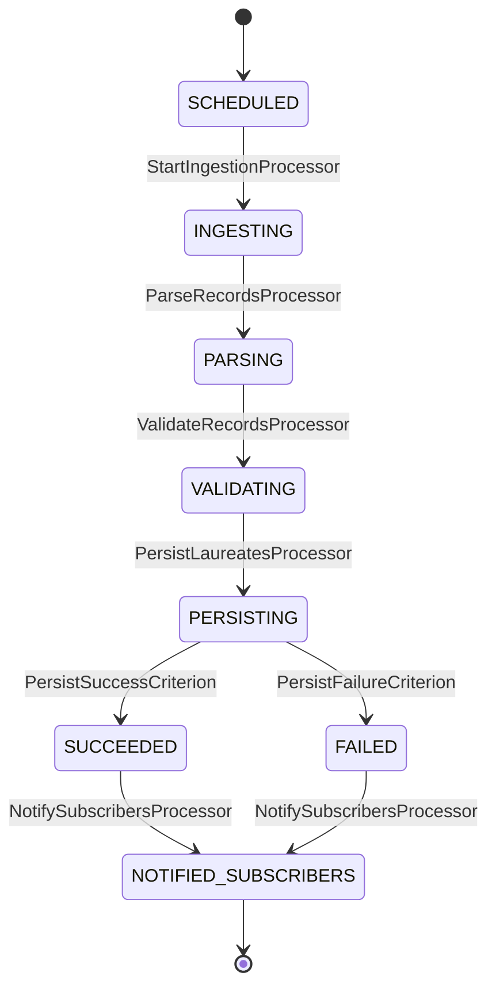
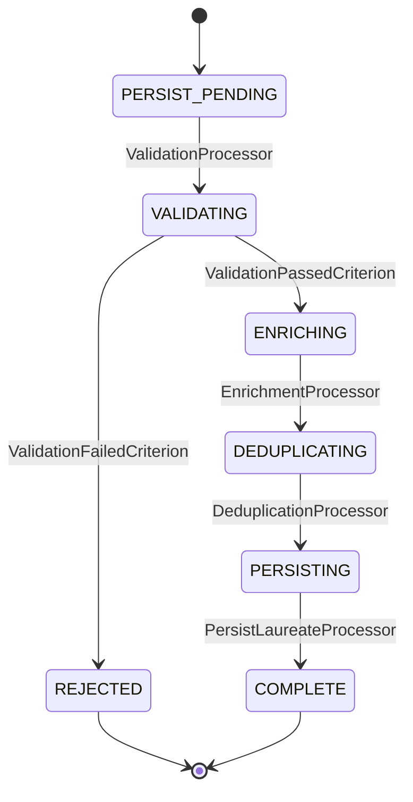
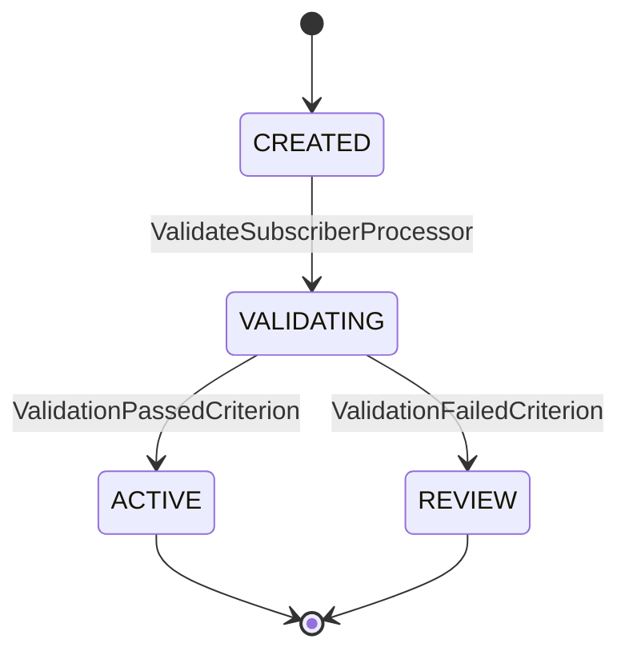

### 1. Entity Definitions
```
Job:
- id: String (business id from client)
- schedule: String (cron or interval expression)
- apiEndpoint: String (Nobel laureates API URL)
- state: String (SCHEDULED, INGESTING, SUCCEEDED, FAILED, NOTIFIED_SUBSCRIBERS)
- startedAt: String (timestamp)
- finishedAt: String (timestamp)
- attempts: Integer (retry attempts)
- lastError: String (last error message)
- createdAt: String (timestamp)

Laureate:
- id: Integer (source laureate id)
- firstname: String (personal info)
- surname: String (personal info)
- gender: String (personal info)
- born: String (date of birth)
- died: String (date of death or null)
- borncountry: String (origin)
- borncountrycode: String (origin standardized code)
- borncity: String (origin)
- year: String (award year)
- category: String (award category)
- motivation: String (award motivation)
- affiliation_name: String (affiliation)
- affiliation_city: String (affiliation)
- affiliation_country: String (affiliation)
- age: Integer (derived)
- normalizedCountryCode: String (derived)
- sourceJobId: String (Job.id that imported this record)
- createdAt: String (timestamp)

Subscriber:
- id: String (subscriber id)
- type: String (email | webhook | other)
- contact: String (email address or webhook URL)
- active: Boolean (is active)
- filters: String (optional JSON string describing categories/years interest)
- lastNotifiedAt: String (timestamp)
- createdAt: String (timestamp)
```

### 2. Entity workflows

Job workflow:
1. Initial State: Job persisted in Cyoda (SCHEDULED). Automatic start triggers ingestion process.
2. Fetching: INGESTING — Fetch data from apiEndpoint.
3. Parsing: Parse response into Laureate candidate records.
4. Validation/Enrichment: Run Laureate validation and enrichment processors.
5. Persistence: Persist valid Laureate entities (new/updated).
6. Finalize: If ingestion/persistence succeeded -> SUCCEEDED else -> FAILED
7. Notification: After SUCCEEDED or FAILED -> NOTIFIED_SUBSCRIBERS (send summarised notification to active subscribers)
8. Terminal: Job remains in NOTIFIED_SUBSCRIBERS


```mermaid
stateDiagram-v2
    [*] --> SCHEDULED
    SCHEDULED --> INGESTING : StartIngestionProcessor
    INGESTING --> PARSING : ParseRecordsProcessor
    PARSING --> VALIDATING : ValidateRecordsProcessor
    VALIDATING --> PERSISTING : PersistLaureatesProcessor
    PERSISTING --> SUCCEEDED : PersistSuccessCriterion
    PERSISTING --> FAILED : PersistFailureCriterion
    SUCCEEDED --> NOTIFIED_SUBSCRIBERS : NotifySubscribersProcessor
    FAILED --> NOTIFIED_SUBSCRIBERS : NotifySubscribersProcessor
    NOTIFIED_SUBSCRIBERS --> [*]
```

Job processors and criteria
- Processors (4):
  - StartIngestionProcessor (fetch data)
  - ParseRecordsProcessor (map to Laureate candidates)
  - PersistLaureatesProcessor (invoke Laureate workflow per record)
  - NotifySubscribersProcessor (build and send notification summary)
- Criteria (2):
  - PersistSuccessCriterion (no fatal errors, persisted >0 or valid outcome)
  - PersistFailureCriterion (fatal fetch/parse/persist errors)

Laureate workflow:
1. Initial State: Laureate candidate arrives via Job process (PERSIST_PENDING).
2. Validation: Run ValidationProcessor (required fields, date formats).
3. Enrichment: Run EnrichmentProcessor (calculate age, normalize country codes).
4. Deduplication: DeduplicationCriterion: decide NEW vs UPDATED vs DUPLICATE.
5. Persistence: Persist to store and mark createdAt; mark outcome.
6. Terminal: COMPLETE (persisted) or REJECTED (invalid)


```mermaid
stateDiagram-v2
    [*] --> PERSIST_PENDING
    PERSIST_PENDING --> VALIDATING : ValidationProcessor
    VALIDATING --> REJECTED : ValidationFailedCriterion
    VALIDATING --> ENRICHING : ValidationPassedCriterion
    ENRICHING --> DEDUPLICATING : EnrichmentProcessor
    DEDUPLICATING --> PERSISTING : DeduplicationProcessor
    PERSISTING --> COMPLETE : PersistLaureateProcessor
    REJECTED --> [*]
    COMPLETE --> [*]
```

Laureate processors and criteria
- Processors (3):
  - ValidationProcessor (ensure id, firstname/surname, year present and formats)
  - EnrichmentProcessor (calculate age, standardize borncountrycode)
  - PersistLaureateProcessor (save or update record, set sourceJobId)
- Criteria (2):
  - ValidationPassedCriterion
  - ValidationFailedCriterion
- Pseudo-sequence: ValidationProcessor -> if passed -> EnrichmentProcessor -> Deduplication -> PersistLaureateProcessor

Subscriber workflow (minimal; subscribers do not orchestrate ingestion):
1. Initial State: Subscriber persisted (CREATED).
2. Validation: Basic contact validation (automatic).
3. Active: Mark active if validated; otherwise flag for manual review.


```mermaid
stateDiagram-v2
    [*] --> CREATED
    CREATED --> VALIDATING : ValidateSubscriberProcessor
    VALIDATING --> ACTIVE : ValidationPassedCriterion
    VALIDATING --> REVIEW : ValidationFailedCriterion
    ACTIVE --> [*]
    REVIEW --> [*]
```

Subscriber processors and criteria
- Processors (1):
  - ValidateSubscriberProcessor (check email/webhook format)
- Criteria (2):
  - ValidationPassedCriterion
  - ValidationFailedCriterion

### 3. Pseudo code for processor classes
ValidationProcessor
```
function process(laureate):
  if laureate.id is null or laureate.firstname is null or laureate.year is null:
    laureate.validationErrors = [...]
    mark as invalid
  else
    mark as valid
```

EnrichmentProcessor
```
function process(laureate):
  laureate.age = if laureate.born then yearsBetween(laureate.born, laureate.died or today)
  laureate.normalizedCountryCode = normalizeCountry(laureate.borncountrycode or borncountry)
```

PersistLaureateProcessor
```
function process(laureate, job):
  if deduplicate(laureate) == NEW:
    save new record with sourceJobId = job.id
  else if UPDATED:
    update existing record with merged fields
  return outcome
```

NotifySubscribersProcessor
```
function process(job, resultsSummary):
  activeSubs = findActiveSubscribers(job.filters)
  for sub in activeSubs:
    payload = buildSummary(job, resultsSummary, errors)
    sendNotification(sub.contact, payload)
  mark job.notifiedAt = now
```

### 4. API Endpoints Design Rules

- POST endpoints (create orchestration / admin entities). Response MUST contain only technicalId.
- GET endpoints only for retrieving stored results (full entity and technicalId).
- GET by technicalId present for Job and Subscriber (created via POST). Laureate GET by technicalId provided for retrieval though created by Job process.

Examples:

POST create Job
```json
POST /api/jobs
{
  "id": "job-01",
  "schedule": "0 0 * * *",
  "apiEndpoint": "https://public.opendatasoft.com/api/explore/v2.1/catalog/datasets/nobel-prize-laureates/records"
}
```
Response
```json
{
  "technicalId": "tx-job-0001"
}
```

GET Job by technicalId
```json
GET /api/jobs/tx-job-0001
```
Response
```json
{
  "technicalId": "tx-job-0001",
  "id": "job-01",
  "schedule": "0 0 * * *",
  "apiEndpoint": "...",
  "state": "NOTIFIED_SUBSCRIBERS",
  "startedAt": "2025-08-26T10:00:00Z",
  "finishedAt": "2025-08-26T10:00:10Z",
  "attempts": 1,
  "lastError": null
}
```

POST create Subscriber
```json
POST /api/subscribers
{
  "id": "sub-01",
  "type": "email",
  "contact": "ops@example.com",
  "filters": "{\"category\":\"Chemistry\"}"
}
```
Response
```json
{
  "technicalId": "tx-sub-0001"
}
```

GET Laureate by technicalId
```json
GET /api/laureates/tx-laur-0853
```
Response example (full persisted laureate)
```json
{
  "technicalId": "tx-laur-0853",
  "id": 853,
  "firstname": "Akira",
  "surname": "Suzuki",
  "born": "1930-09-12",
  "died": null,
  "borncountry": "Japan",
  "borncountrycode": "JP",
  "borncity": "Mukawa",
  "gender": "male",
  "year": "2010",
  "category": "Chemistry",
  "motivation": "for palladium-catalyzed cross couplings in organic synthesis",
  "affiliation_name": "Hokkaido University",
  "affiliation_city": "Sapporo",
  "affiliation_country": "Japan",
  "age": 80,
  "sourceJobId": "job-01",
  "createdAt": "2025-08-26T10:00:05Z"
}
```

Questions for you to finalize:
1) Preferred Job scheduling default (cron or manual)?  
2) Notification content preference: summary only or full laureate payloads to subscribers?