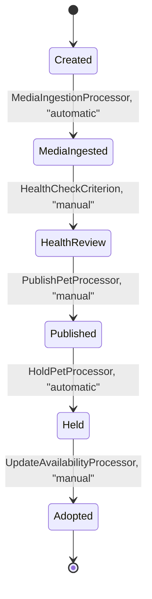
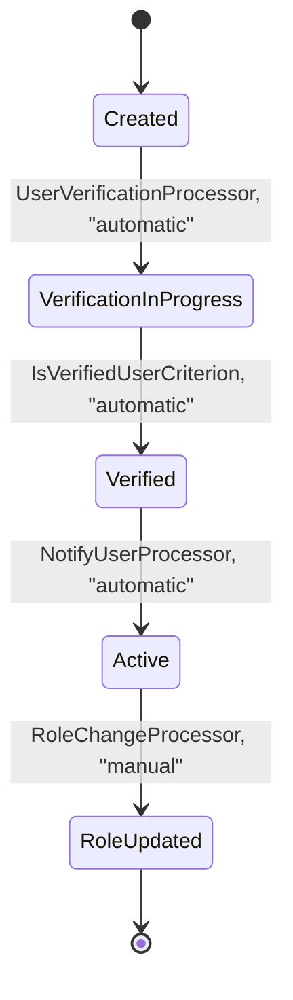
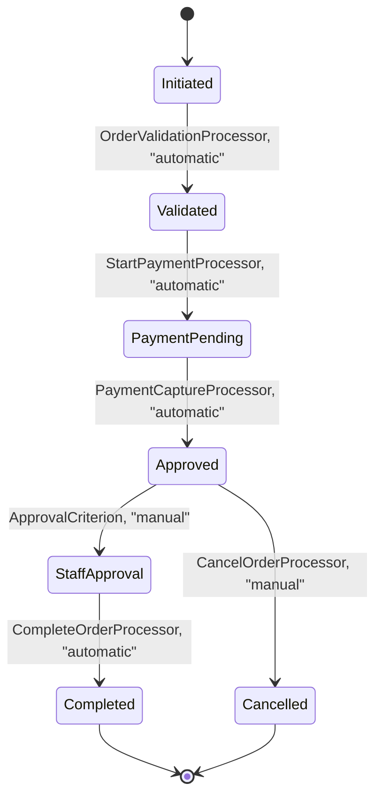

### 1. Entity Definitions
```
Pet:
- id: String (business id visible in UI)
- name: String (pet name)
- species: String (cat/dog/etc)
- breed: String (breed description)
- age: Integer (years/months)
- gender: String (M/F/other)
- status: String (available/reserved/adopted/held/sick)
- photos: List<String> (URLs or media ids)
- description: String (bio)
- tags: List<String> (playful tags)
- healthNotes: String (vet notes)

User:
- id: String (business id)
- name: String (full name)
- email: String (contact email)
- role: String (customer/staff/admin)
- contact: String (phone)
- verified: Boolean (identity verified)
- savedPets: List<String> (pet ids)
- notes: String (internal notes)

Order:
- id: String (business id)
- petId: String (linked pet.id)
- userId: String (linked user.id)
- type: String (adopt/purchase/reserve)
- status: String (initiated/payment_pending/approved/completed/cancelled)
- total: Number (fees)
- createdAt: String (ISO timestamp)
- expiresAt: String (reservation expiry)
- notes: String (free text)
```

### 2. Entity workflows

Pet workflow:
1. Initial State: Pet created with status available or sick
2. Media ingestion: images processed and validated (automatic)
3. Health check: staff reviews healthNotes (manual)
4. Publish: set status to available and notify subscribers (automatic)
5. Lifecycle: status may become held/reserved/adopted via Order processing (automatic/manual)


```mermaid
stateDiagram-v2
    [*] --> Created
    Created --> MediaIngested : MediaIngestionProcessor, "automatic"
    MediaIngested --> HealthReview : HealthCheckCriterion, "manual"
    HealthReview --> Published : PublishPetProcessor, "manual"
    Published --> Held : HoldPetProcessor, "automatic"
    Held --> Adopted : UpdateAvailabilityProcessor, "manual"
    Adopted --> [*]
```

Pet processors/criteria:
- Processors: MediaIngestionProcessor, PublishPetProcessor, HoldPetProcessor, UpdateAvailabilityProcessor
- Criteria: HealthCheckCriterion, IsReadyForPublishCriterion

User workflow:
1. Initial State: User created (unverified)
2. Verification: identity/contacts validated (automatic/manual)
3. Activation: set verified true and optionally notify user (automatic)
4. Role changes: admin/staff changes are manual


```mermaid
stateDiagram-v2
    [*] --> Created
    Created --> VerificationInProgress : UserVerificationProcessor, "automatic"
    VerificationInProgress --> Verified : IsVerifiedUserCriterion, "automatic"
    Verified --> Active : NotifyUserProcessor, "automatic"
    Active --> RoleUpdated : RoleChangeProcessor, "manual"
    RoleUpdated --> [*]
```

User processors/criteria:
- Processors: UserVerificationProcessor, NotifyUserProcessor, RoleChangeProcessor
- Criteria: IsVerifiedUserCriterion

Order workflow:
1. Initial State: Order created with status initiated
2. Validation: check pet availability and user verification (automatic)
3. Payment: payment capture (automatic/manual depending on policy)
4. Approval: staff may approve adoption (manual) or auto-approve
5. Completion: update order.status to completed and pet.status to adopted/reserved; notify user


```mermaid
stateDiagram-v2
    [*] --> Initiated
    Initiated --> Validated : OrderValidationProcessor, "automatic"
    Validated --> PaymentPending : StartPaymentProcessor, "automatic"
    PaymentPending --> Approved : PaymentCaptureProcessor, "automatic"
    Approved --> StaffApproval : ApprovalCriterion, "manual"
    StaffApproval --> Completed : CompleteOrderProcessor, "automatic"
    Completed --> [*]
    Approved --> Cancelled : CancelOrderProcessor, "manual"
    Cancelled --> [*]
```

Order processors/criteria:
- Processors: OrderValidationProcessor, StartPaymentProcessor, PaymentCaptureProcessor, CompleteOrderProcessor, CancelOrderProcessor
- Criteria: IsPetAvailableCriterion, IsPaymentValidCriterion, ApprovalCriterion

### 3. Pseudo code for processor classes

MediaIngestionProcessor
```
class MediaIngestionProcessor:
  process(pet):
    for url in pet.photos:
      validateImage(url)
      generateThumbnail(url)
    mark pet.mediaStatus = processed
    persist pet
```

PublishPetProcessor
```
class PublishPetProcessor:
  process(pet):
    if HealthCheckCriterion.evaluate(pet) and pet.mediaStatus == processed:
      pet.status = available
      persist pet
      NotifySubscribersProcessor.process(pet)
```

UserVerificationProcessor
```
class UserVerificationProcessor:
  process(user):
    if basicChecks(user.email, user.contact):
      user.verified = true
    else:
      user.verified = false
    persist user
```

OrderValidationProcessor
```
class OrderValidationProcessor:
  process(order):
    pet = fetchPet(order.petId)
    user = fetchUser(order.userId)
    if not IsPetAvailableCriterion.evaluate(pet):
      order.status = cancelled
      persist order
      return
    if not IsVerifiedUserCriterion.evaluate(user):
      order.status = payment_pending
    persist order
```

PaymentCaptureProcessor
```
class PaymentCaptureProcessor:
  process(order):
    if capturePayment(order.total):
      order.status = approved
      persist order
    else:
      order.status = cancelled
      persist order
```

CompleteOrderProcessor
```
class CompleteOrderProcessor:
  process(order):
    pet = fetchPet(order.petId)
    pet.status = adopted if order.type == adopt else reserved
    persist pet
    order.status = completed
    persist order
    NotifyUserProcessor.process(order)
```

Criteria examples (pseudo)
- IsPetAvailableCriterion.evaluate(pet): return pet.status == available
- IsVerifiedUserCriterion.evaluate(user): return user.verified == true
- IsPaymentValidCriterion.evaluate(order): return payment gateway result

### 4. API Endpoints Design Rules

Notes:
- POST endpoints return only technicalId (datastore-specific id).
- All created entities via POST must have GET by technicalId.
- GET all and GET by non-technical fields omitted unless requested.

Endpoints:

1) Create Pet
POST /pets
Request:
```json
{
  "id":"PET-123",
  "name":"Mittens",
  "species":"cat",
  "breed":"Tabby",
  "age":2,
  "gender":"F",
  "status":"available",
  "photos":["https://.../1.jpg"],
  "description":"Loves naps",
  "tags":["friendly","playful"],
  "healthNotes":"Vaccinated"
}
```
Response (only technicalId):
```json
{
  "technicalId":"tx-abc-001"
}
```

GET Pet by technicalId
GET /pets/{technicalId}
Response:
```json
{
  "technicalId":"tx-abc-001",
  "entity": { /* Pet fields as above plus persisted metadata */ }
}
```

2) Create User
POST /users
Request:
```json
{
  "id":"USR-99",
  "name":"Ava Smith",
  "email":"ava@example.com",
  "role":"customer",
  "contact":"+123456",
  "verified":false,
  "savedPets":[],
  "notes":""
}
```
Response:
```json
{
  "technicalId":"tx-user-002"
}
```

GET User by technicalId
GET /users/{technicalId}
Response:
```json
{
  "technicalId":"tx-user-002",
  "entity": { /* User fields */ }
}
```

3) Create Order
POST /orders
Request:
```json
{
  "id":"ORD-777",
  "petId":"PET-123",
  "userId":"USR-99",
  "type":"adopt",
  "status":"initiated",
  "total":50,
  "createdAt":"2025-08-22T10:00:00Z",
  "expiresAt":"2025-08-29T10:00:00Z",
  "notes":"First-time adopter"
}
```
Response:
```json
{
  "technicalId":"tx-order-010"
}
```

GET Order by technicalId
GET /orders/{technicalId}
Response:
```json
{
  "technicalId":"tx-order-010",
  "entity": { /* Order fields */ }
}
```

If you want, I can:
- Expand to include Appointment or Notification entities (up to 10)
- Add GET by condition endpoints (e.g., list available pets by species)
Which would you like to add or refine next?