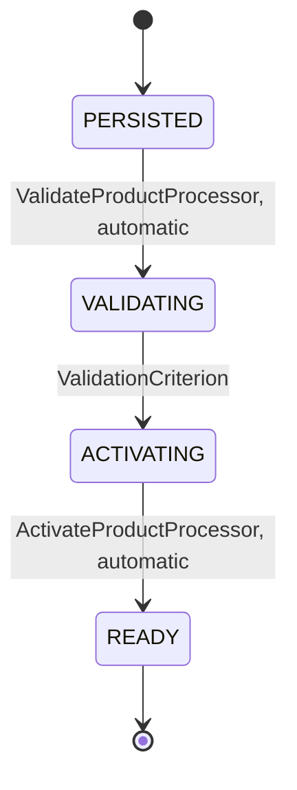
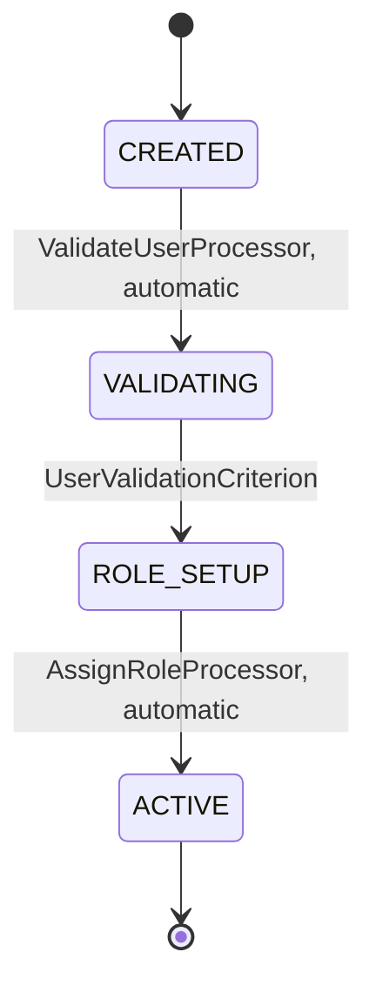
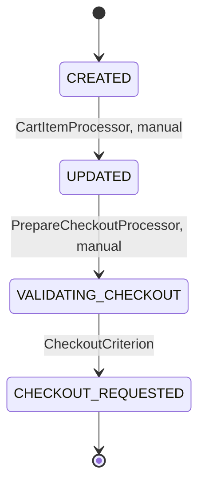
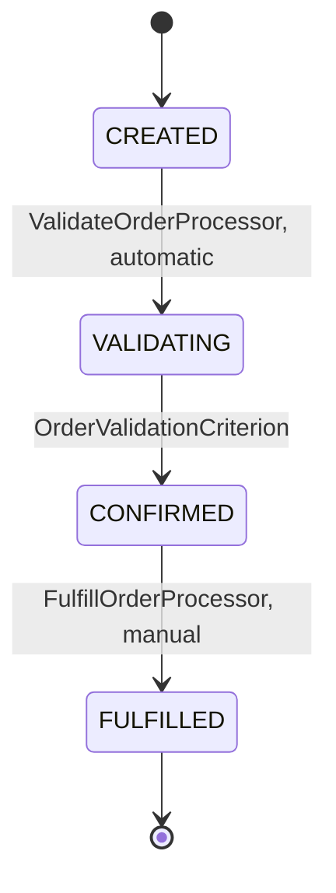
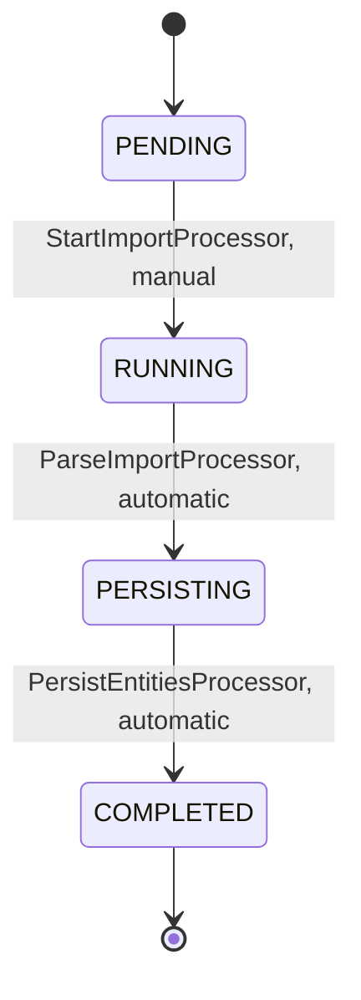

### 1. Entity Definitions
```
Product:
- sku: String (unique product identifier)
- name: String (display name)
- description: String (short description)
- price: Number (unit price)
- availableQuantity: Number (inventory available)
- active: Boolean (sellable flag)
- createdAt: String (ISO timestamp)

User:
- userId: String (business id)
- name: String (full name)
- email: String (contact)
- role: String (Admin or Customer)
- status: String (active/inactive)
- createdAt: String (ISO timestamp)

ShoppingCart:
- cartId: String (business id)
- customerUserId: String (link to User)
- items: Array (elements: productSku String, quantity Number, priceAtAdd Number)
- createdAt: String
- modifiedAt: String

Order:
- orderId: String (business id)
- customerUserId: String
- items: Array (productSku, quantity, unitPrice)
- subtotal: Number
- total: Number
- status: String (Created, Confirmed, Shipped, Cancelled)
- createdAt: String

ImportJob:
- jobId: String (business id)
- jobType: String (products or users)
- sourceReference: String (file/ref)
- status: String (Pending, Running, Completed, Failed)
- resultSummary: Object (created, updated, failed counts)
- createdAt: String
```

### 2. Entity workflows

Product workflow:
1. Initial State: Product persisted (event)
2. Validation: validate fields and price
3. Activation: set active if availableQuantity > 0
4. Ready: available for browsing


```mermaid
stateDiagram-v2
    [*] --> PERSISTED
    PERSISTED --> VALIDATING : ValidateProductProcessor, automatic
    VALIDATING --> ACTIVATING : ValidationCriterion
    ACTIVATING --> READY : ActivateProductProcessor, automatic
    READY --> [*]
```

Processors/Criteria: ValidateProductProcessor, ActivateProductProcessor, ValidationCriterion

User workflow:
1. Initial State: User persisted (event)
2. Validate: email uniqueness/format
3. RoleSetup: assign default permissions for Customer or Admin
4. Active: user ready


```mermaid
stateDiagram-v2
    [*] --> CREATED
    CREATED --> VALIDATING : ValidateUserProcessor, automatic
    VALIDATING --> ROLE_SETUP : UserValidationCriterion
    ROLE_SETUP --> ACTIVE : AssignRoleProcessor, automatic
    ACTIVE --> [*]
```

Processors/Criteria: ValidateUserProcessor, AssignRoleProcessor, UserValidationCriterion

ShoppingCart workflow:
1. Initial State: Cart created (event)
2. ItemOps: add/update/remove items (manual by user)
3. ValidateCheckout: on checkout attempt validate stock/prices
4. CheckoutTriggered: emit CheckoutRequested event


```mermaid
stateDiagram-v2
    [*] --> CREATED
    CREATED --> UPDATED : CartItemProcessor, manual
    UPDATED --> VALIDATING_CHECKOUT : PrepareCheckoutProcessor, manual
    VALIDATING_CHECKOUT --> CHECKOUT_REQUESTED : CheckoutCriterion
    CHECKOUT_REQUESTED --> [*]
```

Processors/Criteria: CartItemProcessor, PrepareCheckoutProcessor, CheckoutCriterion

Order workflow:
1. Initial State: Order created from cart (event)
2. ValidatePaymentAndStock: check stock and payment (automatic)
3. ConfirmOrder: reserve stock and set status Confirmed
4. Fulfillment: Admin marks Shipped or Cancelled


```mermaid
stateDiagram-v2
    [*] --> CREATED
    CREATED --> VALIDATING : ValidateOrderProcessor, automatic
    VALIDATING --> CONFIRMED : OrderValidationCriterion
    CONFIRMED --> FULFILLED : FulfillOrderProcessor, manual
    FULFILLED --> [*]
```

Processors/Criteria: ValidateOrderProcessor, FulfillOrderProcessor, OrderValidationCriterion

ImportJob workflow:
1. Initial State: Job created via POST (event)
2. RunImport: validate file, parse rows
3. PersistEntities: create/update Product or User entities
4. Complete: set resultSummary and Completed/Failed


```mermaid
stateDiagram-v2
    [*] --> PENDING
    PENDING --> RUNNING : StartImportProcessor, manual
    RUNNING --> PERSISTING : ParseImportProcessor, automatic
    PERSISTING --> COMPLETED : PersistEntitiesProcessor, automatic
    COMPLETED --> [*]
```

Processors/Criteria: StartImportProcessor, ParseImportProcessor, PersistEntitiesProcessor, ImportResultCriterion

### 3. Pseudo code for processor classes (conceptual)

ImportJob processors
```
class StartImportProcessor:
    process(job):
        job.status = Running

class ParseImportProcessor:
    process(job):
        rows = parse(job.sourceReference)
        return rows

class PersistEntitiesProcessor:
    process(job, rows):
        for row in rows:
            if job.jobType == products:
                ValidateProductProcessor.process(row)
                saveOrUpdateProduct(row)
            else:
                ValidateUserProcessor.process(row)
                saveOrUpdateUser(row)
        job.resultSummary = {created, updated, failed}
        job.status = Completed
```

Product/User processors
```
class ValidateProductProcessor:
    process(product):
        assert price >= 0
        assert sku present

class ActivateProductProcessor:
    process(product):
        product.active = product.availableQuantity > 0

class ValidateUserProcessor:
    process(user):
        assert email valid
        check email uniqueness
```

Cart / Order processors
```
class CartItemProcessor:
    process(cart, change):
        apply change to cart.items
        cart.modifiedAt = now

class PrepareCheckoutProcessor:
    process(cart):
        recalc totals
        create Order entity event from cart

class ValidateOrderProcessor:
    process(order):
        for item in order.items:
            if product.availableQuantity < item.quantity:
                fail
        reserve stock
```

### 4. API Endpoints Design Rules

Rules followed: POST returns only technicalId. GET endpoints for retrieval by technicalId.

Endpoints:
- POST /import-jobs
Request/Response:
```json
{ "jobType":"products", "sourceReference":"s3://bucket/file.csv" }
```
Response:
```json
{ "technicalId":"<importJobTechnicalId>" }
```
- GET /import-jobs/{technicalId}
Response: full ImportJob entity with resultSummary

- POST /shopping-carts
Request:
```json
{ "customerUserId":"u123" }
```
Response:
```json
{ "technicalId":"<cartTechnicalId>" }
```
- GET /shopping-carts/{technicalId}
Response: full ShoppingCart

- POST /checkout
Request:
```json
{ "cartId":"c123", "paymentReference": "external-ref-optional" }
```
Response:
```json
{ "technicalId":"<orderTechnicalId>" }
```
- GET /orders/{technicalId}
Response: full Order

- GET /products/{sku}
Response: full Product

- GET /users/{userId}
Response: full User

Notes:
- All POSTs are events that trigger Cyoda workflows described above.
- ImportJob POST triggers creation/update of Product and User entities; those entity persistence events start their workflows in Cyoda.
- Choice assumptions: import will upsert (create or update) rows; checkout validates stock and reserves on Confirmed state.