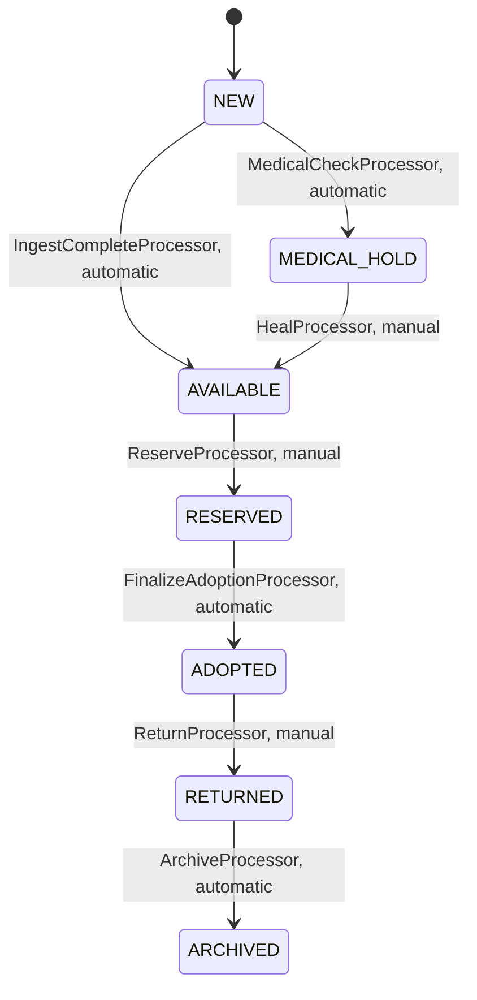
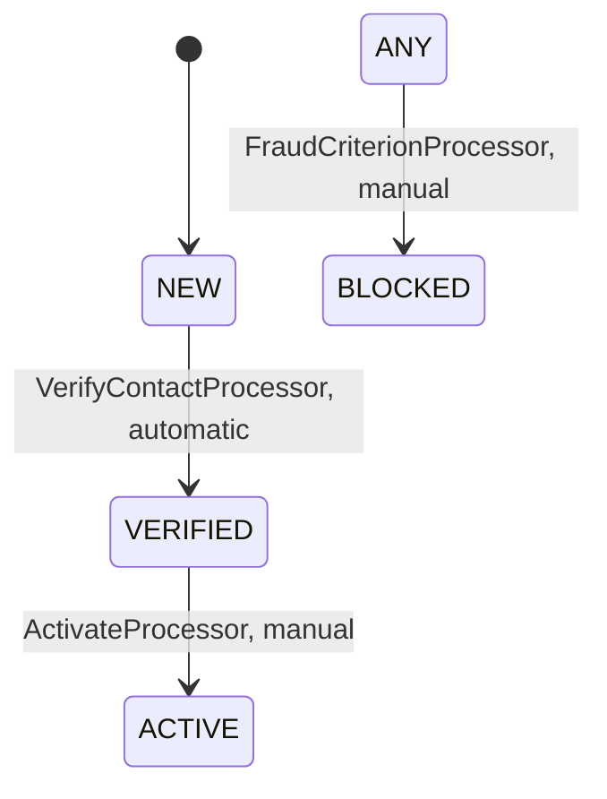
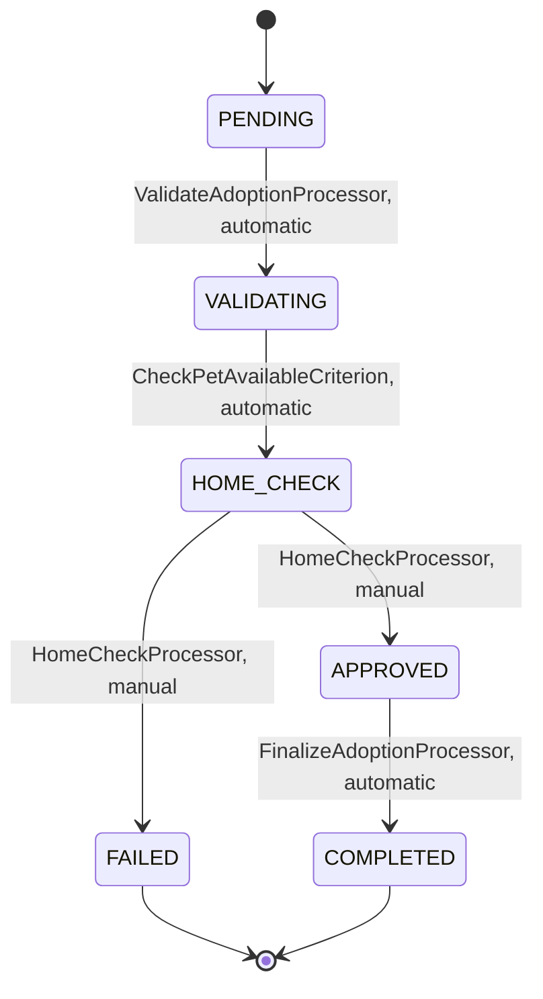

### 1. Entity Definitions
```
Pet:
- id: string (business id from Petstore)
- name: string (pet name)
- species: string (dog cat etc)
- breed: string (breed)
- age: number (years/months)
- status: string (available reserved adopted medical_hold returned archived)
- photos: array (urls)
- tags: array (strings)
- healthNotes: string (veterinary notes)

Customer:
- id: string (business customer id)
- fullName: string
- contactInfo: object (email phone)
- address: object (street city postcode)
- status: string (new verified blocked active)
- favorites: array (pet ids)
- adoptionHistory: array (pet ids & dates)

AdoptionJob:
- jobId: string (technical job id created via POST)
- customerId: string (business id)
- petId: string (business id)
- requestedAt: string (timestamp)
- status: string (PENDING VALIDATING HOME_CHECK APPROVED COMPLETED FAILED)
- resultNotes: string
```

### 2. Entity workflows

Pet workflow:
1. Initial State: Pet created via sync ingestion -> NEW
2. Health Check: MedicalHoldCriterion auto -> if flagged -> MEDICAL_HOLD
3. Available: set to AVAILABLE (auto) when no holds
4. Reservation: user action -> RESERVED (manual)
5. Adoption: AdoptionJob Finalize -> ADOPTED (automatic)
6. Return/Archive: RETURNED or ARCHIVED (manual/automatic)


```mermaid
stateDiagram-v2
    [*] --> NEW
    NEW --> MEDICAL_HOLD : MedicalCheckProcessor, automatic
    NEW --> AVAILABLE : IngestCompleteProcessor, automatic
    AVAILABLE --> RESERVED : ReserveProcessor, manual
    RESERVED --> ADOPTED : FinalizeAdoptionProcessor, automatic
    ADOPTED --> RETURNED : ReturnProcessor, manual
    RETURNED --> ARCHIVED : ArchiveProcessor, automatic
    MEDICAL_HOLD --> AVAILABLE : HealProcessor, manual
```

Pet processors/criteria:
- Criteria: MedicalHoldCriterion, AvailabilityCriterion
- Processors: IngestCompleteProcessor, MedicalCheckProcessor, ReserveProcessor, FinalizeAdoptionProcessor, ArchiveProcessor

Customer workflow:
1. Initial: Customer added by registration event -> NEW
2. Verification: VerifyContactProcessor -> VERIFIED (automatic/manual)
3. Active: VERIFIED -> ACTIVE (manual)
4. Blocked: Admin action or FraudCriterion -> BLOCKED


```mermaid
stateDiagram-v2
    [*] --> NEW
    NEW --> VERIFIED : VerifyContactProcessor, automatic
    VERIFIED --> ACTIVE : ActivateProcessor, manual
    ANY --> BLOCKED : FraudCriterionProcessor, manual
```

Customer processors/criteria:
- Criteria: ContactVerifiedCriterion, FraudCriterion
- Processors: VerifyContactProcessor, ActivateProcessor, BlockCustomerProcessor

AdoptionJob workflow:
1. Initial: POST creates AdoptionJob -> PENDING
2. Validation: ValidateAdoptionProcessor checks customer and pet -> VALIDATING
3. Home Check: HomeCheckProcessor -> HOME_CHECK
4. Approval: ApproveAdoptionProcessor -> APPROVED or FAILED
5. Completion: FinalizeAdoptionProcessor updates Pet and Customer -> COMPLETED


```mermaid
stateDiagram-v2
    [*] --> PENDING
    PENDING --> VALIDATING : ValidateAdoptionProcessor, automatic
    VALIDATING --> HOME_CHECK : CheckPetAvailableCriterion, automatic
    HOME_CHECK --> APPROVED : HomeCheckProcessor, manual
    HOME_CHECK --> FAILED : HomeCheckProcessor, manual
    APPROVED --> COMPLETED : FinalizeAdoptionProcessor, automatic
    FAILED --> [*]
    COMPLETED --> [*]
```

AdoptionJob processors/criteria:
- Criteria: CheckPetAvailableCriterion, CustomerEligibleCriterion
- Processors: ValidateAdoptionProcessor, HomeCheckProcessor, ApproveAdoptionProcessor, FinalizeAdoptionProcessor

### 3. Pseudo code for processor classes (concise)

ValidateAdoptionProcessor:
```
process(job):
  if not CustomerEligibleCriterion.check(job.customerId):
    job.status = FAILED
    job.resultNotes = reason
    return
  if not CheckPetAvailableCriterion.check(job.petId):
    job.status = FAILED
    job.resultNotes = pet not available
    return
  job.status = HOME_CHECK
```

HomeCheckProcessor:
```
process(job):
  schedule home check task or set job.status = APPROVED/FAILED based on report
```

FinalizeAdoptionProcessor:
```
process(job):
  mark pet.status = ADOPTED
  append pet id to customer.adoptionHistory
  job.status = COMPLETED
  NotifyStaffProcessor.process(job)
```

ReserveProcessor:
```
process(petId, customerId):
  if CheckPetAvailableCriterion.check(petId):
    set pet.status = RESERVED
    notify customer
```

MedicalCheckProcessor:
```
process(pet):
  if pet.healthNotes contains urgent flag:
    set pet.status = MEDICAL_HOLD
```

### 4. API Endpoints Design Rules

Rules applied:
- Only AdoptionJob is created via POST (orchestration). Pet and Customer are populated by ingestion/jobs and available via GET.
- POST endpoints return only technicalId.

Endpoints:

1) Create AdoptionJob (triggers EDA workflow)
POST /adoption-jobs
Request:
```json
{
  "customerId":"C123",
  "petId":"P456",
  "requestedAt":"2025-08-22T10:00:00Z",
  "resultNotes":"optional"
}
```
Response:
```json
{
  "technicalId":"job-789-uuid"
}
```

2) Get AdoptionJob by technicalId
GET /adoption-jobs/{technicalId}
Response:
```json
{
  "jobId":"job-789-uuid",
  "customerId":"C123",
  "petId":"P456",
  "status":"HOME_CHECK",
  "requestedAt":"2025-08-22T10:00:00Z",
  "resultNotes":""
}
```

3) Get Pet by business id
GET /pets/{id}
Response:
```json
{
  "id":"P456",
  "name":"Mittens",
  "species":"cat",
  "status":"AVAILABLE",
  "age":2
}
```

4) List Pets (optional)
GET /pets
Response: array of pet objects (same shape as above)

5) Get Customer by id
GET /customers/{id}
Response:
```json
{
  "id":"C123",
  "fullName":"Jane Doe",
  "status":"VERIFIED",
  "adoptionHistory":[]
}
```

Notes and assumptions:
- Max entities used: 3 (Pet Customer AdoptionJob). If you want Orders, Inventory, or PetSyncJob added swap one of the above (max 10 allowed).  
- All entity create operations in the platform are events. AdoptionJob POST triggers the full orchestration and will create/update business entities (Pet Customer) via processors.