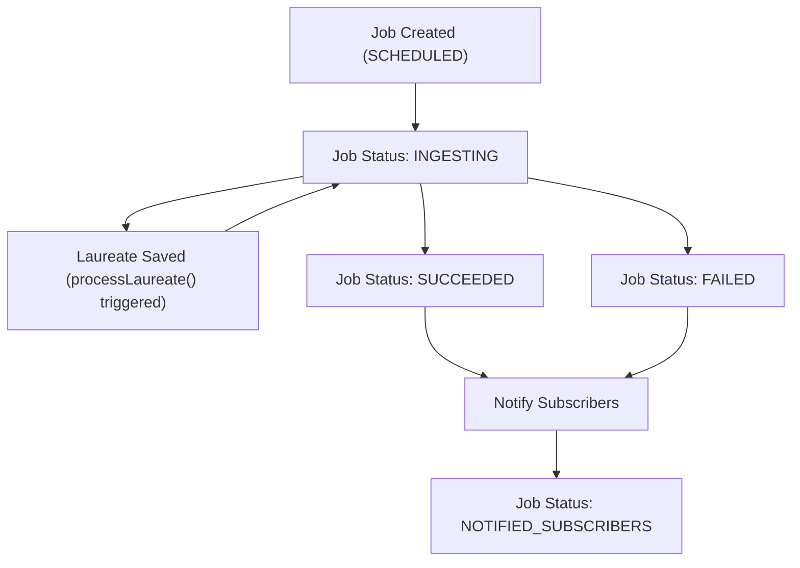

### 1. Entity Definitions

```
Job:
- jobName: String (Descriptive name of the ingestion job)
- scheduledTime: String (ISO 8601 datetime when the job is scheduled)
- status: String (Job lifecycle state: SCHEDULED, INGESTING, SUCCEEDED, FAILED, NOTIFIED_SUBSCRIBERS)
- createdAt: String (ISO 8601 timestamp of job creation)
- resultSummary: String (Summary or message about job outcome)

Laureate:
- laureateId: String (Unique identifier from source data)
- firstname: String
- surname: String
- gender: String
- born: String (Date of birth, ISO 8601)
- died: String (Date of death, ISO 8601 or null)
- borncountry: String
- borncountrycode: String
- borncity: String
- year: String (Award year)
- category: String (Prize category)
- motivation: String (Award motivation text)
- affiliationName: String (Institution name)
- affiliationCity: String
- affiliationCountry: String

Subscriber:
- subscriberId: String (Unique subscriber identifier)
- contactType: String (e.g., email, webhook)
- contactValue: String (email address or webhook URL)
- active: Boolean (Indicates if subscriber is active)
```

---

### 2. Process Method Flows

```
processJob() Flow:
1. Initial State: Job created with status = SCHEDULED
2. Transition: Update status to INGESTING
3. Data Ingestion: Call OpenDataSoft API to fetch laureates data
4. For each laureate record:
   - Save Laureate entity (triggers processLaureate() implicitly)
5. Update Job status to SUCCEEDED if all laureates processed successfully; else FAILED
6. Trigger notification for all active Subscribers by saving Notification entities or directly sending
7. Update Job status to NOTIFIED_SUBSCRIBERS
8. End of job lifecycle
```

```
processLaureate() Flow:
1. Validation: Check required fields (non-null firstname, surname, year, category)
2. Enrichment: Normalize country codes, calculate derived data if any (optional)
3. Persist laureate as immutable record
4. No updates or deletes; new laureates always created as new entities
```

```
processSubscriber() Flow:
1. Validation: Verify contactType and contactValue formats
2. Persist subscriber entity as immutable record
3. Subscribers do not trigger further processing automatically
```

---

### 3. API Endpoints Design

- **Job**
  - POST `/jobs`  
    Request body:  
    ```json
    {
      "jobName": "Nobel Laureates Ingestion",
      "scheduledTime": "2024-07-01T10:00:00Z"
    }
    ```  
    Response:  
    ```json
    {
      "technicalId": "job-123456"
    }
    ```
  - GET `/jobs/{technicalId}`  
    Response:  
    ```json
    {
      "jobName": "Nobel Laureates Ingestion",
      "scheduledTime": "2024-07-01T10:00:00Z",
      "status": "NOTIFIED_SUBSCRIBERS",
      "createdAt": "2024-06-25T08:00:00Z",
      "resultSummary": "Ingested 120 laureates and notified 10 subscribers"
    }
    ```

- **Laureate**  
  *No POST endpoint* (created implicitly by processJob)  
  - GET `/laureates/{technicalId}`  
    Response:  
    ```json
    {
      "laureateId": "853",
      "firstname": "Akira",
      "surname": "Suzuki",
      "gender": "male",
      "born": "1930-09-12",
      "died": null,
      "borncountry": "Japan",
      "borncountrycode": "JP",
      "borncity": "Mukawa",
      "year": "2010",
      "category": "Chemistry",
      "motivation": "for palladium-catalyzed cross couplings in organic synthesis",
      "affiliationName": "Hokkaido University",
      "affiliationCity": "Sapporo",
      "affiliationCountry": "Japan"
    }
    ```

- **Subscriber**
  - POST `/subscribers`  
    Request body:  
    ```json
    {
      "contactType": "email",
      "contactValue": "user@example.com",
      "active": true
    }
    ```  
    Response:  
    ```json
    {
      "technicalId": "sub-987654"
    }
    ```
  - GET `/subscribers/{technicalId}`  
    Response:  
    ```json
    {
      "contactType": "email",
      "contactValue": "user@example.com",
      "active": true
    }
    ```

---

### 4. Mermaid Diagram: Event-Driven Processing Chain


```mermaid
graph TD
Job_Created["Job Created (SCHEDULED)"]
Job_Ingesting["Job Status: INGESTING"]
Laureate_Saved["Laureate Saved (processLaureate() triggered)"]
Job_Succeeded["Job Status: SUCCEEDED"]
Job_Failed["Job Status: FAILED"]
Subscribers_Notification["Notify Subscribers"]
Job_Notified["Job Status: NOTIFIED_SUBSCRIBERS"]

Job_Created --> Job_Ingesting
Job_Ingesting --> Laureate_Saved
Laureate_Saved --> Job_Ingesting
Job_Ingesting --> Job_Succeeded
Job_Ingesting --> Job_Failed
Job_Succeeded --> Subscribers_Notification
Job_Failed --> Subscribers_Notification
Subscribers_Notification --> Job_Notified
```

---

### Summary of Confirmed Functional Requirements

- One orchestration entity: **Job** with lifecycle states: `SCHEDULED`, `INGESTING`, `SUCCEEDED`, `FAILED`, `NOTIFIED_SUBSCRIBERS`.
- Two business entities: **Laureate** and **Subscriber**, both created immutably.
- `POST /jobs` creates a Job and automatically triggers ingestion and processing of laureates.
- Laureates are created internally during Job processing; no separate POST endpoint.
- Subscribers can be created via `POST /subscribers` and receive notifications on job completion.
- Notifications are sent to subscribers after job completion.
- No update or delete endpoints; all data is immutable.
- All POST endpoints return only `technicalId`.
- GET endpoints are available for retrieving entities by `technicalId`.
- Processing flows follow Event-Driven Architecture principles with process methods triggered on entity persistence.