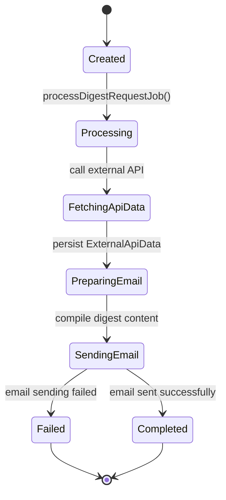
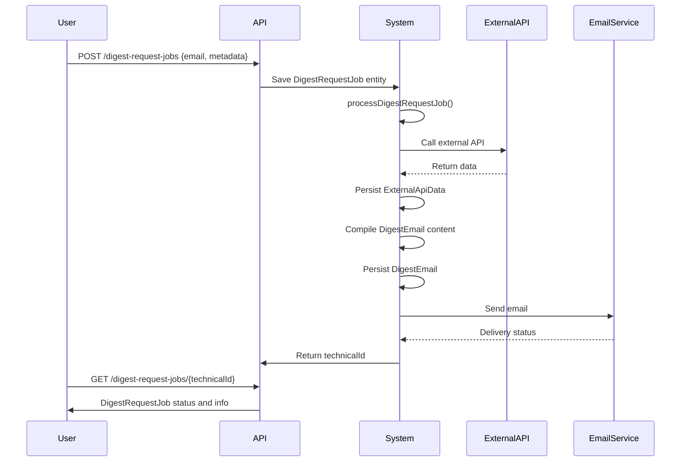

### 1. Entity Definitions

``` 
DigestRequestJob:  
- email: String (recipient email for the digest)  
- requestMetadata: String (additional metadata relevant to digest request)  
- status: String (current processing status: PENDING, PROCESSING, COMPLETED, FAILED)  
- createdAt: Instant (timestamp when job was created)  

ExternalApiData:  
- jobTechnicalId: String (reference to DigestRequestJob by technicalId)  
- apiEndpoint: String (called external API endpoint URL)  
- responseData: String (raw or processed data retrieved from external API)  
- fetchedAt: Instant (timestamp of data retrieval)  

DigestEmail:  
- jobTechnicalId: String (reference to DigestRequestJob by technicalId)  
- emailContent: String (compiled digest content, e.g., HTML or plain text)  
- sentAt: Instant (timestamp when email was sent)  
- deliveryStatus: String (status of email dispatch: SENT, FAILED)  
```

---

### 2. Process Method Flows

``` 
processDigestRequestJob() Flow:  
1. Initial State: DigestRequestJob created with status = PENDING  
2. Validation: Check if email is valid and requestMetadata is present  
3. Processing:  
   - Call external API(s) based on requestMetadata or configured defaults  
   - Persist ExternalApiData entity with retrieved data  
4. Email Preparation:  
   - Compile the ExternalApiData into digest email content  
   - Persist DigestEmail entity with prepared content  
5. Email Dispatch:  
   - Send email to DigestRequestJob.email  
   - Update DigestEmail.deliveryStatus accordingly  
6. Completion:  
   - Update DigestRequestJob.status to COMPLETED if all steps succeed, otherwise FAILED  
```

``` 
processExternalApiData() Flow:  
- Triggered implicitly by processDigestRequestJob after data retrieval  
- Validate responseData format  
- Possibly transform or enrich responseData for email compilation  
- No separate POST endpoints; fully internal to workflow  
``` 

``` 
processDigestEmail() Flow:  
- Triggered after email content creation  
- Attempt to send the email via configured email service  
- Update deliveryStatus based on outcome  
```

---

### 3. API Endpoints Design

| Endpoint                          | Method | Description                                        | Request Body                 | Response                    |
|----------------------------------|--------|--------------------------------------------------|-----------------------------|-----------------------------|
| `/digest-request-jobs`            | POST   | Create new DigestRequestJob entity (triggers event) | `{ "email": "...", "requestMetadata": "..." }` | `{ "technicalId": "string" }`  |
| `/digest-request-jobs/{technicalId}` | GET    | Retrieve DigestRequestJob status and info        | N/A                         | DigestRequestJob entity JSON  |
| `/external-api-data/{technicalId}`  | GET    | Retrieve ExternalApiData results by jobTechnicalId | N/A                         | ExternalApiData entity JSON   |
| `/digest-email/{technicalId}`       | GET    | Retrieve DigestEmail status and content           | N/A                         | DigestEmail entity JSON       |

- No update/delete endpoints to maintain event history and immutability.
- Business entity creation is done via orchestration entity POST only.

---

### 4. Request/Response Formats

**POST /digest-request-jobs Request**

```json
{
  "email": "user@example.com",
  "requestMetadata": "string with metadata or preferences"
}
```

**POST /digest-request-jobs Response**

```json
{
  "technicalId": "abc123def456"
}
```

**GET /digest-request-jobs/{technicalId} Response**

```json
{
  "email": "user@example.com",
  "requestMetadata": "string with metadata or preferences",
  "status": "COMPLETED",
  "createdAt": "2024-06-01T12:00:00Z"
}
```

**GET /external-api-data/{technicalId} Response**

```json
{
  "jobTechnicalId": "abc123def456",
  "apiEndpoint": "https://petstore.swagger.io/v2/pet/findByStatus",
  "responseData": "{...}", 
  "fetchedAt": "2024-06-01T12:01:00Z"
}
```

**GET /digest-email/{technicalId} Response**

```json
{
  "jobTechnicalId": "abc123def456",
  "emailContent": "<html><body>Your digest...</body></html>",
  "sentAt": "2024-06-01T12:02:00Z",
  "deliveryStatus": "SENT"
}
```

---

### 5. Mermaid Diagrams

**DigestRequestJob Lifecycle State Diagram**


```mermaid
stateDiagram-v2
    [*] --> Created
    Created --> Processing : processDigestRequestJob()
    Processing --> FetchingApiData : call external API
    FetchingApiData --> PreparingEmail : persist ExternalApiData
    PreparingEmail --> SendingEmail : compile digest content
    SendingEmail --> Completed : email sent successfully
    SendingEmail --> Failed : email sending failed
    Failed --> [*]
    Completed --> [*]
```

**Event-Driven Processing Chain**

```mermaid
graph TD
    A[POST DigestRequestJob] --> B[processDigestRequestJob()]
    B --> C[Call External API]
    C --> D[Persist ExternalApiData]
    D --> E[Compile DigestEmail]
    E --> F[Persist DigestEmail]
    F --> G[Send Email]
    G --> H[Update DigestRequestJob status]
```

**User Interaction Sequence**


```mermaid
sequenceDiagram
    participant User
    participant API
    participant System
    User->>API: POST /digest-request-jobs {email, metadata}
    API->>System: Save DigestRequestJob entity
    System->>System: processDigestRequestJob()
    System->>ExternalAPI: Call external API
    ExternalAPI-->>System: Return data
    System->>System: Persist ExternalApiData
    System->>System: Compile DigestEmail content
    System->>System: Persist DigestEmail
    System->>EmailService: Send email
    EmailService-->>System: Delivery status
    System->>API: Return technicalId
    User->>API: GET /digest-request-jobs/{technicalId}
    API->>User: DigestRequestJob status and info
```

---

This completes the functional requirements specification for your event-driven Digest Request processing system.  
Please let me know if you need further adjustments!