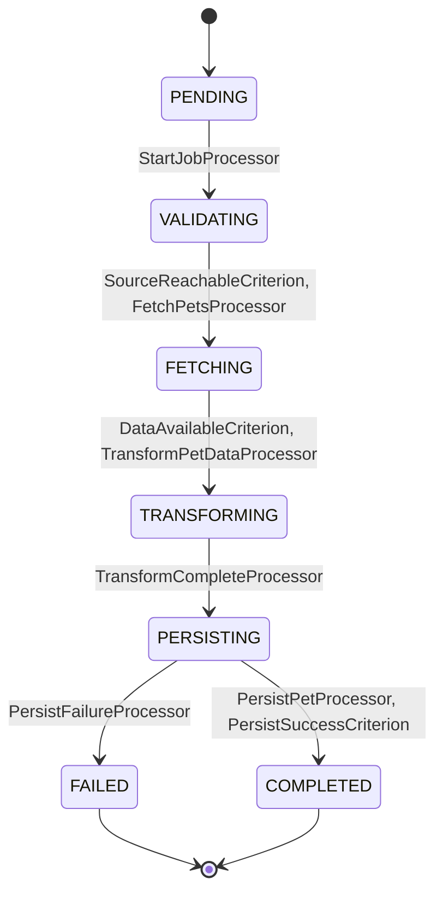
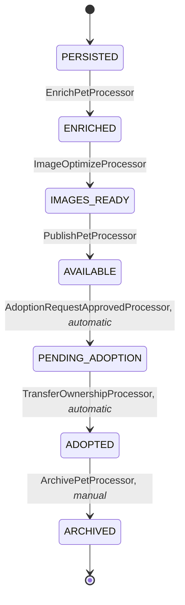
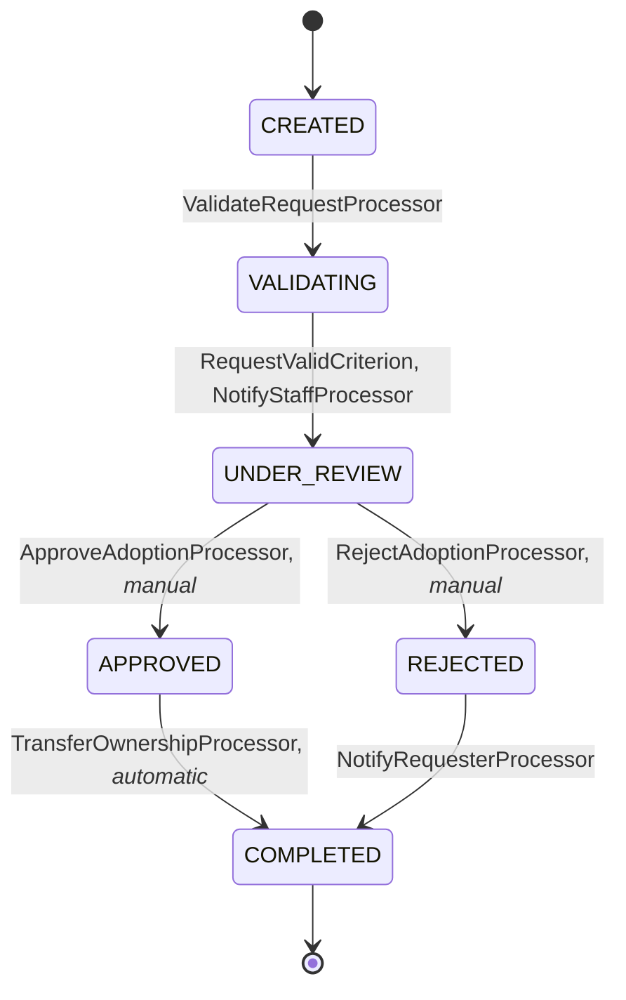

### 1. Entity Definitions
```
Pet:
- id: String (source id from Petstore)
- name: String (pet name)
- species: String (cat/dog/etc)
- breed: String (breed info)
- age: String (age or age_range)
- sex: String (M/F/unknown)
- size: String (small/medium/large)
- status: String (available/pending/adopted/archived)
- bio: String (description)
- healthNotes: String (vaccinations/conditions)
- photos: List<String> (URLs)
- tags: List<String> (fun tags like playful, shy)
- source: String (origin e.g., Petstore)
- importedAt: DateTime (when ingested)

AdoptionRequest:
- petId: String (references Pet.id)
- requesterName: String (applicant name)
- contactInfo: Object (email, phone)
- motivation: String (why they want the pet)
- status: String (created/reviewed/approved/rejected/cancelled/completed)
- submittedAt: DateTime
- processedBy: String (staff id)
- notes: String (staff notes)

PetIngestionJob:
- jobName: String (PetstoreSync)
- sourceUrl: String (Petstore API endpoint)
- status: String (PENDING/VALIDATING/FETCHING/TRANSFORMING/PERSISTING/COMPLETED/FAILED)
- startedAt: DateTime
- completedAt: DateTime
- processedCount: Integer
- errors: List<String>
```

### 2. Entity workflows

PetIngestionJob workflow:
1. Initial State: Job created with PENDING status (POST triggers event)
2. Validate Source: Check source URL reachable (automatic)
3. Fetch Data: Download pet payloads (automatic)
4. Transform: Map Petstore schema -> Pet schema (automatic)
5. Persist: Create/Update Pet entities (automatic emits Pet persisted events)
6. Finalize: Mark COMPLETED or FAILED and notify staff (automatic)


```mermaid
stateDiagram-v2
    [*] --> PENDING
    PENDING --> VALIDATING : StartJobProcessor
    VALIDATING --> FETCHING : SourceReachableCriterion, FetchPetsProcessor
    FETCHING --> TRANSFORMING : DataAvailableCriterion, TransformPetDataProcessor
    TRANSFORMING --> PERSISTING : TransformCompleteProcessor
    PERSISTING --> COMPLETED : PersistPetProcessor, PersistSuccessCriterion
    PERSISTING --> FAILED : PersistFailureProcessor
    FAILED --> [*]
    COMPLETED --> [*]
```

Processors & Criteria:
- Criteria: SourceReachableCriterion, DataAvailableCriterion, PersistSuccessCriterion
- Processors: StartJobProcessor, FetchPetsProcessor, TransformPetDataProcessor, PersistPetProcessor, FinalizeJobProcessor

Pet workflow:
1. Initial State: Pet persisted by job -> PERSISTED
2. Enrichment: Auto enrich (fill missing fields, tag) -> ENRICHED
3. Image processing: Optimize/thumbnail photos -> IMAGES_READY
4. Available: Pet becomes AVAILABLE for adoption (automatic after enrichment) or ADMIN_MANUAL if staff sets status
5. Adoption: status moves to PENDING_ADOPTION when request approved; then ADOPTED -> ARCHIVED


```mermaid
stateDiagram-v2
    [*] --> PERSISTED
    PERSISTED --> ENRICHED : EnrichPetProcessor
    ENRICHED --> IMAGES_READY : ImageOptimizeProcessor
    IMAGES_READY --> AVAILABLE : PublishPetProcessor
    AVAILABLE --> PENDING_ADOPTION : AdoptionRequestApprovedProcessor, *automatic*
    PENDING_ADOPTION --> ADOPTED : TransferOwnershipProcessor, *automatic*
    ADOPTED --> ARCHIVED : ArchivePetProcessor, *manual*
    ARCHIVED --> [*]
```

Processors & Criteria:
- Criteria: ValidPetDataCriterion, ImageQualityCriterion
- Processors: EnrichPetProcessor, ImageOptimizeProcessor, PublishPetProcessor, AdoptionRequestApprovedProcessor, TransferOwnershipProcessor

AdoptionRequest workflow:
1. Initial State: CREATED by user POST (event)
2. Validation: Check request completeness & pet availability (automatic)
3. Review: Staff reviews request (manual)
4. Decision: Approve or Reject (manual)
5. Finalize: If approved, update Pet status to PENDING_ADOPTION -> ADOPTED (automatic). If rejected, mark REJECTED and notify requester.


```mermaid
stateDiagram-v2
    [*] --> CREATED
    CREATED --> VALIDATING : ValidateRequestProcessor
    VALIDATING --> UNDER_REVIEW : RequestValidCriterion, NotifyStaffProcessor
    UNDER_REVIEW --> APPROVED : ApproveAdoptionProcessor, *manual*
    UNDER_REVIEW --> REJECTED : RejectAdoptionProcessor, *manual*
    APPROVED --> COMPLETED : TransferOwnershipProcessor, *automatic*
    REJECTED --> COMPLETED : NotifyRequesterProcessor
    COMPLETED --> [*]
```

Processors & Criteria:
- Criteria: RequestValidCriterion, PetAvailableCriterion
- Processors: ValidateRequestProcessor, NotifyStaffProcessor, ApproveAdoptionProcessor, RejectAdoptionProcessor, TransferOwnershipProcessor

### 3. Pseudo code for processor classes (concise)

- FetchPetsProcessor
```
class FetchPetsProcessor {
  process(job) {
    // call job.sourceUrl, retrieve list
    job.fetchedPayload = httpGet(job.sourceUrl)
    job.processedCount = job.fetchedPayload.size()
  }
}
```

- TransformPetDataProcessor
```
class TransformPetDataProcessor {
  process(job) {
    job.transformed = job.fetchedPayload.map(item -> mapToPetSchema(item))
  }
}
```

- PersistPetProcessor
```
class PersistPetProcessor {
  process(job) {
    for petDto in job.transformed:
      // emit Pet persisted events to Cyoda when saved
      savePet(petDto)
  }
}
```

- EnrichPetProcessor
```
class EnrichPetProcessor {
  process(pet) {
    if pet.tags empty -> pet.tags = inferTags(pet.bio)
    set default healthNotes if missing
    save(pet)
  }
}
```

- ImageOptimizeProcessor
```
class ImageOptimizeProcessor {
  process(pet) {
    for url in pet.photos:
      optimized = optimizeImage(url)
      replace url with optimized
    save(pet)
  }
}
```

- ValidateRequestProcessor
```
class ValidateRequestProcessor {
  process(request) {
    if missing contactInfo or motivation -> mark request.status = REJECTED
    if pet not found or pet.status != AVAILABLE -> set invalid
  }
}
```

- ApproveAdoptionProcessor
```
class ApproveAdoptionProcessor {
  process(request) {
    // manual action by staff triggers this processor
    request.status = APPROVED
    emit event -> TransferOwnershipProcessor
    save(request)
  }
}
```

- TransferOwnershipProcessor
```
class TransferOwnershipProcessor {
  process(request) {
    pet = findPet(request.petId)
    pet.status = ADOPTED
    pet.owner = request.requesterName
    save(pet)
    request.status = COMPLETED
    save(request)
  }
}
```

### 4. API Endpoints Design Rules

Rules applied:
- POST endpoints create events and must return only technicalId.
- Orchestration entity (PetIngestionJob) and user actions (AdoptionRequest) have POST + GET by technicalId.
- Pets are created by ingestion job; GET by technicalId available. GET by condition is not added.

Endpoints:

1) Create ingestion job
POST /jobs/pet-ingestion
Request:
```json
{
  "jobName":"PetstoreSync",
  "sourceUrl":"https://petstore.example/api/pets"
}
```
Response (only technicalId):
```json
{
  "technicalId":"job_abc123"
}
```
GET job by technicalId:
GET /jobs/{technicalId}
Response:
```json
{
  "technicalId":"job_abc123",
  "jobName":"PetstoreSync",
  "status":"COMPLETED",
  "processedCount":120,
  "startedAt":"2025-08-28T10:00:00Z",
  "completedAt":"2025-08-28T10:00:30Z",
  "errors":[]
}
```

2) Create adoption request
POST /adoption-requests
Request:
```json
{
  "petId":"pet_42",
  "requesterName":"Alex",
  "contactInfo":{"email":"alex@example.com","phone":"555-0101"},
  "motivation":"Looking for a playful companion"
}
```
Response:
```json
{
  "technicalId":"req_zyx987"
}
```
GET adoption request by technicalId:
GET /adoption-requests/{technicalId}
Response:
```json
{
  "technicalId":"req_zyx987",
  "petId":"pet_42",
  "requesterName":"Alex",
  "status":"UNDER_REVIEW",
  "submittedAt":"2025-08-28T11:00:00Z",
  "notes":""
}
```

3) Retrieve Pet by technicalId
GET /pets/{technicalId}
Response:
```json
{
  "technicalId":"petrec_555",
  "id":"42",
  "name":"Mr Whiskers",
  "species":"cat",
  "breed":"Tabby",
  "age":"2 years",
  "status":"AVAILABLE",
  "photos":["https://.../thumb1.jpg"],
  "tags":["playful","gentle"]
}
```

Optional GET all pets:
GET /pets
Response: list of pet objects as above.

--- 

If you want, I can expand to 5 entities (Owner, Media) or add GET by condition (search by species/breed) — tell me which and I will update the entities, workflows and endpoints.