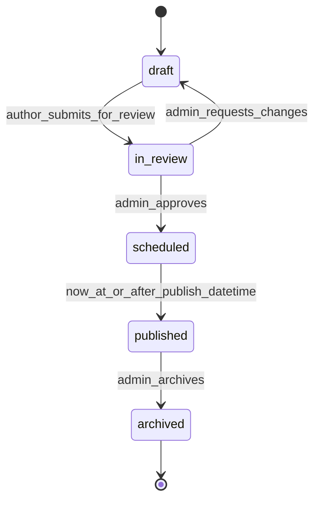
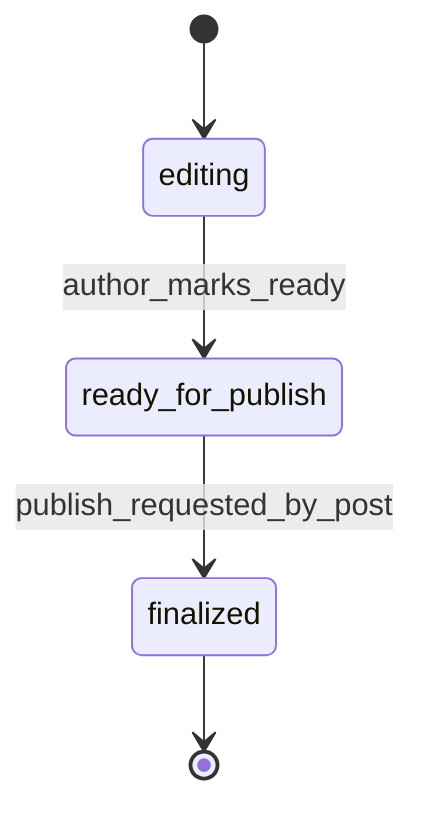
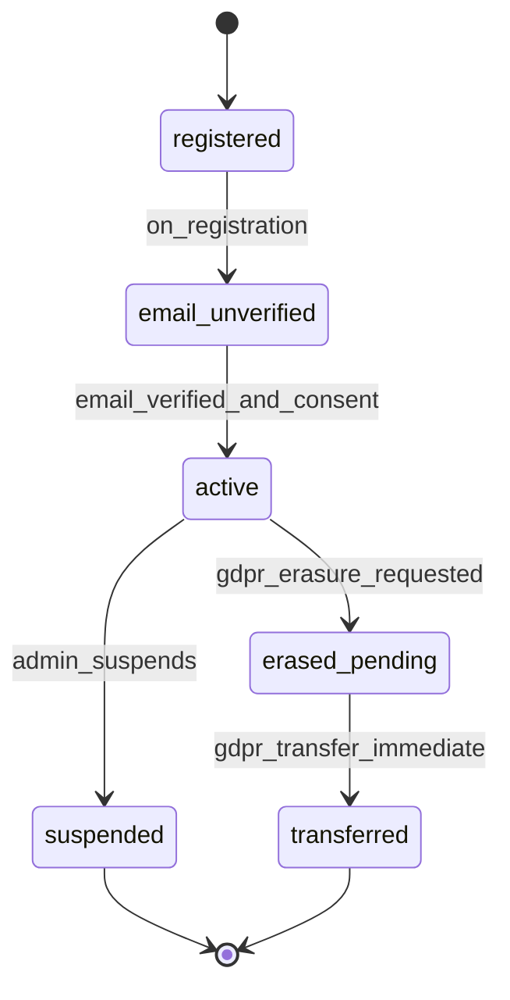
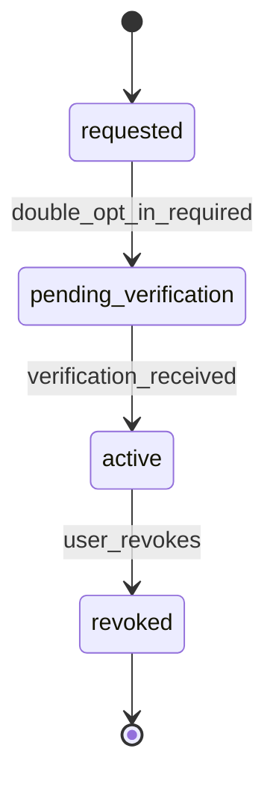
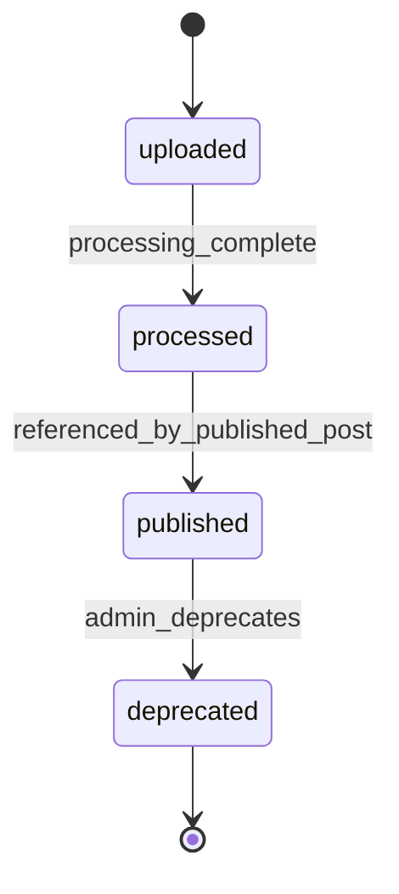
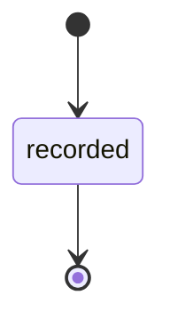

# Functional Requirements (Finalized)

### 1. Entity Definitions

```
Post:
- id: String (canonical id)
- title: String (headline)
- slug: String (canonical URL fragment)
- summary: String (short summary)
- locale: String (en-GB)
- status: String (workflow state)
- current_version_id: String (ref to PostVersion)
- author_id: String (user who authored)
- owner_id: String (current owner; transfers to Admin on GDPR)
- tags: Array String (freeform)
- media_refs: Array String (refs to Media)
- publish_datetime: String (ISO timestamp optional)
- published_at: String (ISO timestamp)
- cache_control: String (CDN directive)

PostVersion:
- version_id: String (id)
- post_id: String (parent Post)
- author_id: String
- content_rich: String (editor content)
- normalized_text: String (plaintext normalized)
- chunks_meta: Array Object (plaintext chunk refs)
- embeddings_ref: String (vector store ref)
- change_summary: String
- created_at: String (ISO)

User:
- user_id: String
- email: String
- email_verified: Boolean
- profile: Object (name, locale, bio)
- marketing_flags: Object (marketing_enabled Boolean)
- owner_of_posts: Array String (post ids)
- gdpr_state: String
- audit_refs: Array String

Consent:
- consent_id: String
- user_id: String
- type: String (marketing/analytics)
- status: String
- evidence_ref: String
- requested_at: String
- granted_at: String
- revoked_at: String
- source: String

Media:
- media_id: String
- owner_id: String
- filename: String
- mime: String
- status: String
- versions: Array Object
- cdn_ref: String
- created_at: String

Audit:
- audit_id: String
- entity_ref: String (entity id + type)
- action: String
- actor_id: String
- timestamp: String
- evidence_ref: String
- metadata: Object
```

> Note: You specified 6 entities; I used exactly those six.

---

### 2. Entity workflows

Post workflow:
1. Create Post persisted -> event triggers Post workflow with state draft.
2. Author edits versions (PostVersion) -> transitions version to ready_for_publish.
3. Author submits for review -> Post moves draft -> in_review (manual).
4. Admin approves -> in_review -> scheduled OR published depending on publish_datetime.
5. Scheduled -> published (automatic by time) -> publish creates immutable bundle, sets cache_control, triggers PostVersion.finalize and embeddings.
6. Admin may archive published posts.


```mermaid
stateDiagram-v2
    [*] --> draft
    draft --> in_review : author_submits_for_review
    in_review --> draft : admin_requests_changes
    in_review --> scheduled : admin_approves
    scheduled --> published : now_at_or_after_publish_datetime
    published --> archived : admin_archives
    archived --> [*]
```

Post processors & criteria
- Criteria: author_submits_for_review(post), admin_approves(post), has_publish_datetime(post), now_at_or_after_publish_datetime(post)
- Processors: submit_for_review (SYNC), admin_approve (SYNC), publish_post (ASYNC_JOB), archive_post (SYNC)

PostVersion workflow:
1. New version persisted -> editing.
2. Author marks ready -> editing -> ready_for_publish (manual) runs normalize_and_chunk.
3. When Post.publish arrives, version -> finalized (automated) and enqueue_embeddings.


```mermaid
stateDiagram-v2
    [*] --> editing
    editing --> ready_for_publish : author_marks_ready
    ready_for_publish --> finalized : publish_requested_by_post
    finalized --> [*]
```

PostVersion processors & criteria
- Criteria: author_marks_ready(version), publish_requested_by_post(version)
- Processors: normalize_and_chunk (SYNC), finalize_version (ASYNC_JOB), enqueue_embeddings (ASYNC_JOB)

User workflow:
1. Registration persisted -> registered -> email_unverified (automated).
2. Email verification + consent double opt-in -> active.
3. Admin suspend -> suspended (manual).
4. GDPR erasure requested -> erased_pending -> transferred (automated immediate) owner_id -> Admin and add Audit.


```mermaid
stateDiagram-v2
    [*] --> registered
    registered --> email_unverified : on_registration
    email_unverified --> active : email_verified_and_consent
    active --> suspended : admin_suspends
    suspended --> [*]
    active --> erased_pending : gdpr_erasure_requested
    erased_pending --> transferred : gdpr_transfer_immediate
    transferred --> [*]
```

User processors & criteria
- Criteria: on_registration(user), email_verified(user) AND consent_double_opt_in_confirmed(user), gdpr_erasure_requested(user), gdpr_transfer_immediate(user)
- Processors: init_email_verification (SYNC), activate_user (SYNC), mark_erasure_pending (SYNC), gdpr_transfer (ASYNC_JOB)

Consent workflow:
1. Consent requested persisted -> requested -> pending_verification (automatic if double opt-in).
2. Verification received -> active.
3. User revokes -> revoked.


```mermaid
stateDiagram-v2
    [*] --> requested
    requested --> pending_verification : double_opt_in_required
    pending_verification --> active : verification_received
    active --> revoked : user_revokes
    revoked --> [*]
```

Consent processors & criteria
- Criteria: double_opt_in_required(consent), verification_received(consent, token), user_revokes(consent)
- Processors: create_verification_token (SYNC), send_verification_email (ASYNC_RETRY), record_evidence_and_activate (SYNC), revoke_consent (SYNC)

Media workflow:
1. Media upload persisted -> uploaded.
2. Background processing -> processed (derivatives, cdn_ref).
3. If referenced by published post -> published.
4. Admin may deprecate -> deprecated.


```mermaid
stateDiagram-v2
    [*] --> uploaded
    uploaded --> processed : processing_complete
    processed --> published : referenced_by_published_post
    published --> deprecated : admin_deprecates
    deprecated --> [*]
```

Media processors & criteria
- Criteria: processing_complete(media), referenced_by_published_post(media), admin_deprecates(media)
- Processors: process_media (ASYNC_JOB), publish_media (SYNC), deprecate_media (SYNC)

Audit workflow:
1. Append audit record whenever guarded transitions occur.
2. Audit state is recorded and immutable.


```mermaid
stateDiagram-v2
    [*] --> recorded
    recorded --> [*]
```

Audit processors & criteria
- Criteria: invoked_on_guarded_transition(entity, action)
- Processors: append_audit (SYNC)

---

### 3. Pseudo code for processor classes

Note: processors are written in high-level pseudocode representing processor logic invoked by Cyoda workflows.

submit_for_review (SYNC)
```
function submit_for_review(post):
  validate title, slug, current_version_id
  normalize_tags(post.tags)
  append_audit(entity_ref=post.id, action="submit_for_review", actor=post.author_id)
  set post.status = in_review
  persist post
```

publish_post (ASYNC_JOB)
```
function publish_post(post):
  create immutable content bundle from PostVersion referenced
  upload bundle metadata (cdn_ref, cache_control)
  set post.published_at = now
  set post.status = published
  append_audit(entity_ref=post.id, action="publish", actor="Admin")
  trigger finalize_version for post.current_version_id
  persist post
```

normalize_and_chunk (SYNC)
```
function normalize_and_chunk(version):
  normalized = normalize_plaintext(version.content_rich)
  chunks = chunk_text(normalized)
  version.normalized_text = normalized
  version.chunks_meta = chunks
  persist version
```

enqueue_embeddings (ASYNC_JOB)
```
function enqueue_embeddings(version):
  for chunk in version.chunks_meta:
    compute embedding asynchronously
    store vector and collect ref
  version.embeddings_ref = store_ref
  persist version
```

gdpr_transfer (ASYNC_JOB)
```
function gdpr_transfer(user):
  posts = find_posts_by_owner(user.user_id)
  for p in posts:
    p.owner_id = "Admin"
    append_audit(entity_ref=p.id, action="gdpr_transfer", actor="system", metadata={from:user.user_id,to:Admin})
    persist p
  user.gdpr_state = transferred
  append_audit(entity_ref=user.user_id, action="gdpr_transfer_user", actor="system")
  persist user
```

create_verification_token (SYNC) + send_verification_email (ASYNC_RETRY)
```
function create_verification_token(consent):
  token = generate_token()
  save token record with expires_at
  consent.status = pending_verification
  persist consent
  enqueue send_verification_email(consent.user_id, token)
```

process_media (ASYNC_JOB)
```
function process_media(media):
  derive thumbnails and formats
  upload to immutable storage and set cdn_ref
  media.status = processed
  media.cdn_ref = computed_ref
  append_audit(entity_ref=media.media_id, action="process_media", actor="system")
  persist media
```

append_audit (SYNC)
```
function append_audit(entry):
  entry.timestamp = now
  persist audit entry immutably
```

---

### 4. API Endpoints Design Rules & JSON formats

Rules applied:
- POST entity creation must return only technicalId.
- GET by technicalId allowed for all POST-created entities.
- GET by condition not added (not explicitly requested).
- POST triggers Cyoda persistence event which starts workflows.

Endpoints (name + brief purpose)

1) Create Post
- POST /posts
  Request:
```json
{
  "title":"How to use Cyoda",
  "slug":"how-to-use-cyoda",
  "summary":"Short summary",
  "locale":"en-GB",
  "author_id":"user-123",
  "tags":["cyoda","cms"],
  "current_version_id":"pv-456",
  "publish_datetime":"2025-09-01T10:00:00Z"
}
```
Response:
```json
{ "technicalId":"tech-post-001" }
```
GET /posts/{technicalId}
Response: full Post record JSON (as in entity definition)

2) Create PostVersion
- POST /post-versions
  Request:
```json
{
  "post_id":"post-123",
  "author_id":"user-123",
  "content_rich":"...html/editor delta..."
}
```
Response:
```json
{ "technicalId":"tech-version-001" }
```
GET /post-versions/{technicalId}
Response: full PostVersion JSON

3) Register User
- POST /users
  Request:
```json
{
  "email":"alice@example.com",
  "profile":{"name":"Alice","locale":"en-GB"}
}
```
Response:
```json
{ "technicalId":"tech-user-001" }
```
GET /users/{technicalId}
Response: full User JSON

4) Request Consent
- POST /consents
  Request:
```json
{
  "user_id":"user-123",
  "type":"marketing",
  "source":"signup_form"
}
```
Response:
```json
{ "technicalId":"tech-consent-001" }
```
GET /consents/{technicalId}
Response: full Consent JSON

5) Upload Media
- POST /media
  Request:
```json
{
  "owner_id":"user-123",
  "filename":"image.jpg",
  "mime":"image/jpeg"
}
```
Response:
```json
{ "technicalId":"tech-media-001" }
```
GET /media/{technicalId}
Response: full Media JSON

6) Get Audit by technicalId (optional read)
- GET /audit/{technicalId}
  Response: Audit entry JSON

Notes:
- All POST calls persist the entity and immediately trigger Cyoda workflows (processors/criteria) described above.
- Responses from GET return the persisted entity representation (including audit_refs and status fields).

---

If you want, I can now:
- Export this spec as compact YAML for direct Cyoda workflow mapping (functional only), or
- Provide a couple of example end-to-end traces (author creates post -> publish) showing events emitted and processors invoked. Which would you prefer?