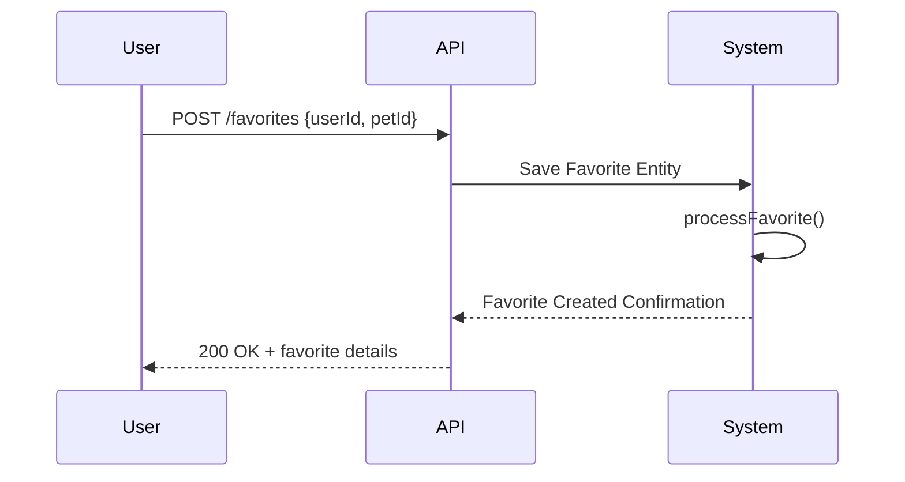

### 1. Entity Definitions

``` 
PurrfectPetsJob: 
- jobId: String (unique identifier for the job) 
- petType: String (type of pet to process, e.g., cat, dog, all) 
- status: StatusEnum (PENDING, PROCESSING, COMPLETED, FAILED) 

Pet: 
- petId: String (unique identifier for the pet) 
- name: String (pet's name) 
- type: String (species, e.g., cat, dog, bird) 
- age: Integer (pet's age in years) 
- status: StatusEnum (AVAILABLE, ADOPTED, PENDING) 

Favorite: 
- favoriteId: String (unique identifier) 
- userId: String (identifier of the user who favorites) 
- petId: String (identifier of the favorited pet) 
- status: StatusEnum (ACTIVE, REMOVED) 
```

---

### 2. Process Method Flows

```
processPurrfectPetsJob() Flow: 
1. Initial State: Job created with PENDING status 
2. Validation: Verify petType and job parameters 
3. Data Fetch: Retrieve pets from Petstore API filtered by petType 
4. Persistence: Save or update Pet entities in the system 
5. Completion: Update job status to COMPLETED or FAILED based on result 
6. Notification: Optionally notify system/users of job completion 

processPet() Flow: 
1. Initial State: New Pet entity created with AVAILABLE status 
2. Validation: Check pet details for completeness and correctness 
3. Business Logic: Possibly flag pets not available or mark adopted 
4. Completion: Confirm Pet status and persist changes 

processFavorite() Flow: 
1. Initial State: Favorite entity created with ACTIVE status 
2. Validation: Check user and pet exist and favorite is valid 
3. Persistence: Add favorite record or update status if re-favorited 
4. Completion: Confirm favorite status update 
```

---

### 3. API Endpoints Design Rules

- **POST /jobs**  
  Create a new `PurrfectPetsJob` to trigger pet data ingestion by petType (e.g., "cat", "all").  
  Request triggers `processPurrfectPetsJob()`.  
  Response returns created job details and status.  

- **POST /pets**  
  Create a new pet entry (mostly internal, triggered by job processing).  
  Triggers `processPet()`.  

- **POST /favorites**  
  Add a pet to user's favorites.  
  Triggers `processFavorite()`.  

- **GET /pets**  
  Retrieve list of pets, supporting optional filters (type, status).  

- **GET /pets/{petId}**  
  Retrieve pet details by ID.  

- **GET /favorites/{userId}**  
  Retrieve all favorites for a user.  

---

### 4. Request/Response Formats

**POST /jobs**  
Request:  
```json
{
  "petType": "cat"
}
```

Response:  
```json
{
  "jobId": "job123",
  "petType": "cat",
  "status": "PENDING"
}
```

---

**POST /favorites**  
Request:  
```json
{
  "userId": "user456",
  "petId": "pet789"
}
```

Response:  
```json
{
  "favoriteId": "fav101",
  "userId": "user456",
  "petId": "pet789",
  "status": "ACTIVE"
}
```

---

**GET /pets**  
Response:  
```json
[
  {
    "petId": "pet123",
    "name": "Whiskers",
    "type": "cat",
    "age": 3,
    "status": "AVAILABLE"
  },
  {
    "petId": "pet124",
    "name": "Fido",
    "type": "dog",
    "age": 5,
    "status": "ADOPTED"
  }
]
```

---

### Mermaid Diagrams

**Entity Lifecycle State Diagram for PurrfectPetsJob**


```mermaid
stateDiagram-v2
    [*] --> PENDING
    PENDING --> PROCESSING : processPurrfectPetsJob()
    PROCESSING --> COMPLETED : success
    PROCESSING --> FAILED : error
    COMPLETED --> [*]
    FAILED --> [*]
```

---

**Event-Driven Processing Chain**

```mermaid
graph TD
    JobCreated[PurrfectPetsJob Created]
    JobCreated -->|Triggers| ProcessJob[processPurrfectPetsJob()]
    ProcessJob -->|Fetch & Save| PetCreated[Pet Entities Created]
    PetCreated -->|Triggers| ProcessPet[processPet()]
    ProcessJob -->|Completion| JobCompleted[PurrfectPetsJob Completed]
```

---

**User Interaction Sequence Flow (Add Favorite)**


```mermaid
sequenceDiagram
    participant User
    participant API
    participant System

    User->>API: POST /favorites {userId, petId}
    API->>System: Save Favorite Entity
    System->>System: processFavorite()
    System-->>API: Favorite Created Confirmation
    API-->>User: 200 OK + favorite details
```

---

If you have any further requests or need clarifications, feel free to ask!