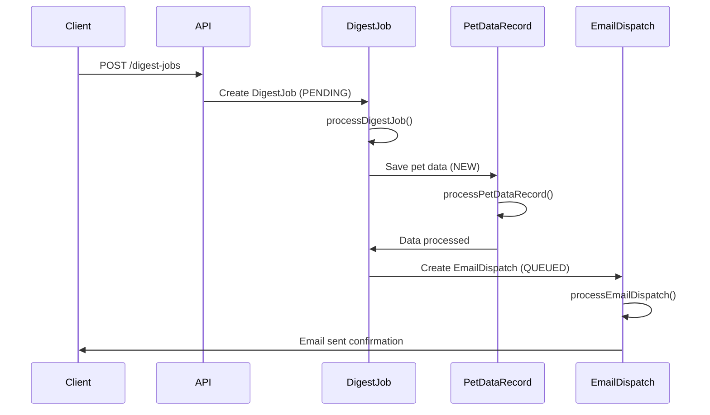
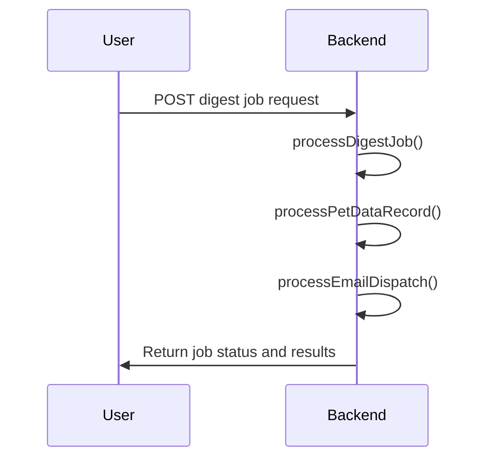

### 1. Entity Definitions

``` 
DigestJob:
- id: UUID (unique identifier for the job)
- requestTimestamp: DateTime (time when the digest request was created)
- petDataQuery: String (parameters or filters for data retrieval from petstore)
- emailRecipients: List<String> (email addresses to send the digest)
- status: StatusEnum (PENDING, PROCESSING, COMPLETED, FAILED)

PetDataRecord:
- id: UUID (unique identifier for the pet data record)
- jobId: UUID (reference to DigestJob)
- petId: Integer (pet identifier from petstore)
- name: String (pet name)
- category: String (pet category/type)
- status: StatusEnum (NEW, PROCESSED)

EmailDispatch:
- id: UUID (unique identifier for email dispatch event)
- jobId: UUID (reference to DigestJob)
- recipient: String (email address)
- subject: String (email subject)
- body: String (email content)
- status: StatusEnum (QUEUED, SENT, FAILED)
```

---

### 2. Process Method Flows

```
processDigestJob() Flow:
1. Initial State: DigestJob created with PENDING status
2. Validation: Verify query parameters & email recipients
3. Data Retrieval: Fetch pet data from https://petstore.swagger.io/ based on petDataQuery
4. Persist Data: Save retrieved pet data as PetDataRecord entities (NEW status)
5. Update DigestJob status to PROCESSING
6. Trigger processPetDataRecord() for each new PetDataRecord
7. Upon completion of all data processing, trigger processEmailDispatch()
8. Update DigestJob status to COMPLETED or FAILED based on outcomes
```

```
processPetDataRecord() Flow:
1. Initial State: PetDataRecord with NEW status
2. Transformation: Prepare data for email content
3. Update PetDataRecord status to PROCESSED
```

```
processEmailDispatch() Flow:
1. Initial State: Create EmailDispatch entities with QUEUED status for each recipient
2. Email Sending: Dispatch emails with pet data digest content
3. Update EmailDispatch status to SENT or FAILED
```

---

### 3. API Endpoints

- **POST /digest-jobs**  
  Create new DigestJob (triggers `processDigestJob()`)  
  Request JSON:  
  ```json
  {
    "petDataQuery": "available=true",
    "emailRecipients": ["user@example.com"]
  }
  ```  
  Response JSON:  
  ```json
  {
    "id": "job-uuid",
    "status": "PENDING",
    "requestTimestamp": "2024-06-01T12:00:00Z"
  }
  ```

- **GET /digest-jobs/{id}**  
  Retrieve DigestJob status and summary of results (pet data count, email dispatch status)  
  Response JSON:  
  ```json
  {
    "id": "job-uuid",
    "status": "COMPLETED",
    "petDataCount": 10,
    "emailsSent": 1
  }
  ```

- **GET /pet-data-records?jobId={jobId}**  
  Retrieve pet data records for a specific job  
  Response JSON:  
  ```json
  [
    {
      "petId": 1,
      "name": "Fluffy",
      "category": "Cat",
      "status": "PROCESSED"
    }
  ]
  ```

---

### 4. Mermaid Diagrams

Entity lifecycle state diagram for DigestJob:


```mermaid
stateDiagram-v2
    [*] --> PENDING
    PENDING --> PROCESSING : processDigestJob()
    PROCESSING --> COMPLETED : success
    PROCESSING --> FAILED : error
    COMPLETED --> [*]
    FAILED --> [*]
```

Event-driven processing chain (simplified):


```mermaid
sequenceDiagram
    participant Client
    participant API
    participant DigestJob
    participant PetDataRecord
    participant EmailDispatch

    Client->>API: POST /digest-jobs
    API->>DigestJob: Create DigestJob (PENDING)
    DigestJob->>DigestJob: processDigestJob()
    DigestJob->>PetDataRecord: Save pet data (NEW)
    PetDataRecord->>PetDataRecord: processPetDataRecord()
    PetDataRecord->>DigestJob: Data processed
    DigestJob->>EmailDispatch: Create EmailDispatch (QUEUED)
    EmailDispatch->>EmailDispatch: processEmailDispatch()
    EmailDispatch->>Client: Email sent confirmation
```

User interaction sequence flow:


```mermaid
sequenceDiagram
    participant User
    participant Backend

    User->>Backend: POST digest job request
    Backend->>Backend: processDigestJob()
    Backend->>Backend: processPetDataRecord()
    Backend->>Backend: processEmailDispatch()
    Backend->>User: Return job status and results
```

---

Please let me know if you would like me to help with the next steps, such as API implementation or event handling logic!