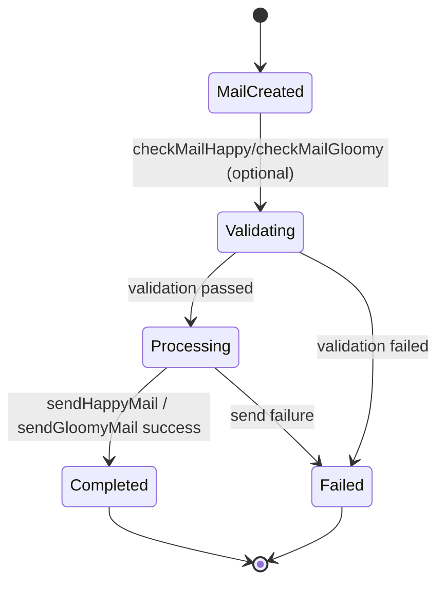
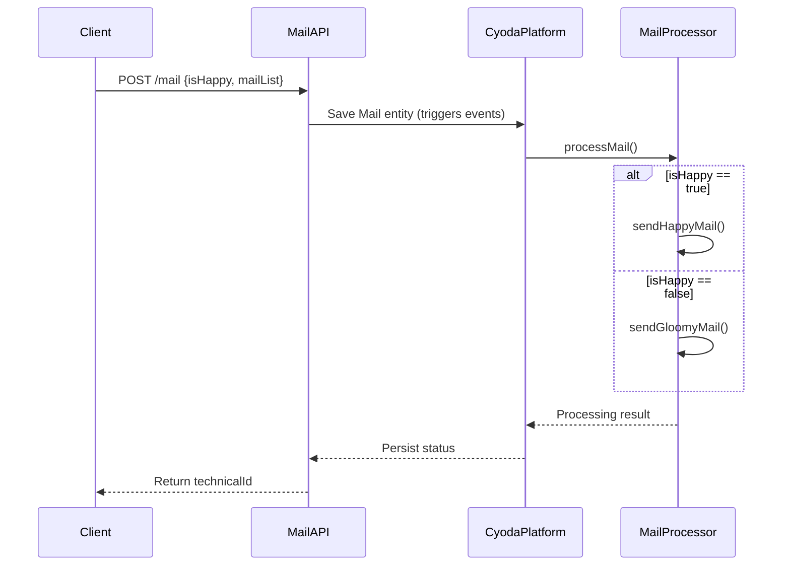
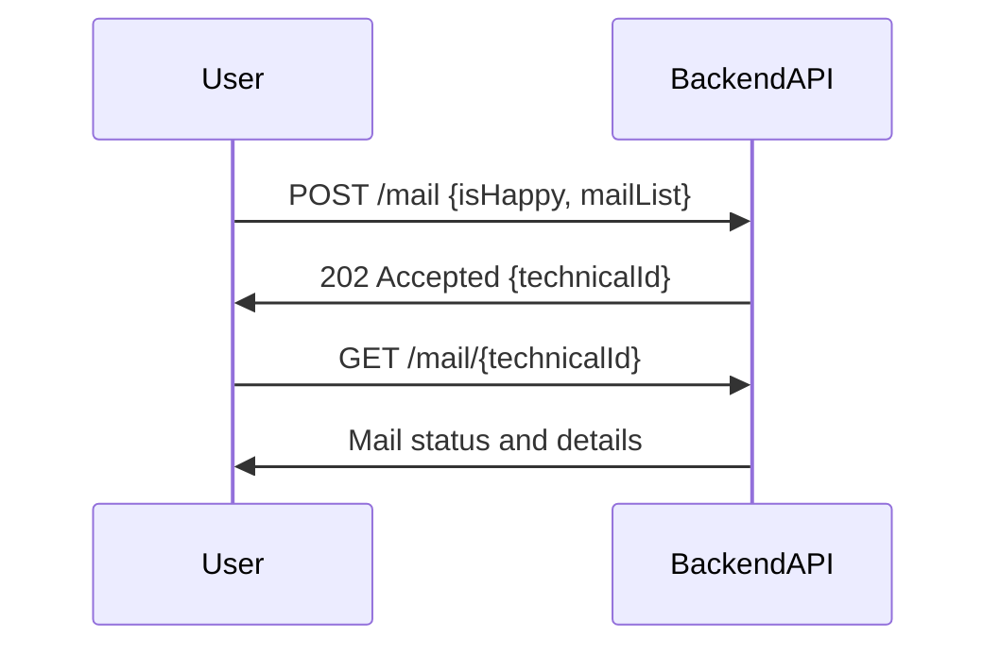

### 1. Entity Definitions

``` 
Mail:
- isHappy: Boolean (Indicates if the mail is happy or gloomy)
- mailList: List<String> (List of recipient email addresses)
```

### 2. Process Method Flows

``` 
processMail() Flow:
1. Initial State: Mail entity created with isHappy flag and mailList populated.
2. Validation: If explicitly requested, run checkMailHappy() or checkMailGloomy() criteria based on isHappy flag.
3. Processing:
   - If isHappy == true: invoke sendHappyMail() processor to send happy content mails to mailList.
   - If isHappy == false: invoke sendGloomyMail() processor to send gloomy content mails to mailList.
4. Completion: Mark mail processing completed (via event/state).
5. Notification: Optionally notify downstream systems or logs about mail sending results.
```

### 3. API Endpoints Design

| Method | Endpoint           | Description                                                      | Request Body                         | Response                      |
|--------|--------------------|-----------------------------------------------------------------|------------------------------------|-------------------------------|
| POST   | `/mail`            | Create new Mail entity (triggers processing)                    | `{ "isHappy": boolean, "mailList": ["email1", "email2"] }` | `{ "technicalId": "string" }` |
| GET    | `/mail/{technicalId}` | Retrieve stored mail entity and status                          | N/A                                | Full Mail entity + status      |

- No update or delete endpoints for `Mail` entity to preserve event history.
- No GET by condition endpoint unless explicitly requested later.

### 4. Request / Response Formats

**POST /mail Request**

```json
{
  "isHappy": true,
  "mailList": ["alice@example.com", "bob@example.com"]
}
```

**POST /mail Response**

```json
{
  "technicalId": "uuid-generated-id"
}
```

**GET /mail/{technicalId} Response**

```json
{
  "isHappy": true,
  "mailList": ["alice@example.com", "bob@example.com"],
  "status": "COMPLETED",
  "sentTimestamp": "2024-06-01T12:00:00Z"
}
```

---

### 5. Mermaid Diagrams

**Mail Entity Lifecycle State Diagram**


```mermaid
stateDiagram-v2
    [*] --> MailCreated
    MailCreated --> Validating : checkMailHappy/checkMailGloomy (optional)
    Validating --> Processing : validation passed
    Validating --> Failed : validation failed
    Processing --> Completed : sendHappyMail / sendGloomyMail success
    Processing --> Failed : send failure
    Completed --> [*]
    Failed --> [*]
```

**Event-Driven Processing Chain**


```mermaid
sequenceDiagram
    participant Client
    participant MailAPI
    participant CyodaPlatform
    participant MailProcessor

    Client->>MailAPI: POST /mail {isHappy, mailList}
    MailAPI->>CyodaPlatform: Save Mail entity (triggers events)
    CyodaPlatform->>MailProcessor: processMail()
    alt isHappy == true
        MailProcessor->>MailProcessor: sendHappyMail()
    else isHappy == false
        MailProcessor->>MailProcessor: sendGloomyMail()
    end
    MailProcessor-->>CyodaPlatform: Processing result
    CyodaPlatform-->>MailAPI: Persist status
    MailAPI-->>Client: Return technicalId
```

**User Interaction Sequence Flow**


```mermaid
sequenceDiagram
    participant User
    participant BackendAPI

    User->>BackendAPI: POST /mail {isHappy, mailList}
    BackendAPI->>User: 202 Accepted {technicalId}
    User->>BackendAPI: GET /mail/{technicalId}
    BackendAPI->>User: Mail status and details
```

---

If you need any further refinement or additional details, feel free to ask!