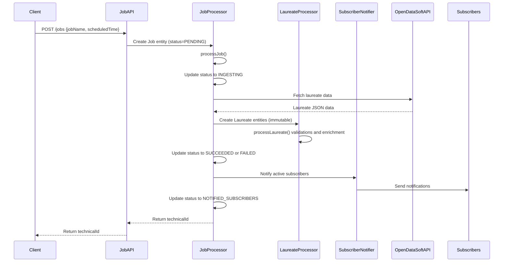
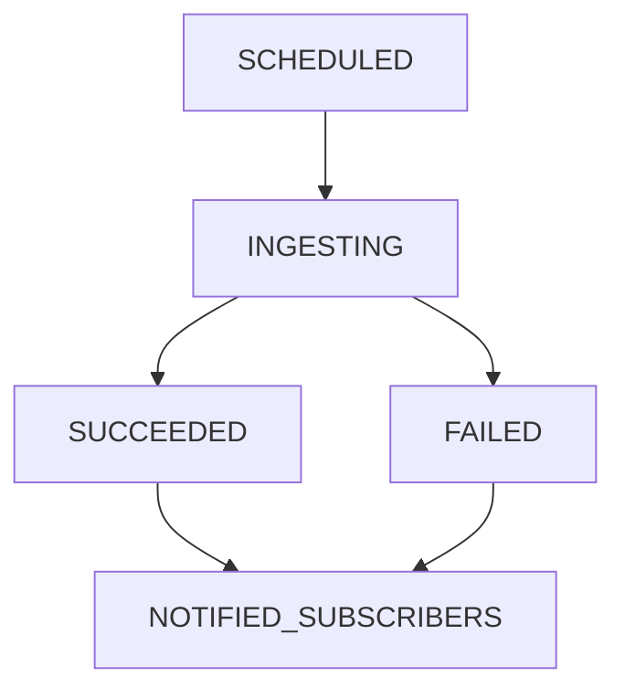

### 1. Entity Definitions

```
Job:
- jobName: String (Name/identifier of the ingestion job)
- status: String (State of the job, e.g., PENDING, INGESTING, SUCCEEDED, FAILED, NOTIFIED_SUBSCRIBERS)
- scheduledTime: String (ISO 8601 timestamp when the job was scheduled)
- startedTime: String (ISO 8601 timestamp when ingestion started)
- finishedTime: String (ISO 8601 timestamp when ingestion finished)
- errorMessage: String (Error details if ingestion or notification failed)

Laureate:
- laureateId: Integer (Unique identifier from source dataset)
- firstname: String (Laureate's first name)
- surname: String (Laureate's last name)
- gender: String (Gender of the laureate)
- born: String (ISO 8601 date of birth)
- died: String (ISO 8601 date of death or null)
- borncountry: String (Country where laureate was born)
- borncountrycode: String (Country code of birth country)
- borncity: String (Birth city)
- year: String (Year laureate received the prize)
- category: String (Prize category)
- motivation: String (Reason for award)
- affiliationName: String (Affiliation institution name)
- affiliationCity: String (Affiliation city)
- affiliationCountry: String (Affiliation country)

Subscriber:
- contactType: String (Type of contact, e.g., email, webhook)
- contactValue: String (Email address or webhook URL)
- active: Boolean (Indicates if subscriber is active for notifications)
- subscriptionPreferences: String (Optional filter criteria, e.g., categories or years)
```

---

### 2. Process Method Flows

```
processJob() Flow:
1. Initial State: Job created with status = PENDING
2. Transition status to INGESTING
3. Fetch Nobel laureates data from OpenDataSoft API
4. For each laureate record:
   - Create Laureate entity (immutable)
   - Trigger processLaureate() automatically (default processor)
5. Upon successful ingestion, update Job status to SUCCEEDED
6. If ingestion fails, update Job status to FAILED and log errorMessage
7. Trigger notification to all active Subscribers by creating notification events/entities
8. Update Job status to NOTIFIED_SUBSCRIBERS when all notifications are sent

processLaureate() Flow:
1. Validate laureate fields (trigger checkLaureateValidations if explicitly requested)
2. Enrich data (e.g., normalize country codes, calculate derived fields)
3. Persist laureate entity immutably
4. No update/delete operations by default

processSubscriber() Flow:
1. On subscriber creation, validate contact info if requested
2. Store subscriber information immutably
3. Not involved in orchestration, listens passively for notifications
```

---

### 3. API Endpoints Design

**Job API**

- `POST /jobs`
  - Request: Create new ingestion job (triggers processJob)
  - Request JSON:
    ```json
    {
      "jobName": "string",
      "scheduledTime": "string (ISO 8601)"
    }
    ```
  - Response JSON:
    ```json
    {
      "technicalId": "string"
    }
    ```

- `GET /jobs/{technicalId}`
  - Response JSON:
    ```json
    {
      "jobName": "string",
      "status": "string",
      "scheduledTime": "string",
      "startedTime": "string",
      "finishedTime": "string",
      "errorMessage": "string"
    }
    ```

**Laureate API**

- `GET /laureates/{technicalId}`
  - Response JSON:
    ```json
    {
      "laureateId": "integer",
      "firstname": "string",
      "surname": "string",
      "gender": "string",
      "born": "string",
      "died": "string",
      "borncountry": "string",
      "borncountrycode": "string",
      "borncity": "string",
      "year": "string",
      "category": "string",
      "motivation": "string",
      "affiliationName": "string",
      "affiliationCity": "string",
      "affiliationCountry": "string"
    }
    ```

- `GET /laureates` (optional, only if explicitly requested, e.g., by year or category)
  - Query params example: `?year=2010&category=Chemistry`
  - Response: List of laureate objects as above

**Subscriber API**

- `POST /subscribers`
  - Request JSON:
    ```json
    {
      "contactType": "string",
      "contactValue": "string",
      "active": true,
      "subscriptionPreferences": "string (optional)"
    }
    ```
  - Response JSON:
    ```json
    {
      "technicalId": "string"
    }
    ```

- `GET /subscribers/{technicalId}`
  - Response JSON:
    ```json
    {
      "contactType": "string",
      "contactValue": "string",
      "active": true,
      "subscriptionPreferences": "string"
    }
    ```

---

### 4. Visual Representation


```mermaid
sequenceDiagram
  participant Client
  participant JobAPI
  participant JobProcessor
  participant LaureateProcessor
  participant SubscriberNotifier
  
  Client->>JobAPI: POST /jobs {jobName, scheduledTime}
  JobAPI->>JobProcessor: Create Job entity (status=PENDING)
  JobProcessor->>JobProcessor: processJob()
  JobProcessor->>JobProcessor: Update status to INGESTING
  JobProcessor->>OpenDataSoftAPI: Fetch laureate data
  OpenDataSoftAPI-->>JobProcessor: Laureate JSON data
  JobProcessor->>LaureateProcessor: Create Laureate entities (immutable)
  LaureateProcessor->>LaureateProcessor: processLaureate() validations and enrichment
  JobProcessor->>JobProcessor: Update status to SUCCEEDED or FAILED
  JobProcessor->>SubscriberNotifier: Notify active subscribers
  SubscriberNotifier->>Subscribers: Send notifications
  JobProcessor->>JobProcessor: Update status to NOTIFIED_SUBSCRIBERS
  JobProcessor-->>JobAPI: Return technicalId
  JobAPI-->>Client: Return technicalId
```


```mermaid
graph TD
  Job_SCHEDULED["SCHEDULED"]
  Job_INGESTING["INGESTING"]
  Job_SUCCEEDED["SUCCEEDED"]
  Job_FAILED["FAILED"]
  Job_NOTIFIED["NOTIFIED_SUBSCRIBERS"]

  Job_SCHEDULED --> Job_INGESTING
  Job_INGESTING --> Job_SUCCEEDED
  Job_INGESTING --> Job_FAILED
  Job_SUCCEEDED --> Job_NOTIFIED
  Job_FAILED --> Job_NOTIFIED
```

---

This document represents the finalized functional requirements for the Nobel laureates data ingestion system using an Event-Driven Architecture approach as confirmed.