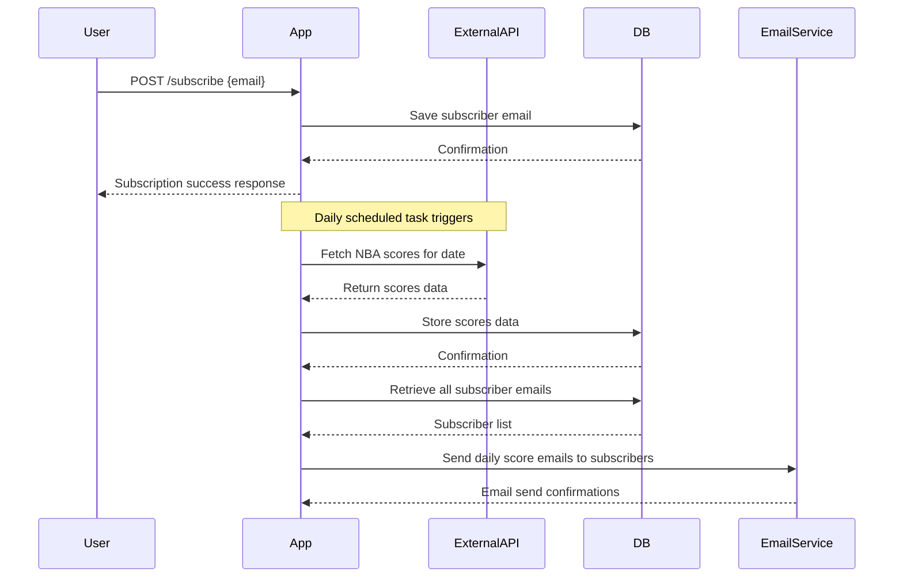
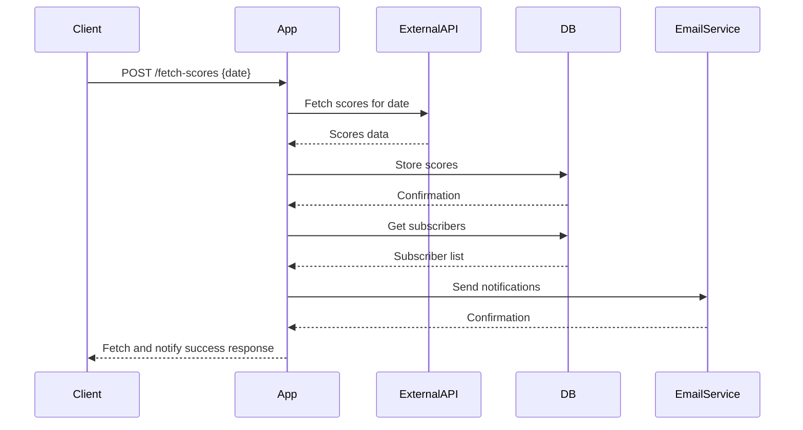

# Functional Requirements and API Design

## API Endpoints

### 1. Subscribe User  
**POST /subscribe**  
- Description: Add a user email to the subscription list.  
- Request Body:  
  ```json
  {
    "email": "user@example.com"
  }
  ```  
- Response:  
  ```json
  {
    "message": "Subscription successful",
    "email": "user@example.com"
  }
  ```  
- Business Logic: Validate email, check uniqueness, save subscriber.

---

### 2. Fetch and Store NBA Scores  
**POST /fetch-scores**  
- Description: Trigger fetching NBA scores for a specific date from external API, store in DB, and send notifications.  
- Request Body:  
  ```json
  {
    "date": "YYYY-MM-DD"
  }
  ```  
- Response:  
  ```json
  {
    "message": "Scores fetched and notifications sent",
    "date": "YYYY-MM-DD",
    "gamesCount": 10
  }
  ```  
- Business Logic: Call external NBA API, store games, send daily email notifications.

---

### 3. Get All Subscribers  
**GET /subscribers**  
- Description: Retrieve the list of all subscribed emails.  
- Response:  
  ```json
  {
    "subscribers": [
      "user1@example.com",
      "user2@example.com"
    ]
  }
  ```

---

### 4. Get All Games (with optional pagination)  
**GET /games/all?limit=20&offset=0**  
- Description: Retrieve stored NBA games data with optional pagination.  
- Response:  
  ```json
  {
    "games": [
      {
        "date": "YYYY-MM-DD",
        "homeTeam": "Team A",
        "awayTeam": "Team B",
        "homeScore": 100,
        "awayScore": 98
      }
    ],
    "limit": 20,
    "offset": 0,
    "total": 200
  }
  ```

---

### 5. Get Games by Date  
**GET /games/{date}**  
- Description: Retrieve all NBA games for a specific date.  
- Response: Same format as `/games/all` but filtered by date.

---

# Mermaid Sequence Diagram: User Subscription and Daily Score Notification Flow


```mermaid
sequenceDiagram
    participant User
    participant App
    participant ExternalAPI
    participant DB
    participant EmailService

    User->>App: POST /subscribe {email}
    App->>DB: Save subscriber email
    DB-->>App: Confirmation
    App-->>User: Subscription success response

    Note over App, ExternalAPI: Daily scheduled task triggers

    App->>ExternalAPI: Fetch NBA scores for date
    ExternalAPI-->>App: Return scores data
    App->>DB: Store scores data
    DB-->>App: Confirmation

    App->>DB: Retrieve all subscriber emails
    DB-->>App: Subscriber list

    App->>EmailService: Send daily score emails to subscribers
    EmailService-->>App: Email send confirmations
```

---

# Mermaid Sequence Diagram: Fetch Scores API Call Flow


```mermaid
sequenceDiagram
    participant Client
    participant App
    participant ExternalAPI
    participant DB
    participant EmailService

    Client->>App: POST /fetch-scores {date}
    App->>ExternalAPI: Fetch scores for date
    ExternalAPI-->>App: Scores data
    App->>DB: Store scores
    DB-->>App: Confirmation
    App->>DB: Get subscribers
    DB-->>App: Subscriber list
    App->>EmailService: Send notifications
    EmailService-->>App: Confirmation
    App-->>Client: Fetch and notify success response
```