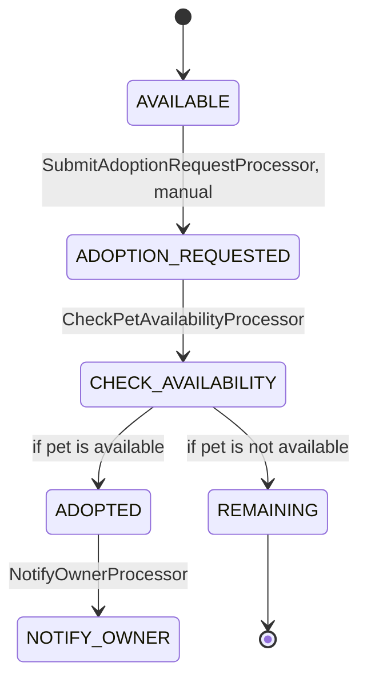
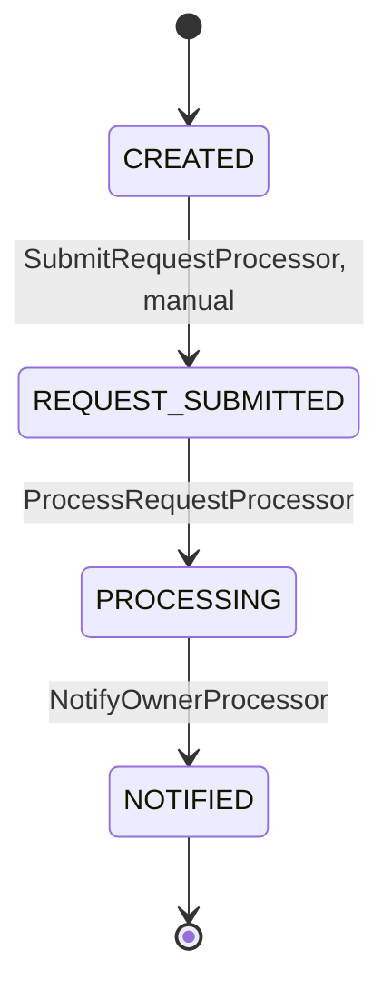
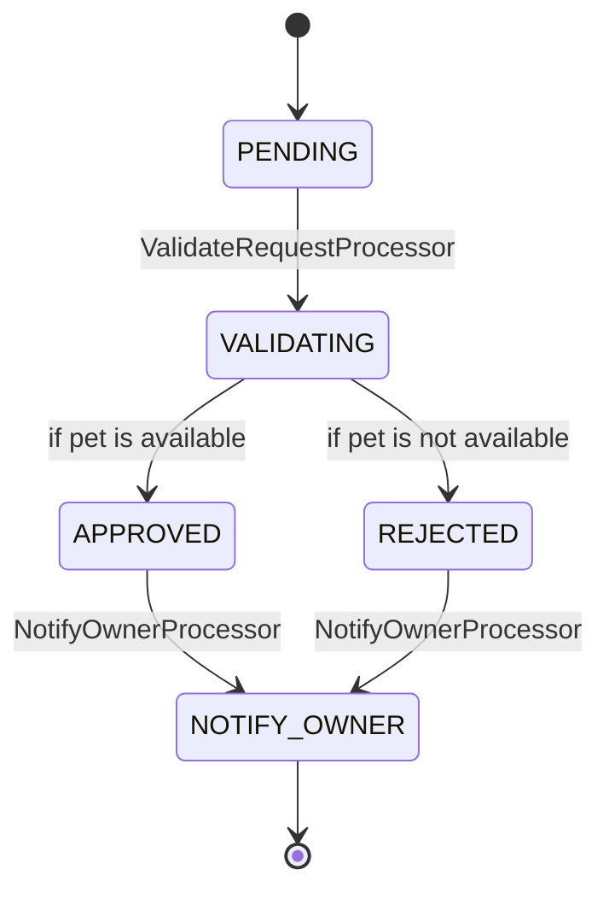

Let's define the functional requirements for your 'Purrfect Pets' API app using the Event-Driven Architecture (EDA) approach. Based on your requirement, I'll outline the entities and their workflows.

### 1. Entity Definitions
```
Pet:
- id: String (unique identifier for each pet)
- name: String (name of the pet)
- type: String (type of pet, e.g., cat, dog)
- age: Integer (age of the pet)
- status: String (adoption status, e.g., available, adopted)

Owner:
- id: String (unique identifier for each owner)
- name: String (name of the owner)
- contact: String (contact information of the owner)
- address: String (address of the owner)

AdoptionRequest:
- id: String (unique identifier for each request)
- petId: String (ID of the pet being requested for adoption)
- ownerId: String (ID of the owner requesting the pet)
- status: String (status of the request, e.g., pending, approved, rejected)
```

### 2. Entity workflows
**Pet workflow:**
1. Initial State: Pet created with AVAILABLE status
2. Adoption Request: Owner submits a request to adopt the pet
3. Approval Process: System checks if the pet is still available
4. Completion: Update status to ADOPTED or REMAINING
5. Notification: Notify owner about the adoption status


```mermaid
stateDiagram-v2
    [*] --> AVAILABLE
    AVAILABLE --> ADOPTION_REQUESTED : SubmitAdoptionRequestProcessor, manual
    ADOPTION_REQUESTED --> CHECK_AVAILABILITY : CheckPetAvailabilityProcessor
    CHECK_AVAILABILITY --> ADOPTED : if pet is available
    CHECK_AVAILABILITY --> REMAINING : if pet is not available
    ADOPTED --> NOTIFY_OWNER : NotifyOwnerProcessor
    REMAINING --> [*]
```

**Owner workflow:**
1. Initial State: Owner created
2. Request Submission: Owner submits an adoption request
3. Processing: System processes the request
4. Completion: Owner is notified of the request status


```mermaid
stateDiagram-v2
    [*] --> CREATED
    CREATED --> REQUEST_SUBMITTED : SubmitRequestProcessor, manual
    REQUEST_SUBMITTED --> PROCESSING : ProcessRequestProcessor
    PROCESSING --> NOTIFIED : NotifyOwnerProcessor
    NOTIFIED --> [*]
```

**AdoptionRequest workflow:**
1. Initial State: Request created with PENDING status
2. Validation: Validate the request data
3. Approval: Check if the pet is available for adoption
4. Finalization: Update request status to APPROVED or REJECTED
5. Notification: Notify owner about the request outcome


```mermaid
stateDiagram-v2
    [*] --> PENDING
    PENDING --> VALIDATING : ValidateRequestProcessor
    VALIDATING --> APPROVED : if pet is available
    VALIDATING --> REJECTED : if pet is not available
    APPROVED --> NOTIFY_OWNER : NotifyOwnerProcessor
    REJECTED --> NOTIFY_OWNER : NotifyOwnerProcessor
    NOTIFY_OWNER --> [*]
```

### 3. Pseudo code for processor classes
- **SubmitAdoptionRequestProcessor**: Handles the submission of an adoption request.
- **CheckPetAvailabilityProcessor**: Validates if the pet is still available for adoption.
- **NotifyOwnerProcessor**: Notifies the owner about the status of the adoption or request.
- **ValidateRequestProcessor**: Validates the adoption request details.
- **ProcessRequestProcessor**: Manages the processing of the adoption request.

### 4. API Endpoints Design Rules
- **POST /pets**: Creates a new pet and triggers the pet workflow. Returns only the technicalId.
    ```json
    {
        "technicalId": "123456"
    }
    ```

- **GET /pets/{technicalId}**: Retrieves a pet by its technicalId.
    ```json
    {
        "id": "123",
        "name": "Fluffy",
        "type": "cat",
        "age": 2,
        "status": "available"
    }
    ```

- **POST /adoptionRequests**: Creates a new adoption request and triggers the request workflow. Returns only the technicalId.
    ```json
    {
        "technicalId": "654321"
    }
    ```

- **GET /adoptionRequests/{technicalId}**: Retrieves an adoption request by its technicalId.
    ```json
    {
        "id": "456",
        "petId": "123",
        "ownerId": "789",
        "status": "pending"
    }
    ```

This structure provides a clear outline of the entities and their workflows, adhering to your requirements for the 'Purrfect Pets' API app. Let me know if you need any further adjustments!