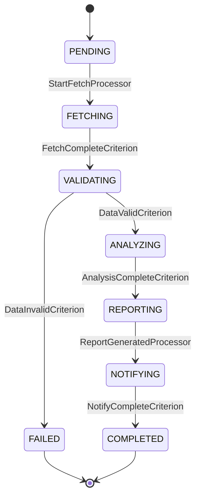
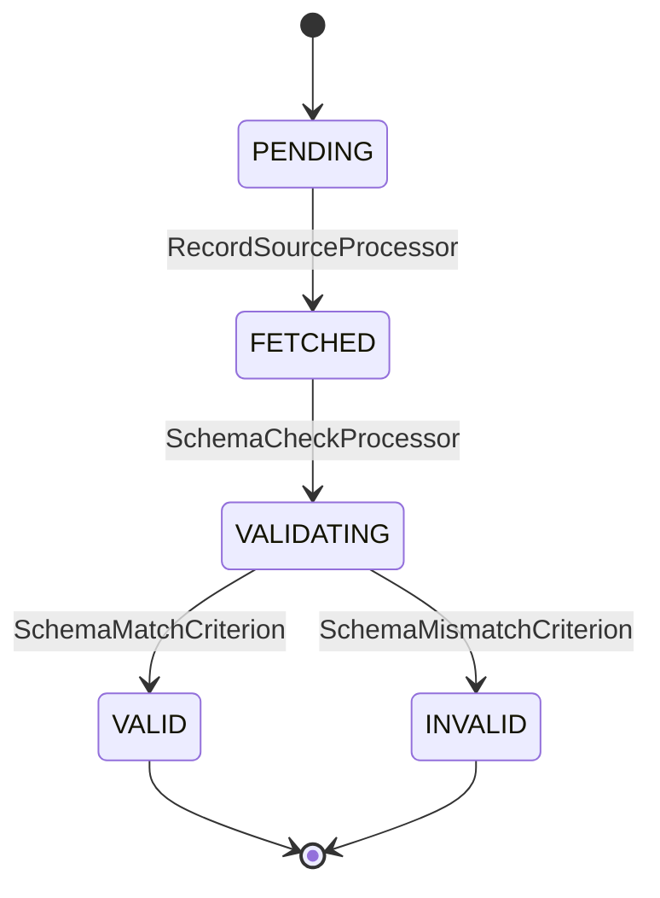
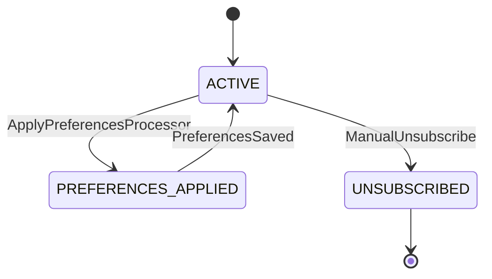

### 1. Entity Definitions
```
DataSource:
- id: String (internal id of this data source record)
- url: String (source URL to fetch CSV)
- last_fetched_at: String (timestamp of last fetch)
- schema: String (serialized schema/columns)
- validation_status: String (VALID/INVALID)
- sample_hash: String (content fingerprint)

ReportJob:
- job_id: String (internal id, POST creates this orchestration entity)
- data_source_url: String (URL to process)
- trigger_type: String (manual/scheduled/on_change)
- requested_metrics: String (specification of analytics to run)
- status: String (PENDING/FETCHING/VALIDATING/ANALYZING/REPORTING/NOTIFYING/COMPLETED/FAILED)
- report_location: String (where generated report is stored)
- generated_at: String (timestamp)
- notify_filters: String (subscriber filter rules)

Subscriber:
- subscriber_id: String (internal id)
- email: String (recipient address)
- name: String (display name)
- frequency: String (daily/weekly/on_change)
- filters: String (areas/price/bedrooms preferences)
- status: String (ACTIVE/UNSUBSCRIBED)
```

### 2. Entity workflows

ReportJob workflow:
1. Initial State: job persisted with PENDING
2. Fetching: system fetches CSV -> state FETCHING
3. Validation: validate schema and content -> VALIDATING
4. Analysis: run analytics and build report -> ANALYZING
5. Reporting: generate report artifact -> REPORTING
6. Notification: select subscribers and send report -> NOTIFYING
7. Completion: COMPLETED or FAILED
Processors: FetchDataProcessor, ValidateDataProcessor, AnalyzeDataProcessor, GenerateReportProcessor, NotifySubscribersProcessor
Criteria: DataValidCriterion, AnalysisCompleteCriterion


```mermaid
stateDiagram-v2
    [*] --> PENDING
    PENDING --> FETCHING : StartFetchProcessor
    FETCHING --> VALIDATING : FetchCompleteCriterion
    VALIDATING --> ANALYZING : DataValidCriterion
    VALIDATING --> FAILED : DataInvalidCriterion
    ANALYZING --> REPORTING : AnalysisCompleteCriterion
    REPORTING --> NOTIFYING : ReportGeneratedProcessor
    NOTIFYING --> COMPLETED : NotifyCompleteCriterion
    FAILED --> [*]
    COMPLETED --> [*]
```

DataSource workflow:
1. Created by system (on fetch) PENDING
2. Fetch recorded -> FETCHED
3. Schema/health check -> VALID or INVALID
4. If VALID stored for reuse
Processors: RecordSourceProcessor, SchemaCheckProcessor, HealthCheckProcessor
Criteria: SchemaMatchCriterion


```mermaid
stateDiagram-v2
    [*] --> PENDING
    PENDING --> FETCHED : RecordSourceProcessor
    FETCHED --> VALIDATING : SchemaCheckProcessor
    VALIDATING --> VALID : SchemaMatchCriterion
    VALIDATING --> INVALID : SchemaMismatchCriterion
    VALID --> [*]
    INVALID --> [*]
```

Subscriber workflow:
1. Persisted (manual add) -> ACTIVE
2. Preferences validated -> PREFERENCES_APPLIED
3. Unsubscribe is manual -> UNSUBSCRIBED
Processors: ValidateSubscriberProcessor, ApplyPreferencesProcessor, DeactivateSubscriberProcessor
Criteria: ValidEmailCriterion


```mermaid
stateDiagram-v2
    [*] --> ACTIVE
    ACTIVE --> PREFERENCES_APPLIED : ApplyPreferencesProcessor
    PREFERENCES_APPLIED --> ACTIVE : PreferencesSaved
    ACTIVE --> UNSUBSCRIBED : ManualUnsubscribe
    UNSUBSCRIBED --> [*]
```

### 3. Pseudo code for processor classes (concise)

FetchDataProcessor:
```
class FetchDataProcessor:
  process(job):
    download = fetch(job.data_source_url)
    write temp storage
    record DataSource with sample_hash and last_fetched_at
    return success/failure
```

ValidateDataProcessor:
```
class ValidateDataProcessor:
  process(job):
    load sample
    check required columns and row counts
    if ok set DataSource.validation_status = VALID else INVALID
```

AnalyzeDataProcessor:
```
class AnalyzeDataProcessor:
  process(job):
    compute metrics as requested
    produce visuals metadata
    mark analysis result location
```

GenerateReportProcessor:
```
class GenerateReportProcessor:
  process(job):
    assemble summary + metrics + visuals
    store report -> set job.report_location and generated_at
```

NotifySubscribersProcessor:
```
class NotifySubscribersProcessor:
  process(job):
    find subscribers matching job.notify_filters and frequency
    for each subscriber create delivery event and attempt send
    record delivery outcome
```

Criteria examples:
- DataValidCriterion: check DataSource.validation_status == VALID
- AnalysisCompleteCriterion: check analysis results exist and metrics computed
- ValidEmailCriterion: basic email format check

### 4. API Endpoints Design Rules

- Create ReportJob (orchestration) — POST triggers EDA processing. Returns only technicalId.

POST /jobs/report
```json
{
  "data_source_url": "https://raw.githubusercontent.com/.../london_houses.csv",
  "trigger_type": "manual",
  "requested_metrics": "avg_price,median_price,price_by_bedrooms,distribution_by_area",
  "notify_filters": "frequency=weekly;area=All",
  "schedule": null
}
```
Response (must return only technicalId)
```json
"technicalId-12345"
```

GET job by technicalId
GET /jobs/report/{technicalId}
```json
{
  "job_id": "job-abc",
  "status": "ANALYZING",
  "data_source_url": "...",
  "report_location": null,
  "generated_at": null
}
```

GET DataSource by id
GET /data-source/{id}
```json
{
  "id": "ds-1",
  "url": "...",
  "last_fetched_at": "2025-08-01T12:00:00Z",
  "validation_status": "VALID",
  "schema": "columns..."
}
```

GET Subscriber by id
GET /subscriber/{id}
```json
{
  "subscriber_id": "sub-1",
  "email": "user@example.com",
  "name": "Alice",
  "frequency": "weekly",
  "status": "ACTIVE",
  "filters": "area=NW"
}
```

Notes / assumptions:
- Only ReportJob has POST (creates orchestration event). DataSource and Subscriber are persisted by processors or admin actions (no POST endpoints added).
- All entity persistence triggers Cyoda workflows automatically.
- If you want additional entities (e.g., separate AnalysisReport), or POST endpoints for Subscriber management, say so and I will expand up to 10 entities.