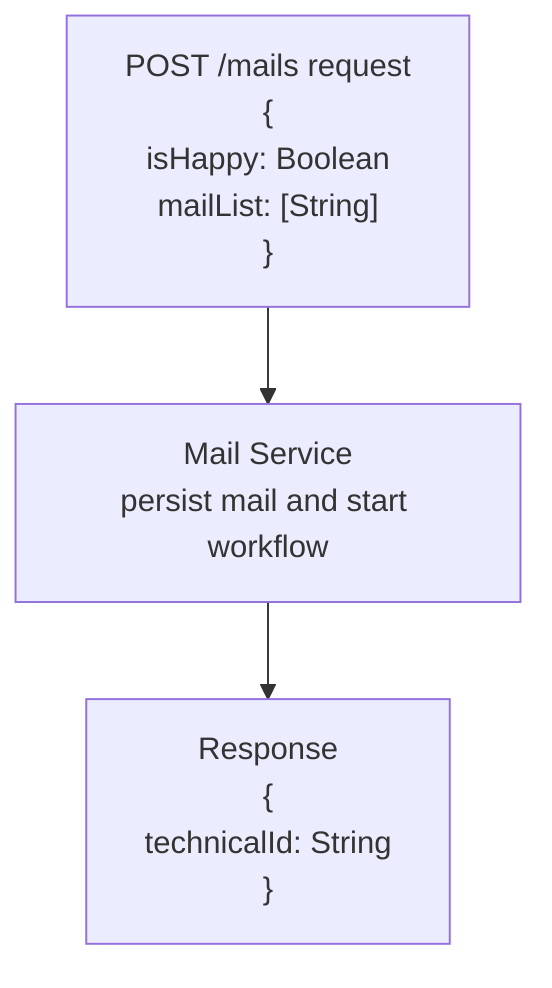
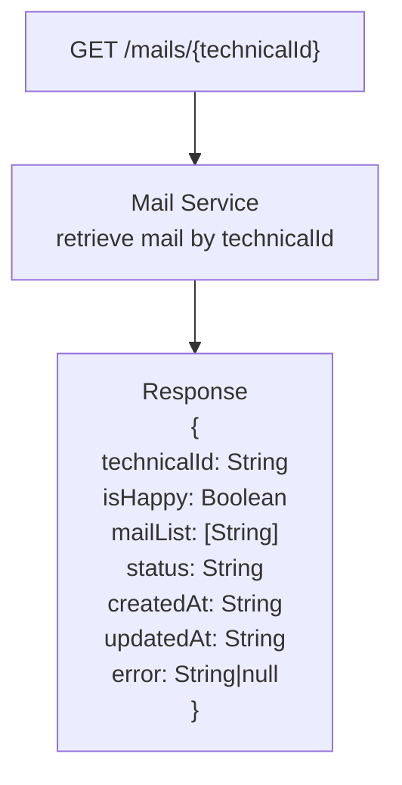

# Functional Requirements (Final)

- Build an app that sends happy mails with one entity 'mail'.
  - It has 2 fields: 'isHappy' and 'mailList'
  - It has 2 processors: 'sendHapppyMail' and 'sendGloomyMail'
  - along with 2 criteria to define if the mail is happy or gloomy

- Programming language / tool specified by the user (as provided):
  - use java
  - java

---

### 1. Entity Definitions

Mail:
- isHappy: Boolean (indicates whether this mail should be treated as happy or not; used by criteria to route processing)
- mailList: List<String> (list of recipient email addresses)

Programming language / tool specified by the user (as provided):
- use java
- java

---

### 2. Entity workflows

Mail workflow:
1. Initial State: Mail entity is created / persisted in datastore (CREATED)
   - Persistence of the entity is an EVENT that triggers the Mail workflow automatically.
2. Evaluation: Run criteria to determine whether the mail is happy or gloomy (EVALUATION)
   - isHappyCriterion evaluates mail.isHappy and/or other mail content to decide.
   - isGloomyCriterion evaluates the opposite condition.
   - These are automatic system-triggered transitions.
3. Selected Branch:
   - HAPPY branch: If isHappyCriterion passes → schedule sending via sendHapppyMail processor (SENDING_HAPPY)
   - GLOOMY branch: If isGloomyCriterion passes → schedule sending via sendGloomyMail processor (SENDING_GLOOMY)
4. Sending: Processor executes sending logic; on success move to SENT, on failure move to FAILED.
5. Completion: SENT or FAILED ends the workflow for this entity.

Entity state diagrams


```mermaid
stateDiagram-v2
    [*] --> CREATED
    CREATED --> EVALUATION : "OnPersist start workflow"
    EVALUATION --> HAPPY : "isHappyCriterion true"
    EVALUATION --> GLOOMY : "isGloomyCriterion true"
    HAPPY --> SENDING_HAPPY : "sendHapppyMail processor automatic"
    GLOOMY --> SENDING_GLOOMY : "sendGloomyMail processor automatic"
    SENDING_HAPPY --> SENT : "on success"
    SENDING_GLOOMY --> SENT : "on success"
    SENDING_HAPPY --> FAILED : "on failure"
    SENDING_GLOOMY --> FAILED : "on failure"
    SENT --> [*]
    FAILED --> [*]
```

Criterion and processor classes needed (names and purpose):
- Criteria
  - IsHappyCriterion (Java class): evaluates Mail entity and returns true when mail should be treated as happy (e.g., mail.isHappy == true)
  - IsGloomyCriterion (Java class): evaluates Mail entity and returns true when mail should be treated as gloomy (e.g., mail.isHappy == false)
- Processors
  - sendHapppyMail (Java class) — processor that sends happy mail (NOTE: preserve exact provided name sendHapppyMail)
  - sendGloomyMail (Java class) — processor that sends gloomy mail

Behavioral notes (business logic):
- Entity persistence of Mail triggers the process method / workflow automatically (Event-Driven Architecture). The system must call criteria and processors as part of workflow transitions.
- The process method does the heavy lifting once entity is persisted: evaluate criteria, invoke appropriate processor, handle success/failure, and persist resulting status.

---

### 3. Pseudo code for processor classes

Note: Use Java. Preserve class and processor names exactly as specified.

Pseudo-code: Criteria classes

```java
public class IsHappyCriterion {
    // returns true if mail should be processed as happy
    public boolean evaluate(Mail mail) {
        // business rule: use isHappy field
        return Boolean.TRUE.equals(mail.getIsHappy());
    }
}
```

```java
public class IsGloomyCriterion {
    // returns true if mail should be processed as gloomy
    public boolean evaluate(Mail mail) {
        // business rule: not happy -> gloomy
        return !Boolean.TRUE.equals(mail.getIsHappy());
    }
}
```

Pseudo-code: Processor classes

```java
public class sendHapppyMail {
    // triggered automatically when IsHappyCriterion passes
    public void process(Mail mail) {
        try {
            // Example sending logic (synchronous or enqueue async)
            for (String to : mail.getMailList()) {
                // call to Java mail library or external email service
                // e.g., EmailClient.sendHappyEmail(to, mailContent);
            }
            // update mail status to SENT in datastore
            // persistSentStatus(mail);
        } catch (Exception e) {
            // update mail status to FAILED and record error
            // persistFailedStatus(mail, e);
        }
    }
}
```

```java
public class sendGloomyMail {
    // triggered automatically when IsGloomyCriterion passes
    public void process(Mail mail) {
        try {
            for (String to : mail.getMailList()) {
                // call to Java mail library or external email service
                // e.g., EmailClient.sendGloomyEmail(to, mailContent);
            }
            // update mail status to SENT in datastore
            // persistSentStatus(mail);
        } catch (Exception e) {
            // update mail status to FAILED and record error
            // persistFailedStatus(mail, e);
        }
    }
}
```

Processor invocation notes:
- The system that persists Mail must start the Mail workflow and call IsHappyCriterion and IsGloomyCriterion (in evaluation step).
- Depending on criterion result, the system must call sendHapppyMail.process(mail) or sendGloomyMail.process(mail).
- Processors should handle retries, error recording, and update persisted status to SENT or FAILED.

---

### 4. API Endpoints Design Rules

- POST endpoints: Entity creation (triggers events) + business logic.
  - POST endpoint that adds an entity should return only entity technicalId - this field is not included in the entity itself, it's a datastore imitated specific field. Nothing else.
- GET endpoints: ONLY for retrieving stored application results.
- GET by technicalId: ONLY for retrieving stored application results by technicalId - should be present for all entities that are created via POST endpoints.
- GET by condition: ONLY for retrieving stored application results by non-technicalId fields - should be present only if explicitly asked by the user.
- GET all: optional.
- If you have an orchestration entity (like Job, Task, Workflow), it should have a POST endpoint to create it, and a GET by technicalId to retrieve it. You will most likely not need any other POST endpoints for business entities as saving business entity is done via the process method.
- Business logic rule: External data sources, calculations, processing → POST endpoints

API endpoints for Mail entity (per rules and EDA behavior):

1) Create Mail (POST) — triggers the event/workflow
- Endpoint: POST /mails
- Behavior: Persist Mail entity, start Mail workflow automatically, return only technicalId string.
- Request JSON:
  - Fields: isHappy (Boolean), mailList (array of strings)
- Response JSON:
  - { "technicalId": "string" }  // only this field

Mermaid visualization for POST request/response


```mermaid
graph TD
  POST_Request["POST /mails request\n{\n  isHappy: Boolean\n  mailList: [String]\n}"]
  Mail_Service["Mail Service\npersist mail and start workflow"]
  POST_Response["Response\n{\n  technicalId: String\n}"]
  POST_Request --> Mail_Service
  Mail_Service --> POST_Response
```

2) Retrieve Mail by technicalId (GET)
- Endpoint: GET /mails/{technicalId}
- Behavior: Return stored Mail record including persisted status (CREATED / SENDING_HAPPY / SENDING_GLOOMY / SENT / FAILED) and any metadata (timestamps, error info). This is a retrieval-only endpoint.
- Response JSON (example structure):
  - {
      "technicalId": "string",
      "isHappy": true|false,
      "mailList": ["a@example.com"],
      "status": "CREATED|EVALUATION|SENDING_HAPPY|SENDING_GLOOMY|SENT|FAILED",
      "createdAt": "ISO8601 timestamp",
      "updatedAt": "ISO8601 timestamp",
      "error": "string or null"
    }

Mermaid visualization for GET by technicalId request/response


```mermaid
graph TD
  GET_Request["GET /mails/{technicalId}"]
  Mail_Service_Get["Mail Service\nretrieve mail by technicalId"]
  GET_Response["Response\n{\n  technicalId: String\n  isHappy: Boolean\n  mailList: [String]\n  status: String\n  createdAt: String\n  updatedAt: String\n  error: String|null\n}"]
  GET_Request --> Mail_Service_Get
  Mail_Service_Get --> GET_Response
```

3) GET all mails (optional)
- Endpoint: GET /mails
- Behavior: Optional listing of stored mails (pagination recommended). Not required by rules but allowed.

Request/response format notes:
- POST /mails request exactly contains the Mail fields (isHappy, mailList). The returned response for POST must contain only technicalId according to rules.
- GET endpoints return stored application results (full persisted structure including technicalId and status).

Implementation notes for endpoints:
- POST /mails:
  - Persist the Mail entity (Mail object does not include technicalId field; datastore generates technicalId).
  - After persistence, event-driven workflow must be triggered automatically by the system (process method).
  - Return the generated technicalId only.
- GET /mails/{technicalId}:
  - Query datastore for the persistent record and return full stored representation including status and metadata.

---

All items above are strictly based on the provided user requirement:
- Build an app that sends happy mails with one entity 'mail'.
  - It has 2 fields: 'isHappy' and 'mailList'
  - It has 2 processors: 'sendHapppyMail' and 'sendGloomyMail'
  - along with 2 criteria to define if the mail is happy or gloomy

Programming language / tool specified by the user (as provided):
- use java
- java