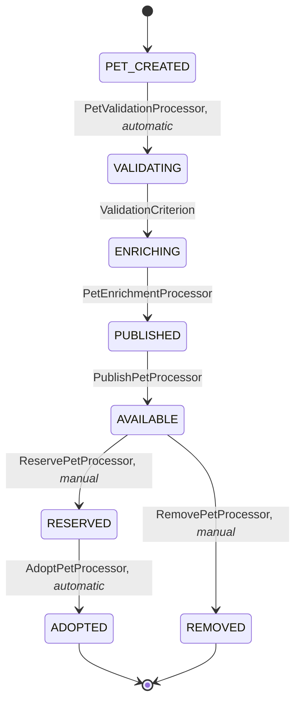
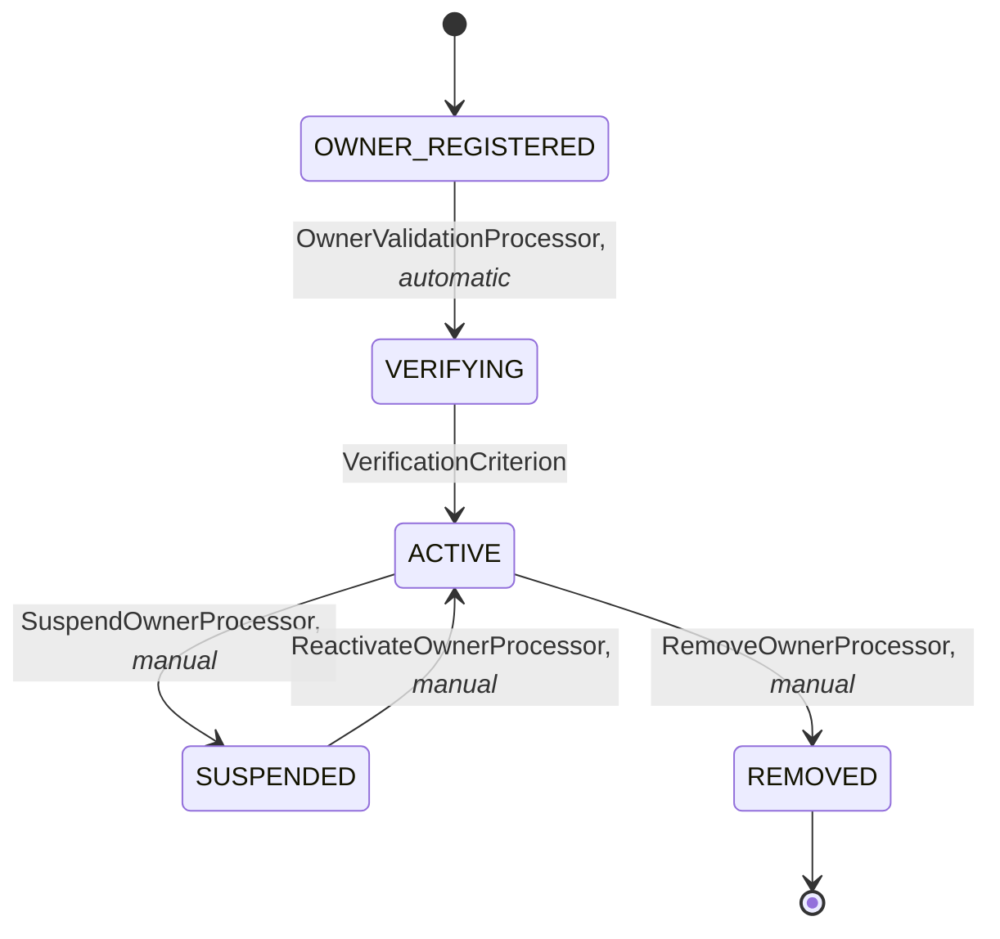
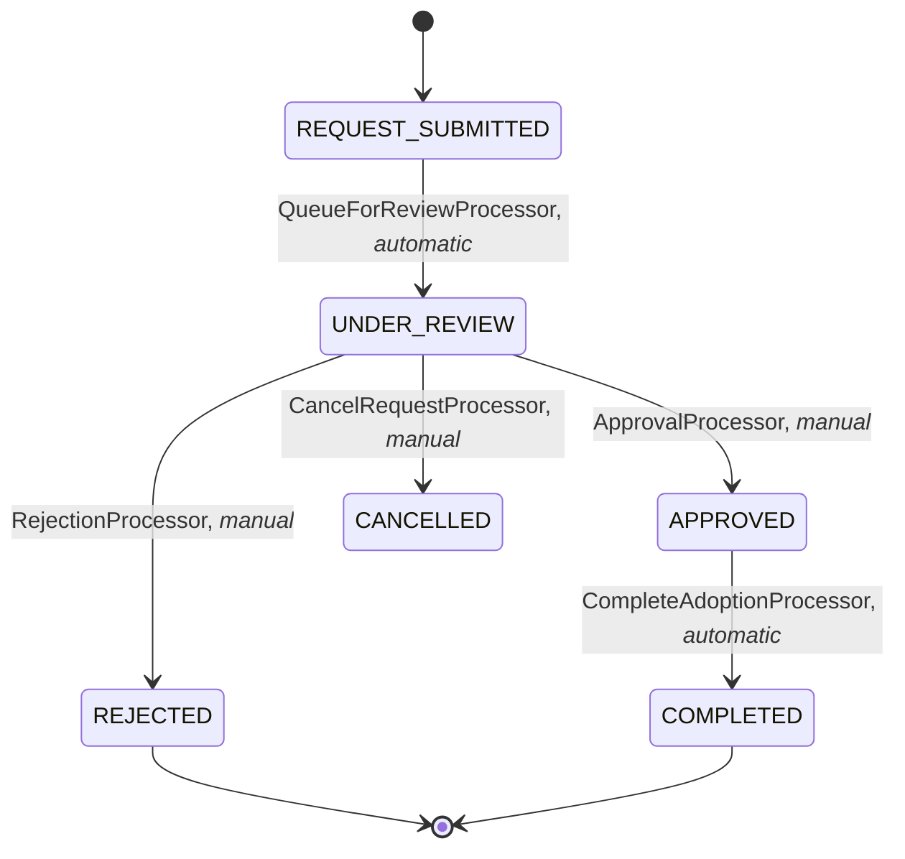

### 1. Entity Definitions

```
Pet:
- id: String (business id from source, optional)
- name: String (pet name)
- species: String (dog/cat/etc.)
- breed: String (breed description)
- age: Integer (years or months)
- gender: String (male/female/unknown)
- status: String (available/reserved/adopted)
- photos: Array<String> (URLs)
- description: String (short bio)
- healthNotes: String (vaccinations, conditions)
- location: String (shelter location or city)
- source: String (origin e.g., Petstore API, manual)

Owner:
- ownerId: String (business id)
- name: String (full name)
- contactInfo: Object (email, phone)
- address: String (optional)
- savedPets: Array<String> (pet ids)
- adoptedPets: Array<String> (pet ids)
- role: String (user/admin/staff)
- verificationStatus: String (unverified/pending/verified)

AdoptionRequest:
- requestId: String (business id)
- petId: String (target pet id)
- requesterId: String (ownerId)
- submittedAt: String (timestamp)
- status: String (submitted/under_review/approved/rejected/cancelled/completed)
- notes: String (user notes)
- decisionAt: String (timestamp of decision)
- reviewerId: String (ownerId of staff/admin)
```

---

### 2. Entity workflows

Pet workflow:
1. Initial State: PET_CREATED when entity persisted (event)
2. Validation: Validate required fields and source mappings (automatic)
3. Enrichment: Enrich from Petstore API data or photos processing (automatic)
4. Publish: Mark AVAILABLE or set status based on business rules (automatic)
5. Reservation/Adoption: status changes to RESERVED → ADOPTED (manual by staff or automatic on approved AdoptionRequest)
6. Archive: If removed or duplicate, mark REMOVED (manual)


```mermaid
stateDiagram-v2
    [*] --> PET_CREATED
    PET_CREATED --> VALIDATING : PetValidationProcessor, *automatic*
    VALIDATING --> ENRICHING : ValidationCriterion
    ENRICHING --> PUBLISHED : PetEnrichmentProcessor
    PUBLISHED --> AVAILABLE : PublishPetProcessor
    AVAILABLE --> RESERVED : ReservePetProcessor, *manual*
    RESERVED --> ADOPTED : AdoptPetProcessor, *automatic*
    AVAILABLE --> REMOVED : RemovePetProcessor, *manual*
    ADOPTED --> [*]
    REMOVED --> [*]
```

Pet workflow processors/criteria:
- Processors: PetValidationProcessor, PetEnrichmentProcessor, PublishPetProcessor, ReservePetProcessor, AdoptPetProcessor
- Criteria: ValidationCriterion (required fields), DuplicatePetCriterion (source dedupe)
- Processor pseudo behavior: validate fields, map source attributes, update status, emit notifications to Owner/Staff.

Owner workflow:
1. Initial State: OWNER_REGISTERED on persist (event)
2. Verify: Run verification checks (automatic or manual if flagged)
3. Active: Set ACTIVE when verification succeeds
4. Suspended: Manual suspension by admin
5. Reactivate/Remove: Manual transitions


```mermaid
stateDiagram-v2
    [*] --> OWNER_REGISTERED
    OWNER_REGISTERED --> VERIFYING : OwnerValidationProcessor, *automatic*
    VERIFYING --> ACTIVE : VerificationCriterion
    ACTIVE --> SUSPENDED : SuspendOwnerProcessor, *manual*
    SUSPENDED --> ACTIVE : ReactivateOwnerProcessor, *manual*
    ACTIVE --> REMOVED : RemoveOwnerProcessor, *manual*
    REMOVED --> [*]
```

Owner workflow processors/criteria:
- Processors: OwnerValidationProcessor, NotifyVerificationProcessor, SuspendOwnerProcessor
- Criteria: VerificationCriterion (email/phone format), RiskCheckCriterion (optional)

AdoptionRequest workflow:
1. Initial State: REQUEST_SUBMITTED when persisted (event)
2. Review: System queues request for staff review (automatic)
3. Decision: Manual approval or rejection by staff
4. Completion: On approval, Pet status transitions to ADOPTED and request to COMPLETED; on rejection set REJECTED
5. Cancelled: Requester may cancel before decision


```mermaid
stateDiagram-v2
    [*] --> REQUEST_SUBMITTED
    REQUEST_SUBMITTED --> UNDER_REVIEW : QueueForReviewProcessor, *automatic*
    UNDER_REVIEW --> APPROVED : ApprovalProcessor, *manual*
    UNDER_REVIEW --> REJECTED : RejectionProcessor, *manual*
    APPROVED --> COMPLETED : CompleteAdoptionProcessor, *automatic*
    REJECTED --> [*]
    UNDER_REVIEW --> CANCELLED : CancelRequestProcessor, *manual*
    COMPLETED --> [*]
```

AdoptionRequest processors/criteria:
- Processors: QueueForReviewProcessor, ApprovalProcessor, RejectionProcessor, CompleteAdoptionProcessor, NotifyRequesterProcessor
- Criteria: EligibilityCriterion (owner eligibility, pet availability), DuplicateRequestCriterion

---

### 3. Pseudo code for processor classes

Note: these are high-level pseudo implementations that represent Cyoda processors invoked when entities are persisted.

PetValidationProcessor
```
class PetValidationProcessor {
  process(pet) {
    if (!pet.name || !pet.species) throw ValidationError
    if (DuplicatePetCriterion.matches(pet)) mark REMOVED and emit DuplicateFound
    return pet
  }
}
```

PetEnrichmentProcessor
```
class PetEnrichmentProcessor {
  process(pet) {
    if (pet.source == 'PetstoreAPI') {
      // fetch additional details from source mapping data (external call)
      pet.photos = pet.photos || fetchPhotos(pet.id)
    }
    normalizeAge(pet)
    return pet
  }
}
```

PublishPetProcessor
```
class PublishPetProcessor {
  process(pet) {
    pet.status = computeInitialStatus(pet)
    persist(pet)
    NotifyStaffIfHighPriorityProcessor.process(pet)
  }
}
```

OwnerValidationProcessor
```
class OwnerValidationProcessor {
  process(owner) {
    if (!isValidContact(owner.contactInfo)) mark verificationStatus = pending
    else verificationStatus = verified
    persist(owner)
  }
}
```

QueueForReviewProcessor (AdoptionRequest)
```
class QueueForReviewProcessor {
  process(request) {
    if (!EligibilityCriterion.matches(request)) mark request.status = REJECTED
    else enqueueReviewTicket(request)
  }
}
```

ApprovalProcessor / CompleteAdoptionProcessor
```
class ApprovalProcessor {
  process(request, reviewer) {
    request.status = APPROVED
    request.reviewerId = reviewer.id
    persist(request)
  }
}
class CompleteAdoptionProcessor {
  process(request) {
    // atomic: set pet.status = ADOPTED, add pet to owner.adoptedPets
    updatePetStatus(request.petId, ADOPTED)
    addAdoptedPetToOwner(request.requesterId, request.petId)
    request.status = COMPLETED
    persist(request)
    NotifyRequesterProcessor.process(request)
  }
}
```

Criteria examples:
- ValidationCriterion: checks mandatory fields
- DuplicatePetCriterion: fuzzy match on name+breed+location + source id
- EligibilityCriterion: owner verification and pet.status == AVAILABLE

---

### 4. API Endpoints Design Rules

- POST endpoints create entities (trigger Cyoda workflows). Response MUST return only technicalId.
- GET by technicalId returns stored application result.
- GET all allowed for Pet (optional). No GET by condition unless explicitly requested.

Endpoints:

1) Create Pet (triggers ingestion/validation/enrichment)
POST /pets
Request:
```json
{
  "id": "optional-source-id",
  "name": "Mittens",
  "species": "cat",
  "breed": "Tabby",
  "age": 2,
  "gender": "female",
  "photos": ["https://..."],
  "description": "Playful cat",
  "healthNotes": "Vaccinated",
  "location": "Shelter A",
  "source": "PetstoreAPI"
}
```
Response:
```json
{ "technicalId": "pet-technical-12345" }
```

GET /pets/{technicalId}
Response:
```json
{
  "technicalId": "pet-technical-12345",
  "entity": { /* stored Pet object with current status */ }
}
```

GET /pets
Response:
```json
[
  { "technicalId": "pet-technical-12345", "entity": { /* Pet */ } },
  { "technicalId": "pet-technical-12346", "entity": { /* Pet */ } }
]
```

2) Create Owner (register)
POST /owners
Request:
```json
{
  "ownerId": "external-oid",
  "name": "Alice Doe",
  "contactInfo": { "email": "alice@example.com", "phone": "+1-555-0100" },
  "address": "123 Main St",
  "role": "user"
}
```
Response:
```json
{ "technicalId": "owner-technical-6789" }
```

GET /owners/{technicalId}
Response:
```json
{ "technicalId": "owner-technical-6789", "entity": { /* Owner */ } }
```

3) Submit Adoption Request
POST /adoption-requests
Request:
```json
{
  "petId": "pet-source-123",
  "requesterId": "owner-source-456",
  "notes": "I have a fenced yard and previous experience"
}
```
Response:
```json
{ "technicalId": "request-technical-1357" }
```

GET /adoption-requests/{technicalId}
Response:
```json
{ "technicalId": "request-technical-1357", "entity": { /* AdoptionRequest */ } }
```

Important notes:
- Every POST persists the entity and Cyoda starts the corresponding workflow automatically.
- Processors/criteria listed above will be invoked per workflow transitions.
- POST responses must return only technicalId; use GET by technicalId to retrieve full entity and current state.
- If you want ingestion as a separate orchestration Job (explicit POST Job to pull Petstore data), we can swap one entity for PetSyncJob — tell me if you want that and I will create a PetSyncJob orchestration entity and its workflow.