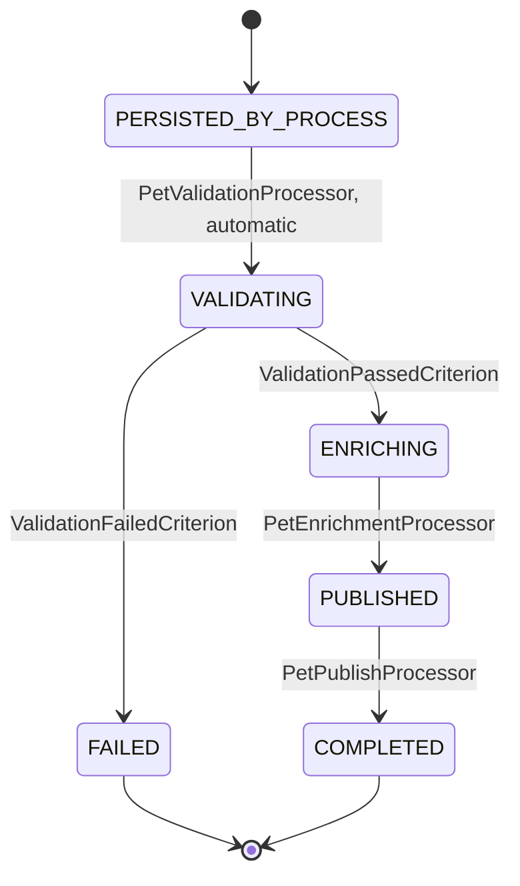
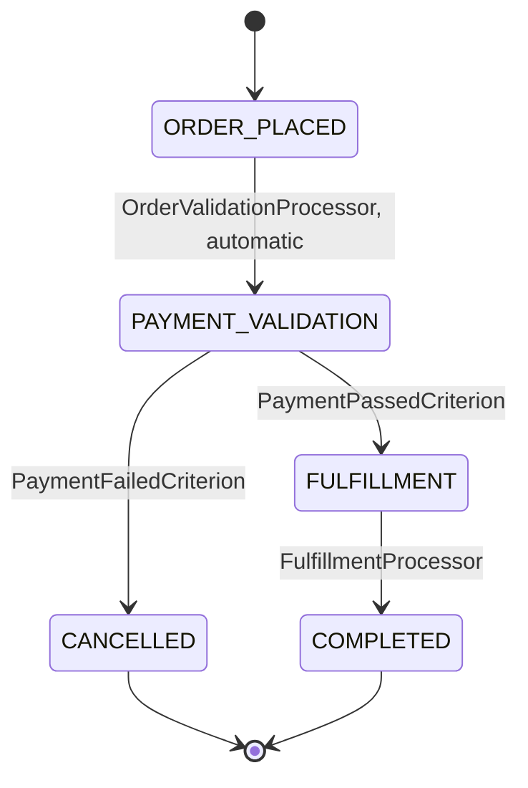
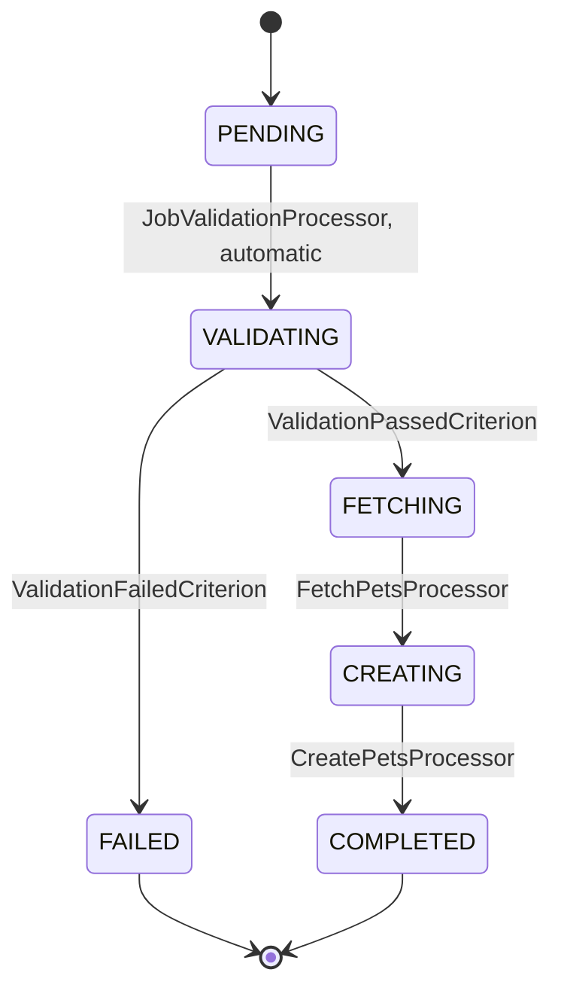

### 1. Entity Definitions
```
Pet:
- petId: String (public business id from Petstore or created id)
- name: String (pet name)
- species: String (cat/dog/etc)
- breed: String (breed description)
- age: Integer (years)
- gender: String (M/F/unknown)
- status: String (available/pending/adopted)
- tags: List<String> (fun tags, e.g., playful,lazy)
- photoUrls: List<String> (image urls)
- description: String (fun profile)
- importedFrom: String (source if imported, e.g., Petstore)

Order:
- orderId: String (business order id)
- petId: String (referenced Pet.petId)
- buyerName: String (customer name)
- buyerContact: String (email/phone)
- type: String (adoption/purchase)
- status: String (PLACED/CONFIRMED/COMPLETED/CANCELLED)
- placedAt: String (ISO timestamp)
- notes: String (optional)

PetImportJob:
- jobId: String (business job id)
- sourceUrl: String (Petstore API base url)
- requestedAt: String (ISO timestamp)
- status: String (PENDING/VALIDATING/FETCHING/CREATING/COMPLETED/FAILED)
- fetchedCount: Integer (number of pets fetched)
- createdCount: Integer (number of Pet entities created)
- error: String (error details if failed)
```

### 2. Entity workflows

Pet workflow:
1. Initial State: PERSISTED_BY_PROCESS (created by Job or admin process)
2. Validation: Check required fields, photoUrls, status
3. Enrichment: Add playful profile text/tags, compute ageCategory
4. Publish: Mark as AVAILABLE and notify listing service (optional)
5. Final: COMPLETED or FAILED


```mermaid
stateDiagram-v2
    [*] --> PERSISTED_BY_PROCESS
    PERSISTED_BY_PROCESS --> VALIDATING : PetValidationProcessor, automatic
    VALIDATING --> ENRICHING : ValidationPassedCriterion
    VALIDATING --> FAILED : ValidationFailedCriterion
    ENRICHING --> PUBLISHED : PetEnrichmentProcessor
    PUBLISHED --> COMPLETED : PetPublishProcessor
    FAILED --> [*]
    COMPLETED --> [*]
```

Processors/Criteria:
- PetValidationProcessor (checks name, species, photoUrls)
- ValidationPassedCriterion / ValidationFailedCriterion (simple boolean)
- PetEnrichmentProcessor (adds tags, friendly description)
- PetPublishProcessor (sets status AVAILABLE and triggers Cyoda notifications)

Order workflow:
1. Initial State: ORDER_PLACED (POST creates order event)
2. Payment Validation: verify buyer info (manual if needed)
3. Fulfillment: Reserve pet (manual admin or automatic if available)
4. Completion: mark COMPLETED or CANCELLED


```mermaid
stateDiagram-v2
    [*] --> ORDER_PLACED
    ORDER_PLACED --> PAYMENT_VALIDATION : OrderValidationProcessor, automatic
    PAYMENT_VALIDATION --> FULFILLMENT : PaymentPassedCriterion
    PAYMENT_VALIDATION --> CANCELLED : PaymentFailedCriterion
    FULFILLMENT --> COMPLETED : FulfillmentProcessor
    CANCELLED --> [*]
    COMPLETED --> [*]
```

Processors/Criteria:
- OrderValidationProcessor (checks buyerContact and pet availability)
- PaymentPassedCriterion / PaymentFailedCriterion
- FulfillmentProcessor (reserve pet and update Pet.status to adopted/sold)

PetImportJob workflow:
1. Initial State: PENDING (job created via POST)
2. Validating: check sourceUrl and rate limits
3. Fetching: call Petstore and collect pets
4. Creating: persist Pet entities (each persist triggers Pet workflow via Cyoda)
5. Completed/Failed


```mermaid
stateDiagram-v2
    [*] --> PENDING
    PENDING --> VALIDATING : JobValidationProcessor, automatic
    VALIDATING --> FETCHING : ValidationPassedCriterion
    VALIDATING --> FAILED : ValidationFailedCriterion
    FETCHING --> CREATING : FetchPetsProcessor
    CREATING --> COMPLETED : CreatePetsProcessor
    FAILED --> [*]
    COMPLETED --> [*]
```

Processors/Criteria:
- JobValidationProcessor (checks sourceUrl)
- ValidationPassedCriterion / ValidationFailedCriterion
- FetchPetsProcessor (retrieves data from Petstore)
- CreatePetsProcessor (persists Pet entities; each persist triggers Pet workflow in Cyoda)

### 3. Pseudo code for processor classes

PetValidationProcessor (pseudo)
```
class PetValidationProcessor {
  void process(Pet pet) {
    if pet.name is empty or pet.species is empty or pet.photoUrls empty:
      mark pet state FAILED
      set error
    else:
      mark validation passed
  }
}
```

PetEnrichmentProcessor (pseudo)
```
class PetEnrichmentProcessor {
  void process(Pet pet) {
    pet.tags.add(computePlayfulTags(pet))
    pet.description = generateFriendlyDescription(pet)
    save pet
  }
}
```

OrderValidationProcessor (pseudo)
```
class OrderValidationProcessor {
  void process(Order order) {
    pet = findPetById(order.petId)
    if pet == null or pet.status != available:
      mark order PAYMENT_VALIDATION -> CANCELLED
    else:
      mark PaymentPassedCriterion true
  }
}
```

FetchPetsProcessor / CreatePetsProcessor (pseudo)
```
class FetchPetsProcessor {
  List<RawPet> fetch(String sourceUrl) { ... }
}

class CreatePetsProcessor {
  void process(List<RawPet> items) {
    for item in items:
      Pet p = mapToPet(item)
      persist p  // Cyoda persists and triggers Pet workflow
      increment createdCount
  }
}
```

### 4. API Endpoints Design Rules

Rules applied:
- POST endpoints trigger events and return only technicalId.
- GET endpoints only retrieve stored results.
- POSTed entities have GET by technicalId.

Endpoints:

1) Create PetImportJob
- POST /jobs/pet-import
Request:
```json
{
  "sourceUrl": "https://petstore.example/api/v1/pets"
}
```
Response:
```json
{ "technicalId": "job-tech-123" }
```
- GET /jobs/pet-import/{technicalId}
Response (example):
```json
{
  "jobId":"job-001",
  "status":"FETCHING",
  "sourceUrl":"https://petstore.example/api/v1/pets",
  "fetchedCount":12,
  "createdCount":10,
  "requestedAt":"2025-08-28T12:00:00Z",
  "error": null
}
```

2) Create Order
- POST /orders
Request:
```json
{
  "petId":"pet-123",
  "buyerName":"Alex",
  "buyerContact":"alex@example.com",
  "type":"adoption",
  "notes":"I love cats!"
}
```
Response:
```json
{ "technicalId":"order-tech-456" }
```
- GET /orders/{technicalId}
Response:
```json
{
  "orderId":"order-789",
  "petId":"pet-123",
  "buyerName":"Alex",
  "status":"PLACED",
  "placedAt":"2025-08-28T12:05:00Z"
}
```

3) Read Pet (created by Job or internal admin — no POST required)
- GET /pets/{technicalId}
Response:
```json
{
  "petId":"pet-123",
  "name":"Whiskers",
  "species":"cat",
  "breed":"Siamese",
  "age":2,
  "status":"AVAILABLE",
  "tags":["playful","lapcat"],
  "photoUrls":["https://.../1.jpg"]
}
```

Optional:
- GET /pets (list/filter) — include only if you want search by species/tags.

Notes:
- All entity persistence triggers Cyoda process method per EDA: e.g., CreatePetsProcessor persists Pet -> Cyoda starts Pet workflow processors/criteria automatically.
- Keep processors concise (3-5 per workflow) and criteria minimal (1-3) as defined above.

Would you like me to (a) add a User entity instead of one of these three, or (b) expand processors/criteria with more detailed pseudo code and failure paths?